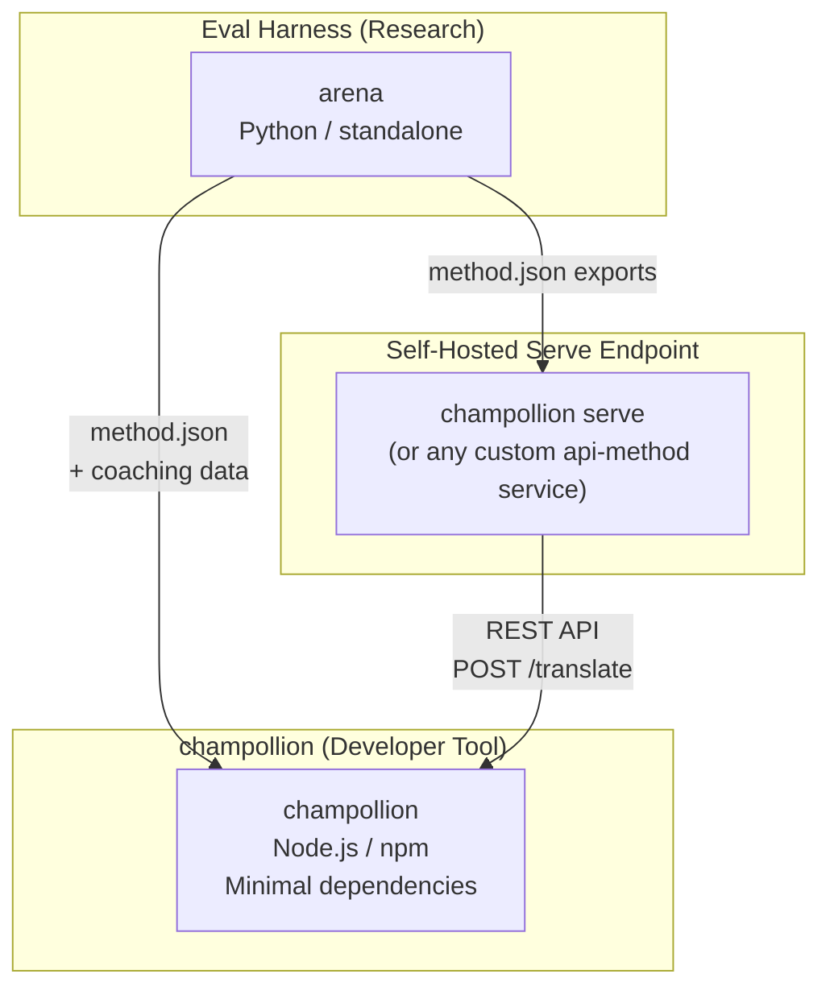
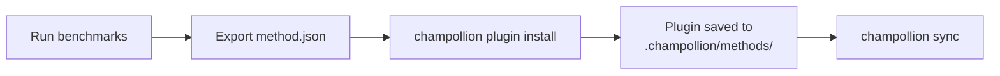
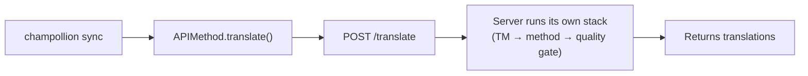
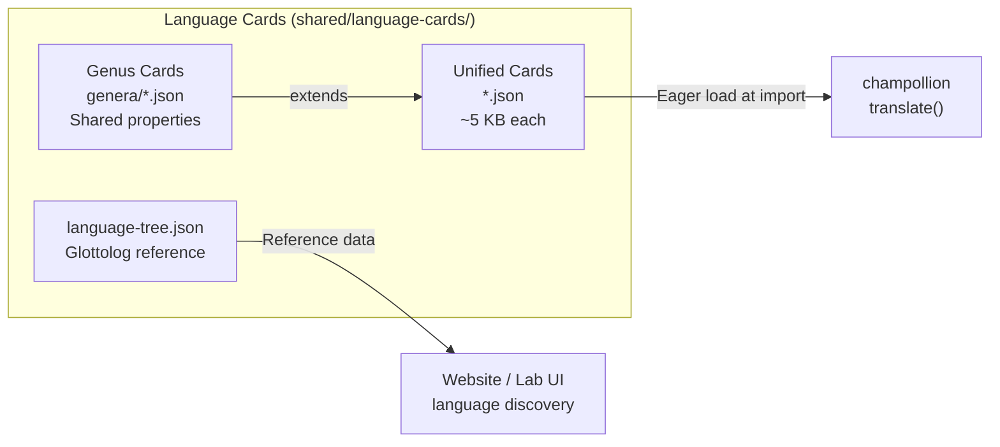

# Architecture

L'écosystème de traduction Champollion comprend trois outils indépendants qui fonctionnent ensemble par le biais de contrats bien définis. Aucun d'entre eux ne dépend des autres au moment de la compilation. Ils communiquent par le biais d'un **format de plugin de méthode** partagé et d'un **contrat API REST**.

## Les trois composants



### champollion (ce projet)

L'outil de développement dont le code source est disponible (gratuit pour un usage non commercial). Traduit les fichiers de localisation à l'aide de méthodes enfichables. Dépendances minimales, configuration facultative, prêt à l'emploi.

**Méthodes intégrées :**
- `llm` → OpenRouter / tout LLM (200+ modèles)
- `llm-coached` → LLM + coaching grammatical/dictionnaire
- `openai` → API OpenAI directe (GPT-4o, GPT-4o-mini)
- `anthropic` → API Anthropic directe (Claude Sonnet, Haiku, Opus)
- `gemini` → API Google Gemini directe (Flash, Pro — niveau gratuit disponible)
- `google-translate` → API Google Cloud Translation v2
- `deepl` → API DeepL avec support du glossaire
- `microsoft-translator` → Azure Cognitive Services Translator
- `libretranslate` → LibreTranslate auto-hébergé (AGPL, gratuit)
- `api` → Conduit fin vers n'importe quel point de terminaison REST distant

### Eval Harness (projet compagnon)

Un outil de recherche pour développer, tester et évaluer les méthodes de traduction. Lorsqu'une méthode atteint une qualité acceptable, le harness exporte un **plugin de méthode** — un manifeste `method.json` et des fichiers de données de coaching optionnels.

Le harness ne s'exécute jamais à l'intérieur de champollion. C'est un outil séparé qui produit une sortie statique (fichiers JSON). Champollion lit simplement ces fichiers.

[→ Eval Harness sur GitHub](https://github.com/gamedaysuits/Champollion)

### Point de terminaison de service auto-hébergé (`champollion serve`)

Tout projet champollion peut servir sa propre pile de traduction configurée via HTTP avec une seule commande — [`champollion serve`](/docs/guides/serving-a-method#the-zero-code-path-champollion-serve) — et tout autre projet peut la consommer via la méthode `api`. Les prompts, les données de coaching, la mémoire de traduction et les clés des fournisseurs restent sur l'infrastructure du propriétaire ; les consommateurs envoient uniquement les chaînes sources et reçoivent les traductions. Les pipelines qui existent entièrement en dehors de champollion (une chaîne FST, un système de recherche) peuvent implémenter le même contrat en tant que [service personnalisé](/docs/guides/serving-a-method). Il n'y a pas de service Champollion hébergé — le service est toujours auto-hébergé, par conception.

## Comment ils se connectent

### Eval Harness → champollion (export unidirectionnel)



**Contrat** : [Spécification du plugin](/docs/reference/plugin-spec)

### Point de terminaison de service → champollion (API à l'exécution)



Le `APIMethod` de Champollion est un **conduit muet**. Il envoie des clés et reçoit des traductions en retour. Il ne contient aucune logique de traduction et aucun contenu propriétaire.

## Ce que chaque composant sait des autres

| Outil | Connaît champollion ? | Connaît un point de terminaison de service ? | Connaît le harnais ? |
|------|---------------------|-------------------------------|---------------------|
| **champollion** | *(est champollion)* | Oui — la méthode `api` l'appelle | Non — lit simplement les exports de plugins |
| **Point de terminaison de service** | Oui — sert ses requêtes | *(est le point de terminaison de service)* | Non — installe les méthodes exportées comme n'importe quel projet |
| **Harnais d'évaluation** | Oui — exporte le format de plugin | Non — méthodes déployées séparément | *(est le harnais)* |

## Scénarios d'utilisation

### Scénario 1 : Gratuit, zéro configuration (la plupart des utilisateurs)

```bash
export OPENROUTER_API_KEY=sk-...
npx champollion sync
```

Utilise la méthode intégrée `llm`. Pas de plugins, pas de serveur, pas de harnais.

### Scénario 2 : Ligne de base Google Translate

```bash
export GOOGLE_TRANSLATE_API_KEY=AIza...
npx champollion sync
```

Utilise la méthode `google-translate` intégrée. Aucun plugin nécessaire.

### Scénario 3 : Plugin ouvert avec coaching fourni

```bash
champollion plugin install ./french-formal-v1/
champollion sync
```

Le plugin a `type: "llm-coached"` → champollion utilise la clé OpenRouter de l'utilisateur. Les données de coaching sont locales (aucun appel serveur).

### Scénario 4 : Coaching DIY (pas de plugin, pas de harness)

```json title="champollion.config.json"
{
  "pairs": {
    "en:fr": { "method": "llm-coached" }
  }
}
```

L'utilisateur maintient ses propres règles grammaticales et dictionnaire dans `.champollion/coaching/fr.json`.

### Scénario 5 : Consommer la pile servie d'un autre projet

```bash
champollion plugin install ./their-project-serve/   # manifest from `champollion serve --emit-manifest`
CHAMPOLLION_API_KEY=<their bearer token> champollion sync
```

La méthode `api` de la paire envoie via POST les chaînes sources à leur point de terminaison auto-hébergé [`champollion serve`](/docs/guides/serving-a-method#the-zero-code-path-champollion-serve) ; leur pile (coaching, mémoire de traduction, contrôle qualité) effectue la traduction.

## Cartes de langue

Chaque langue dans champollion est configurée par le biais d'une **Carte de langue** — un fichier JSON unifié contenant des présets de registre, des règles de formalité, des drapeaux de support de méthode, des conventions typographiques, une classification généalogique et des données de référence linguistique.



Les cartes sont chargées avec impatience à l'importation. Chaque carte contient toutes les métadonnées dont le moteur de traduction et la documentation des développeurs ont besoin — il n'y a pas de niveau de référence séparé. Les cartes sont générées à partir de sources faisant autorité (IANA, CLDR, [Glottolog](https://glottolog.org), [WALS](https://wals.info)) en utilisant `scripts/generate-language-card.mjs` et `scripts/build-language-tree.mjs`, puis curées manuellement pour la précision linguistique.

## Principes de Conception

1. **Pas de dépendances circulaires.** Les ponts sont à sens unique.
2. **Champollion est le cœur léger.** Dépendances minimales, configuration facultative. Les plugins et l'API sont additifs.
3. **La protection de la propriété intellectuelle est architecturale.** Les techniques propriétaires restent du côté du service — quiconque exécute le point de terminaison conserve ses prompts, son coaching et ses clés. Le paquet npm ne contient rien de propriétaire.
4. **Le format de plugin est le contrat.** Tout passe par `method.json`.
5. **Chaque outil a une seule tâche.** Harnais → développer des méthodes. `champollion serve` → héberger des méthodes. Champollion → traduire des fichiers.

---

## Voir aussi

- [Méthodes de traduction](/docs/guides/translation-methods) — comment fonctionne chaque méthode intégrée
- [Spécification du plugin](/docs/reference/plugin-spec) — le format du manifeste method.json
- [Eval Harness](/docs/network/specifications/harness) — l'outil de recherche compagnon
- [Servir une méthode via API](/docs/guides/serving-a-method) — héberger des pipelines de traduction personnalisés
- [Supporter une langue peu dotée en ressources](/docs/network/community/low-resource-languages) — le cas d'usage qui a motivé cette architecture
