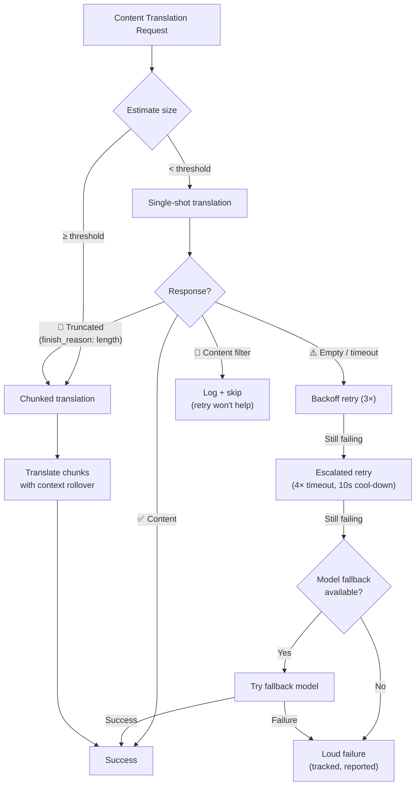

# Résilience de la Traduction de Contenu

Le pipeline de traduction de contenu de Champollion (documents Markdown/MDX) utilise un système de résilience multicouche pour gérer les défaillances avec élégance. Contrairement à la traduction clé-valeur — où chaque lot est petit et les tentatives sont peu coûteuses — la traduction de contenu implique des invites volumineuses et des sorties longues qui peuvent échouer pour des raisons structurelles, pas seulement transitoires.

## Le Problème

La traduction de contenu présente des modes de défaillance fondamentalement différents de la traduction clé-valeur :

| Mode de défaillance | Clé-Valeur | Contenu |
|---|---|---|
| Limite de débit (429) | Courant, transitoire | Courant, transitoire |
| Délai d'expiration | Rare (petits lots) | Courant (sortie longue) |
| Réponse vide | Rare | Courant (limites de sortie, filtres) |
| Troncature de sortie | N/A (JSON validé) | Se produit silencieusement |
| Filtre de contenu | Extrêmement rare | Possible (docs CLI, docs sécurité) |
| Limitation du modèle | La tentative le corrige | La tentative ne le corrigera pas |

L'insight clé : **réessayer la même requête défaillante n'est pas de la redondance, c'est de l'obstination.** Un vrai système de résilience identifie *pourquoi* quelque chose a échoué et change son approche en conséquence.

## Aperçu de l'Architecture



## Couche 1 : Tentative Basée sur le Diagnostic

Avant de décider *comment* réessayer, le système inspecte la réponse de l'API pour comprendre *ce qui* a échoué.

### Analyse de la Raison d'Achèvement

Chaque API LLM retourne un `finish_reason` aux côtés du texte généré. Champollion l'utilise pour prendre des décisions de tentative intelligentes :

| `finish_reason` | Signification | Action |
|---|---|---|
| `stop` + contenu | Le modèle s'est terminé normalement | ✅ Accepter le résultat |
| `stop` + vide | Le modèle n'a rien généré | ⚠️ Réessayer la même requête (transitoire) |
| `length` | La sortie a atteint la limite de jetons | 🔶 Diviser automatiquement le document |
| `content_filter` | Le filtre de sécurité a bloqué la sortie | 🔴 Enregistrer et ignorer (la tentative n'aidera pas) |
| `null` / manquant | Réponse malformée | ⚠️ Réessayer la même requête (transitoire) |

Cela remplace l'approche actuelle de traiter chaque défaillance de manière identique avec des tentatives avec backoff.

### Budget de Tentatives

Le budget de tentatives standard pour les défaillances transitoires :

| Tour | Tentatives | Délai d'expiration | Backoff |
|---|---|---|---|
| Standard | 4 (0→3) | 60s | 1s → 2s → 4s |
| Escaladé | 4 (0→3) | 120s | 1s → 2s → 4s |
| **Total** | **8** | — | **~3,5 min pire cas** |

Entre les tours, un refroidissement de 10 secondes permet aux problèmes transitoires de se résoudre.

## Couche 2 : Division de Contenu

Lorsqu'un document dépasse un seuil de taille — ou lorsque la Couche 1 signale une troncature de sortie — le système divise le document en chunks de taille traductible.

Consultez [Context Rollover](/docs/concepts/context-rollover#content-chunking) pour la configuration détaillée du chunking. Les points clés :

### Stratégie de Division

1. **Limites de titre** — `##` et `###` sont des limites naturelles d'unités de traduction. Chaque section est suffisamment autonome pour une traduction indépendante.
2. **Secours paragraphe** — si une seule section de titre dépasse la taille du chunk, diviser aux doubles sauts de ligne.
3. **Division forcée** — dernier recours pour les paragraphes extrêmement longs (par exemple, tableaux). Diviser aux limites de phrases.

### Contexte Entre les Chunks

Chaque chunk reçoit les 2-3 derniers paragraphes de la *traduction du chunk précédent* comme contexte. Cela prévient :
- **Dérive terminologique** — le modèle voit ce qu'il a appelé « tableau de bord » dans le chunk précédent
- **Résolution de pronoms** — les antécédents de la section précédente se poursuivent
- **Cohérence de registre** — le ton établi dans le chunk 1 persiste à travers le chunk N

### Déclencheurs de Division Automatique

| Déclencheur | Comportement |
|---|---|
| `contentChunkSize` défini dans la config | Toujours diviser les docs dépassant cette taille |
| `finish_reason: "length"` retourné | Division automatique comme secours (même sans config) |
| Entrée > ~12KB (détection automatique) | Enregistrer une suggestion, mais ne pas forcer |

## Couche 3 : Chaîne de Secours de Modèle

Lorsque le modèle configuré échoue de manière cohérente — pas de manière transitoire, mais structurelle — le système essaie des modèles alternatifs. Les différents modèles ont des fenêtres de contexte, des limites de sortie, des filtres de sécurité et des forces multilingues différents.

### Chaîne de Secours par Défaut

```json title="champollion.config.json"
{
  "contentFallbackChain": [
    "google/gemini-2.5-flash",
    "anthropic/claude-sonnet-4"
  ]
}
```

Le modèle configuré est toujours essayé en premier. Les modèles de secours ne sont utilisés qu'après l'épuisement de tous les tours de tentatives (standard + escaladé).

### Pourquoi Plusieurs Architectures

| Scénario | Le Modèle Principal Échoue | Le Modèle de Secours Réussit |
|---|---|---|
| Docs CLI vietnamiens | Gemini retourne vide | Claude le gère bien |
| Contenu filtré pour la sécurité | OpenAI le bloque | Gemini a des seuils de filtre différents |
| Longs tableaux structurés | Le modèle A tronque | Le modèle B a une fenêtre de sortie plus grande |

La valeur du secours est la diversité architecturale — les différentes familles de modèles ont des modes de défaillance différents. Une défaillance structurelle pour un modèle peut être triviale pour un autre.

### Portée

> Le secours de modèle est **contenu uniquement**. Les lots clé-valeur sont petits et échouent presque jamais structurellement. Ajouter la complexité du secours là-bas serait de la sur-ingénierie.

## Couche 4 : Comptabilité des Défaillances

Lorsque des défaillances se produisent, le système les suit et les signale correctement au lieu de continuer silencieusement.

### Pendant la Synchronisation

- Les éléments défaillants affichent `[FAIL]` dans la sortie de progression
- Chaque défaillance enregistre la raison spécifique (délai d'expiration, réponse vide, filtre de contenu, troncature)
- Les éléments complétés sont sauvegardés dans le manifeste immédiatement (persistance incrémentale)

### Après la Synchronisation

Un résumé des défaillances s'affiche à la fin :

```
  ┌─ Content Translation Failures ─────────────────────────────────────┐
  │                                                                     │
  │  2 of 24 content translations failed:                              │
  │                                                                     │
  │  ✗ docs/reference/cli.md → vi                                      │
  │    Reason: empty response after 8 attempts + 1 fallback model      │
  │    Models tried: google/gemini-3.1-pro-preview, gemini-2.5-flash   │
  │                                                                     │
  │  ✗ docs/guides/troubleshooting.md → ar                             │
  │    Reason: content_filter (no retry — blocked by safety filter)    │
  │                                                                     │
  │  Re-run: npx champollion@latest sync                              │
  │  (22 completed translations are cached and won't re-run)           │
  └─────────────────────────────────────────────────────────────────────┘
```

### Manifeste de Tentatives

Les fichiers défaillants sont écrits dans `.champollion-retry.json` :

```json
{
  "failedAt": "2026-05-27T21:45:00Z",
  "files": [
    {
      "source": "docs/reference/cli.md",
      "locale": "vi",
      "reason": "empty_response",
      "attempts": 8,
      "modelsTried": ["google/gemini-3.1-pro-preview", "google/gemini-2.5-flash"]
    }
  ]
}
```

À la prochaine exécution de `sync`, seuls ces fichiers sont retraités. Les fichiers complétés sont préservés via le manifeste de hash de contenu (`.champollion-content.lock`).

### Codes de Sortie

| Code | Signification |
|---|---|
| 0 | Toutes les traductions ont réussi |
| 1 | Erreur de configuration, clé API manquante, etc. |
| 2 | Défaillance partielle — certaines traductions de contenu ont échoué |

## Configuration

```json title="champollion.config.json"
{
  "contentChunkSize": 4000,
  "contentOverlap": 200,
  "contentFallbackChain": [
    "google/gemini-2.5-flash",
    "anthropic/claude-sonnet-4"
  ]
}
```

| Champ | Type | Défaut | Description |
|---|---|---|---|
| `contentChunkSize` | `number \| null` | `null` | Jetons max par chunk de contenu. `null` = pas de chunking (division automatique sur troncature uniquement) |
| `contentOverlap` | `number` | `200` | Jetons de chevauchement entre chunks de contenu pour la continuité du contexte |
| `contentFallbackChain` | `string[]` | `[]` | Modèles de secours à essayer lorsque le modèle configuré échoue structurellement |

## État de Mise en Œuvre

| Fonctionnalité | État |
|---|---|
| Tentative basée sur le diagnostic (analyse finish_reason) | 🔲 Planifié |
| Division de contenu (division titre/paragraphe) | 🔲 Planifié |
| Rollover de contexte entre chunks | 🔲 Planifié |
| Chaîne de secours de modèle | 🔲 Planifié |
| Rapport de résumé des défaillances | 🔲 Planifié |
| Manifeste de tentatives (.champollion-retry.json) | 🔲 Planifié |
| Code de sortie 2 pour défaillances partielles | 🔲 Planifié |
| Tentative d'escalade (délai d'expiration étendu) | ✅ Implémenté (v3.3.3) |
| Messages de tentative numérotés | ✅ Implémenté (v3.3.3) |
| Défaillance bruyante sur erreurs de contenu | ✅ Implémenté (v3.3.3) |

## Voir Aussi

- [Context Rollover](/docs/concepts/context-rollover) — cohérence du batching et configuration du chunking de contenu
- [How Sync Works](/docs/concepts/how-sync-works) — le pipeline de synchronisation complet
- [Translation Methods](/docs/guides/translation-methods) — méthodes disponibles et leurs caractéristiques
