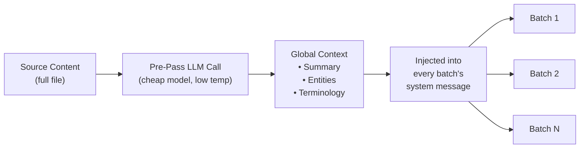

# Regroupement du Contexte

Le regroupement du contexte est une fonctionnalité de cohérence de traduction au niveau du document qui transmet une fenêtre de traductions antérieures dans les lots suivants, donnant au modèle de langage une « mémoire à court terme » au-delà des limites des lots.

## Raison d'être

Lors de la traduction de fichiers volumineux (100+ clés ou longs documents Markdown), champollion divise le travail en lots. Sans regroupement, chaque lot est traduit indépendamment — le modèle de langage n'a aucune mémoire de ce qu'il a traduit dans le lot précédent. Cela provoque :

- **Dérive terminologique** : Le même terme anglais est traduit différemment selon les lots (par exemple, « dashboard » → « tableau de bord » dans le lot 1, « panneau » dans le lot 3)
- **Échec de coréférence** : Les pronoms et références qui franchissent les limites des lots perdent leur antécédent
- **Incohérence de registre** : Le ton peut varier entre les lots (formel → informel → formel)

Il s'agit d'un problème bien documenté dans la littérature de la traduction automatique. L'approche par fenêtre glissante est validée par la recherche en traduction automatique au niveau du document (ACL, ateliers WMT).

## Fonctionnement

### La Fenêtre Glissante

Lorsque `contextRollover` est activé, le pipeline de traduction maintient une fenêtre de paires clé-valeur récemment traduites. Après la fin de chaque lot, une portion de sa sortie (par défaut : 20 % de `batchSize`) est transmise au lot suivant dans l'invite en tant que « traductions de référence ».

```
Batch 1: Translate keys 1-80         → LLM sees: system prompt + keys 1-80
Batch 2: Translate keys 81-160       → LLM sees: system prompt + [16 reference translations from batch 1] + keys 81-160
Batch 3: Translate keys 161-240      → LLM sees: system prompt + [16 reference translations from batch 2] + keys 161-240
```

Les traductions de référence sont injectées dans le message utilisateur avec une étiquette claire :

```
--- Previous translations for context (do NOT re-translate these) ---
"nav.dashboard": "Tableau de bord"
"nav.settings": "Paramètres"
"header.welcome": "Bienvenue sur la plateforme"
---

{
  "content.main_heading": "Getting Started with Your Dashboard",
  ...
}
```

### Stratégie de Sélection

Deux modes pour choisir les traductions à transmettre :

| Stratégie | Comportement | Idéal pour |
|-----------|-------------|-----------|
| `tail` (par défaut) | Les N dernières traductions du lot précédent | Documents séquentiels, contenu Markdown |
| `diverse` | Sélectionne les entrées couvrant différents types de clés (boutons, en-têtes, descriptions) | Fichiers JSON volumineux avec types d'éléments d'interface utilisateur mixtes |

### Budget de Jetons

La fenêtre de regroupement consomme des jetons d'entrée. Champollion calcule le coût approximatif en jetons et avertit si la fenêtre dépasse 15 % de la fenêtre de contexte estimée du modèle. L'avertissement inclut une réduction suggérée :

```
[WARN] Rollover window is ~2400 tokens (18% of model context).
       Consider reducing rolloverSize to 0.15 or lowering batchSize.
```

## Passe de Contexte Global

Un appel LLM optionnel en première passe qui s'exécute **avant** le début de la traduction. Le modèle de langage analyse le contenu source complet et produit :

1. **Résumé du Document** — Description de 2-3 phrases de ce qui est traduit
2. **Entités Nommées** — Noms de produits, termes techniques et noms propres avec gestion suggérée
3. **Liste de Cohérence Terminologique** — Termes clés identifiés par le modèle de langage comme nécessitant une traduction cohérente

Ce contexte global est injecté dans le **message système** de chaque lot, donnant à chaque lot une conscience du document complet même s'il ne voit qu'une tranche.



### Modèle de Passe Préalable

L'extraction de contexte global utilise un appel LLM séparé et peu coûteux (par défaut : `google/gemini-3.5-flash` à température 0,1) indépendamment du modèle de traduction configuré par l'utilisateur. Il s'agit d'une tâche d'extraction de métadonnées, non d'une tâche de traduction — la vitesse et le coût importent plus que la sortie créative.

## Segmentation du Contenu {#content-chunking}

Pour les longs documents Markdown (traduction de contenu), le corps peut dépasser la fenêtre de contexte effective du modèle de langage, ou le modèle peut tronquer sa sortie. La segmentation du contenu divise le document en segments chevauchants qui sont chacun traduits indépendamment, puis réassemblés.

### Stratégie de Division

La segmentation suit une cascade de priorités — elle essaie d'abord le point de division le plus significatif sur le plan sémantique :

1. **Limites d'en-têtes** — Les marqueurs `##` et `###` créent des unités de traduction naturelles. Chaque section est suffisamment autonome pour une traduction indépendante, et les en-têtes donnent au modèle de langage un contexte structurel sur ce qu'il traduit.
2. **Limites de paragraphes** — si une seule section d'en-tête dépasse la taille du segment, divisez aux doubles sauts de ligne (`\n\n`). Les paragraphes sont la limite suivante la meilleure car ils représentent des pensées complètes.
3. **Limites de phrases** — dernier recours pour les paragraphes extrêmement longs (par exemple, grands tableaux, prose dense). Divise aux limites point-espace tout en respectant les abréviations.

Les blocs protégés (clôtures de code, shortcodes — voir [Comment fonctionne la synchronisation](/docs/concepts/how-sync-works)) ne sont jamais divisés entre les segments. Si un bloc protégé serait coupé, le point de division se déplace avant ou après celui-ci.

### Déclencheurs de Segmentation Automatique

La segmentation s'active de deux façons :

| Déclencheur | Comportement |
|-------------|-------------|
| `contentChunkSize` défini dans la configuration | Segmente de manière proactive tous les documents dépassant ce nombre de jetons |
| Le modèle retourne `finish_reason: "length"` | Segmente automatiquement en secours, même sans configuration |

Le déclencheur de secours signifie que la segmentation fonctionne comme un filet de sécurité même si vous ne la configurez pas — si le modèle tronque, champollion réessaie automatiquement avec des segments.

### Configuration

- **`contentChunkSize`** : Jetons maximum par segment (par défaut : null = envoyer le corps complet ; définir à par exemple 4000 pour les longs documents)
- **`contentOverlap`** : Chevauchement en jetons entre les segments (par défaut : 200). Le chevauchement assure des transitions fluides aux limites des segments.

Lorsque la segmentation est active, le regroupement du contexte s'applique automatiquement entre les segments — la sortie traduite du dernier paragraphe du segment précédent est ajoutée au début de l'invite du segment suivant.

```json title="champollion.config.json"
{
  "contentChunkSize": 4000,
  "contentOverlap": 200
}
```

> Pour le système complet de résilience de traduction de contenu (nouvelle tentative diagnostique, secours de modèle, comptabilité des défaillances), voir [Résilience du Contenu](/docs/concepts/content-resilience).

## Configuration

### Démarrage Rapide

```json title="champollion.config.json"
{
  "contextRollover": true,
  "globalContext": true,
  "contentChunkSize": 4000,
  "contentOverlap": 200
}
```

### Options Complètes

```json title="champollion.config.json (advanced)"
{
  "contextRollover": {
    "size": 0.2,
    "strategy": "tail",
    "maxTokens": null
  },
  "globalContext": {
    "model": "google/gemini-3.5-flash",
    "maxEntities": 20,
    "temperature": 0.1
  },
  "contentChunkSize": 4000,
  "contentOverlap": 200,
  "contentFallbackChain": [
    "google/gemini-2.5-flash",
    "anthropic/claude-sonnet-4"
  ]
}
```

| Champ | Type | Par défaut | Description |
|-------|------|-----------|-------------|
| `contextRollover` | `boolean \| object` | `false` | Activer le regroupement par fenêtre glissante |
| `contextRollover.size` | `number` | `0.2` | Fraction de `batchSize` à transmettre (0,0–1,0) |
| `contextRollover.strategy` | `string` | `"tail"` | Stratégie de sélection : `"tail"` ou `"diverse"` |
| `contextRollover.maxTokens` | `number \| null` | `null` | Limite stricte du budget de jetons de regroupement |
| `globalContext` | `boolean \| object` | `false` | Activer la passe de contexte global |
| `globalContext.model` | `string` | `"google/gemini-3.5-flash"` | Modèle pour l'appel de passe préalable |
| `globalContext.maxEntities` | `number` | `20` | Entités nommées maximum à extraire |
| `globalContext.temperature` | `number` | `0.1` | Température pour l'appel de passe préalable |
| `contentChunkSize` | `number \| null` | `null` | Jetons max par segment de contenu (null = pas de segmentation) |
| `contentOverlap` | `number` | `200` | Jetons de chevauchement entre les segments de contenu |
| `contentFallbackChain` | `string[]` | `[]` | Modèles de secours pour la traduction de contenu lorsque le modèle configuré échoue structurellement |

## Quand l'utiliser

| Scénario | Recommandation |
|---------|---------------|
| Petits fichiers JSON (< 50 clés) | Non nécessaire — lot unique, pas de problèmes de limites |
| Fichiers JSON volumineux (100+ clés) | Activer `contextRollover` pour la cohérence terminologique |
| Longs documents Markdown | Activer `contextRollover` + `contentChunkSize` + `globalContext` |
| Documentation technique | Activer `globalContext` pour l'extraction d'entités |
| Chaînes d'interface utilisateur avec registre mixte | Utiliser `contextRollover` avec `strategy: "diverse"` |

## État de Mise en Œuvre

| Fonctionnalité | État |
|----------------|------|
| Regroupement par fenêtre glissante (clé-valeur) | 🔲 Planifié |
| Regroupement par fenêtre glissante (contenu) | 🔲 Planifié |
| Passe de contexte global | 🔲 Planifié |
| Segmentation du contenu | 🔲 Planifié |
| Segmentation automatique en cas de troncature | 🔲 Planifié |
| Stratégie de sélection `diverse` | 🔲 Planifié |

## Littérature

Cette fonctionnalité est fondée sur la recherche publiée en traduction automatique au niveau du document :

- **Approche par fenêtre glissante** : Validée pour améliorer les scores BLEU, chrF et COMET lors de l'utilisation de modèles de langage pour la traduction (ateliers ACL 2023–2025 sur la traduction au niveau du document)
- **Fusion multi-connaissances** : L'injection de résumés de documents et de listes d'entités en tant que contexte global améliore la cohérence terminologique dans les longs documents
- **Incitation Consciente du Contexte (CAP)** : La sélection de contexte pertinent via des scores d'attention ou la similarité sémantique pour l'apprentissage en contexte

## Voir Aussi

- [Résilience du Contenu](/docs/concepts/content-resilience) — nouvelle tentative diagnostique, secours de modèle et comptabilité des défaillances
- [Comment fonctionne la synchronisation](/docs/concepts/how-sync-works) — le pipeline de lots que le regroupement augmente
- [Données de Coaching](/docs/concepts/coaching-data) — fonctionnalité complémentaire pour l'injection de grammaire/dictionnaire
- [Mémoire de Traduction](/docs/concepts/translation-memory) — le cache TM qui fonctionne aux côtés du regroupement
