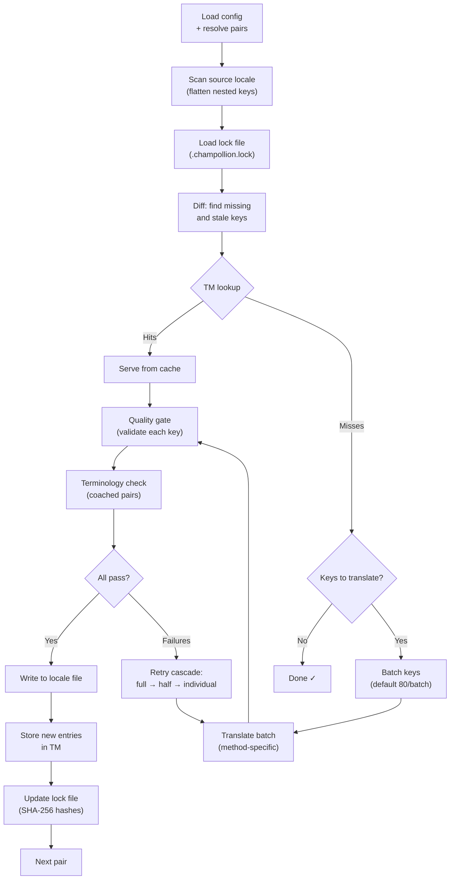

# Fonctionnement de la synchronisation

La commande `sync` est l'opération centrale de Champollion. Voici ce qui se produit lorsque vous exécutez `npx champollion sync`.

## Aperçu du pipeline



## Étape par étape

### 1. Résolution de la configuration

Champollion charge `champollion.config.json` (ou détecte automatiquement les paramètres). Il résout :
- Les locales source et cibles
- Le graphe de paires (quelles combinaisons source→cible traiter)
- Les paramètres de méthode, modèle et qualité par paire

Avant de scanner les fichiers, Champollion affiche un en-tête de démarrage :

```
champollion v0.1.0

[INFO] Detected format: json (auto)
[INFO] Detected framework: Hugo
```

- **Bannière de version** : Affiche la version installée pour le débogage et les rapports de problèmes.
- **Détection de format** : Signale le format de fichier et s'il a été détecté automatiquement `(auto)` ou configuré explicitement `(config)`. Supporte `json`, `toml` et `yaml`.
- **Détection du framework** : Lorsque `contentDir` est défini, identifie le framework (`Hugo`) pour confirmer que la synchronisation de contenu est active.

### 2. Analyse de la source

Le fichier de locale source est chargé et aplati en une carte clé→valeur :

```json
// Input (nested)
{ "hero": { "title": "Welcome", "subtitle": "Build" } }

// Flattened
{ "hero.title": "Welcome", "hero.subtitle": "Build" }
```

### 3. Détection des modifications

Champollion lit `.champollion.lock`, qui stocke les hachages SHA-256 des valeurs source précédemment traduites. Pour chaque clé, il vérifie :

| Condition | Action |
|-----------|--------|
| Clé manquante de la cible | **Traduire** |
| Hachage source modifié depuis la dernière synchronisation | **Re-traduire** (obsolète) |
| La valeur cible commence par `[EN]` | **Re-traduire** (marqueur de secours hérité) |
| Hachage source inchangé, clé existe | **Ignorer** |

C'est pourquoi Champollion ne traduit que ce qui a changé — il ne re-traduit pas l'intégralité de votre fichier à chaque synchronisation.

### 4. Regroupement par lots

Les clés sont regroupées en lots (par défaut : 80 clés/lot pour LLM, 128 pour Google Translate). Le regroupement réduit les allers-retours API tout en gardant les invites gérables.

Pendant la traduction, Champollion affiche une barre de progression en ligne qui se met à jour après chaque lot :

```
[INFO] fr.json — 2,847 missing
     ████████████████░░░░░░░░░░░░░░░░ 1,440/2,847 keys
```

La barre s'affiche en utilisant `\r` retour à la ligne pour les mises à jour sur place — pas de défilement. Supprimée en modes `--quiet` et `--json`.

### 4b. Mémoire de traduction

Avant le regroupement, Champollion vérifie le cache de Mémoire de traduction (`.champollion/tm.json`). Les clés dont le texte source + locale + méthode correspondent à une traduction précédente sont servies instantanément à partir du cache — aucun appel API nécessaire.

```
  [TM] 142 key(s) served from cache
  Translating 3 key(s) to French (llm)... [OK]
```

La MT est le mécanisme principal d'économie de coûts. Re-exécuter la synchronisation après une modification d'une seule clé ne traduit que cette clé, pas l'intégralité du fichier. Voir [Mémoire de traduction](/docs/concepts/translation-memory) pour plus de détails.

Pour contourner le cache pour une seule exécution : `champollion sync --no-tm`

### 5. Traduction

Chaque lot est envoyé à la méthode de traduction configurée :

- **`llm`** : Invite structurée vers OpenRouter avec instructions de registre et de genre
- **`llm-coached`** : Identique, mais avec règles de grammaire, dictionnaire et notes de style injectés
- **`google-translate`** : Requête par lot de l'API Google Cloud Translation v2
- **`api`** : POST HTTP vers un point de terminaison distant

Le message système (registre, instructions de genre, règles) est identique entre les lots pour une locale donnée, permettant la **mise en cache des invites** — les fournisseurs comme Anthropic et Google mettent en cache les messages système répétés, réduisant les coûts en jetons.

### 6. Portail de qualité

Chaque traduction est validée avant d'être écrite sur le disque. Cinq vérifications s'exécutent :

| Vérification | Ce qu'elle détecte | Exemple |
|-------|----------------|---------|
| **Vide/blanc** | Le modèle n'a rien retourné | `""` |
| **Écho source** | Le modèle a retourné l'entrée anglaise | `"Welcome"` pour le japonais |
| **Boucle d'hallucination** | Trigrammes répétés | `"Qo' Qo' Qo' Qo'"` |
| **Inflation de longueur** | La sortie est 4× ou plus longue que la source | Source 10 caractères → sortie 50 caractères |
| **Conformité du script** | Mauvais script pour la locale | Texte latin pour locale arabe |

Les défaillances sont enregistrées avec un préfixe `[GATE]`. Aucun secours silencieux.

Voir [Portail de qualité](/docs/concepts/quality-gate) pour plus de détails.

### 6b. Vérification de la terminologie

Pour les paires coachées avec un dictionnaire, Champollion vérifie si le LLM a réellement utilisé la terminologie requise après la traduction. Les violations sont enregistrées comme avertissements `[TERM]` :

```
[TERM] en→fr: 2 term violation(s)
  • "dashboard" → expected "tableau de bord" but got "panneau"
```

Ce sont des avertissements, pas des erreurs bloquantes — la traduction est toujours écrite.

### 7. Cascade de nouvelle tentative

En cas d'échec d'analyse JSON ou d'erreurs au niveau du lot, Champollion réessaie avec des lots progressivement plus petits :

```
Full batch (80 keys) → Failed
  └→ Half batch (40 keys) → 1 failure
      └→ Individual keys (1 each) → Isolates the problem key
```

Le budget de nouvelle tentative est plafonné par `maxRetries` (par défaut : 3) pour éviter une dépense de jetons incontrôlée.

### 8. Écriture et verrouillage

Les traductions réussies sont écrites dans le fichier de locale cible, en préservant la structure d'imbrication d'origine. Le fichier de verrouillage est mis à jour avec les nouveaux hachages SHA-256.

### 9. Vérification

Après le traitement de toutes les paires, Champollion relit les fichiers de locale écrits à partir du disque et exécute une passe de vérification (sauf si `--no-verify` est défini). Cela détecte l'écart entre le rapport de succès de la synchronisation et les clés réellement incorrectes :

- **Parité des clés** — toutes les clés source présentes dans chaque cible
- **Marqueurs de secours `[EN]`** — marqueurs hérités des exécutions précédentes
- **Traductions vides** — valeurs vides qui ont glissé
- **Conformité du script** — locales non-latines avec traductions ASCII uniquement
- **Préservation des espaces réservés** — les espaces réservés ICU correspondent à la source
- **Problèmes d'encodage** — marqueurs BOM, caractères invisibles

Ceci est également disponible en tant que commande `champollion verify` autonome pour les portes CI.

## Traduction de contenu (Phase 2)

Pour les projets Docusaurus et Hugo, `sync` exécute une deuxième phase après la traduction des clés JSON. Cette phase traduit les fichiers Markdown et MDX (docs, articles de blog, tutoriels) en utilisant les mêmes méthodes et portail de qualité.

### Fonctionnement

1. Champollion découvre tous les fichiers de contenu source (`.md`, `.mdx`) en parcourant le répertoire de contenu/docs
2. Pour chaque paire fichier × locale, il vérifie un fichier de verrouillage de contenu séparé (`.champollion-content.lock`) pour les modifications de hachage SHA-256
3. Les fichiers modifiés ou manquants sont collectés dans un pool d'éléments de travail plat
4. Le pool est traité avec **concurrence parallèle** (par défaut : 12 appels API simultanés)

```
Phase 2: content (79 translations to process, 341 skipped, concurrency: 48)

    [1/79] (1%)  docs/concepts/security.md → ja [RE-TRANSLATE] (~3328s left)
    [2/79] (3%)  docs/concepts/security.md → th [RE-TRANSLATE] (~1821s left)
    ...
    [79/79] (100%) blog/v3-2-quality.md → de [OK]

  [OK] Created 79 content file(s), 341 unchanged
```

### Parallélisme

Les phases 1 (clés JSON) et 2 (contenu) s'exécutent maintenant en parallèle :

- **Phase 1** : Toutes les traductions de locale s'exécutent simultanément (par défaut : 50 locales simultanées). Dans chaque locale, les lots API s'exécutent également en parallèle (4 lots simultanés). Une synchronisation 12-locale avec 120 clés se termine en ~1 minute au lieu de ~15 minutes.
- **Phase 2** : Toutes les combinaisons fichier×locale sont traduites en tant que pool plat (par défaut : 12 appels API simultanés). Différents fichiers et différentes locales se traduisent simultanément.

Contrôlez le parallélisme avec `--json-concurrency`, `--content-concurrency` ou `--concurrency` (définit les deux) :

```bash
# Faster JSON sync (more parallel locale translations)
npx champollion sync --json-concurrency 30

# Faster content sync (more parallel API calls)
npx champollion sync --content-concurrency 20

# Slower (gentler on rate limits)
npx champollion sync --concurrency 4
```

### Protection du contenu

Pendant la traduction, Champollion protège le contenu non traduisible :

- **Blocs de code** (clôturés et indentés) sont remplacés par des espaces réservés
- **Champs de frontmatter** non dans la liste `translatableFields` sont préservés tels quels
- **Liens**, chemins d'image et balises HTML sont protégés
- **Shortcodes** et variables d'interpolation (par ex. `{count}`, `{{.Params.title}}`) sont protégés

Après la traduction, tous les espaces réservés sont restaurés et validés. Si l'un d'eux est manquant ou corrompu, la traduction est rejetée et réessayée.

## Succès partiel

Un lot échoué ne bloque pas le reste. Si 9 lots sur 10 réussissent, ces 9 sont écrits. Le lot échoué est enregistré et vous pouvez re-exécuter `sync` pour réessayer.

## Exécution à blanc

Prévisualisez ce qui changerait sans écrire aucun fichier :

```bash
npx champollion sync --dry-run
```

## Forcer la re-traduction

Forcez des clés spécifiques à être re-traduites même si inchangées :

```bash
npx champollion sync --force-keys "hero.title,nav.about"
```

## Estimation des coûts

Avant de traduire, Champollion génère un **rapport d'estimation de coûts pré-synchronisation** montrant les coûts estimés par paire. Ceci s'exécute automatiquement pendant chaque `sync` — vous le voyez avant tout appel API.

```
╔══════════════════════════════════════════════════════════╗
║  Cost Estimate                                          ║
╠════════════╦═══════╦════════════╦════════════════════════╣
║ Pair       ║ Keys  ║ Est. Cost  ║ Method                 ║
╠════════════╬═══════╬════════════╬════════════════════════╣
║ en → fr    ║   142 ║ $0.07      ║ google-translate       ║
║ en → ja    ║    38 ║   —        ║ llm (model-dependent)  ║
║ en → crk   ║    38 ║   —        ║ llm-coached            ║
╚════════════╩═══════╩════════════╩════════════════════════╝
```

### Ce qui est estimé

Chaque méthode de traduction fournit sa propre estimation de coûts :

| Méthode | Base de coûts | Précision |
|--------|-----------|-----------|
| `google-translate` | Taux publié de Google (20 $/million de caractères) | Précis |
| `llm` | Varie selon le modèle OpenRouter | Dépendant du modèle — vérifiez [Tarification OpenRouter](https://openrouter.ai/models) |
| `llm-coached` | Identique à `llm` plus jetons de contexte de coaching | Dépendant du modèle |
| `api` | Déterminé par le serveur | Inconnu — impossible d'estimer sans interroger le point de terminaison |

Lorsqu'une méthode ne peut pas déterminer le coût (méthodes LLM, API distantes), Champollion signale `—` plutôt que de deviner. Utilisez `--dry` pour voir les estimations de coûts sans réellement traduire.

---

## Voir aussi

- [Référence CLI — sync](/docs/reference/cli#sync) — drapeaux et options de commande
- [Mémoire de traduction](/docs/concepts/translation-memory) — mise en cache et économies de coûts
- [Portail de qualité](/docs/concepts/quality-gate) — comment les traductions sont validées
- [Méthodes de traduction](/docs/guides/translation-methods) — fonctionnement de chaque méthode
- [Travailler avec des traducteurs professionnels](/docs/guides/professional-translators) — flux de travail XLIFF
- [Configuration](/docs/getting-started/configuration) — référence de configuration
- [Guide CI/CD](/docs/guides/ci-cd) — automatisation des synchronisations dans votre pipeline
