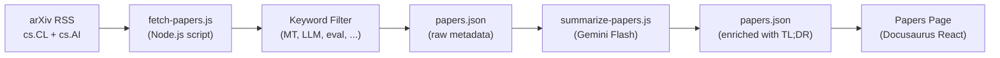

# Flux de Recherche Scientifique

Champollion maintient un flux curé d'articles de recherche en traduction automatique et traitement du langage naturel provenant d'arXiv, filtrés et résumés pour les praticiens. Le flux est semi-automatisé : les articles sont récupérés et filtrés quotidiennement, résumés par IA, et publiés sur le site web.

## Raison d'être

Le pipeline de traduction de champollion s'appuie sur des techniques issues de la recherche publiée — prompting orienté par registre, injection de données d'entraînement, roulement de contexte, portes de qualité. Le flux Papers remplit trois objectifs :

1. **Transparence** : Les utilisateurs peuvent voir la recherche soutenant chaque fonctionnalité
2. **Découverte** : Les nouvelles techniques publiées sur arXiv peuvent éclairer les futures fonctionnalités ou configurations utilisateur
3. **Communauté** : Positionne champollion comme un outil informé par la recherche, et non simplement un autre wrapper d'API

## Architecture



### Étapes du Pipeline

#### 1. Récupération (Quotidienne)

`scripts/fetch-papers.js` interroge l'API Atom d'arXiv pour les articles récents dans :
- `cs.CL` (Computation and Language)
- `cs.AI` (Artificial Intelligence)

Retour : titre, auteurs, résumé, identifiant arXiv, lien PDF, date de publication, catégories.

#### 2. Filtrage

Les articles sont filtrés par pertinence des mots-clés. Un article doit correspondre à au moins un mot-clé primaire :

**Mots-clés primaires** (doit correspondre à ≥1) :
- `machine translation`, `neural machine translation`, `NMT`
- `LLM`, `large language model`
- `multilingual`, `cross-lingual`
- `document-level translation`
- `low-resource language`, `endangered language`
- `translation evaluation`, `BLEU`, `COMET`, `chrF`
- `tokenization`, `morphology`, `polysynthetic`
- `context window`, `sliding window`
- `prompt engineering` (dans le contexte de traduction)

**Mots-clés de renforcement** (augmentent le score de pertinence) :
- `i18n`, `internationalization`, `localization`
- `few-shot`, `in-context learning`
- `terminology`, `glossary`, `consistency`
- `quality estimation`, `hallucination`

#### 3. Résumé (Assisté par IA)

`scripts/summarize-papers.js` traite les nouveaux articles (non résumés) :

Pour chaque article, envoie le résumé à Gemini 3.5 Flash avec :
```
Read this ML research abstract and produce:
1. A 2-sentence TL;DR accessible to a software developer (not a researcher)
2. A single bullet: "Why this matters for MT" — how could this technique
   improve machine translation quality, cost, or speed in production?

Abstract: {abstract}
```

Le résultat est stocké dans `papers.json` aux côtés des métadonnées brutes.

#### 4. Publication

La page Papers de Docusaurus (`website/src/pages/papers.js`) affiche `papers.json` sous forme de grille de cartes filtrables et paginées.

Chaque carte affiche :
- **Titre** (lié à arXiv)
- **Auteurs** (les 3 premiers + « et al. »)
- **Date** (publication ou dernière mise à jour)
- **TL;DR** (généré par IA)
- **Pourquoi c'est important** (généré par IA)
- **Catégories** (tags arXiv)
- **Lien PDF**

### Automatisation

Un workflow GitHub Actions exécute le pipeline quotidiennement :

```yaml title=".github/workflows/fetch-papers.yml"
name: Fetch MT Research Papers
on:
  schedule:
    - cron: '0 6 * * *'  # 06:00 UTC daily
  workflow_dispatch: {}   # Manual trigger

jobs:
  fetch:
    runs-on: ubuntu-latest
    steps:
      - uses: actions/checkout@v4
      - uses: actions/setup-node@v4
        with:
          node-version: 20
      - run: node scripts/fetch-papers.js
      - run: node scripts/summarize-papers.js
        env:
          GEMINI_API_KEY: ${{ secrets.GEMINI_API_KEY }}
      - name: Commit if changed
        run: |
          git config user.name "github-actions[bot]"
          git config user.email "github-actions[bot]@users.noreply.github.com"
          git add website/src/data/papers.json
          git diff --cached --quiet || git commit -m "chore: update research papers feed"
          git push
```

## Schéma de Données

```typescript
interface Paper {
  id: string;           // arXiv ID (e.g., "2406.12345")
  title: string;
  authors: string[];
  abstract: string;
  published: string;    // ISO date
  updated: string;      // ISO date
  pdfUrl: string;
  categories: string[];
  primaryCategory: string;

  // Computed by filter
  relevanceScore: number;
  matchedKeywords: string[];

  // Computed by summarizer (null until processed)
  tldr: string | null;
  whyItMatters: string | null;
  summarizedAt: string | null;
}
```

## Emplacements des Fichiers

| Fichier | Objectif |
|---------|----------|
| `scripts/fetch-papers.js` | Récupérateur RSS d'arXiv et filtre par mots-clés |
| `scripts/summarize-papers.js` | Résumé par IA via Gemini |
| `website/src/data/papers.json` | Données d'articles (validées dans le dépôt) |
| `website/src/pages/papers.js` | Composant de page Docusaurus |
| `website/src/pages/papers.module.css` | Styles de page |
| `.github/workflows/fetch-papers.yml` | Automatisation quotidienne |

## État de Mise en Œuvre

| Fonctionnalité | État |
|----------------|------|
| `fetch-papers.js` (récupération et filtrage arXiv) | 🔲 Planifié |
| `summarize-papers.js` (résumé par IA) | 🔲 Planifié |
| Page Papers (composant React) | 🔲 Planifié |
| Workflow GitHub Actions | 🔲 Planifié |
| Filtrage par catégorie/mots-clés sur la page | 🔲 Planifié |
| Pagination | 🔲 Planifié |

## Voir Aussi

- [Architecture](/docs/concepts/architecture) — comment les composants de champollion se rapportent les uns aux autres
- [Context Rollover](/docs/concepts/context-rollover) — une fonctionnalité directement informée par ce flux de recherche
