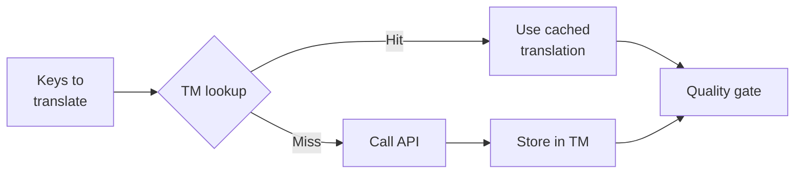

# Mémoire de Traduction

La Mémoire de Traduction (MT) est la couche de mise en cache intégrée de champollion. Elle stocke chaque traduction indexée par texte source + locale + méthode, de sorte que réexécuter `sync` n'appelle l'API que pour les clés qui ont véritablement changé.

## Pourquoi la MT existe

Sans MT, chaque `sync` retraduit chaque clé modifiée — même si vous avez déjà traduit exactement le même texte anglais pour la même locale lors d'une exécution précédente. Les scénarios courants où cela gaspille de l'argent :

| Scénario | Sans MT | Avec MT |
|----------|---------|---------|
| Réexécuter la synchronisation après 1 changement de clé (500 clés × 10 locales) | 5 000 appels API | 10 appels API |
| Rétablir une clé à une valeur anglaise précédente | Appel API complet | Accès instantané au cache |
| La même phrase apparaît dans 3 fichiers de locale | 3 × appels API | 1 appel API + 2 accès au cache |
| Dry-run → synchronisation réelle | Appels API complets sur les deux | La première exécution met en cache, la seconde réutilise |

La MT est **activée par défaut** et ne nécessite aucune configuration. Les traductions sont mises en cache automatiquement lors de chaque `sync` et servies lors des exécutions suivantes.

## Fonctionnement

### Clé de cache

Chaque entrée MT est indexée par un hash SHA-256 de trois valeurs :

```
SHA-256( sourceValue + '\x00' + locale + '\x00' + method )
```

| Composant | Pourquoi il est dans la clé |
|-----------|---------------------------|
| `sourceValue` | Un texte anglais différent → une traduction différente |
| `locale` | « Hello » se traduit différemment en français et en japonais |
| `method` | La sortie de Google Translate ≠ la sortie de GPT-4o |

Le séparateur de byte nul (`\x00`) prévient les collisions entre `"ab" + "c"` et `"a" + "bc"`.

### Pendant la synchronisation



1. Avant d'appeler l'API de traduction, champollion partitionne les clés en **accès MT** et **absences MT**
2. Les accès sont servis instantanément depuis le cache — aucun appel API, aucune latence, aucun coût
3. Les absences passent par le pipeline de traduction normal
4. Les nouvelles traductions de l'API sont stockées dans la MT pour les exécutions futures
5. Toutes les traductions (mises en cache + nouvelles) passent par le contrôle de qualité

### Stockage

La MT est stockée à `.champollion/tm.json` dans la racine de votre projet. Le fichier utilise du JSON compact (sans formatage) pour maintenir la taille gérable. Chaque entrée stocke :

| Champ | Description |
|-------|-------------|
| `t` | Le texte traduit |
| `ts` | Horodatage ISO-8601 du moment où il a été mis en cache |
| `l` | Code de locale cible (pour les statistiques/filtrage) |
| `m` | Nom de la méthode de traduction (pour les statistiques/filtrage) |

Avec 50 langues × 500 clés = 25 000 entrées, le fichier devrait faire environ 2-3 Mo.

## Gestion du cache

### Afficher les statistiques

```bash
champollion tm stats
```

Affiche le nombre d'entrées, la taille du fichier et une répartition par locale :

```
  Translation Memory — .champollion/tm.json

  Entries:      2,847
  File size:    1.2 MB
  Created:      2026-05-20
  Last entry:   2026-05-24

  By locale:
    fr       482 entries  (llm: 380, llm-coached: 102)
    de       471 entries  (llm: 471)
    ja       465 entries  (llm: 465)
```

### Effacer le cache

```bash
# Clear everything (with confirmation prompt)
champollion tm clear

# Clear without prompt (CI environments)
champollion tm clear --yes

# Clear only one locale
champollion tm clear --locale fr
```

### Ignorer la MT pour une exécution

```bash
# Force fresh API calls for all keys (useful when switching providers)
champollion sync --no-tm
```

Cela ne supprime pas le cache — cela l'ignore simplement pour cette exécution et ne stocke pas les nouveaux résultats.

## Quand la MT n'aide pas

La MT ne produira pas d'accès au cache quand :

- **Le texte source a changé** — le hash change, c'est donc une absence
- **La méthode a changé** — passer de `llm` à `google-translate` signifie des clés de cache différentes
- **Première exécution** — démarrage à froid, aucune entrée encore
- **Drapeau `--no-tm`** — contourne explicitement le cache

## Devriez-vous valider `.champollion/tm.json` ?

**Généralement non.** La MT est une optimisation locale pour développeur. Elle est remplie automatiquement lors de la synchronisation et n'aide que lors de la réexécution de la synchronisation sur la même machine. Cependant, vous pourriez envisager de la valider si :

- Votre équipe partage un seul runner CI qui synchronise les traductions
- Vous souhaitez des builds reproductibles sans appels API
- Vous archivez les traductions pour la conformité

Ajoutez `.champollion/tm.json` à `.gitignore` pour une utilisation typique.

---

## Voir aussi

- [Comment fonctionne la synchronisation](/docs/concepts/how-sync-works) — où la MT s'intègre dans le pipeline
- [Référence CLI — tm](/docs/reference/cli#tm) — référence des commandes
- [Référence CLI — sync --no-tm](/docs/reference/cli#sync) — contourner la MT
