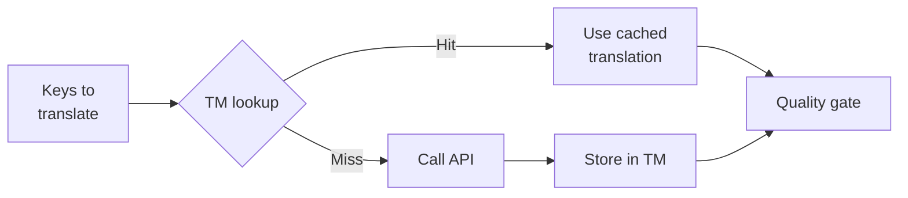

# Mémoire de Traduction

La Mémoire de Traduction (MT) est la couche de mise en cache intégrée de champollion. Elle stocke chaque traduction indexée par texte source + locale + méthode, de sorte que réexécuter `sync` n'appelle l'API que pour les clés qui ont véritablement changé.

## Pourquoi la MT existe

Sans MT, chaque `sync` retraduit chaque clé modifiée — même si vous avez déjà traduit exactement le même texte anglais pour la même locale lors d'une exécution précédente. Les scénarios courants où cela gaspille de l'argent :

| Scénario | Sans MT | Avec MT |
|----------|---------|---------|
| Réexécuter la synchronisation après 1 changement de clé (500 clés × 10 locales) | 5 000 appels API | 10 appels API |
| Rétablir une clé à une valeur anglaise précédente | Appel API complet | Accès instantané au cache |
| La même phrase apparaît dans 3 fichiers de locale | 3 × appels API | 1 appel API + 2 accès au cache |
| Dry-run → synchronisation réelle | Appels API complets sur les deux | La première exécution met en cache, la seconde réutilise |

La MT est **activée par défaut** et ne nécessite aucune configuration. Les traductions sont mises en cache automatiquement lors de chaque `sync` et servies lors des exécutions suivantes.

## Comment ça fonctionne

### Clé de cache

Chaque entrée MT est indexée par un hash SHA-256 de trois valeurs :

```
SHA-256( sourceValue + '\x00' + locale + '\x00' + method )
```

| Composant | Pourquoi il est dans la clé |
|-----------|---------------------------|
| `sourceValue` | Un texte anglais différent → une traduction différente |
| `locale` | « Hello » se traduit différemment en français et en japonais |
| `method` | La sortie de Google Translate ≠ la sortie de GPT-4o |

Le séparateur de byte nul (`\x00`) prévient les collisions entre `"ab" + "c"` et `"a" + "bc"`.

Le `sourceValue` est le texte à partir duquel la clé est traduite, en y intégrant tout ce qui permet de distinguer deux textes identiques :

- **Contexte gettext.** Une entrée comportant un `msgctxt` est mise en cache avec son contexte : « Open » le verbe et « Open » l'adjectif constituent deux entrées distinctes.
- **Formes plurielles absentes de la source.** i18next stocke les pluriels sous forme de clés suffixées, et une langue cible peut posséder des formes inexistantes dans la source : le français et l'espagnol ajoutent `count_many`, qui est traduit à partir du texte anglais `count_other`. Les deux clés envoient le même texte, mais le modèle est sollicité pour des formes différentes (`"2 recettes"` et `"1 000 000 de recettes"`), de sorte que chacune obtient sa propre entrée : `count_other` conserve la forme simple, et `count_many` est mise en cache sous le texte accompagné de sa forme. Il en va de même pour chaque forme traduite à partir du texte d'une autre catégorie (l'arabe `_zero`, `_two`, `_few`, `_many` ; le russe `_few`, `_many` ; les formes ordinales).
- **`msgid_plural` gettext et pluriels ARB / ICU** représentent un message par clé (toutes les formes au sein d'une même valeur) ; ils constituent donc une seule entrée, comme auparavant.

Avant la version 0.4.0, une forme empruntée partageait l'entrée de la forme dont elle était traduite, et l'entrée conservait la dernière réponse stockée, de sorte que `--redo all` pouvait écrire une seule et même forme dans les deux clés. Un cache de cette époque est réparé au fil de son utilisation. Lorsque l'entrée partagée contient le texte de la forme empruntée, elle est déplacée vers l'entrée propre à cette forme, et l'autre forme est traduite à nouveau lors de sa prochaine mise en file d'attente. Sinon, l'entrée reste associée à la forme dont elle s'inspire, et la forme empruntée est envoyée au modèle une seule fois, la première fois qu'elle est mise en file d'attente (l'exécution le signale). `champollion verify` émet un avertissement lorsqu'une forme empruntée contient exactement le texte de la forme dont elle découle et que le cache n'indique pas que le modèle l'a rédigée ainsi. Certaines langues écrivent effectivement deux formes de manière identique, c'est pourquoi il ne s'agit que d'un avertissement ; `--redo keys:<key>` réitère la demande.

### Pendant la synchronisation


```mermaid
flowchart LR
    A["Keys to\ntranslate"] --> B{"TM lookup"}
    B -->|Hit| C["Use cached\ntranslation"]
    B -->|Miss| D["Call API"]
    D --> E["Store in TM"]
    C --> F["Quality gate"]
    E --> F
```

1. Avant d'appeler l'API de traduction, champollion partitionne les clés en **accès MT** et **absences MT**
2. Les accès sont servis instantanément depuis le cache — aucun appel API, aucune latence, aucun coût
3. Les absences passent par le pipeline de traduction normal
4. Les nouvelles traductions de l'API sont stockées dans la MT pour les exécutions futures
5. Toutes les traductions (mises en cache + nouvelles) passent par le contrôle de qualité

### Stockage

La MT est stockée à `.champollion/tm.json` dans la racine de votre projet. Le fichier utilise du JSON compact (sans formatage) pour maintenir la taille gérable. Chaque entrée stocke :

| Champ | Description |
|-------|-------------|
| `t` | Le texte traduit |
| `ts` | Horodatage ISO-8601 du moment où il a été mis en cache |
| `l` | Code de locale cible (pour les statistiques/filtrage) |
| `m` | Nom de la méthode de traduction (pour les statistiques/filtrage) |

Avec 50 langues × 500 clés = 25 000 entrées, le fichier devrait faire environ 2-3 Mo.

## Gestion du cache

### Afficher les statistiques

```bash
champollion tm stats
```

Affiche le nombre d'entrées, la taille du fichier et une répartition par locale :

```
  Translation Memory — .champollion/tm.json

  Entries:      2,847
  File size:    1.2 MB
  Created:      2026-05-20 09:14 MDT
  Last entry:   2026-05-24 17:52 MDT

  By locale:
    fr       482 entries
               380  llm · model google/gemini-3.8-flash · register formal-vous
               102  llm-coached · model google/gemini-3.8-flash · register formal-vous · coaching 3f2a9c1b
    de       471 entries
               471  llm · model google/gemini-3.8-flash · register formal-Sie
    ja       465 entries
               465  llm · model google/gemini-3.8-flash · register polite
```

Les dates sont à l'heure locale de cette machine, avec mention du fuseau horaire (`--json`
contient également les horodatages UTC stockés sous `createdAt` et `lastEntryAt`).
Chaque ligne sous une locale indique ce qui a généré ces entrées : la méthode, le modèle et
le registre (ainsi qu'une empreinte du texte de coaching pour chaque méthode dont
l'invite l'inclut : `llm`, `local`, `openai`, `anthropic`, `gemini`,
`llm-coached` ; le `coachingFile` propre à une paire, une langue ou un fallback est lu
à cet effet, et c'est son texte, et non son chemin, qui est pris en compte). La présence de deux
modèles sous une même locale signifie généralement un changement de modèle ; `champollion status`
indique si les fichiers de locale eux-mêmes mélangent désormais le texte des deux modèles.

### Effacer le cache

```bash
# Clear everything (with confirmation prompt)
champollion tm clear

# Clear without prompt (CI environments)
champollion tm clear --yes

# Clear only one locale
champollion tm clear --locale fr
```

### Ignorer la MT pour une exécution

```bash
# Fresh API calls for everything queued (useful when debugging quality)
champollion sync --redo all --fresh     # --fresh = --no-tm
```

Cela ne supprime pas le cache et ne le lit pas lors de cette exécution — mais ce que l'exécution traduit (et facture) reste stocké, de sorte que l'exécution suivante bénéficie à nouveau du cache.

## Changer de modèle

**Comment changer de modèle.** Le modèle est un paramètre dans `champollion.config.json` : modifiez `"model"` (et `"defaultMethod"` si la méthode change également), ou le `"model"` propre à une paire dans `"pairs"`. La prochaine commande `champollion sync` l'utilisera.

`sync --model <name>` (et `--method <name>`) désignent un modèle pour **une seule exécution** : le fichier n'est pas modifié, sync le signale, et la prochaine exécution standard de `sync` utilisera à nouveau le modèle configuré. Ce que cette exécution a traduit reste dans les fichiers. Une synchronisation standard ultérieure indique quelles traductions ont été générées par un autre modèle, en proposant deux options : les conserver en faisant de ce modèle le modèle configuré (définissez `"model"` sur celui-ci — rien n'est envoyé), ou demander au modèle configuré de les traduire (la commande de reprise qu'il affiche, avec son coût). `champollion status` indique la même chose. Il n'est pas nécessaire d'exécuter à nouveau `champollion init` pour changer de modèle ; `init --force` ne réécrit que ce que ses options précisent, et conserve tous les autres paramètres ([Référence du CLI](/docs/reference/cli#init)).

Changer de modèle ne supprime pas votre cache. Lorsqu'une chaîne ne possède aucune entrée sous le nouveau modèle, sync réutilise la traduction effectuée sous le modèle précédent, tant que la méthode, le registre et le coaching restent inchangés. Les entrées réutilisées sont soumises aux mêmes contrôles qualité que tout autre accès au cache. Avant l'estimation des coûts, sync indique combien de traductions seront réutilisées et quel modèle les a générées — y compris lors d'un dry run, et également une fois le changement terminé : une chaîne rétablie à un texte que seul l'ancien modèle avait traduit se voit attribuer la traduction de ce modèle, et l'exécution le signale avant l'estimation.

Pour demander au nouveau modèle de les traduire à la place (il envoie les clés qu'un
modèle antérieur avait traduites ; ce que le nouveau modèle a déjà traduit provient toujours du
cache) :

```bash
champollion sync --redo all --fresh-on-model-change
```

À elle seule, l'option `--fresh-on-model-change` n'affecte que les clés que l'exécution traduit
de toute façon (les nouvelles ou celles modifiées). Après une retraduction complète, sync cesse
d'annoncer le changement de modèle pour cette langue. Les clés pour lesquelles les réponses du nouveau
modèle ont échoué sont enregistrées comme **en attente** dans `.champollion.lock` : le prochain
`champollion sync` les redemandera au nouveau modèle (et non au cache), et
la transition sera terminée lorsqu'elles auront été traitées. `champollion status` liste les clés
en attente et signale si les fichiers contiennent du texte issu d'un modèle antérieur — mélangé avec
le modèle actuel ou dans son intégralité ([Porte de qualité](/docs/concepts/quality-gate#a-redo-that-could-not-finish)).
Il sait quel modèle a généré chaque valeur, car sync l'enregistre dans
`.champollion.lock` (le modèle qui a répondu, ou celui dont la traduction en
cache a été renvoyée). Pour les valeurs écrites avant la version 0.4.0, il se rabat sur le
cache, et affiche « modèle inconnu » lorsque deux modèles ont mis en cache le même texte. Un simple
`champollion sync` sans rien à traduire indique, sur une ligne par langue,
si les fichiers ont été rédigés par un modèle autre que celui configuré, accompagné de la
commande ci-dessus.
Une reprise en masse ne remplace jamais une traduction modifiée manuellement par une personne dans le fichier
([Modifier des traductions](/docs/guides/professional-translators#editing-key-value-files)).

Modifier la méthode, le registre ou le coaching produit toujours de nouvelles traductions, car ces modifications ont pour but d'obtenir un texte différent. Lorsque des clés sont envoyées au modèle alors que le cache contient des traductions du même texte produites d'une autre manière (par exemple après être passé de `local` à `llm`), sync le signale une fois par langue, en indiquant ce qui les a produites — c'est la raison pour laquelle l'exécution n'affiche aucun élément servi depuis le cache.

Un changement de méthode, de registre ou de coaching ne retraduit rien à lui seul : une synchronisation standard (ou un dry run) sans aucun nouveau contenu à traduire conserve les fichiers tels quels. Elle le signale par langue : le nombre de valeurs générées par une autre méthode, la commande de reprise pour les remplacer (`champollion sync --pair en:fr --redo all`), et ce que cela coûterait.

## Quand la MT n'aide pas

La MT ne produira pas d'accès au cache quand :

- **Texte source modifié** — le hachage change, il s'agit donc d'un échec de cache
- **Méthode modifiée** — passer de `llm` à `google-translate` génère des clés de cache différentes
- **Registre ou coaching modifié** — la clé de cache les inclut (un simple changement de modèle est réutilisé ; voir ci-dessus). Le fallback d'une paire possède sa propre clé (méthode, modèle, registre, coaching) : après l'avoir modifié, `sync` et `status` indiquent les valeurs générées par sa configuration précédente ainsi que la commande de reprise (`--redo all` ; avec `--fresh-on-model-change` pour un simple changement de modèle). Les caches écrits avant la version 0.4.0 n'intégraient le coaching dans la clé que pour `llm-coached` ; lors de la première exécution, les entrées créées avec le coaching dont dispose alors la paire sont conservées
- **Ne font pas partie de la clé :** le glossaire, ainsi que les règles grammaticales et notes de style de `llm-coached` — les modifier ne retraduit rien de ce qui est en cache (`--redo keys:… --fresh` réitère la demande)
- **`--retranslate <glob>`** — les fichiers de contenu spécifiés font volontairement l'objet d'une nouvelle traduction
- **Première exécution** — démarrage à froid, aucune entrée pour le moment
- **`--no-tm` / `--fresh`** — contourne explicitement le cache
- **Clé en attente** — une clé qu'une reprise n'a pas pu mener à terme est redemandée au modèle, et non servie depuis le cache

Le cache ne décide jamais si une clé est *mise en file d'attente* : une clé inchangée dont la traduction se trouve déjà dans le fichier est ignorée avant toute recherche (elle n'est pas comptabilisée comme un succès de cache). De plus, une clé refusée à un modèle par la porte de qualité n'est pas renvoyée à ce modèle lors d'une synchronisation standard — cela facturerait la même réponse ([retenues](/docs/concepts/quality-gate#refused-keys-are-held-back)) ; le cache est néanmoins interrogé pour cette clé.

## Devriez-vous valider `.champollion/tm.json` ?

**Généralement non.** La MT est une optimisation locale pour développeur. Elle est remplie automatiquement lors de la synchronisation et n'aide que lors de la réexécution de la synchronisation sur la même machine. Cependant, vous pourriez envisager de la valider si :

- Votre équipe partage un seul runner CI qui synchronise les traductions
- Vous souhaitez des builds reproductibles sans appels API
- Vous archivez les traductions pour la conformité

Ajoutez `.champollion/tm.json` à `.gitignore` pour une utilisation typique.

---

## Voir aussi

- [Comment fonctionne la synchronisation](/docs/concepts/how-sync-works) — où la MT s'intègre dans le pipeline
- [Référence CLI — tm](/docs/reference/cli#tm) — référence des commandes
- [Référence CLI — sync --no-tm](/docs/reference/cli#sync) — contourner la MT
