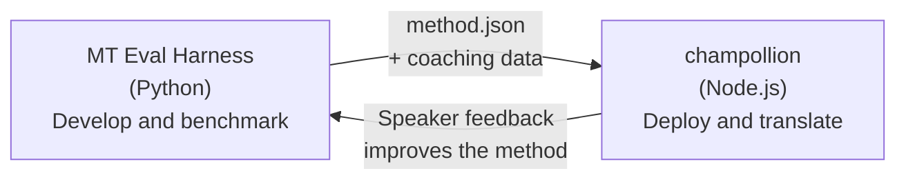

# Le Pont du Harnais d'Évaluation

champollion et le MT Eval Harness sont deux outils distincts qui forment un seul écosystème. Le harnais est l'endroit où les méthodes de traduction sont **prouvées**. Champollion est l'endroit où les méthodes prouvées sont **déployées**. Ils se connectent par un format de plugin partagé.



## Le Flux : Recherche → Production

### 1. Construire une méthode dans le harnais

Toute classe Python qui implémente `async translate(entries, config) → [{id, predicted}]` peut se brancher sur le harnais. Le harnais ne se soucie pas de ce qui se passe à l'intérieur — LLM avec invite, modèle entraîné personnalisé, règles déterministes, n'importe quoi.

### 2. L'évaluer

Le harnais évalue votre méthode par rapport à un corpus standardisé avec des métriques reproductibles : chrF++, acceptation FST (pour les langues morphologiquement riches), précision morphologique et notation sémantique.

### 3. Exporter en tant que plugin

Lorsque votre méthode atteint une qualité acceptable, empaquetez-la en tant que plugin champollion — un manifeste `method.json` avec des données de coaching optionnelles.

:::info[L'export CLI est prévu]
Actuellement, vous créez le manifeste method.json manuellement. La commande `mt-eval export` automatisera cette opération. Consultez l'[Interface de méthode](/docs/network/specifications/methods) pour le format complet du plugin.
:::

### 4. Installer dans champollion

```bash
champollion plugin install ./my-method-plugin/
```

### 5. Traduire du contenu réel

```bash
champollion sync
```

Votre méthode benchmarkée produit maintenant des traductions réelles en production.

## Le Flux : Production → Recherche

Les traductions déployées sont examinées par des locuteurs bilingues. Leurs commentaires identifient les erreurs systématiques (mauvais motifs de temps, vocabulaire manquant, formulation peu naturelle). Le chercheur met à jour la méthode dans le harnais, réévalue, réexporte et redéploie. Le système apprend de l'utilisation.

## Le Format du Plugin

Le manifeste `method.json` est le contrat entre les deux outils :

```json
{
  "name": "crk-coached-v3",
  "type": "llm-coached",
  "version": "3.0.0",
  "description": "Coached LLM translation for Plains Cree",
  "locales": ["crk"],
  "config": {
    "model": "google/gemini-3.5-flash",
    "temperature": 0.3
  },
  "benchmarks": {
    "crk": {
      "composite_score": 0.67,
      "fst_acceptance": 0.82,
      "corpus_size": 150
    }
  }
}
```

Consultez la [Spécification du Plugin](/docs/reference/plugin-spec) pour le format complet.

## Ce qui est Construit vs. Prévu

| Composant | Statut |
|-----------|--------|
| Protocole TranslationMethod | ✅ Construit |
| Exécuteur d'évaluation du harnais | ✅ Construit |
| Format de plugin method.json | ✅ Construit |
| `champollion plugin install/remove/list` | ✅ Construit |
| Chargement des données de coaching | ✅ Construit |
| CLI `mt-eval export` | 🔲 Prévu |
| Interface d'examen communautaire | 🔲 Prévu |
| Évaluation d'ensemble de test cryptographique | 🔲 Prévu |

## Lectures complémentaires

- [Méthodes de traduction](/docs/guides/translation-methods) — toutes les méthodes disponibles et leur fonctionnement
- [Spécification du plugin](/docs/reference/plugin-spec) — le format method.json
- [Servir une méthode via API](/docs/guides/serving-a-method) — héberger une méthode côté serveur
- [Souveraineté des données](/docs/network/sovereignty/data-sovereignty) — les principes autochtones de souveraineté des données, CARE et la protection cryptographique
- [Pour les chercheurs en traduction automatique](/docs/network/leaderboard/rules) — la documentation de l'eval harness
