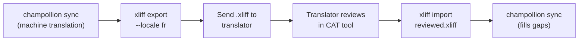

# Travailler avec des traducteurs professionnels

Champollion génère des traductions automatiques, mais certains projets nécessitent une révision humaine — contenu réglementaire, texte sensible à la marque, ou interface utilisateur critique. Le flux de travail XLIFF vous permet d'exporter les traductions pour révision professionnelle et de les réimporter sans interruption.

## Qu'est-ce que XLIFF ?

XLIFF (XML Localization Interchange File Format) est le format d'échange standard de l'industrie pour les outils de traduction. Tous les outils TAO (Traduction Assistée par Ordinateur) professionnels le supportent :

- **memoQ** — importer XLIFF, réviser en contexte, exporter le fichier révisé
- **SDL Trados Studio** — support natif de XLIFF
- **Phrase (Memsource)** — télécharger des tâches XLIFF pour les équipes de traducteurs
- **Smartling** — pipeline d'ingestion XLIFF
- **OmegaT** — outil TAO gratuit/open-source avec support XLIFF

Champollion génère XLIFF 1.2 (la version universellement supportée) plutôt que 2.0+ pour une compatibilité maximale avec les outils.

## Le flux de travail



### Étape 1 : Générer les traductions automatiques

Exécutez `sync` d'abord pour obtenir une traduction automatique de base :

```bash
champollion sync
```

### Étape 2 : Exporter XLIFF

Exportez la paire source + cible en XLIFF :

```bash
champollion xliff export --locale fr
```

Cela écrit `.champollion/xliff/fr.xliff` contenant :
- Chaque clé source avec sa valeur en anglais
- La traduction automatique actuelle (le cas échéant) comme `<target>`
- Les clés sans traductions marquées comme `state="new"`

```xml
<trans-unit id="hero.title" xml:space="preserve">
  <source>Welcome to our platform</source>
  <target state="translated">Bienvenue sur notre plateforme</target>
</trans-unit>
```

### Étape 3 : Envoyer au traducteur

Envoyez le fichier `.xliff` à votre traducteur ou téléchargez-le sur votre plateforme TAO. Le traducteur voit la source et la cible côte à côte, et peut :

- Modifier les traductions automatiques
- Remplir les traductions manquantes
- Signaler les problèmes de qualité
- Appliquer sa propre mémoire de traduction et ses bases terminologiques

### Étape 4 : Importer le fichier révisé

Lorsque le traducteur retourne le `.xliff` révisé, importez-le :

```bash
# Preview what will change
champollion xliff import .champollion/xliff/fr.xliff --dry

# Apply changes
champollion xliff import .champollion/xliff/fr.xliff
```

Résultat :
```
  ✓ Imported 142 translations for fr
    Updated:    23 (changed from existing)
    Added:      0 (new keys)
    Unchanged:  119
    Written to: locales/fr.json
```

### Étape 5 : Combler les lacunes

Si de nouvelles clés ont été ajoutées après l'export du XLIFF, exécutez `sync` pour les traduire :

```bash
champollion sync
```

Champollion ne traduit que les clés qui manquent toujours — les traductions révisées de l'import XLIFF sont préservées.

## Conseils

### Exporter des chemins personnalisés

```bash
# Export to a specific directory
champollion xliff export --locale ja --out ./for-review/

# Export with a specific filename
champollion xliff export --locale de --out ./review/german.xliff
```

### Plusieurs locales

Exportez chaque locale séparément :

```bash
for locale in fr de ja ko; do
  champollion xliff export --locale $locale
done
```

### Contrôle de version

Ajoutez `.champollion/xliff/` à `.gitignore` — les fichiers XLIFF sont des artefacts transitoires, pas la source du projet :

```gitignore
.champollion/xliff/
```

### Quand utiliser XLIFF par rapport à simplement `sync`

| Scénario | Recommandation |
|----------|---------------|
| Application interne, 90%+ de qualité acceptable | Simplement `sync` — la traduction automatique suffit |
| Contenu marketing orienté utilisateur | Exporter XLIFF pour révision humaine |
| Contenu juridique/réglementaire | Exporter XLIFF — révision humaine requise |
| 50+ locales, délai serré | `sync` d'abord, export XLIFF pour les 5 meilleures locales uniquement |
| Traducteur utilisant déjà un outil TAO | XLIFF est le format de remise naturel |

---

## Voir aussi

- [Référence CLI — xliff](/docs/reference/cli#xliff) — référence de commande
- [Mémoire de traduction](/docs/concepts/translation-memory) — mise en cache des traductions révisées
- [Méthodes de traduction](/docs/guides/translation-methods) — options de traduction automatique
