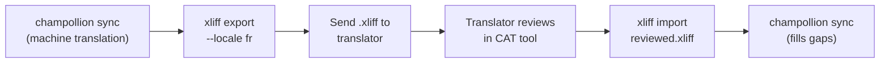

# Travailler avec des traducteurs professionnels

Champollion génère des traductions automatiques, mais certains projets nécessitent une révision humaine — contenu réglementaire, texte sensible à la marque, ou interface utilisateur critique. Le flux de travail XLIFF vous permet d'exporter les traductions pour révision professionnelle et de les réimporter sans interruption.

XLIFF prend en charge les **fichiers de chaînes** de votre application (clés et valeurs). Le **Markdown** traduit (infolettres, articles de blog, pages de documentation) fait l'objet d'une révision différente : le réviseur modifie directement le fichier `.md` traduit, et la synchronisation conserve ces modifications. Voir [Réviser le contenu Markdown traduit](#reviewing-translated-markdown) ci-dessous.

## Qu'est-ce que XLIFF ?

XLIFF (XML Localization Interchange File Format) est le format d'échange standard de l'industrie pour les outils de traduction. Tous les outils TAO (Traduction Assistée par Ordinateur) professionnels le supportent :

- **memoQ** — importer XLIFF, réviser en contexte, exporter le fichier révisé
- **SDL Trados Studio** — support natif de XLIFF
- **Phrase (Memsource)** — télécharger des tâches XLIFF pour les équipes de traducteurs
- **Smartling** — pipeline d'ingestion XLIFF
- **OmegaT** — outil TAO gratuit/open-source avec support XLIFF

Champollion génère XLIFF 1.2 (la version universellement supportée) plutôt que 2.0+ pour une compatibilité maximale avec les outils.

## Le flux de travail


```mermaid
flowchart LR
    A["champollion sync\n(machine translation)"] --> B["xliff export\n--locale fr"]
    B --> C["Send .xliff to\ntranslator"]
    C --> D["Translator reviews\nin CAT tool"]
    D --> E["xliff import\nreviewed.xliff"]
    E --> F["champollion sync\n(fills gaps)"]
```

### Étape 1 : Générer les traductions automatiques

Exécutez `sync` d'abord pour obtenir une traduction automatique de base :

```bash
champollion sync
```

### Étape 2 : Exporter XLIFF

Exportez la paire source + cible en XLIFF :

```bash
champollion xliff export --locale fr
```

Cela écrit `.champollion/xliff/fr.xliff` contenant :
- Chaque clé source avec sa valeur en anglais
- La traduction automatique actuelle (le cas échéant) comme `<target>`
- Les clés sans traductions marquées comme `state="new"`

```xml
<trans-unit id="hero.title" xml:space="preserve">
  <source>Welcome to our platform</source>
  <target state="translated">Bienvenue sur notre plateforme</target>
</trans-unit>
```

### Étape 3 : Envoyer au traducteur

Envoyez le fichier `.xliff` à votre traducteur ou téléchargez-le sur votre plateforme TAO. Le traducteur voit la source et la cible côte à côte, et peut :

- Modifier les traductions automatiques
- Remplir les traductions manquantes
- Signaler les problèmes de qualité
- Appliquer sa propre mémoire de traduction et ses bases terminologiques

### Étape 4 : Importer le fichier révisé

Lorsque le traducteur retourne le `.xliff` révisé, importez-le :

```bash
# Preview what will change
champollion xliff import .champollion/xliff/fr.xliff --dry

# Apply changes
champollion xliff import .champollion/xliff/fr.xliff
```

Résultat :
```
  ✓ Imported 142 translations for fr
    Updated:    23 (changed from existing)
    Added:      0 (new keys)
    Unchanged:  119
    Written to: locales/fr.json
```

### Étape 5 : Combler les lacunes

Si de nouvelles clés ont été ajoutées après l'export du XLIFF, exécutez `sync` pour les traduire :

```bash
champollion sync
```

Champollion ne traduit que les clés qui manquent toujours — les traductions révisées de l'import XLIFF sont préservées.

## Conseils

### Exporter des chemins personnalisés

```bash
# Export to a specific directory
champollion xliff export --locale ja --out ./for-review/

# Export with a specific filename
champollion xliff export --locale de --out ./review/german.xliff
```

### Plusieurs locales

Exportez chaque locale séparément :

```bash
for locale in fr de ja ko; do
  champollion xliff export --locale $locale
done
```

### Contrôle de version

Ajoutez `.champollion/xliff/` à `.gitignore` — les fichiers XLIFF sont des artefacts transitoires, pas la source du projet :

```gitignore
.champollion/xliff/
```

### Quand utiliser XLIFF par rapport à simplement `sync`

| Scénario | Recommandation |
|----------|---------------|
| Application interne, 90%+ de qualité acceptable | Simplement `sync` — la traduction automatique suffit |
| Contenu marketing orienté utilisateur | Exporter XLIFF pour révision humaine |
| Contenu juridique/réglementaire | Exporter XLIFF — révision humaine requise |
| 50+ locales, délai serré | `sync` d'abord, export XLIFF pour les 5 meilleures locales uniquement |
| Traducteur utilisant déjà un outil TAO | XLIFF est le format de remise naturel |

## Modifier des traductions dans les fichiers de paramètres régionaux {#editing-key-value-files}

Un réviseur peut également corriger une traduction directement dans un fichier de paramètres régionaux (`messages/fr.json`, `locale/fr/LC_MESSAGES/django.po`, `app_fr.arb`, …) et la commiter. Champollion enregistre, dans `.champollion.lock`, une empreinte de chaque valeur qu'il écrit. Une valeur qui ne correspond plus a été modifiée par une personne, et la synchronisation la traite comme lui appartenant :

| Commande exécutée | Ce qu'il advient de la valeur modifiée |
|-------------------|---------------------------------------|
| Un simple `sync`, le texte source anglais inchangé | Intacte (comme auparavant). |
| `sync --redo all` / `--force`, un changement de modèle (`--redo all --fresh-on-model-change`), ou la nouvelle tentative sur des clés laissées en attente après un redo | **Conservée.** L'exécution indique combien de valeurs ont été conservées et lesquelles, ainsi que la méthode pour en remplacer une : `--redo keys:<key>`. |
| `sync --redo keys:<key>` la désignant nommément | Remplacée — vous avez explicitement demandé cette clé. La formulation modifiée est d'abord affichée. |
| La **source anglaise de cette clé change** | Retraduite (la modification concernait l'ancien texte). La formulation modifiée est affichée afin de pouvoir être réappliquée, et ajoutée à la fin de `.champollion-replaced-edits.jsonl` à la racine du projet. |

`.champollion-replaced-edits.jsonl` est un fichier suivi par git, placé aux côtés du lock (le dossier de cache `.champollion/` est propre à chaque machine et ignoré par git) : une ligne JSON par modification remplacée, contenant la locale, le fichier, la clé, la formulation modifiée, le motif du remplacement et le nouveau texte source. Commitez-le avec le lock — il s'agit de l'unique copie de cette formulation. `champollion status` indique combien d'entrées il contient.

Les valeurs écrites avant l'existence de cet enregistrement, ou par un autre outil, ne possèdent aucune empreinte. Une telle valeur n'est considérée comme produite par Champollion que si le cache de traduction contient exactement ce texte pour la clé ; dans le cas contraire, elle est traitée comme l'œuvre d'une personne et conservée lors des réexécutions globales (la commande liste ces valeurs comme n'ayant aucun enregistrement attestant de leur écriture). Les valeurs importées avec `champollion xliff import` constituent le travail d'une personne et sont conservées de la même manière.

## Réviser le contenu Markdown traduit {#reviewing-translated-markdown}

Les fichiers de contenu issus d'un `contentDir` (par exemple `newsletters/2026-10.md` → `newsletters/2026-10.crk.md`) ne disposent d'aucun export XLIFF. Le réviseur travaille directement dans le fichier traduit lui-même :

1. Exécutez `champollion sync` et commitez les traductions ainsi que `.champollion-content.lock`.
2. Le réviseur modifie le fichier traduit, qu'il s'agisse d'un paragraphe ou d'un champ du front-matter traduit tel que `title`, et le commite.
3. Lors des synchronisations ultérieures, les modifications sont conservées. Si la source anglaise est modifiée dans d'autres paragraphes, les paragraphes du réviseur restent inchangés au mot près et seuls les paragraphes modifiés sont traduits. L'exécution affiche `kept the edits made by hand to …`.

Il existe deux exceptions, et la synchronisation émet un avertissement pour chacune d'elles. Si le paragraphe en anglais corrigé par le réviseur change également, ce paragraphe est traduit à nouveau et la formulation du réviseur est affichée afin qu'elle puisse être réappliquée. Si le réviseur a ajouté ou supprimé des paragraphes et que la source est ensuite modifiée, le fichier est conservé en l'état et mentionné à chaque synchronisation, jusqu'à ce que quelqu'un le mette à jour manuellement.

Pour annuler les modifications et revenir à la traduction automatique, spécifiez le fichier : `champollion sync --redo files:2026-10.md`. Toutes les règles sont détaillées dans [Traduction de contenu](/docs/guides/content-translation#reviewing-and-editing-translations).

---

## Voir aussi

- [Référence CLI — xliff](/docs/reference/cli#xliff) — référence des commandes
- [Mémoire de traduction](/docs/concepts/translation-memory) — mise en cache des traductions révisées
- [Méthodes de traduction](/docs/guides/translation-methods) — options de traduction automatique
- [Traduction de contenu](/docs/guides/content-translation) — traduire du Markdown et conserver les modifications des réviseurs
- [Quality Gate](/docs/concepts/quality-gate#refused-keys-are-held-back) — clés refusées par la validation et clés laissées en attente après un redo
