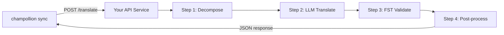

# Servir une méthode personnalisée en tant qu'API

La méthode **`api`** de champollion vous permet de pointer n'importe quelle paire de traduction vers un point de terminaison HTTP externe. C'est ainsi que vous intégrez des pipelines trop complexes pour une simple invite LLM — analyseurs morphologiques, transducteurs à états finis (FST), chaînes LLM multi-étapes, ou toute méthode de recherche personnalisée que vous avez développée.

Il existe deux façons de mettre en place un tel point de terminaison :

1. **`champollion serve`** — une commande qui sert la pile configurée de votre projet champollion existant (méthode, registres, coaching, mémoire de traduction, barrière de qualité) derrière ce contrat. Aucun code serveur. Voir [la voie sans code](#the-zero-code-path-champollion-serve).
2. **Un service personnalisé** — écrivez votre propre serveur HTTP implémentant le contrat, pour les pipelines qui existent entièrement en dehors de champollion.

## Pourquoi un service API ?

Certains pipelines de traduction ne peuvent pas s'exécuter dans un simple cycle demande-réponse :

| Étape du pipeline | Exemple |
|---|---|
| **Décomposition morphologique** | Diviser les mots polysynthétiques en morphèmes avant la traduction |
| **Validation FST** | Rejeter les résultats qui violent les règles phonologiques ou morphologiques |
| **Chaînes LLM multi-étapes** | Générer → vérifier → corriger des cycles avec différents modèles |
| **Recherche dans un dictionnaire** | Référencer un dictionnaire bilingue curé au milieu du pipeline |
| **Boucle humaine** | Mettre en file d'attente les traductions incertaines pour examen par un expert |

La méthode `api` traite votre pipeline comme une boîte noire — champollion envoie des chaînes sources, votre service retourne des traductions. Ce qui se passe à l'intérieur dépend entièrement de vous.

## Architecture



## La voie sans code : `champollion serve`

Si votre pipeline est déjà un projet champollion — une méthode configurée (LLM, avec coaching ou un moteur), des registres, des fichiers de coaching, une mémoire de traduction et la barrière de qualité déterministe — vous n'avez pas du tout besoin d'écrire un serveur. `champollion serve` déploie **votre propre pile configurée** derrière le contrat exact décrit ci-dessous :

```bash
# Owner side — run from the project whose champollion.config.json defines the stack
CHAMPOLLION_SERVE_TOKEN=$(openssl rand -hex 24) npx champollion serve
# [OK] champollion serve listening on http://127.0.0.1:1822/translate
```

Chaque requête traverse le même pipeline que celui utilisé par `champollion sync` :

- **Mémoire de traduction** — les chaînes que la MT contient déjà sont servies depuis le cache gratuitement, sans solliciter votre fournisseur en amont. Les résultats de l'API validés par la barrière sont mis en cache pour la requête suivante.
- **Barrière de qualité** — chaque réponse est validée de manière déterministe (répétition, ratio de longueur, conformité du script, écho de la source). Les échecs sont renvoyés sous forme d'erreurs structurées par clé (HTTP 207/422) — jamais sous forme de sortie silencieusement dégradée.
- **Garde-fou des coûts** — `--max-cost-per-request` et `--max-session-cost` refusent les requêtes dont le coût *estimé* en amont dépasse vos plafonds, avant même qu'un appel au fournisseur ne soit effectué. Les méthodes dont la tarification est inconnue sont également refusées sous un plafond : ce qui est inconnu n'est pas gratuit. Les requêtes couvertes par la MT ont un coût connu de 0 $ et passent toujours.

Le serveur se lie à `127.0.0.1` par défaut : quiconque peut atteindre le port peut dépenser votre budget d'API en amont, son exposition est donc une décision explicite — `--bind 0.0.0.0` plus un jeton au porteur (bearer token) fort. `--no-auth` n'est accepté qu'avec une liaison sur l'interface de bouclage (loopback). Une limite de débit par IP et un plafond de taille de requête sont activés par défaut ; voir `champollion serve --help`.

### Pointer un consommateur vers celui-ci

Émettez le manifeste de plugin que les consommateurs installent (une commande de chaque côté) :

```bash
# Owner side
champollion serve --emit-manifest --endpoint https://translate.example.org
# [OK] Wrote ./my-project-serve/method.json
```

```bash
# Consumer side
champollion plugin install ./my-project-serve
```

```json title="champollion.config.json (consumer)"
{
  "pairs": {
    "en:crk": { "methodPlugin": "my-project-serve" }
  }
}
```

```bash
CHAMPOLLION_API_KEY=<the server's bearer token> champollion sync
```

La méthode `api` du consommateur envoie les chaînes sources à votre serveur via POST ; votre pile traduit, contrôle et met en cache ; le `qualityTier` du manifeste est un relais fidèle de vos paires configurées (le niveau le plus prudent lorsqu'elles diffèrent). Vos invites, données de coaching et clés de fournisseur ne quittent jamais votre machine.

Le reste de ce guide couvre l'écriture d'un service **personnalisé** — utile lorsque votre pipeline n'est pas un projet champollion (une chaîne FST Python, un système de recherche sur mesure). Le contrat réseau est identique dans les deux cas.

## Configuration de votre service

Votre service API doit implémenter un seul point de terminaison qui accepte et retourne du JSON :

### Format de la requête

Champollion envoie ce corps JSON exact (voir [api.js](https://github.com/gamedaysuits/Champollion/blob/main/cli/lib/methods/api.js)) :

```json
POST /translate
Content-Type: application/json
Authorization: Bearer <CHAMPOLLION_API_KEY>

{
  "source_locale": "en",
  "target_locale": "crk",
  "method": "crk-coached-v1",
  "keys": {
    "greeting": "Hello, welcome to our app",
    "farewell": "Goodbye and thanks"
  }
}
```

| Champ | Type | Description |
|-------|------|-------------|
| `source_locale` | string | Code de langue source BCP 47 |
| `target_locale` | string | Code de langue cible BCP 47 |
| `method` | string | Nom du plugin ou `"default"` |
| `keys` | object | Carte de clé → chaîne source à traduire |
```

### Response Format

Your service must return a `translations` object. An optional `meta` object can include cost and diagnostic info:

```json
{
  "translations": {
    "greeting": "tânisi, pê-kîwêw ôta",
    "farewell": "ekosi mâka, kinanâskomitin"
  },
  "meta": {
    "model": "my-custom-pipeline/v1",
    "cost_usd": 0.0042,
    "method": "decompose-translate-validate"
  }
}
```

| Field | Type | Required | Description |
|-------|------|----------|-------------|
| `translations` | object | ✅ | Map of key → translated string |
| `meta` | object | — | Optional metadata |
| `meta.cost_usd` | number | — | If present, displayed in champollion's output |
| `errors` | object | — | For partial success (HTTP 207): map of key → `{ message }` |

### Minimal Express Server

```javascript
import express from 'express';

const app = express();
app.use(express.json());

/**
 * champollion API contract:
 *
 * Request:  { source_locale, target_locale, method, keys: { "key": "source" } }
 * Response: { translations: { "key": "translated" }, meta: { ... } }
 */
app.post('/translate', async (req, res) => {
  const { source_locale, target_locale, method, keys } = req.body;

  const translations = {};

  for (const [key, source] of Object.entries(keys)) {
    // --- Your pipeline goes here ---
    // Step 1: Morphological decomposition
    const morphemes = await decompose(source, source_locale);

    // Step 2: LLM translation with context
    const draft = await llmTranslate(morphemes, target_locale);

    // Step 3: FST validation
    const validated = await fstValidate(draft, target_locale);

    // Step 4: Post-processing (orthography normalization, etc.)
    translations[key] = await postProcess(validated);
  }

  res.json({
    translations,
    meta: {
      model: 'my-custom-pipeline/v1',
      method: 'decompose-translate-validate',
    },
  });
});

app.listen(3001, () => {
  console.log('Translation API running on http://localhost:3001');
});
```

## Configuring champollion

Point a translation pair at your running service in `champollion.config.json`:

```json
{
  "inputLocale": "en",
  "pairs": {
    "en:crk": {
      "method": "api",
      "endpoint": "http://localhost:3001/translate",
      "register": "Formal Plains Cree. Use SRO orthography."
    }
  }
}
```

Then run sync as usual:

```bash
npx champollion sync
```

champollion will POST your source strings to the endpoint and write the returned translations to `crk.json`.

## Case Study: Plains Cree Pipeline

:::info[Under Development]
The Plains Cree pipeline described below is **under active development** and is not yet running in production. Details here reflect the current design direction and may change as the project evolves.
:::

The **arena** project demonstrates this pattern. Its Plains Cree pipeline uses:

1. **Morphological decomposition** — Break polysynthetic Cree words into translatable morpheme chains
2. **LLM translation** — Context-enriched GPT-4o translation with coaching data (SRO orthography rules, register instructions)
3. **FST validation** — Finite-state transducer checks that outputs conform to Cree phonological rules
4. **Confidence scoring** — Each translation gets a confidence score based on FST pass rate and dictionary coverage

The entire pipeline runs as a single HTTP endpoint that champollion calls via the `api` method.

### Running Evaluations

After translating, you can evaluate output quality using the harness directly:

```bash
# Clone the harness
git clone https://github.com/gamedaysuits/Champollion.git
cd Champollion/arena
pip install -e .

# Exécuter l'évaluation sur un corpus réel non intégré
mt-eval run --corpus eval-amh-fra-globalvoices-test-v1 --model gemini-pro --yes
```

This produces structured evaluation records with chrF++, BLEU, and exact match scores that can be used as regression baselines.

## Authentication

If your API requires authentication, set the `apiKey` field or use an environment variable:

```json
{
  "pairs": {
    "en:crk": {
      "method": "api",
      "endpoint": "https://my-mt-service.example.com/translate",
      "apiKey": "${CRK_API_KEY}"
    }
  }
}
```

## Souveraineté des données

The `api` method is particularly important for **Indigenous language communities**. By self-hosting the translation pipeline, a community keeps full control over:

- **Proprietary coaching data** — register instructions, orthography rules, and domain glossaries never leave community infrastructure.
- **Linguistic resources** — curated dictionaries, FST grammars, and elder-verified translations remain under community ownership.
- **Access policies** — the community decides who can call the endpoint and under what terms.

Cette conception suit la direction des [principes autochtones de souveraineté des données](/docs/network/community/low-resource-languages#data-sovereignty-principles) — la propriété et le contrôle communautaires des données linguistiques : les données linguistiques sensibles restent gouvernées par la communauté plutôt que par une plateforme tierce.

:::tip
Combine the `api` method with a private deployment (e.g., a community-hosted VM or on-prem server) for the strongest data-sovereignty posture. `champollion serve` gives a community exactly this self-hosting posture without writing any server code — coaching data, provider keys, and the Translation Memory all stay on community infrastructure. See [Support a Low-Resource Language](/docs/network/community/low-resource-languages) for a full walkthrough.
:::

## Cost Estimation

The `api` method returns `null` for cost estimation by default — your service controls pricing. If you want to provide cost transparency, have your API return a `cost` field in the metadata:

```json
{
  "translations": { "...": "..." },
  "metadata": {
    "cost": {
      "estimatedCost": 0.0042,
      "currency": "USD",
      "source": "my-service-pricing"
    }
  }
}
```

## Bonnes pratiques

1. **Retourner des chaînes vides en cas d'échec** — Ne retournez pas la chaîne source comme « traduction ». Retournez `""` et la porte de qualité de champollion le détectera. La clé sera ignorée et réessayée lors de la prochaine synchronisation.
2. **Inclure des scores de confiance** — Si votre pipeline peut estimer la qualité, retournez-la dans les métadonnées. Cela aide à l'audit de qualité.
3. **Implémenter des vérifications de santé** — Ajoutez un point de terminaison `GET /health` pour que champollion puisse vérifier la connectivité avant de démarrer une grande synchronisation.
4. **Limiter le débit avec élégance** — Si votre pipeline a des limites de débit, retournez des codes de statut `429`. Le système de traitement par lots de champollion se retirera.
5. **Tout enregistrer** — Les pipelines multi-étapes peuvent échouer silencieusement. Enregistrez l'entrée/sortie de chaque étape pour le débogage.

## Licence

Le modèle de méthode `api` est entièrement ouvert — il n'y a aucune restriction de licence sur l'encapsulation de votre propre pipeline de traduction en tant que service HTTP. Le harnais d'évaluation `arena` est sous licence AGPL-3.0-or-later (avec une exception de plugin standard d'évaluation §7) ; vous pouvez l'étudier et le développer selon ces conditions.

## Voir aussi

- [Méthodes de traduction](/docs/guides/translation-methods) — aperçu de chaque méthode intégrée (`openai`, `google`, `api`, etc.)
- [Spécification des plugins](/docs/reference/plugin-spec) — schéma complet pour `champollion.config.json` incluant les champs de la méthode `api`
- [Prendre en charge une langue peu dotée](/docs/network/community/low-resource-languages) — guide de bout en bout pour les langues sous-dotées, incluant les principes de souveraineté des données
- [Architecture](/docs/concepts/architecture) — fonctionnement de la boucle de synchronisation, du traitement par lots et de la répartition des méthodes de champollion
- [Évaluation de la MT](/docs/network/leaderboard/rules) — méthodologie d'évaluation, métriques et processus de soumission au classement
- [Classement des méthodes](/leaderboard) — classements de qualité en direct pour l'ensemble des méthodes et des paires de langues

