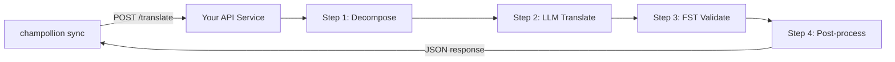

# Servir une méthode personnalisée en tant qu'API

La méthode **`api`** de champollion vous permet de pointer n'importe quelle paire de traduction vers un point de terminaison HTTP externe. C'est ainsi que vous intégrez des pipelines trop complexes pour une simple invite LLM — analyseurs morphologiques, transducteurs à états finis (FST), chaînes LLM multi-étapes, ou toute méthode de recherche personnalisée que vous avez développée.

Il existe deux façons de mettre en place un tel point de terminaison :

1. **`champollion serve`** — une commande unique qui sert la pile configurée de votre projet champollion existant (méthode, registres, coaching, mémoire de traduction, quality gate) derrière ce contrat. Aucun code de serveur requis. Consultez [l'approche sans code](#the-zero-code-path-champollion-serve).
2. **Un service personnalisé** — écrivez votre propre serveur HTTP implémentant le contrat, pour les pipelines qui s'exécutent entièrement en dehors de champollion.

## Pourquoi un service API ?

Certains pipelines de traduction ne peuvent pas s'exécuter dans un simple cycle demande-réponse :

| Étape du pipeline | Exemple |
|---|---|
| **Décomposition morphologique** | Diviser les mots polysynthétiques en morphèmes avant la traduction |
| **Validation FST** | Rejeter les résultats qui violent les règles phonologiques ou morphologiques |
| **Chaînes LLM multi-étapes** | Générer → vérifier → corriger des cycles avec différents modèles |
| **Recherche dans un dictionnaire** | Référencer un dictionnaire bilingue curé au milieu du pipeline |
| **Boucle humaine** | Mettre en file d'attente les traductions incertaines pour examen par un expert |

La méthode `api` traite votre pipeline comme une boîte noire — champollion envoie des chaînes sources, votre service retourne des traductions. Ce qui se passe à l'intérieur dépend entièrement de vous.

## Architecture


```mermaid
graph LR
    A[champollion sync] -->|POST /translate| B[Your API Service]
    B --> C[Step 1: Decompose]
    C --> D[Step 2: LLM Translate]
    D --> E[Step 3: FST Validate]
    E --> F[Step 4: Post-process]
    F -->|JSON response| A
```

## L'approche sans code : `champollion serve`

Si votre pipeline est déjà un projet champollion — une méthode configurée (LLM, coached ou moteur), des registres, des fichiers de coaching, une mémoire de traduction et le quality gate déterministe —, vous n'avez aucun serveur à écrire. `champollion serve` déploie **votre propre pile configurée** derrière le contrat exact décrit ci-dessous :

```bash
# Owner side — run from the project whose champollion.config.json defines the stack
CHAMPOLLION_SERVE_TOKEN=$(openssl rand -hex 24) npx champollion serve
# [OK] champollion serve listening on http://127.0.0.1:1822/translate
```

Chaque requête passe par le même pipeline que celui utilisé par `champollion sync` :

- **Mémoire de traduction** — les chaînes déjà présentes dans la TM sont servies gratuitement depuis le cache, sans solliciter votre fournisseur en amont. Les résultats d'API validés par le quality gate sont mis en cache pour la requête suivante.
- **Quality gate** — chaque réponse est validée de manière déterministe (répétition, ratio de longueur, conformité de l'écriture/script, écho de la source). Les échecs sont renvoyés sous forme d'erreurs structurées par clé (HTTP 207/422) — jamais sous forme de sortie dégradée silencieusement.
- **Cost guard** — `--max-cost-per-request` et `--max-session-cost` refusent les requêtes dont le coût amont *estimé* dépasse vos plafonds, avant même tout appel au fournisseur. Les méthodes dont la tarification est inconnue sont également refusées lorsqu'un plafond est défini : inconnu ne signifie pas gratuit. Les requêtes couvertes par la TM ont un coût connu de 0 $ et passent toujours.

Le serveur s'associe par défaut à `127.0.0.1` : toute personne pouvant accéder au port peut consommer votre budget d'API amont ; l'exposer est donc une décision explicite — `--bind 0.0.0.0` associé à un jeton porteur (bearer token) robuste. `--no-auth` n'est accepté qu'avec une liaison de bouclage (loopback bind). Une limitation de débit par IP et un plafond sur la taille des requêtes sont activés par défaut ; voir `champollion serve --help`.

### Y connecter un consommateur

Émettez le manifeste de plugin que les consommateurs installent (une seule commande de chaque côté) :

```bash
# Owner side
champollion serve --emit-manifest --endpoint https://translate.example.org
# [OK] Wrote ./my-project-serve/method.json
```

```bash
# Consumer side
champollion plugin install ./my-project-serve
```

```json title="champollion.config.json (consumer)"
{
  "pairs": {
    "en:crk": { "methodPlugin": "my-project-serve" }
  }
}
```

```bash
CHAMPOLLION_API_KEY=<the server's bearer token> champollion sync
```

La méthode `api` du consommateur envoie les chaînes sources par requête POST à votre serveur ; votre pile traduit, valide (gating) et met en cache ; le champ `qualityTier` du manifeste reflète fidèlement vos paires configurées (le niveau le plus conservateur lorsqu'elles diffèrent). Vos prompts, données de coaching et clés de fournisseur ne quittent jamais votre machine.

Le reste de ce guide traite de l'écriture d'un service **personnalisé** — utile lorsque votre pipeline n'est pas un projet champollion (une chaîne FST en Python, un système de recherche sur mesure). Le contrat de communication reste identique dans les deux cas.

## Configuration de votre service

Votre service API doit implémenter un seul point de terminaison qui accepte et retourne du JSON :

### Format de la requête

Champollion envoie ce corps JSON exact (voir [api.js](https://github.com/gamedaysuits/Champollion/blob/main/cli/lib/methods/api.js)) :

```json
POST /translate
Content-Type: application/json
Authorization: Bearer <CHAMPOLLION_API_KEY>

{
  "source_locale": "en",
  "target_locale": "crk",
  "method": "my-project-serve",
  "keys": {
    "greeting": "Hello, welcome to our app",
    "farewell": "Goodbye and thanks"
  }
}
```

| Champ | Type | Description |
|-------|------|-------------|
| `source_locale` | string | Code de langue source BCP 47 |
| `target_locale` | string | Code de langue cible BCP 47 |
| `method` | string | Nom du plugin ou `"default"` |
| `keys` | object | Table clé → chaîne source à traduire |
| `instructions` | object | Uniquement lorsque le point de terminaison déclare `"acceptsInstructions": true` : clé → notes par clé (les formes plurielles requises par un message, le retour d'une tentative de quality gate) |
| `text_format` | string | `"markdown"` pour le texte de document Markdown (voir ci-dessous) ; absent pour les chaînes d'application |

### Format de réponse

Votre service doit renvoyer un objet `translations`. Un objet `meta` facultatif peut inclure des informations de coût et de diagnostic :

```json
{
  "translations": {
    "greeting": "<the greeting, translated>",
    "farewell": "<the farewell, translated>"
  },
  "meta": {
    "model": "my-custom-pipeline/v1",
    "cost_usd": 0.0042,
    "method": "decompose-translate-validate"
  }
}
```

| Champ | Type | Requis | Description |
|-------|------|----------|-------------|
| `translations` | object | ✅ | Table clé → chaîne traduite |
| `meta` | object | — | Métadonnées facultatives |
| `meta.cost_usd` | number | — | Si présent, affiché dans la sortie de champollion |
| `errors` | object | — | En cas de succès partiel (HTTP 207) : table clé → `{ message }` |

### Serveur Express minimal

```javascript
import express from 'express';

const app = express();
app.use(express.json());

/**
 * champollion API contract:
 *
 * Request:  { source_locale, target_locale, method, keys: { "key": "source" } }
 * Response: { translations: { "key": "translated" }, meta: { ... } }
 */
app.post('/translate', async (req, res) => {
  const { source_locale, target_locale, method, keys } = req.body;

  const translations = {};

  for (const [key, source] of Object.entries(keys)) {
    // --- Your pipeline goes here ---
    // Step 1: Morphological decomposition
    const morphemes = await decompose(source, source_locale);

    // Step 2: LLM translation with context
    const draft = await llmTranslate(morphemes, target_locale);

    // Step 3: FST validation
    const validated = await fstValidate(draft, target_locale);

    // Step 4: Post-processing (orthography normalization, etc.)
    translations[key] = await postProcess(validated);
  }

  res.json({
    translations,
    meta: {
      model: 'my-custom-pipeline/v1',
      method: 'decompose-translate-validate',
    },
  });
});

app.listen(3001, () => {
  console.log('Translation API running on http://localhost:3001');
});
```

## Configurer champollion

Pointez une paire de traduction vers votre service en cours d'exécution dans `champollion.config.json` :

```json
{
  "inputLocale": "en",
  "pairs": {
    "en:crk": {
      "method": "api",
      "endpoint": "http://localhost:3001/translate",
      "register": "Formal Plains Cree. Use SRO orthography."
    }
  }
}
```

Exécutez ensuite la synchronisation comme d'habitude :

```bash
npx champollion sync
```

champollion enverra vos chaînes sources par POST au point de terminaison et écrira les traductions renvoyées dans `crk.json`.

### Votre point de terminaison suit-il les instructions ?

Indiquez-le avec `"acceptsInstructions"` sur la paire (ou au niveau supérieur du `method.json` du plugin) :

- **`false`** — un modèle NMT entraîné, tel que celui servi par `nmt-forge serve`, traduit du texte et rien d'autre ; interrogé deux fois, il répond la même chose. Lorsque le quality gate refuse l'une de ses réponses, champollion ne lui demande **pas** à nouveau (ce qui serait un appel inutile) ; il évalue la première réponse comme une deuxième réponse le serait (un nom conservé tel quel est accepté) et envoie le reste au `fallback` de la paire.
- **`true`** — un LLM derrière votre point de terminaison peut exploiter des notes par clé : les requêtes comportent un objet `instructions`, et une clé refusée est soumise à nouveau avec le retour du quality gate.
- **non défini** — champollion ne peut pas le déterminer. Une clé refusée est demandée une fois de plus sans retour, et l'exécution signale que le point de terminaison risque de l'ignorer.

```json
{
  "pairs": {
    "en:crk": {
      "method": "api",
      "endpoint": "http://127.0.0.1:8378/translate",
      "acceptsInstructions": false,
      "fallback": { "method": "llm-coached" }
    }
  }
}
```

Le repli (fallback) est ici un modèle hébergé. Pour tout conserver sur cette machine, utilisez plutôt `"fallback": { "method": "local", "model": "<your local model>" }` (voir [Méthode de repli](/docs/getting-started/configuration#fallback) pour savoir quand utiliser laquelle).

## Étude de cas : pipeline pour le cri des Plaines

:::info[En cours de développement]
Le pipeline pour le cri des Plaines décrit ci-dessous est **en cours de développement actif** et n'est pas encore opérationnel en production. Les détails présentés ici reflètent les orientations actuelles de conception et peuvent changer au fil de l'évolution du projet.
:::

Le projet **arena** illustre ce modèle. Son pipeline pour le cri des Plaines utilise :

1. **Décomposition morphologique** — Décomposition des mots polysynthétiques cris en chaînes de morphèmes traduisibles
2. **Traduction par LLM** — Traduction par GPT-4o enrichie de contexte avec des données de coaching (règles d'orthographe SRO, consignes de registre)
3. **Validation par FST** — Un transducteur à états finis vérifie que les sorties se conforment aux règles phonologiques du cri
4. **Attribution d'un score de confiance** — Chaque traduction reçoit un score de confiance basé sur le taux de réussite FST et la couverture du dictionnaire

L'ensemble du pipeline fonctionne comme un point de terminaison HTTP unique que champollion appelle par l'intermédiaire de la méthode `api`.

### Exécuter des évaluations

Après la traduction, vous pouvez évaluer la qualité des résultats en utilisant directement le banc d'évaluation :

```bash
# Clone the harness
git clone https://github.com/gamedaysuits/Champollion.git
cd Champollion/arena
python3 -m pip install -e .

# Run the evaluation against a real, non-bundled corpus
mt-eval run --corpus eval-amh-fra-globalvoices-test-v1 --model google/gemini-3.1-pro-preview --yes
```

Cela génère des enregistrements d'évaluation structurés avec les scores chrF++, BLEU et de correspondance exacte qui peuvent servir de références pour la non-régression.

## Authentification

Si votre API nécessite une authentification, indiquez sur la paire le nom de la variable d'environnement qui contient
son jeton (`"${VAR}"`, lue depuis l'environnement ou `.env.local`),
ou définissez `CHAMPOLLION_API_KEY`. Champollion n'envoie que ce jeton au
point de terminaison — jamais la clé d'un autre fournisseur. Un point de terminaison de bouclage (`nmt-forge
serve`, `champollion serve`) n'en nécessite aucun.

```json
{
  "pairs": {
    "en:crk": {
      "method": "api",
      "endpoint": "https://my-mt-service.example.com/translate",
      "apiKey": "${CRK_API_KEY}"
    }
  }
}
```

Le contenu (corps Markdown) emprunte le même contrat : chaque bloc constitue une clé
(`segment.<N>`, ou `body` pour une page entière) et la requête porte
`"text_format": "markdown"`, afin que le serveur puisse distinguer le texte de document des chaînes
d'application. Les serveurs qui ne reconnaissent pas ce champ peuvent l'ignorer.

## Souveraineté des données

La méthode `api` est particulièrement importante pour les **communautés linguistiques autochtones**. En auto-hébergeant le pipeline de traduction, une communauté conserve un contrôle total sur :

- **Les données de coaching propriétaires** — les consignes de registre, les règles d'orthographe et les glossaires spécialisés ne quittent jamais l'infrastructure de la communauté.
- **Les ressources linguistiques** — les dictionnaires validés, les grammaires FST et les traductions vérifiées par les aînés restent la propriété de la communauté.
- **Les politiques d'accès** — la communauté décide qui peut appeler le point de terminaison et selon quelles modalités.

Cette conception suit les [principes de souveraineté des données autochtones](/docs/network/community/low-resource-languages#data-sovereignty-principles) — propriété et contrôle communautaires des données linguistiques : les données linguistiques sensibles restent sous la gouvernance de la communauté plutôt que sous celle d'une plateforme tierce.

:::tip
Associez la méthode `api` à un déploiement privé (par exemple, une machine virtuelle hébergée par la communauté ou un serveur sur site) pour garantir le plus haut niveau de souveraineté des données. `champollion serve` offre précisément cette posture d'auto-hébergement à une communauté sans nécessiter l'écriture du moindre code serveur — les données de coaching, les clés de fournisseur et la mémoire de traduction restent toutes sur l'infrastructure communautaire. Consultez [Prendre en charge une langue à faibles ressources](/docs/network/community/low-resource-languages) pour un guide complet.
:::

## Estimation des coûts

La méthode `api` renvoie `null` pour l'estimation des coûts par défaut — votre service maîtrise la tarification. Si vous souhaitez offrir une transparence sur les coûts, faites en sorte que votre API renvoie un champ `cost` dans les métadonnées :

```json
{
  "translations": { "...": "..." },
  "metadata": {
    "cost": {
      "estimatedCost": 0.0042,
      "currency": "USD",
      "source": "my-service-pricing"
    }
  }
}
```

## Bonnes pratiques

1. **Ne renvoyez aucune traduction en cas d'échec** — Ne renvoyez pas la chaîne source en guise de « traduction ». Omettez la clé de `translations` (ou signalez-la sous `errors` avec un code HTTP 207) : la clé est ignorée et sera redemandée lors de la prochaine synchronisation. Une réponse refusée par le quality gate — une chaîne vide, un écho de la source — est mémorisée, et une synchronisation standard ne renverra pas cette clé à votre point de terminaison tant qu'elle ne sera pas explicitement ciblée avec `--redo keys:` (cela facturerait la même réponse).
2. **Incluez des scores de confiance** — Si votre pipeline peut estimer la qualité, renvoyez cette estimation dans les métadonnées. Cela facilite l'audit de qualité.
3. **Mettez en place des bilans de santé** — Ajoutez un point de terminaison `GET /health` afin que champollion puisse vérifier la connectivité avant de lancer une synchronisation volumineuse.
4. **Gérez élégamment la limitation de débit** — Si votre pipeline a des limites de débit, renvoyez des codes d'état `429`. Le système de traitement par lots de champollion temporisera automatiquement (backoff).
5. **Journalisez tout** — Les pipelines comprenant plusieurs étapes peuvent échouer silencieusement. Enregistrez les entrées et sorties de chaque étape pour le débogage.

## Licence

Le modèle de méthode `api` est entièrement ouvert — il n'y a aucune restriction de licence sur l'encapsulation de votre propre pipeline de traduction en tant que service HTTP. Le harnais d'évaluation `arena` est sous licence AGPL-3.0-or-later (avec une exception de plugin standard d'évaluation §7) ; vous pouvez l'étudier et le développer selon ces conditions.

## Voir aussi

- [Méthodes de traduction](/docs/guides/translation-methods) — vue d'ensemble de chaque méthode intégrée (`openai`, `google`, `api`, etc.)
- [Spécification des plugins](/docs/reference/plugin-spec) — schéma complet pour `champollion.config.json` incluant les champs de la méthode `api`
- [Prendre en charge une langue à faibles ressources](/docs/network/community/low-resource-languages) — guide complet pour les langues peu dotées, y compris les principes de souveraineté des données
- [Architecture](/docs/concepts/architecture) — fonctionnement de la boucle de synchronisation, du traitement par lots et de la répartition des méthodes de champollion
- [Évaluation de la TA](/docs/network/leaderboard/rules) — méthodologie d'évaluation, métriques et processus de soumission au classement
- [Classement des méthodes](/leaderboard) — classements de qualité en direct selon les méthodes et les paires de langues
