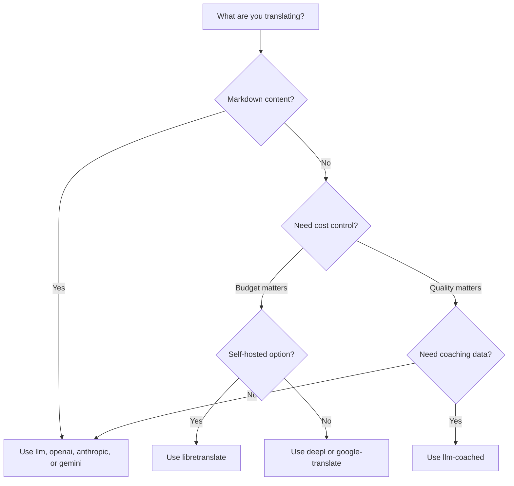

# Méthodes de Traduction

Champollion prend en charge plusieurs méthodes de traduction. Chaque paire de langues peut utiliser une méthode différente — vous n'êtes pas limité à une seule approche pour l'ensemble de votre projet.

## Comparaison des Méthodes

### Fournisseurs LLM

Axés sur la qualité, conscients du Markdown, compatibles avec le coaching. Idéal pour les projets riches en contenu.

| Méthode | Clé | Ce qu'elle fait |
|---------|-----|-----------------|
| `llm` (par défaut) | `OPENROUTER_API_KEY` | LLM via OpenRouter — 200+ modèles, routage automatique |
| `llm-coached` | `OPENROUTER_API_KEY` | LLM + règles grammaticales, dictionnaires, notes de style |
| `openai` | `OPENAI_API_KEY` | API OpenAI directe (gpt-4o, gpt-4o-mini) |
| `anthropic` | `ANTHROPIC_API_KEY` | API Anthropic directe (Claude Sonnet, Haiku, Opus) |
| `gemini` | `GEMINI_API_KEY` | API Google Gemini directe (Flash, Pro) — niveau gratuit |

### Traduction Automatique Traditionnelle

Axée sur la vitesse et le coût. Idéal pour les paires clé-valeur en grand volume.

| Méthode | Clé | Description |
|--------|-----|-------------|
| `google-translate` | `GOOGLE_TRANSLATE_API_KEY` | Google Cloud Translation API v2 (194 langues) |
| `deepl` | `DEEPL_API_KEY` | DeepL API avec prise en charge des glossaires (33 langues) |
| `microsoft-translator` | `MICROSOFT_TRANSLATOR_API_KEY` | Azure Cognitive Services Translator (135 langues) |
| `libretranslate` | *(auto-hébergé)* | LibreTranslate auto-hébergé (AGPL, gratuit) |
| `tilde` | `TILDE_API_KEY` | Tilde MT — moteurs développés dans l'UE, performants pour les langues baltes et européennes |
| `translated` | `LARA_ACCESS_KEY_ID` + `LARA_ACCESS_KEY_SECRET` | Translated's Lara — traduction automatique adaptative professionnelle (200 langues) |

### Infrastructure

| Méthode | Clé | Ce qu'elle fait |
|---------|-----|-----------------|
| `api` | *(par fournisseur)* | Client HTTP léger pour tout point de terminaison de traduction REST |

## Arbre de Décision



---

## `llm` — Traduction LLM (Par Défaut)

Traduit via n'importe quel LLM sur [OpenRouter](https://openrouter.ai). C'est la méthode par défaut et la plus polyvalente.

**Fonctionnement :**
1. Regroupe les clés (80 par défaut/lot) avec les instructions de registre et de contexte
2. Envoie à OpenRouter sous forme de prompt structuré
3. Analyse la réponse JSON
4. Valide chaque traduction via la [porte de qualité](/docs/concepts/quality-gate)
5. Écrit les traductions réussies, réessaie ou rejette les échecs

**Quand l'utiliser :** La plupart des projets. Particulièrement les sites riches en contenu avec Markdown, où les blocs de code et les shortcodes doivent être protégés.

**Configuration :**

```json
{
  "defaultMethod": "llm",
  "model": "google/gemini-3.5-flash"
}
```

## `llm-coached` — Traduction LLM Coachée

Identique à `llm`, mais avec des règles grammaticales, des dictionnaires de termes et des notes de style injectés dans chaque prompt.

**Fonctionnement :**
1. Charge les données de coaching depuis `.champollion/coaching/<locale>.json` ou le répertoire `coaching/` d'un plugin
2. Injecte les règles grammaticales, les termes du dictionnaire et les notes de style dans le prompt système
3. Les termes du dictionnaire correspondant aux clés source sont inclus comme terminologie requise
4. La traduction procède comme avec `llm`, les données de coaching ajoutant de la précision

**Quand l'utiliser :** Langues peu dotées en ressources, terminologie spécialisée (juridique, médicale), registres formels, ou tout cas où la sortie LLM générique n'est pas assez précise.

**Format des données de coaching :**

```json title=".champollion/coaching/fr.json"
{
  "grammar_rules": [
    "French adjectives agree in gender and number with the noun they modify",
    "Use 'vous' for formal contexts, 'tu' for informal"
  ],
  "dictionary": {
    "dashboard": "tableau de bord",
    "deployment": "déploiement",
    "settings": "paramètres"
  },
  "style_notes": "Prefer active voice. Avoid anglicisms where a native French term exists."
}
```

Voir aussi : [Guide des Langues Peu Dotées en Ressources](/docs/network/community/low-resource-languages)

---

## `openai` — API OpenAI Directe

Traduit directement via l'API OpenAI Chat Completions. Pas d'intermédiaire OpenRouter — votre clé, votre compte, votre tableau de bord d'utilisation.

**Modèles :** `gpt-4o` (par défaut), `gpt-4o-mini`

**Fonctionnalités :**
- ✅ Conscient du Markdown (traduction de contenu)
- ✅ Support du coaching (règles grammaticales, remplacements de dictionnaire, notes de style)
- ✅ Mode JSON pour la sortie structurée clé-valeur
- ✅ Backoff exponentiel avec réessai

**Configuration :**

```json
{
  "pairs": {
    "en:fr": { "method": "openai", "model": "gpt-4o-mini" }
  }
}
```

```bash
export OPENAI_API_KEY=sk-proj-...
```

Obtenez votre clé sur [platform.openai.com/api-keys](https://platform.openai.com/api-keys).

## `anthropic` — API Anthropic Directe

Traduit directement via l'API Anthropic Messages. Utilise le paramètre `system` pour les données de coaching, permettant la mise en cache des prompts d'Anthropic.

**Modèles :** `claude-sonnet-4-6` (par défaut), `claude-haiku-4-5`, `claude-opus-4-7`

**Fonctionnalités :**
- ✅ Conscient du Markdown (traduction de contenu)
- ✅ Support du coaching (règles grammaticales, remplacements de dictionnaire, notes de style)
- ✅ Mise en cache du prompt système (amortit le coût du coaching sur les lots)
- ✅ Backoff exponentiel avec réessai

**Configuration :**

```json
{
  "pairs": {
    "en:ja": { "method": "anthropic", "model": "claude-haiku-4-5" }
  }
}
```

```bash
export ANTHROPIC_API_KEY=sk-ant-...
```

Obtenez votre clé sur [console.anthropic.com](https://console.anthropic.com/settings/keys).

## `gemini` — API Google Gemini Directe

Traduit directement via l'API Google Gemini `generateContent`. **Niveau gratuit disponible** — meilleur point de départ sans coût.

**Modèles :** `gemini-2.5-flash` (par défaut), `gemini-2.5-pro`

**Fonctionnalités :**
- ✅ Conscient du Markdown (traduction de contenu)
- ✅ Support du coaching (règles grammaticales, remplacements de dictionnaire, notes de style)
- ✅ Mode réponse JSON via `responseMimeType`
- ✅ Niveau gratuit (quota quotidien généreux)
- ✅ Backoff exponentiel avec réessai

**Configuration :**

```json
{
  "pairs": {
    "en:ko": { "method": "gemini", "model": "gemini-2.5-pro" }
  }
}
```

```bash
export GEMINI_API_KEY=AI...
```

Obtenez votre clé sur [aistudio.google.com/apikey](https://aistudio.google.com/apikey).

### Validation du Modèle {#model-validation}

Les fournisseurs LLM directs (`openai`, `anthropic`, `gemini`) valident votre chaîne de modèle à la première utilisation. Cela détecte trois catégories d'erreurs :

**Format de méthode incorrect** — Utiliser un chemin de modèle de style OpenRouter avec un fournisseur direct :

```
[WARN] OpenAI: model "google/gemini-3.5-flash" looks like an OpenRouter path.
       Direct providers use bare model names (e.g., "gpt-4o").
       To use OpenRouter models, set method to 'llm' instead.
```

**Fournisseur incorrect** — Utiliser un modèle d'un fournisseur complètement différent :

```
[WARN] Gemini: model "claude-sonnet-4-6" is an Anthropic model.
       This provider (gemini) cannot serve Anthropic models.
       Use --method anthropic or set "method": "anthropic" in config.
```

**Modèle obsolète ou mal orthographié** — Au premier appel API, champollion récupère la liste des modèles en direct du fournisseur et vérifie votre modèle par rapport à celle-ci :

```
[WARN] Gemini: model "gemini-1.5-flash" not found in available models.
       Similar models: gemini-2.0-flash, gemini-2.5-flash, gemini-2.5-pro
       The API call will proceed — the provider will give the final verdict.
```

:::note[Il s'agit d'avertissements, non d'erreurs]
La validation du modèle enregistre des avertissements mais ne bloque pas l'appel API. L'API du fournisseur donne le verdict final — un nom de modèle futur pourrait correspondre à un motif différent, et nous ne souhaitons pas imposer de restrictions basées sur des heuristiques.
:::

---

## `google-translate` — API Google Cloud Translation

Intégration directe avec l'API Google Cloud Translation v2. Utilise l'API REST — pas de SDK, pas de compte de service. Juste la clé API.

**Quand l'utiliser :** Paires de chaînes clé-valeur à volume élevé où la vitesse et le coût priment sur la nuance. Prend en charge 194 langues nativement ([liste publiée par Google](https://docs.cloud.google.com/translate/docs/languages)).

**Limitations :**
- ⚠️ **Pas de conscience du Markdown.** Corrompra les blocs de code, les shortcodes et les variables d'interpolation.
- Pas de contrôle de registre/ton
- Pas de coaching ou d'application de terminologie

```bash
npx champollion sync --method google-translate
```

:::tip[Détection automatique]
Si seul `GOOGLE_TRANSLATE_API_KEY` est défini (aucune clé OpenRouter), champollion bascule automatiquement vers Google Translate. Aucune modification de configuration nécessaire.
:::

## `deepl` — API DeepL

Intégration directe avec l'API de traduction DeepL. Prend en charge les glossaires pour une terminologie cohérente.

**Quand l'utiliser :** Langues européennes où DeepL excelle (allemand, français, espagnol, néerlandais, polonais, etc.). Le support des glossaires applique une terminologie cohérente sans données de coaching.

**Fonctionnalités :**
- ✅ Détection automatique du point de terminaison gratuit/pro (suffixe `:fx` sur les clés gratuites)
- ✅ Création et gestion des glossaires
- ✅ Contrôle du niveau de formalité
- ⚠️ **Pas de conscience du Markdown** — paires clé-valeur uniquement

**Configuration :**

```json
{
  "pairs": {
    "en:de": { "method": "deepl" }
  }
}
```

```bash
export DEEPL_API_KEY=your-key-here
```

Obtenez votre clé sur [deepl.com/pro-api](https://www.deepl.com/pro-api).

## `microsoft-translator` — Azure Cognitive Services

Intégration directe avec l'API Microsoft Translator Text v3.

**Quand l'utiliser :** Environnements d'entreprise disposant d'une infrastructure Azure existante. Prend en charge 135 langues, y compris certaines que Google Translate ne couvre pas (tibétain, féroïen, inuktitut, entre autres).

**Fonctionnalités :**
- ✅ Jusqu'à 100 segments par requête (débit élevé)
- ✅ Paramètre de région optionnel pour l'optimisation de la latence
- ⚠️ **Pas de conscience du Markdown** — paires clé-valeur uniquement
- ⚠️ **Pas de traduction de contenu** — paires clé-valeur uniquement

**Configuration :**

```json
{
  "pairs": {
    "en:ar": { "method": "microsoft-translator" }
  }
}
```

```bash
export MICROSOFT_TRANSLATOR_API_KEY=your-key
export MICROSOFT_TRANSLATOR_REGION=global  # optional
```

Obtenez votre clé depuis le [Portail Azure](https://portal.azure.com) → Cognitive Services → Translator.

## `libretranslate` — Traduction Auto-Hébergée

Traduction open-source auto-hébergée utilisant LibreTranslate. S'exécute localement ou sur votre propre infrastructure — zéro coût API, souveraineté complète des données.

**Quand l'utiliser :** Projets nécessitant une traduction hors ligne, conformité à la protection des données (RGPD), ou fonctionnement sans coût. Particulièrement utile pour les pipelines CI qui ne doivent pas dépendre d'API externes.

**Fonctionnalités :**
- ✅ Auto-hébergé — pas d'appels API externes
- ✅ Gratuit et open source (AGPL-3.0)
- ✅ Déploiement Docker disponible
- ⚠️ **Pas de conscience du Markdown** — paires clé-valeur uniquement
- ⚠️ **Pas de traduction de contenu** — paires clé-valeur uniquement
- ⚠️ La qualité varie selon la paire de langues

**Configuration :**

```bash
# Run LibreTranslate locally with Docker
docker run -d -p 5000:5000 libretranslate/libretranslate

# Configure (optional — defaults to localhost:5000)
export LIBRETRANSLATE_API_URL=http://localhost:5000/translate
```

```json
{
  "pairs": {
    "en:es": { "method": "libretranslate" }
  }
}
```

---

## `api` — API de Traduction Distante

Un client HTTP léger pour les points de terminaison de traduction hébergés par la communauté ou protégés par IP. Champollion envoie les clés et reçoit les traductions en retour — il ne contient aucune logique de traduction.

**Quand l'utiliser :** Quand les méthodes de traduction sont hébergées côté serveur (par exemple, données de coaching propriétaires, modèles affinés, pipelines FST qui ne peuvent pas être distribués).

```json
{
  "pairs": {
    "en:crk": {
      "method": "api",
      "endpoint": "https://api.example.com/v1/translate",
      "apiKey": "your-key"
    }
  }
}
```

:::note[Traduction contrôlée par la communauté (aspirante à la souveraineté)]
La méthode `api` est la passerelle vers **une traduction hébergée et contrôlée par la communauté (aspirante à la souveraineté)**. Les communautés autochtones et de langues minoritaires peuvent héberger leurs propres points de terminaison de traduction — en gardant les données d'entraînement, les modèles affinés et la propriété intellectuelle linguistique sous le contrôle de la communauté — tandis que Champollion s'y connecte en tant que client léger.

Voir [Soutenir une Langue Peu Dotée en Ressources](/docs/network/community/low-resource-languages) pour la procédure complète d'hébergement communautaire, et [Servir une Méthode via API](/docs/guides/serving-a-method) pour les exigences du point de terminaison.
:::

---

## Configuration par Paire

Le vrai pouvoir réside dans le mélange des méthodes par paire de langues :

```json title="champollion.config.json"
{
  "version": 3,
  "pairs": {
    "en:fr": { "method": "deepl" },
    "en:ja": { "method": "openai", "model": "gpt-4o" },
    "en:ko": { "method": "gemini" },
    "en:ar": { "method": "microsoft-translator" },
    "en:crk": { "methodPlugin": "crk-coached-v1" }
  }
}
```

Cela traduit le français via DeepL (support des glossaires), le japonais via OpenAI (qualité), le coréen via Gemini (niveau gratuit), l'arabe via Microsoft Translator (couverture), et le cri des Plaines via un plugin coaché (spécialisé).

## Plugins

Les plugins sont des recettes de traduction pré-packagées pour des paires de langues spécifiques. Ce sont des manifestes JSON — pas du code — qui indiquent à champollion quelle méthode utiliser, avec quels paramètres, et quelle qualité a été évaluée.

:::tip[Du harnais d'évaluation à la production en une seule commande]
Les plugins développés et validés dans le [harnais d'évaluation](/docs/network/specifications/harness) peuvent être installés directement — la méthode que vous validez là se déploie ici avec une seule commande `plugin install`. Consultez [Évaluation TA](/docs/network/leaderboard/rules) pour le flux de travail d'évaluation complet.
:::

```bash
champollion plugin install ./french-formal-v1/
champollion plugin list
champollion plugin remove french-formal-v1
```

Voir la [Spécification des Plugins](/docs/reference/plugin-spec) pour le format complet du manifeste.

---

## Changer de Fournisseur

Vous passez d'une méthode à l'autre ? Le format du modèle et la variable d'environnement changent — voici la correspondance :

### OpenRouter → Fournisseur Direct

```diff title="champollion.config.json"
 {
   "pairs": {
     "en:fr": {
-      "method": "llm",
-      "model": "openai/gpt-4o"
+      "method": "openai",
+      "model": "gpt-4o"
     }
   }
 }
```

```diff title="Environment variables"
- export OPENROUTER_API_KEY=sk-or-v1-...
+ export OPENAI_API_KEY=sk-proj-...
```

**Différences clés :**
- OpenRouter utilise le format `provider/model` (par exemple, `openai/gpt-4o`). Les fournisseurs directs utilisent des noms de modèles simples (par exemple, `gpt-4o`).
- Chaque fournisseur direct a sa propre variable d'environnement (`OPENAI_API_KEY`, `ANTHROPIC_API_KEY`, `GEMINI_API_KEY`).
- Si vous utilisez le mauvais format de modèle, champollion vous avertira — voir [Validation du Modèle](#model-validation).

### Fournisseur Direct → OpenRouter

```diff title="champollion.config.json"
 {
   "pairs": {
     "en:ja": {
-      "method": "anthropic",
-      "model": "claude-sonnet-4-6"
+      "method": "llm",
+      "model": "anthropic/claude-sonnet-4-6"
     }
   }
 }
```

:::tip[Quand utiliser OpenRouter par rapport à Direct]
**Utilisez OpenRouter** lorsque vous souhaitez basculer entre les modèles sans modifier les variables d'environnement, ou lorsque vous souhaitez accéder à plus de 200 modèles à partir d'une seule clé. **Utilisez les fournisseurs directs** lorsque vous souhaitez une facturation plus simple, une latence plus faible (pas d'intermédiaire), ou l'accès à des fonctionnalités spécifiques au fournisseur comme la mise en cache des invites d'Anthropic.
:::

---

## Comparaison des Coûts

Coût approximatif par 1 000 clés traduites (suppose ~10 jetons par clé, 80 clés par lot) :

| Méthode | Coût / 1K Clés | Vitesse | Qualité | Idéal Pour |
|---------|----------------|---------|---------|-----------|
| `gemini` (Flash) | **Gratuit** (dans le niveau) | Rapide | Bon | Démarrage, projets personnels |
| `google-translate` | ~0,02 $ | Le plus rapide | Adéquat | Grand volume, langues européennes |
| `deepl` | ~0,02 $ | Rapide | Bon | Langues européennes, terminologie |
| `microsoft-translator` | ~0,01 $ | Rapide | Adéquat | Boutiques Azure, couverture linguistique large |
| `libretranslate` | **Gratuit** (auto-hébergé) | Variable | Correct | Air-gappé, RGPD, pipelines CI |
| `gemini` (Pro) | ~0,07 $ | Moyen | Très bon | Sensible à la qualité, quota gratuit |
| `openai` (GPT-4o-mini) | ~0,01 $ | Rapide | Bon | LLM économique |
| `openai` (GPT-4o) | ~0,10 $ | Moyen | Très bon | Sensible à la qualité |
| `anthropic` (Haiku) | ~0,01 $ | Rapide | Bon | LLM économique |
| `anthropic` (Sonnet) | ~0,10 $ | Moyen | Très bon | Sensible à la qualité |
| `anthropic` (Opus) | ~0,50 $ | Lent | Excellent | Qualité maximale |
| `llm` (OpenRouter) | Variable selon le modèle | Variable | Variable | Comparaison de modèles, expérimentation |

:::note[Il s'agit d'estimations]
Les coûts réels dépendent de la longueur de votre texte source, de la taille du lot et des modifications de tarification du fournisseur. Consultez la page de tarification actuelle de chaque fournisseur pour connaître les tarifs exacts.
:::

---

## Voir aussi

- [Langues Prises en Charge](/docs/reference/supported-languages)
- [Données de Coaching](/docs/concepts/coaching-data)
- [Soutenir une Langue Peu Dotée en Ressources](/docs/network/community/low-resource-languages)
- [Spécification des Plugins](/docs/reference/plugin-spec)
- [Servir une Méthode via API](/docs/guides/serving-a-method)
- [Porte de Qualité](/docs/concepts/quality-gate)
- [Architecture](/docs/concepts/architecture)
- [Dépannage](/docs/guides/troubleshooting) — erreurs de modèle, problèmes API

