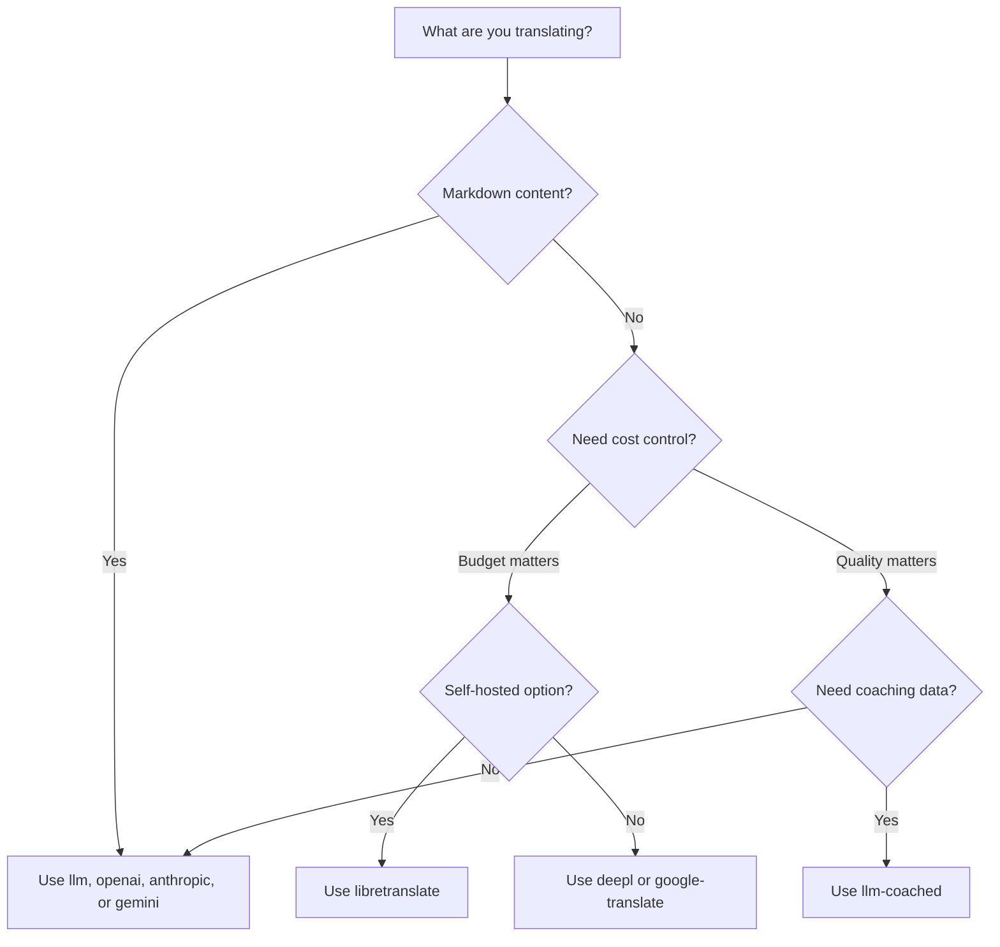

# Méthodes de Traduction

Champollion prend en charge plusieurs méthodes de traduction. Chaque paire de langues peut utiliser une méthode différente — vous n'êtes pas contraint à une seule approche pour l'ensemble de votre projet.

## Comparaison des Méthodes

### Fournisseurs LLM

Axés sur la qualité, conscients du Markdown, compatibles avec le coaching. Idéal pour les projets riches en contenu.

| Méthode | Clé | Description |
|--------|-----|-------------|
| `llm` (par défaut) | `OPENROUTER_API_KEY` | LLM via OpenRouter — plus de 200 modèles, routage automatique |
| `llm-coached` | `OPENROUTER_API_KEY` | LLM + règles de grammaire, dictionnaires, notes de style |
| `openai` | `OPENAI_API_KEY` | API OpenAI directe (gpt-4o, gpt-4o-mini) |
| `anthropic` | `ANTHROPIC_API_KEY` | API Anthropic directe (Claude Sonnet, Haiku, Opus) |
| `gemini` | `GEMINI_API_KEY` | API Google Gemini directe (Flash, Pro) — niveau gratuit |
| `local` | *(aucun)* | Un modèle sur votre propre machine ou serveur : Ollama, vLLM, LM Studio, llama.cpp ou un modèle que vous avez entraîné avec `nmt-forge`. Le texte ne quitte jamais votre infrastructure |

### Traduction Automatique Traditionnelle

Axée sur la vitesse et le coût. Idéal pour les paires clé-valeur en grand volume.

| Méthode | Clé | Description |
|--------|-----|-------------|
| `google-translate` | `GOOGLE_TRANSLATE_API_KEY` | API Google Cloud Translation v2 (194 langues) |
| `deepl` | `DEEPL_API_KEY` | API DeepL avec prise en charge des glossaires (33 langues) |
| `microsoft-translator` | `MICROSOFT_TRANSLATOR_API_KEY` | Azure Cognitive Services Translator (135 langues) |
| `libretranslate` | *(auto-hébergé)* | LibreTranslate auto-hébergé (AGPL, gratuit) |
| `tilde` | `TILDE_API_KEY` | Tilde MT — moteurs développés dans l'UE, performants sur les langues baltes et européennes |
| `translated` | `LARA_ACCESS_KEY_ID` + `LARA_ACCESS_KEY_SECRET` | Lara de Translated — TA adaptative professionnelle (200 langues) |

### Infrastructure

| Méthode | Clé | Ce qu'elle fait |
|---------|-----|-----------------|
| `api` | *(par fournisseur)* | Client HTTP léger pour tout point de terminaison de traduction REST |

## Arbre de Décision


```mermaid
flowchart TD
    A["What are you translating?"] --> B{"Markdown content?"}
    B -->|Yes| C["Use llm, openai, anthropic, or gemini"]
    B -->|No| D{"Need cost control?"}
    D -->|Budget matters| E{"Self-hosted option?"}
    D -->|Quality matters| F{"Need coaching data?"}
    E -->|Yes| G["Use libretranslate"]
    E -->|No| H["Use deepl or google-translate"]
    F -->|Yes| I["Use llm-coached"]
    F -->|No| C
```

---

## `llm` — Traduction LLM (Par Défaut)

Traduit via n'importe quel LLM sur [OpenRouter](https://openrouter.ai). C'est la méthode par défaut et la plus polyvalente.

**Fonctionnement :**
1. Regroupe les clés (80 par défaut/lot) avec les instructions de registre et de contexte
2. Envoie à OpenRouter sous forme de prompt structuré
3. Analyse la réponse JSON
4. Valide chaque traduction via la [porte de qualité](/docs/concepts/quality-gate)
5. Écrit les traductions réussies, réessaie ou rejette les échecs

**Quand l'utiliser :** La plupart des projets. Particulièrement les sites riches en contenu avec Markdown, où les blocs de code et les shortcodes doivent être protégés.

**Configuration :**

```json
{
  "defaultMethod": "llm",
  "model": "google/gemini-3.8-flash"
}
```

## `llm-coached` — Traduction LLM Coachée

Identique à `llm`, mais avec des règles grammaticales, des dictionnaires de termes et des notes de style injectés dans chaque prompt.

**Fonctionnement :**
1. Charge les données de coaching depuis `.champollion/coaching/<locale>.json` ou le répertoire `coaching/` d'un plugin
2. Injecte les règles grammaticales, les termes du dictionnaire et les notes de style dans le prompt système
3. Les termes du dictionnaire correspondant aux clés source sont inclus comme terminologie requise
4. La traduction procède comme avec `llm`, les données de coaching ajoutant de la précision

**Quand l'utiliser :** Langues peu dotées en ressources, terminologie spécialisée (juridique, médicale), registres formels, ou tout cas où la sortie LLM générique n'est pas assez précise.

**Format des données de coaching :**

```json title=".champollion/coaching/fr.json"
{
  "grammar_rules": [
    "French adjectives agree in gender and number with the noun they modify",
    "Use 'vous' for formal contexts, 'tu' for informal"
  ],
  "dictionary": {
    "dashboard": "tableau de bord",
    "deployment": "déploiement",
    "settings": "paramètres"
  },
  "style_notes": "Prefer active voice. Avoid anglicisms where a native French term exists."
}
```

Voir aussi : [Guide des Langues Peu Dotées en Ressources](/docs/network/community/low-resource-languages)

---

## `openai` — API OpenAI Directe

Traduit directement via l'API OpenAI Chat Completions. Pas d'intermédiaire OpenRouter — votre clé, votre compte, votre tableau de bord d'utilisation.

**Modèles :** `gpt-5.4-mini-2026-03-17` (par défaut — un instantané daté), ou tout identifiant de modèle exact listé par OpenAI

**Fonctionnalités :**
- ✅ Prise en compte du Markdown (traduction de contenu)
- ✅ Le même prompt que `llm` — registre, directives de genre, contexte du prompt, termes protégés, directives `coachingFile` et termes du glossaire de chaque lot ([voir ci-dessous](#one-prompt-every-llm-method))
- ✅ Mode JSON pour une sortie clé-valeur structurée
- ✅ Délai exponentiel avec nouvelles tentatives

**Configuration :**

```json
{
  "pairs": {
    "en:fr": { "method": "openai", "model": "gpt-4o-mini" }
  }
}
```

```bash
export OPENAI_API_KEY=sk-proj-...
```

Obtenez votre clé sur [platform.openai.com/api-keys](https://platform.openai.com/api-keys).

## `local` — Votre propre modèle (Ollama, vLLM, LM Studio, un modèle entraîné)

Traduit avec n'importe quel modèle derrière un endpoint **compatible OpenAI**
que vous exécutez : Ollama, vLLM, LM Studio, le serveur de llama.cpp, ou un modèle que vous avez entraîné avec
`nmt-forge`. Aucune clé d'API n'est requise et aucun texte n'est transmis à un tiers. C'est
la méthode à utiliser pour les textes sensibles, et celle qui permet de déployer un modèle que vous
avez conçu vous-même.

```json
{ "defaultMethod": "local", "model": "llama3.1" }
```

```bash
# Optional: only if your server is not at Ollama's default address
export LOCAL_API_BASE=http://localhost:11434/v1
npx champollion sync --method local
```

L'endpoint est lu, dans l'ordre, depuis : `LOCAL_API_BASE`, `OPENAI_API_BASE`,
`OPENAI_BASE_URL`, puis la valeur par défaut d'Ollama `http://localhost:11434/v1`. Lorsque
l'endpoint se trouve sur cette machine (`localhost`, `127.0.0.1`, `::1`), le coût est
indiqué comme **0 $ de coût d'API (s'exécute sur cette machine)** — il n'y a pas de facture d'API ; votre
propre matériel et votre électricité ne sont pas comptabilisés — et `--max-cost` autorise
l'exécution. Tout autre endpoint (Groq, Together, un serveur sur votre réseau) est
signalé comme **inconnu**, jamais 0 $, car l'outil ne peut pas savoir ce qu'il
facture ; `--max-cost` refuse donc d'effectuer l'opération au lieu d'extrapoler. Dans `--json`,
la ligne d'estimation indique `"estimatedCost": 0, "local": true` pour le premier cas
et `"estimatedCost": null` pour le second. (Un proxy sur cette machine qui
redirige vers une API payante — LiteLLM, une passerelle — est facturé en amont, ce que
Champollion ne peut pas voir : prévoyez-le dans votre budget à ce niveau.)

Avant de traduire, sync vérifie qu'un serveur répond à l'endpoint. Si
aucun ne répond, une exécution qui devait lui envoyer des données s'arrête avant de transmettre quoi que ce soit
(code de sortie `1`), en indiquant l'adresse. Une exécution qui ne lui envoie rien — rien n'est
en file d'attente, ou chaque clé en file provient du cache, comme lors d'un rejeu de texte
déjà traduit — signale par un avertissement que le serveur est indisponible et poursuit son traitement. Sur un
exécuteur CI (`CI` ou `GITHUB_ACTIONS` défini), un serveur qui ne répond pas interrompt chaque exécution, même
si rien n'est en file d'attente, afin qu'un workflow qui utilise encore `local` échoue dès son premier
push au lieu d'attendre qu'une chaîne change ([guide CI](/docs/guides/ci-cd)).

La méthode `openai` accepte la même substitution via `OPENAI_API_BASE` / `OPENAI_BASE_URL`
pour joindre n'importe quel fournisseur compatible OpenAI (Groq, Together, …) à l'aide d'une
clé.

## `anthropic` — API Anthropic Directe

Traduit directement via l'API Messages d'Anthropic. Les instructions sont passées dans le paramètre `system`, ce qui active la mise en cache des prompts d'Anthropic.

**Modèles :** `claude-sonnet-4-6` (par défaut), `claude-haiku-4-5`, `claude-opus-4-7`

**Fonctionnalités :**
- ✅ Prise en compte du Markdown (traduction de contenu)
- ✅ Le même prompt que `llm` — registre, directives de genre, contexte du prompt, termes protégés, directives `coachingFile` et termes du glossaire de chaque lot ([voir ci-dessous](#one-prompt-every-llm-method))
- ✅ Mise en cache du prompt système (amortit le coût des instructions à travers les lots)
- ✅ Délai exponentiel avec nouvelles tentatives

**Configuration :**

```json
{
  "pairs": {
    "en:ja": { "method": "anthropic", "model": "claude-haiku-4-5" }
  }
}
```

```bash
export ANTHROPIC_API_KEY=sk-ant-...
```

Obtenez votre clé sur [console.anthropic.com](https://console.anthropic.com/settings/keys).

## `gemini` — API Google Gemini Directe

Traduit directement via l'API Google Gemini `generateContent`. **Niveau gratuit disponible** — meilleur point de départ sans coût.

**Modèles :** `gemini-3.8-flash` (par défaut), ou tout identifiant de modèle exact listé par Google

**Fonctionnalités :**
- ✅ Prise en compte du Markdown (traduction de contenu)
- ✅ Le même prompt que `llm` — registre, directives de genre, contexte du prompt, termes protégés, directives `coachingFile` et termes du glossaire de chaque lot ([voir ci-dessous](#one-prompt-every-llm-method))
- ✅ Mode de réponse JSON via `responseMimeType`
- ✅ Niveau gratuit (quota quotidien généreux)
- ✅ Délai exponentiel avec nouvelles tentatives

**Configuration :**

```json
{
  "pairs": {
    "en:ko": { "method": "gemini", "model": "gemini-2.5-pro" }
  }
}
```

```bash
export GEMINI_API_KEY=AI...
```

Obtenez votre clé sur [aistudio.google.com/apikey](https://aistudio.google.com/apikey).

### Un seul prompt, pour chaque méthode LLM {#one-prompt-every-llm-method}

`llm`, `openai`, `anthropic`, `gemini` et `local` envoient les mêmes instructions
pour un même projet ; seule la destination de la requête diffère. Le message système
contient le registre, les directives de genre de la langue, votre `promptContext`,
votre `protectedTerms` et le texte de votre `coachingFile` ; le message de chaque lot
contient les termes de glossaire qu'il renferme (les `dictionary` dans
`.champollion/coaching/<locale>.json`), les instructions par clé (formes
plurielles, contexte gettext, descriptions) et les chaînes. Constatez-le par vous-même —
rien n'est envoyé :

```bash
npx champollion sync --dry --method local --show-prompt
```

Les règles de grammaire et les notes de style du fichier de coaching sont lues par `llm-coached`,
quel que soit le fournisseur : `{ "method": "llm-coached", "provider": "openai" }`.

### Noms de modèles {#model-names}

Chaque fournisseur direct reçoit son propre nom pour un modèle. Un identifiant de type OpenRouter
est mis en correspondance lorsque le fournisseur propose ce modèle : `openai/gpt-5.5` → `gpt-5.5` sur `openai`,
`anthropic/claude-haiku-4.5` → `claude-haiku-4-5` sur `anthropic`,
`google/gemini-3.8-flash` → `gemini-3.8-flash` sur `gemini`. Un identifiant pour lequel le fournisseur
n'a pas de modèle interrompt l'exécution avant que quoi que ce soit ne soit envoyé :

```
[ERR] sync failed: en:fr: model "google/gemini-3.8-flash" (from the top-level "model") is an OpenRouter model id
      — openai calls OpenAI directly, which has no model by that name. Use an OpenAI model (e.g. --model gpt-4o),
      --method gemini (its name for it: "gemini-3.8-flash") or --method llm to run it through OpenRouter.
```

`local`, ainsi que `openai` pointé vers un autre serveur avec `OPENAI_API_BASE`, transmettent
le nom tel que vous l'avez écrit — c'est ce serveur qui détermine sa signification.

### Slugs exacts uniquement {#exact-slugs}

Chaque modèle est désigné par son slug exact, pour toutes les méthodes : `google/gemini-3.8-flash`
sur OpenRouter, le nom exact propre à un fournisseur direct (`gpt-5.5`) sur `openai`. Aucun
nom abrégé n'est résolu en modèle, et un identifiant flottant (les identifiants de routage
`~vendor/…` d'OpenRouter, tout nom `…-latest` ou `:latest`) est également refusé : il désigne
le modèle vers lequel le fournisseur pointe actuellement, de sorte qu'une exécution ne pourrait pas indiquer quel
modèle a effectué la traduction. L'un ou l'autre interrompt l'exécution avant que quoi que ce soit ne soit envoyé :

```
[ERR] sync failed: "gemini-flash" (from --model) is not a model id — Champollion takes exact model slugs only,
      no aliases. Did you mean google/gemini-3.8-flash (what "gemini-flash" used to stand for)? List models:
      https://openrouter.ai/models (OpenRouter slugs), or champollion models --method <gemini|openai|anthropic>
      (a direct provider's own names).
```

### Validation du Modèle {#model-validation}

Les fournisseurs directs de LLM (`openai`, `anthropic`, `gemini`) vérifient également le nom de votre modèle lors de sa première utilisation (mais pas lorsqu'ils communiquent avec un autre serveur via `OPENAI_API_BASE`). Cela permet d'intercepter deux catégories d'erreurs :

**Fournisseur incorrect** — Utiliser un modèle d'un fournisseur complètement différent :

```
[WARN] Gemini: model "claude-sonnet-4-6" is an Anthropic model.
       This provider (gemini) cannot serve Anthropic models.
       Use --method anthropic or set "method": "anthropic" in config.
```

**Modèle obsolète ou mal orthographié** — Au premier appel API, champollion récupère la liste des modèles en direct du fournisseur et vérifie votre modèle par rapport à celle-ci :

```
[WARN] Gemini: model "gemini-1.5-flash" not found in available models.
       Similar models: gemini-2.0-flash, gemini-2.5-flash, gemini-2.5-pro
       The API call will proceed — the provider will give the final verdict.
```

:::note[Il s'agit d'avertissements, non d'erreurs]
La validation du modèle enregistre des avertissements mais ne bloque pas l'appel API. L'API du fournisseur donne le verdict final — un nom de modèle futur pourrait correspondre à un motif différent, et nous ne souhaitons pas imposer de restrictions basées sur des heuristiques.
:::

---

## `google-translate` — API Google Cloud Translation

Intégration directe avec l'API Google Cloud Translation v2. Utilise l'API REST — pas de SDK, pas de compte de service. Juste la clé API.

**Quand l'utiliser :** Paires de chaînes clé-valeur à volume élevé où la rapidité et le coût priment sur la nuance. Prend en charge 194 langues d'emblée ([liste publiée par Google](https://docs.cloud.google.com/translate/docs/languages)).

**Limitations :**
- ⚠️ **Pas de conscience du Markdown.** Corrompra les blocs de code, les shortcodes et les variables d'interpolation.
- Pas de contrôle de registre/ton
- Pas de coaching ou d'application de terminologie

```bash
npx champollion sync --method google-translate
```

:::tip[Détection automatique]
Si seul `GOOGLE_TRANSLATE_API_KEY` est défini (aucune clé OpenRouter), champollion bascule automatiquement vers Google Translate. Aucune modification de configuration nécessaire.
:::

## `deepl` — API DeepL

Intégration directe avec l'API de traduction DeepL. Prend en charge les glossaires pour une terminologie cohérente.

**Quand l'utiliser :** Langues européennes où DeepL excelle (allemand, français, espagnol, néerlandais, polonais, etc.). Le support des glossaires applique une terminologie cohérente sans données de coaching.

**Fonctionnalités :**
- ✅ Détection automatique du point de terminaison gratuit/pro (suffixe `:fx` sur les clés gratuites)
- ✅ Création et gestion des glossaires
- ✅ Contrôle du niveau de formalité
- ⚠️ **Pas de conscience du Markdown** — paires clé-valeur uniquement

**Configuration :**

```json
{
  "pairs": {
    "en:de": { "method": "deepl" }
  }
}
```

```bash
export DEEPL_API_KEY=your-key-here
```

Obtenez votre clé sur [deepl.com/pro-api](https://www.deepl.com/pro-api).

## `microsoft-translator` — Azure Cognitive Services

Intégration directe avec l'API Microsoft Translator Text v3.

**Quand l'utiliser :** Environnements d'entreprise disposant d'une infrastructure Azure existante. Prend en charge 135 langues, y compris certaines non couvertes par Google Translate (tibétain, féroïen, inuktitut, entre autres).

**Fonctionnalités :**
- ✅ Jusqu'à 100 segments par requête (débit élevé)
- ✅ Paramètre de région optionnel pour l'optimisation de la latence
- ⚠️ **Pas de conscience du Markdown** — paires clé-valeur uniquement
- ⚠️ **Pas de traduction de contenu** — paires clé-valeur uniquement

**Configuration :**

```json
{
  "pairs": {
    "en:ar": { "method": "microsoft-translator" }
  }
}
```

```bash
export MICROSOFT_TRANSLATOR_API_KEY=your-key
export MICROSOFT_TRANSLATOR_REGION=global  # optional
```

Obtenez votre clé depuis le [Portail Azure](https://portal.azure.com) → Cognitive Services → Translator.

## `libretranslate` — Traduction Auto-Hébergée

Traduction open-source auto-hébergée utilisant LibreTranslate. S'exécute localement ou sur votre propre infrastructure — zéro coût API, souveraineté complète des données.

**Quand l'utiliser :** Projets nécessitant une traduction hors ligne, conformité à la protection des données (RGPD), ou fonctionnement sans coût. Particulièrement utile pour les pipelines CI qui ne doivent pas dépendre d'API externes.

**Fonctionnalités :**
- ✅ Auto-hébergé — pas d'appels API externes
- ✅ Gratuit et open source (AGPL-3.0)
- ✅ Déploiement Docker disponible
- ⚠️ **Pas de conscience du Markdown** — paires clé-valeur uniquement
- ⚠️ **Pas de traduction de contenu** — paires clé-valeur uniquement
- ⚠️ La qualité varie selon la paire de langues

**Configuration :**

```bash
# Run LibreTranslate locally with Docker
docker run -d -p 5000:5000 libretranslate/libretranslate

# Configure (optional — defaults to localhost:5000)
export LIBRETRANSLATE_API_URL=http://localhost:5000/translate
```

```json
{
  "pairs": {
    "en:es": { "method": "libretranslate" }
  }
}
```

---

## `api` — API de Traduction Distante

Un client HTTP léger pour les points de terminaison de traduction hébergés par la communauté ou protégés par IP. Champollion envoie les clés et reçoit les traductions en retour — il ne contient aucune logique de traduction.

**Quand l'utiliser :** Quand les méthodes de traduction sont hébergées côté serveur (par exemple, données de coaching propriétaires, modèles affinés, pipelines FST qui ne peuvent pas être distribués).

```json
{
  "pairs": {
    "en:crk": {
      "method": "api",
      "endpoint": "https://api.example.com/v1/translate",
      "apiKey": "your-key"
    }
  }
}
```

:::note[Traduction sous contrôle communautaire (aspiration à la souveraineté)]
La méthode `api` constitue la passerelle vers une **traduction hébergée par la communauté et sous contrôle communautaire (aspiration à la souveraineté)**. Les communautés autochtones et de langues minoritaires peuvent héberger leurs propres endpoints de traduction — conservant ainsi les données de coaching, les modèles affinés et la propriété intellectuelle linguistique sous leur contrôle — tandis que Champollion s'y connecte en tant que client léger.

Voir [Soutenir une Langue Peu Dotée en Ressources](/docs/network/community/low-resource-languages) pour la procédure complète d'hébergement communautaire, et [Servir une Méthode via API](/docs/guides/serving-a-method) pour les exigences du point de terminaison.
:::

---

## Configuration par Paire

Le vrai pouvoir réside dans le mélange des méthodes par paire de langues :

```json title="champollion.config.json"
{
  "version": 3,
  "pairs": {
    "en:fr": { "method": "deepl" },
    "en:ja": { "method": "openai", "model": "gpt-4o" },
    "en:ko": { "method": "gemini" },
    "en:ar": { "method": "microsoft-translator" },
    "en:crk": { "method": "llm-coached" }
  }
}
```

Cela traduit le français via DeepL (prise en charge des glossaires), le japonais via OpenAI (qualité), le coréen via Gemini (niveau gratuit), l'arabe via Microsoft Translator (couverture), et le cri des Plaines via la méthode LLM coachée, avec les notes de grammaire et le dictionnaire que vous fournissez.

## Repli — une seconde méthode pour une paire {#fallback}

Une seule méthode gère rarement tout. Un petit modèle que vous avez entraîné vous-même peut traduire correctement la plupart des phrases tout en omettant les balises `{name}`, en altérant les pluriels ou en transformant « Home » en une phrase entière. Attribuez une méthode de repli `fallback` à la paire :

```json title="champollion.config.json"
{
  "pairs": {
    "en:crk": {
      "method": "api",
      "endpoint": "http://127.0.0.1:8378/translate",
      "fallback": { "method": "llm-coached", "model": "google/gemini-3.8-flash" }
    }
  }
}
```

Quand rien ne doit quitter vos machines, utilisez plutôt un modèle que vous exécutez vous-même comme méthode de repli : `"fallback": { "method": "local", "model": "<your local model>" }` (un serveur compatible OpenAI sur cette machine ; [`local`](#local--your-own-model-ollama-vllm-lm-studio-a-trained-model)). Un modèle hébergé offre généralement un second avis plus solide et est facturé à la requête ; `local` conserve le texte sur place pour un coût d'API de 0 $.

Votre modèle traduit en premier. Les clés que le filtre de qualité refuse de sa part, ainsi que les blocs Markdown qu'il omet ou corrompt, sont envoyés une fois à la méthode de repli et passent par le même filtre. Tout ce qu'aucune des deux méthodes ne parvient à traduire reste non traduit, comme ce serait le cas sans repli. `sync` affiche une ligne `[FALLBACK]` par paire indiquant le nombre d'éléments envoyés au repli et le nombre d'éléments corrigés. `--method` et `--model` modifient la méthode propre à la paire, jamais celle de repli. Avec `--max-cost`, chaque lot de repli est évalué financièrement avant son exécution et ignoré s'il devait dépasser le plafond. Détails : [Méthode de repli](/docs/getting-started/configuration#fallback).

## Plugins

Les plugins sont des recettes de traduction pré-packagées pour des paires de langues spécifiques. Ce sont des manifestes JSON — pas du code — qui indiquent à champollion quelle méthode utiliser, avec quels paramètres, et quelle qualité a été évaluée.

:::tip[Du harnais d'évaluation à la production en une seule commande]
Les plugins développés et validés dans le [harnais d'évaluation](/docs/network/specifications/harness) peuvent être installés directement — la méthode que vous validez là se déploie ici avec une seule commande `plugin install`. Consultez [Évaluation TA](/docs/network/leaderboard/rules) pour le flux de travail d'évaluation complet.
:::

```bash
champollion plugin install ./french-formal-v1/
champollion plugin list
champollion plugin remove french-formal-v1
```

Voir la [Spécification des Plugins](/docs/reference/plugin-spec) pour le format complet du manifeste.

---

## Changer de Fournisseur

Vous passez d'une méthode à l'autre ? Le format du modèle et la variable d'environnement changent — voici la correspondance :

### OpenRouter → Fournisseur Direct

```diff title="champollion.config.json"
 {
   "pairs": {
     "en:fr": {
-      "method": "llm",
-      "model": "openai/gpt-4o"
+      "method": "openai",
+      "model": "gpt-4o"
     }
   }
 }
```

```diff title="Environment variables"
- export OPENROUTER_API_KEY=sk-or-v1-...
+ export OPENAI_API_KEY=sk-proj-...
```

**Différences clés :**
- OpenRouter utilise le format `provider/model` (par exemple, `openai/gpt-4o`). Les fournisseurs directs utilisent des noms de modèles simples (par exemple, `gpt-4o`).
- Chaque fournisseur direct a sa propre variable d'environnement (`OPENAI_API_KEY`, `ANTHROPIC_API_KEY`, `GEMINI_API_KEY`).
- Si vous utilisez le mauvais format de modèle, champollion vous avertira — voir [Validation du Modèle](#model-validation).

### Fournisseur Direct → OpenRouter

```diff title="champollion.config.json"
 {
   "pairs": {
     "en:ja": {
-      "method": "anthropic",
-      "model": "claude-sonnet-4-6"
+      "method": "llm",
+      "model": "anthropic/claude-sonnet-4.6"
     }
   }
 }
```

:::tip[Quand utiliser OpenRouter par rapport à Direct]
**Utilisez OpenRouter** lorsque vous souhaitez basculer entre les modèles sans modifier les variables d'environnement, ou lorsque vous souhaitez accéder à plus de 200 modèles à partir d'une seule clé. **Utilisez les fournisseurs directs** lorsque vous souhaitez une facturation plus simple, une latence plus faible (pas d'intermédiaire), ou l'accès à des fonctionnalités spécifiques au fournisseur comme la mise en cache des invites d'Anthropic.
:::

---

## Comparaison des Coûts

Coût approximatif par 1 000 clés traduites (suppose ~10 jetons par clé, 80 clés par lot) :

| Méthode | Coût / 1K Clés | Vitesse | Qualité | Idéal Pour |
|---------|----------------|---------|---------|-----------|
| `gemini` (Flash) | **Gratuit** (dans le niveau) | Rapide | Bon | Démarrage, projets personnels |
| `google-translate` | ~0,02 $ | Le plus rapide | Adéquat | Grand volume, langues européennes |
| `deepl` | ~0,02 $ | Rapide | Bon | Langues européennes, terminologie |
| `microsoft-translator` | ~0,01 $ | Rapide | Adéquat | Boutiques Azure, couverture linguistique large |
| `libretranslate` | **Gratuit** (auto-hébergé) | Variable | Correct | Air-gappé, RGPD, pipelines CI |
| `gemini` (Pro) | ~0,07 $ | Moyen | Très bon | Sensible à la qualité, quota gratuit |
| `openai` (GPT-4o-mini) | ~0,01 $ | Rapide | Bon | LLM économique |
| `openai` (GPT-4o) | ~0,10 $ | Moyen | Très bon | Sensible à la qualité |
| `anthropic` (Haiku) | ~0,01 $ | Rapide | Bon | LLM économique |
| `anthropic` (Sonnet) | ~0,10 $ | Moyen | Très bon | Sensible à la qualité |
| `anthropic` (Opus) | ~0,50 $ | Lent | Excellent | Qualité maximale |
| `llm` (OpenRouter) | Variable selon le modèle | Variable | Variable | Comparaison de modèles, expérimentation |

:::note[Il s'agit d'estimations]
Les coûts réels dépendent de la longueur de votre texte source, de la taille du lot et des modifications de tarification du fournisseur. Consultez la page de tarification actuelle de chaque fournisseur pour connaître les tarifs exacts.
:::

---

## Voir aussi

- [Langues Prises en Charge](/docs/reference/supported-languages)
- [Données de Coaching](/docs/concepts/coaching-data)
- [Soutenir une Langue Peu Dotée en Ressources](/docs/network/community/low-resource-languages)
- [Spécification des Plugins](/docs/reference/plugin-spec)
- [Servir une Méthode via API](/docs/guides/serving-a-method)
- [Porte de Qualité](/docs/concepts/quality-gate)
- [Architecture](/docs/concepts/architecture)
- [Dépannage](/docs/guides/troubleshooting) — erreurs de modèle, problèmes API
