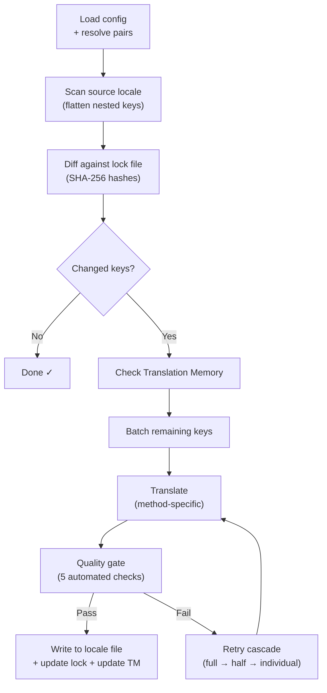

# Fonctionnement de champollion

champollion traduit les fichiers de localisation de votre application avec une seule commande. Voici ce qui se passe en arrière-plan.

## Le pipeline

Lorsque vous exécutez `npx champollion sync`, champollion exécute un pipeline à six étapes :



**Décisions de conception clés :**

- **Détection des modifications via hachages SHA-256.** Champollion suit chaque valeur source avec un hachage dans `.champollion.lock`. Lorsque vous mettez à jour une chaîne anglaise, seule cette clé est retraduite. C'est pourquoi `sync` est rapide lors des exécutions répétées — il effectue un travail minimal.

- **Mise en cache de la mémoire de traduction.** Avant d'effectuer tout appel API, champollion vérifie `.champollion/tm.json` pour les traductions en cache (indexées par texte source + locale + méthode). Lors d'une resynchronisation typique après modification d'une clé, 142 clés proviennent du cache et 1 clé accède à l'API.

- **Portail de qualité avant écriture.** Chaque traduction passe par cinq vérifications automatisées (vide, écho source, boucle d'hallucination, inflation de longueur, conformité des scripts) avant de toucher vos fichiers. Les défaillances sont enregistrées, jamais acceptées silencieusement.

- **Cascade de nouvelles tentatives en cas d'échec.** Si un lot échoue (erreur d'analyse JSON, délai d'expiration de l'API), champollion réessaie avec des lots progressivement plus petits : complet → moitié → individuel. Cela isole la clé problématique sans bloquer le reste.

## Méthodes de Traduction

Champollion prend en charge plusieurs méthodes de traduction, chacune adaptée à différents scénarios. Les principales sont :

| Méthode | Fonctionnement | Idéal pour |
|---------|----------------|-----------|
| **`llm`** | Invite structurée vers n'importe quel modèle OpenRouter | Langues bien dotées en ressources |
| **`llm-coached`** | Même invite + règles de grammaire, dictionnaire et notes de style | Langues où les LLM commettent des erreurs prévisibles |
| **`google-translate`** | Demande de lot de l'API Google Cloud Translation | Langues à hautes ressources avec bon support de traduction automatique |
| **`api`** | HTTP POST vers votre propre point de terminaison | Pipelines personnalisés, modèles contrôlés par la communauté |

Les méthodes sont configurées par paire de langues. Vous pourriez utiliser `google-translate` pour le français mais `llm-coached` pour le cri des Plaines — chaque paire obtient la méthode qui fonctionne le mieux pour elle.

## Données de coaching

Pour les paires `llm-coached`, les données de coaching donnent au LLM des connaissances linguistiques explicites : règles de grammaire, terminologie forcée et préférences de style. Ceci est injecté dans chaque invite en tant que contexte structuré.

```json title="coaching/crk.json"
{
  "grammar_rules": ["Animate nouns take different plural forms than inanimate nouns"],
  "dictionary": {"welcome": "ᑕᓂᓯ", "settings": "ᐃᑕᐢᑌᐘᐃᓇ"},
  "style_notes": "Use Standard Roman Orthography (SRO) unless explicitly configured otherwise."
}
```

Les données de coaching constituent le mécanisme principal pour améliorer la qualité de la traduction sans affiner un modèle. Modifiez les règles → réexécutez la synchronisation → voyez si cela aide. L'itération est instantanée.

## Plugins

Les plugins sont des recettes de traduction pré-packagées pour des paires de langues spécifiques. Ce sont des manifestes JSON — pas du code — qui indiquent à champollion quelle méthode utiliser, avec quels paramètres, et quelle qualité a été évaluée.

```bash
champollion plugin install ./crk-coached-v3/
champollion sync   # uses the installed plugin for en→crk
```

Les plugins comblent le fossé entre la recherche et la production : une méthode qui obtient un bon score dans le [Réseau](/arena) peut être packagée en tant que plugin et déployée ici.

## La vue d'ensemble

champollion est la première moitié d'un écosystème en deux parties :

- **[le Réseau](/arena)** — où les méthodes de traduction sont **développées et prouvées** avec des évaluations reproductibles
- **champollion** — où les méthodes prouvées sont **déployées** pour traduire du contenu réel

Le [Pont Eval Harness](/docs/guides/bridge) relie les deux. Une méthode qui fait ses preuves dans le Réseau se déploie ici. Les commentaires des locuteurs en production améliorent la version suivante.

---

## Approfondissez

- [Fonctionnement de la synchronisation](/docs/concepts/how-sync-works) — présentation détaillée du pipeline étape par étape
- [Portail de qualité](/docs/concepts/quality-gate) — les cinq vérifications automatisées
- [Mémoire de traduction](/docs/concepts/translation-memory) — mise en cache et économies de coûts
- [Méthodes de traduction](/docs/guides/translation-methods) — comparaison détaillée des méthodes
- [Architecture](/docs/concepts/architecture) — aperçu de la conception du système
