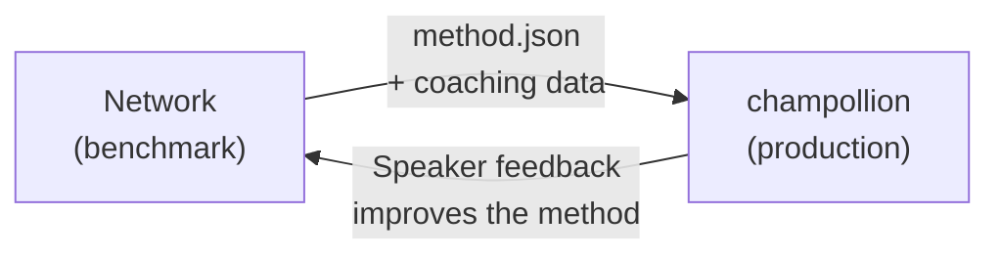

# Déployer en Production

Vous avez prouvé que cela fonctionne dans le Réseau. Maintenant, déployez-le.

Le Réseau est destiné à la R&D — construction, benchmarking et comparaison des méthodes de traduction. **Le déploiement en production** s'effectue via [champollion](https://champollion.dev), l'outil CLI destiné aux développeurs. Ils se connectent via un format de plugin partagé.



---

## Le Chemin du Déploiement

### 1. Exporter Votre Méthode en tant que Plugin

Créez un manifeste `method.json` qui empaquette vos résultats de benchmarking :

```json
{
  "name": "french-formal-v1",
  "type": "llm-coached",
  "version": "1.0.0",
  "description": "Formal-register French (example manifest; the benchmark values are illustrative)",
  "locales": ["fr"],
  "config": {
    "model": "google/gemini-2.5-flash",
    "temperature": 0.3
  },
  "benchmarks": {
    "fr": {
      "corpus_chrf": 72.3,
      "exact_match_rate": 0.42,
      "corpus_size": 500
    }
  }
}
```

Incluez toute donnée de coaching (règles grammaticales, dictionnaires) aux côtés du manifeste.

### 2. Installer dans Champollion

```bash
champollion plugin install ./french-formal-v1/
```

### 3. Configurer Votre Paire

```json title="champollion.config.json"
{
  "pairs": {
    "en:fr": { "methodPlugin": "french-formal-v1" }
  }
}
```

### 4. Traduire du Contenu Réel

```bash
npx champollion sync
```

Votre méthode benchmarkée produit maintenant des traductions réelles en production.

---

## Pour les Langues Autochtones

Les méthodes au service des communautés linguistiques autochtones requièrent le **consentement de la communauté** avant tout déploiement en production. Les principes de souveraineté des données autochtones — appropriation et contrôle des données linguistiques par la communauté — régissent la manière dont les méthodes de traduction sont développées, évaluées et déployées.

Aucun score ne rend une méthode déployable — ni un score chrF++ élevé, ni le seuil d'un prix. Elle n'est déployée **que si et quand** l'organe de gouvernance de la communauté linguistique donne son consentement, après que les locuteurs de la langue ont évalué ses résultats.

Consultez [Souveraineté des Données](/docs/network/sovereignty/data-sovereignty) et [Transfert de Propriété](/docs/network/sovereignty/ownership-transfer) pour le cadre de gouvernance complet.

---

## Voir aussi

- [Le Pont du Harnais d'Évaluation](https://champollion.dev/docs/guides/bridge) — présentation détaillée du pipeline Réseau→champollion
- [Spécification du Plugin](https://champollion.dev/docs/reference/plugin-spec) — le format du manifeste method.json
- [Guide de l'Agent Champollion](https://champollion.dev/docs/guides/agent-guide) — comment utiliser champollion pour la traduction
