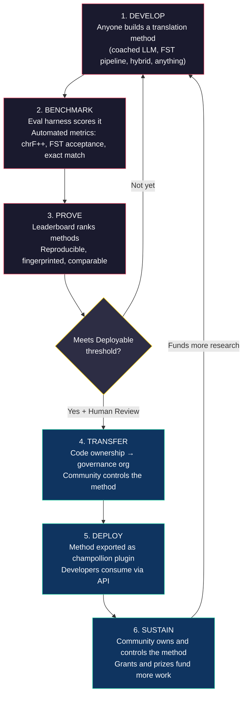
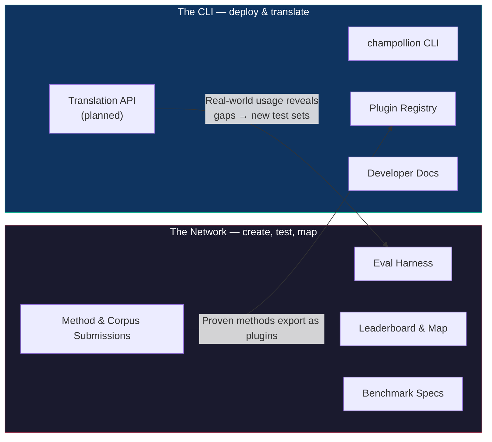
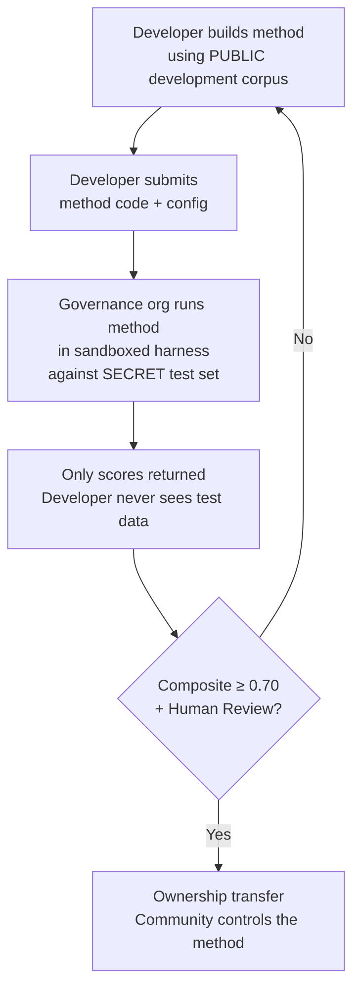

# Comment fonctionne le réseau : Construire, Tester, Développer, Déployer

> **Résumé analytique.** La traduction automatique pour les langues sous-représentées dans le monde n'est pas un problème d'entraînement de modèles — c'est un problème d'*infrastructure*. Aucun modèle, laboratoire ou entreprise ne le résoudra seul. Ce document décrit l'architecture d'une plateforme qui transforme la communauté mondiale des ingénieurs en apprentissage automatique (ML), des linguistes et des locuteurs en un laboratoire de recherche distribué : n'importe qui peut concevoir une méthode de traduction, le réseau teste son efficacité — y compris par rapport à des données d'évaluation détenues par la communauté que la plateforme ne voit jamais — et les méthodes qui fonctionnent deviennent des actifs appartenant aux communautés dont elles servent les langues. Le mécanisme repose sur le développement ouvert et collaboratif de méthodes, associé à des conditions flexibles définies par les gardiens des données — une combinaison encore rare dans la pratique, et celle que nous estimons nécessaire pour résoudre ce problème.

---

> [!IMPORTANT]
> **Périmètre.** Cette plateforme évalue la **traduction de textes écrits formels** — documents, supports éducatifs, communications officielles, chaînes d'interface utilisateur. Il ne s'agit pas d'un chatbot, d'un interprète en temps réel ou d'un système conversationnel à domaine non restreint. Le classement (leaderboard) évalue les méthodes de traduction par rapport à des corpus parallèles validés dans des domaines textuels spécifiques (voir [Benchmark Specification §2.7](/docs/network/specifications/benchmark#27-domain) pour la taxonomie des domaines). La traduction automatique (MT) est une infrastructure pour la revitalisation linguistique, et non un substitut à celle-ci. Les enfants apprennent la langue auprès des personnes, pas des machines.

### Couverture actuelle des domaines

Le classement est **en ligne et en cours d'alimentation** — les exécutions y sont publiées en continu, et
n'importe qui peut en ajouter d'autres. Le tableau ci-dessous indique quels corpus de référence publics
sont *pris en charge* par domaine ; le [classement](/leaderboard) présente les résultats
en temps réel.
Les corpus sont récupérés depuis leur source au moment de l'exécution, et ne sont jamais hébergés ici.

| Domaine | Corpus de référence | Statut | Notes |
|--------|------------------|--------|-------|
| Actualités / journalisme | Global Voices (OPUS) | Pris en charge — ouvert aux soumissions | 493 paires de langues, CC BY 3.0 |
| Quotidien / mixte (écrit) | Tatoeba | Pris en charge — ouvert aux soumissions | 874 paires de langues, CC BY 2.0 |
| Éducatif / manuel scolaire | EdTeKLA (Plains Cree) | Recherche uniquement — **non classé** ; évaluation à distance via API de modèle soumise à consentement | Licence CC BY-NC-SA modifiée d'EdTeKLA (portée sur la souveraineté, non commerciale) ; exclu du classement, des prix et des voies API/commerciales |
| Narratif / littéraire | — | Prévu | Aucun corpus exécutable connecté pour le moment |
| Religieux / scripturaire | FLORES+ (domaine biblique) | Connecté, relatif uniquement | Corpus exécutable ; FORTE contamination, donc relatif uniquement — jamais utilisé pour la notation officielle |
| Parlé / temps réel | — | Hors périmètre | Ce système évalue le texte écrit, pas la parole |
| Technique / scientifique | — | À venir | Nécessite une validation terminologique spécifique au domaine |

## À quoi sert le réseau

Avant la mécanique, la mission. Le réseau Champollion repose sur quatre engagements :

1. **Créer et fiabiliser des jeux de test de traduction.** Pour la plupart des langues, la ressource rare et précieuse n'est pas un énième modèle — c'est un jeu de test *fiable* : rédigé par des humains, fidèle au domaine et dont la version est figée. Le réseau existe pour créer ces jeux de test et garantir leur fiabilité.
2. **Rendre le domaine navigable.** Qui peut traduire quoi, quelle est l'efficacité de chaque méthode sur chaque type de texte, et où se situent les lacunes — tout cela est présenté sous forme de carte publique, et non enfoui dans des articles et des PDF éparpillés.
3. **Toutes les méthodes sont les bienvenues — humaines et automatiques.** Nous sommes des pragmatiques axés sur les solutions. Un traducteur professionnel, un système basé sur des règles, un LLM guidé, un modèle affiné (fine-tuned) — tous sont considérés comme des éléments de premier plan. Ce qui nous importe, c'est que les langues soient traduites, et non de savoir quel outil l'emporte.
4. **Construit *avec* les communautés, jamais par aspiration de données (scraping) — et la souveraineté est non négociable.** Les données linguistiques sont des données biologiques ; les personnes qui fournissent un corpus en détiennent les clés, ainsi que celles de tout ce qui est mesuré par rapport à celui-ci.

Tout ce qui suit — la boucle, l'environnement d'évaluation (harness), le classement, la passerelle de déploiement — est au service de ces quatre engagements.

---

## 1. Le problème : Traduction automatique ≠ Apprentissage automatique

La traduction automatique pour les langues peu dotées (LRLs) est couramment présentée comme un problème d'apprentissage automatique (ML) : collecter des données, entraîner un modèle, déployer. Ce cadrage est erroné, et l'erreur est lourde de conséquences — elle oriente les financements, les talents et les infrastructures vers une approche qui, structurellement, ne peut pas fonctionner pour la majorité des langues du monde.

### 1.1 Pourquoi le cadrage ML échoue

Le pipeline ML standard pour la traduction automatique nécessite trois éléments : de vastes corpus parallèles, des bancs d'essai (benchmarks) d'évaluation validés, et une voie de déploiement. Pour les 194 langues figurant sur la liste de Google Cloud Translation et les 200 couvertes par NLLB-200, ces trois éléments existent. Pour les quelque 1 200 langues de la longue traîne d'OMT-1600 — selon notre calcul : les 1 600 qu'il couvre moins les plus de 400 dont les auteurs rapportent que les modèles les "comprennent suffisamment bien" — des données d'évaluation existent, mais la qualité est généralement inférieure aux seuils d'utilisabilité, les poids des modèles ne sont pas accessibles au public, et il n'y a pas de pipeline de déploiement. Pour les plus de 5 400 langues restantes, aucun de ces éléments n'existe.

| Exigence | Langues bien dotées | Longue traîne d'OMT-1600 (~1 200 LRLs) | Les ~5 400 langues restantes |
|-------------|------------------------|-------------------------------|---------------------------|
| **Corpus parallèles** | Des millions de paires de phrases (Europarl, UN Corpus, OpenSubtitles) | Textes bilingues du domaine biblique, aspirations web, rétrotraduction synthétique. Aucune donnée validée par la communauté. | Des centaines à quelques milliers, au mieux |
| **Bancs d'essai d'évaluation** | WMT, FLORES, NTREX — standardisés, reproductibles | BOUQuET (domaine biblique), met-BOUQuET. Aucune validation morphologique. Aucune évaluation indépendante. | Aucun banc d'essai standard ; évaluation ad hoc |
| **Voie de déploiement** | Google Translate, DeepL, Azure — APIs commerciales | Poids des modèles non publiés. Pas de CLI, pas de système de plugins, pas d'API déployable par la communauté. | Rien. Pas d'API, pas de produit, pas de marché. |

L'approche ML fonctionne lorsque les données existent pour l'entraînement et que le marché existe pour le déploiement. OMT-1600 a considérablement élargi la première condition — mais une expansion sans vérification indépendante de la qualité, sans validation morphologique ou sans gouvernance communautaire est une expansion sans confiance. Le problème n'est pas seulement "nous avons besoin d'un meilleur modèle" — c'est "nous avons besoin d'une infrastructure qui prouve que le modèle fonctionne, selon des conditions contrôlées par la communauté."

### 1.2 Ce que la traduction automatique pour les LRLs requiert réellement

La traduction pour les langues sous-représentées n'est pas principalement un problème d'entraînement. C'est un problème d'**ingénierie des méthodes** — le défi consistant à assembler les ressources disponibles (LLMs, outils morphologiques, connaissances communautaires, règles linguistiques) en pipelines de traduction fonctionnels, puis à prouver leur efficacité par une évaluation rigoureuse.

La distinction est importante :

| Dimension | Approche ML | Approche par ingénierie des méthodes |
|-----------|------------|---------------------------|
| **Activité principale** | Entraîner un modèle sur des données | Combiner des outils, des invites (prompts) et des connaissances linguistiques dans un pipeline |
| **Goulot d'étranglement** | Volume de données parallèles | Créativité en ingénierie + infrastructure d'évaluation |
| **Qui peut contribuer** | Équipes disposant de grappes de GPU et de jeux de données | Quiconque possède une clé API, un dictionnaire et une idée |
| **Évaluation** | BLEU/chrF sur des jeux de test mis de côté | Validation morphologique + révision humaine + métriques automatisées |
| **Déploiement** | Servir le modèle | Empaqueter la méthode sous forme de plugin |

Les LLMs modernes contiennent déjà des connaissances latentes sur de nombreuses langues peu dotées — suffisamment pour produire des résultats qui *semblent* plausibles. Le problème est que ces résultats sont souvent morphologiquement invalides (le modèle hallucine des formes de mots qui n'existent pas dans la langue). Le défi d'ingénierie est le suivant : comment extraire ce que le LLM sait, le valider par rapport à la réalité linguistique, et empaqueter le résultat pour une utilisation en production ?

C'est pourquoi nous évaluons des **méthodes**, et non des modèles. Une méthode est la recette complète : sélection du modèle + ingénierie des invites (prompt engineering) + utilisation d'outils + pré/post-traitement + données d'accompagnement (coaching data) + stratégies de relance. Deux équipes utilisant le même modèle avec des méthodes différentes obtiendront des scores différents. C'est précisément le but.

### 1.3 Pourquoi les langues polysynthétiques cassent tout

Bon nombre des langues les plus sous-représentées au monde sont **polysynthétiques** — elles encodent des phrases entières dans des mots uniques grâce à des processus morphologiques productifs. Prenez le mot en cri des plaines (Plains Cree) :

> **ê-kî-nitawi-kîskinwahamâkosiyân**
> *"quand j'étais allé à l'école"*

Un seul mot. Il encode le temps (passé), la direction (aller vers), la racine (apprendre), la voix (passive/réfléchie) et la personne (première du singulier). L'anglais a besoin de six mots pour ce que le cri exprime en un seul.

Cela met en échec la traduction automatique standard à tous les niveaux :

- **Tokenisation** — BPE et SentencePiece déchiquettent les mots polysynthétiques en fragments dénués de sens, car ils ont été conçus pour une morphologie concaténative.
- **Hallucination** — Les LLMs produisent des chaînes de caractères d'apparence plausible qui ne sont pas des mots valides. Un non-locuteur ne peut pas faire la différence. Sans validation morphologique, les hallucinations sont invisibles.
- **Évaluation** — Les métriques au niveau du mot (BLEU) pénalisent la variation flexionnelle naturelle qui est fondamentale dans le fonctionnement de ces langues. Les métriques au niveau du caractère (chrF++) sont meilleures mais restent insuffisantes sans validation structurelle.

La solution n'est pas un modèle plus grand ou davantage de données d'entraînement. C'est une **infrastructure qui détecte les hallucinations avant qu'elles n'atteignent les utilisateurs** — des analyseurs morphologiques (FSTs) capables d'affirmer de manière définitive : "ceci n'est pas un mot dans cette langue."

---

## 2. Pourquoi les approches existantes ne fonctionnent pas

### 2.1 Traduction automatique commerciale

Les services de traduction commerciale ont historiquement optimisé leurs systèmes pour le volume du marché. OMT-1600 de Meta (mars 2026) représente un changement significatif — 1 600 langues dans un seul système. Mais pour les quelque 1 200 langues de sa longue traîne (notre calcul : 1 600 moins les plus de 400 dont les auteurs rapportent que les modèles les "comprennent suffisamment bien"), la qualité est inférieure aux seuils d'utilisabilité, les poids des modèles ne sont pas disponibles, et il n'y a pas de pipeline de déploiement. Le problème structurel des incitations a évolué : les géants de la technologie (Big Tech) peuvent désormais construire des modèles pour les LRLs, mais sans évaluation indépendante, sans validation morphologique ou sans gouvernance communautaire, la couverture à elle seule ne résout pas le problème.

### 2.2 Recherche académique

La recherche académique en traduction automatique se concentre massivement sur les paires de langues bien dotées, car c'est là que se trouvent les données d'entraînement, les tâches partagées et les opportunités de publication. Les chercheurs qui travaillent sur des paires peu dotées peinent à publier, peinent à financer la puissance de calcul et peinent à déployer — car l'infrastructure de déploiement pour les LRLs n'existe pas.

### 2.3 Compétitions ponctuelles

Vous pourriez organiser une compétition Kaggle : "Anglais→Cri des plaines, le meilleur score chrF++ remporte 10 000 $." Voici ce qui se produit :

1. Quelqu'un gagne, soumet un notebook, empoche le prix et rentre chez lui.
2. Le notebook pourrit dans les archives de Kaggle. Personne ne le déploie. Personne ne le maintient.
3. Le jeu de test finit par être publié — contaminé pour toujours.
4. L'organisation de gouvernance a téléchargé ses données linguistiques sur l'infrastructure de Google selon les conditions d'utilisation de Google, sans véritable contrôle sur leur cycle de vie.
5. Aucune passerelle de déploiement. Un notebook gagnant n'est pas une API fonctionnelle.

Une prime ponctuelle attire les chasseurs de primes. Un classement continu avec une gouvernance communautaire crée un engagement durable.

### 2.4 Affinage (Fine-Tuning)

Affiner un modèle ouvert sur des textes parallèles est l'approche ML évidente. Mais pour la plupart des LRLs, le corpus parallèle nécessaire à l'affinage est précisément la donnée qui n'existe pas — et sa création requiert les mêmes locuteurs bilingues et le même engagement communautaire que l'affinage est censé remplacer. Vous ne pouvez pas vous sortir d'un problème de pénurie de données en utilisant une technique qui nécessite des données.

---

## 3. La solution : Développement collaboratif de méthodes avec évaluation souveraine

La plateforme inverse l'approche traditionnelle : au lieu qu'une seule équipe construise un seul modèle, **la communauté mondiale conçoit et teste des méthodes de traduction ensemble**, le réseau vérifie ce qui fonctionne, et les méthodes efficaces sont déployées en production, la communauté linguistique en conservant la propriété et le contrôle.

### 3.1 La boucle complète

Chaque étape a une fonction spécifique :

| Étape | Ce qui se passe | Qui en bénéficie |
|-------|-------------|--------------|
| **Développer** | Un chercheur, un étudiant ou un passionné conçoit une méthode de traduction en utilisant les outils de son choix — ingénierie d'invites LLM, pipelines FST, dictionnaires, modèles affinés, systèmes basés sur des règles ou hybrides | Le contributeur apprend, expérimente, publie |
| **Évaluer** | L'environnement d'évaluation (harness) note la méthode par rapport à un corpus standardisé avec des métriques reproductibles. Chaque exécution produit une [fiche d'exécution (run card)](/docs/network/specifications/benchmark#3-run-card-schema) — un enregistrement complet de ce qui a été testé et de ses performances | Les chercheurs obtiennent des résultats reproductibles et comparables |
| **Prouver** | Les résultats apparaissent sur le classement public. Les méthodes sont classées, comparées et examinées. La communauté voit ce qui fonctionne et ce qui ne fonctionne pas | Tout le monde gagne en visibilité sur l'état de l'art |
| **Transférer** | Pour les langues autochtones, les méthodes qui atteignent le seuil de déploiement (score composite ≥ 0,70) ET passent la validation humaine voient la propriété de leur code transférée à l'organisation de gouvernance de la communauté linguistique | La communauté devient propriétaire à part entière de la méthode — code, poids et décisions de déploiement |
| **Déployer** | La méthode est exportée sous forme de plugin [champollion](https://github.com/gamedaysuits/Champollion) que la communauté peut exécuter sur sa propre infrastructure. Les développeurs consomment les traductions sans avoir besoin de comprendre la méthode sous-jacente | Les développeurs obtiennent des traductions pour des langues que les APIs commerciales ne desservent pas |
| **Pérenniser** | Les subventions et les prix sponsorisés — que le projet recherche activement ; il est autofinancé aujourd'hui — paient pour davantage de corpus, de validation par les locuteurs et de recherche. Champollion est non commercial et ne prend aucune part de ce qu'une communauté gagne grâce à un actif qu'elle possède | Le travail rémunéré sur les corpus et les méthodes appartenant à la communauté survivent à toute subvention individuelle |

### 3.2 Pourquoi la collaboration ouverte fonctionne

La participation ouverte n'est pas accessoire — c'est le mécanisme même. Voici pourquoi :

**Diversité des approches.** La meilleure méthode pour Anglais→Cri des plaines pourrait être un LLM guidé et filtré par FST. La meilleure pour Anglais→Quechua pourrait être un pipeline augmenté par dictionnaire. La meilleure pour Anglais→Inuktitut pourrait être un modèle affiné amorcé à partir du corpus Hansard du Nunavut. Aucune équipe ni approche unique ne dominera sur toutes les langues. Le classement révèle quels *types* d'approches fonctionnent pour quels *types* de langues — un méta-résultat qui constitue en soi une contribution à la recherche.

**Engagement continu.** Un classement n'est jamais terminé. Il y a toujours une meilleure méthode à concevoir. Chaque soumission fait don de puissance de calcul et d'effort intellectuel au problème. Contrairement à une subvention ponctuelle, le processus ouvert et continu génère un investissement de recherche soutenu de la part de la communauté mondiale.

**Faible barrière à l'entrée.** Vous avez besoin d'une clé API, d'un dictionnaire et d'une idée. L'environnement d'évaluation est open source. Le format du corpus est un simple JSON. Un étudiant en linguistique peut rivaliser avec un laboratoire bien doté — et parfois faire mieux, car la connaissance du domaine (la compréhension de la langue) peut l'emporter sur les ressources de calcul.

**Passerelle de déploiement.** La même méthode qui obtient un bon score dans l'environnement d'évaluation se déploie en production avec une seule modification de configuration. "Prouvez-le ici, déployez-le là-bas." C'est le fossé que Kaggle, les tâches partagées du WMT et les publications académiques ne parviennent pas à combler.

### 3.3 L'architecture de la plateforme

champollion.dev est **un carrefour à deux visages**. Le même site héberge le Réseau (Network) — où les jeux de test sont créés, les méthodes évaluées et les résultats cartographiés — et la CLI, où les méthodes éprouvées sont déployées dans des projets réels. Ils partagent un seul domaine, un seul ensemble de documentation et une seule couche de données ; les étiquettes ci-dessous décrivent deux *rôles*, et non deux sites.

**Le [Réseau](/docs/network/)** est le terrain d'essai. Son public est composé de traducteurs, de linguistes, de communautés et de chercheurs. Tout ici consiste à créer des jeux de test, à évaluer des méthodes par rapport à ceux-ci — humaines ou automatiques — et à cartographier où se situent les lacunes.

**La [CLI](https://champollion.dev)** est le volet déploiement. Son public est composé de développeurs qui ont besoin de traductions pour leurs applications. Ils n'ont pas besoin de comprendre comment fonctionne une méthode — ils se contentent de l'appeler.

La passerelle entre les deux visages est la **méthode** : créée et fiabilisée sur le Réseau, empaquetée pour le déploiement via la CLI, et — pour les langues communautaires — détenue par la communauté.

---

## 4. Évaluation souveraine : Pourquoi l'infrastructure est importante

L'infrastructure d'évaluation n'est pas un détail technique — c'est le cœur du modèle de souveraineté. L'évaluation standard (télécharger votre jeu de test sur une plateforme partagée) ne fonctionne pas pour les langues autochtones car elle implique de céder le contrôle sur les données linguistiques.

### 4.1 Le mécanisme de souveraineté

Le développeur ne voit jamais les données d'évaluation de référence (gold-standard). Il développe par rapport à un corpus de développement public, puis soumet le code de sa méthode à l'organisation de gouvernance, qui l'exécute dans un bac à sable (sandbox) par rapport au jeu de test secret. Seuls les scores sont renvoyés. Il ne s'agit pas seulement de sécurité — cela est construit vers les principes autochtones de souveraineté des données qu'exigent la propriété et le contrôle communautaires des données linguistiques. Savoir si cela y répond n'est pas de notre ressort : cette détermination appartient aux communautés concernées.

### 4.2 Pourquoi cela ne peut pas s'exécuter sur la plateforme d'un tiers

Sur Kaggle, l'organisation de gouvernance télécharge ses données linguistiques sur l'infrastructure de Google selon les conditions d'utilisation de Google. Elle ne peut pas révoquer l'accès selon son propre calendrier. Elle ne peut pas joindre de conditions juridiques personnalisées (comme le transfert de propriété) aux soumissions. Elle n'a aucune garantie cryptographique que les données ne seront pas utilisées à d'autres fins. La souveraineté des données signifie que la communauté contrôle le point de terminaison (endpoint) d'évaluation, détient les clés et peut le désactiver.

---

## 5. Philosophie d'évaluation : Micro-évaluation et LYSS

Les métriques standard de traduction automatique (BLEU, chrF++, COMET) sont conçues pour se généraliser à travers les langues. Cette généralité est leur force — et leur angle mort. Pour les langues polysynthétiques, un mot morphologiquement invalide qui partage des n-grammes de caractères avec la référence obtient un bon score sur chrF++ mais serait reconnu comme du charabia par n'importe quel locuteur.

Le **développement de micro-évaluations (Microeval)** consiste à construire des métriques d'évaluation adaptées à des langues spécifiques en utilisant les meilleurs outils linguistiques disponibles. Le cadre de travail s'appelle **LYSS** (Linguistically-informed Yield & Structural Scoring) :

| Composant | Ce qu'il mesure | Outil | Statut |
|-----------|-----------------|------|--------|
| **LYSS-fst** | Validité morphologique | Transducteur à états finis (FST) | ✅ Implémenté (Cri des plaines) |
| **LYSS-eq** | Équivalence linguistique | Règles de variantes validées par des linguistes | ✅ Implémenté (Cri des plaines) |
| **LYSS-sem** | Préservation sémantique | Modèles sémantiques spécifiques à la langue | ✅ Implémenté (Cri des plaines) |

Les métriques universelles (chrF++, BLEU) servent de références de base et de signaux principaux pour les langues dépourvues d'outils LYSS. Partout où des outils spécifiques à une langue existent, les composants LYSS portent le poids de la notation — car les éléments qui comptent le plus pour chaque langue sont ceux que seuls des outils spécifiques à cette langue peuvent mesurer.

Pour la spécification complète de LYSS et la logique de notation composite, consultez [SCORING_SPEC.md §4](/docs/network/specifications/scoring#4-composite-score).

> [!WARNING]
> **Comparabilité entre les exécutions.** Lors de la comparaison d'exécutions avec une disponibilité de métriques différente (par exemple, une exécution a des scores FST, une autre non), les scores composites ne sont pas directement comparables. Le score composite se normalise par rapport aux métriques disponibles, mais une exécution évaluée sur 5 métriques contient plus d'informations qu'une exécution évaluée sur 2. Le classement indique la couverture des métriques pour chaque entrée.

---

## 6. À qui cela sert-il

### Pour les ingénieurs ML et les chercheurs

Un classement ouvert avec des bancs d'essai standardisés pour des paires de langues qu'aucune tâche partagée ne couvre. Reproduisez n'importe quel résultat avec l'environnement d'évaluation. Publiez votre méthode. Battez le meilleur score. Chaque soumission est associée à une empreinte numérique (fingerprint) correspondant à une configuration et une version de jeu de données spécifiques — aucune ambiguïté sur ce qui a été testé.

### Pour les communautés linguistiques

La propriété et le contrôle de la technologie de traduction conçue pour votre langue. La dynamique concurrentielle signifie que plusieurs équipes travaillent simultanément sur votre langue — vous bénéficiez de toutes et possédez le résultat. Les avantages découlent de la propriété, de l'attribution, des capacités et des conditions relatives aux données que la communauté gouverne — jamais d'un partage des revenus : Champollion est non commercial et ne prend aucune part de ce qu'une communauté gagne grâce à un actif qu'elle possède.

### Pour les bailleurs de fonds et les évaluateurs de subventions

Des métriques transparentes et reproductibles pour évaluer les propositions de recherche en traduction. Des résultats mesurables au-delà des publications : métriques de qualité au fil du temps, couverture linguistique, corpus construits et enregistrés sous le contrôle de gardiens, heures de locuteurs rémunérées et versées aux communautés. Une méthode réussie devient un actif appartenant à la communauté fonctionnant sur une infrastructure d'évaluation ouverte — l'impact de la subvention se multiplie grâce à des méthodes réutilisables et des bancs d'essai publics, plutôt que de s'arrêter à la fin du financement.

### Pour les développeurs

La traduction pour des langues qu'aucune API commerciale ne dessert. Une seule commande CLI (`npx champollion sync`) traduit vos fichiers de paramètres régionaux (locale files) en utilisant des méthodes éprouvées par la communauté. Utilisez Google Translate pour le français, un LLM guidé pour le cri des plaines et une API communautaire pour le quechua — le tout dans le même projet, avec la même interface.

### Pour les étudiants

Un défi ouvert avec un impact dans le monde réel. Concevez une méthode de traduction pour une langue sous-représentée, évaluez-la et publiez vos résultats. L'infrastructure est gratuite, les jeux de données sont ouverts, et le classement ne se soucie pas de savoir si vous êtes dans une université du top 10 ou si vous travaillez depuis le terminal d'une bibliothèque.

---

## 7. Contexte social et technique

### 7.1 La revitalisation linguistique s'accélère

Les efforts de revitalisation linguistique se multiplient dans le monde entier. Les écoles d'immersion, les nids linguistiques communautaires et les projets d'archivage numérique se développent au sein des communautés autochtones au Canada, aux États-Unis, en Australie, en Nouvelle-Zélande et en Europe du Nord. Ces efforts nécessitent de la technologie — plus précisément, une technologie de traduction qui respecte la souveraineté des communautés sur les données linguistiques.

### 7.2 Les LLMs ont changé la référence

Avant 2023, développer une quelconque capacité de traduction automatique pour une langue polysynthétique nécessitait une expertise significative en traitement du langage naturel (NLP), l'entraînement de modèles sur mesure et d'importants budgets de calcul. Les LLMs modernes ont changé la référence : une invite (prompt) bien conçue, accompagnée de données d'accompagnement et d'une validation morphologique, peut produire des traductions utilisables pour certaines paires de langues — sans aucun entraînement requis. Cela abaisse considérablement la barrière à l'entrée pour le développement de méthodes. Le problème est passé de "comment construire un modèle ?" à "comment construire un pipeline qui valide et corrige ce que le modèle produit ?"

### 7.3 Mesure ouverte et reproductible

L'évaluation publique et partagée a remodelé la façon dont le domaine découvre ce qui fonctionne. La Chatbot Arena, LMSYS et le Hugging Face Open LLM Leaderboard ont montré qu'une mesure ouverte et reproductible — n'importe qui peut l'exécuter, n'importe qui peut la vérifier — met en évidence les progrès réels plus rapidement que les affirmations fermées et auto-déclarées. Nous retenons cette leçon, et non la culture du tournoi, pour l'appliquer à la traduction des milliers de langues pour lesquelles la traduction automatique commerciale n'existe pas ou n'a pas été vérifiée de manière indépendante. L'objectif est d'obtenir une carte partagée et vérifiable de ce qui fonctionne pour quelles langues et quels types de textes — et non un classement de qui a battu qui.

### 7.4 La souveraineté des données autochtones est non négociable

Les principes autochtones de souveraineté des données — la propriété et le contrôle communautaires des données linguistiques, les principes CARE (Bénéfice collectif, Autorité de contrôle, Responsabilité, Éthique) et les cadres tels que Te Mana Raraunga (Souveraineté des données maories) — ne sont pas des ajouts facultatifs — ce sont des exigences structurelles pour toute technologie touchant aux ressources linguistiques autochtones. Notre infrastructure d'évaluation est conçue pour s'aligner sur ces principes sur le plan architectural, et pas seulement dans des déclarations de principe — et savoir si elle y répond est une détermination qui appartient aux communautés, et non à nous.

---

## 8. Tensions et limites {#8-tensions-and-limitations}

Ce projet utilise un mécanisme occidental — l'évaluation comparative concurrentielle (benchmarking) — pour servir des systèmes de connaissances qui sont souvent communautaires, relationnels et guidés par les Aînés. Cette tension est réelle et doit être nommée, et non résolue par de simples affirmations.

**Évaluation comparative vs connaissances communautaires.** Les classements hiérarchisent les individus et optimisent les scores numériques. Les traditions de connaissances autochtones mettent l'accent sur l'autorité relationnelle, la correction communautaire et la légitimité fondée sur les relations. Nous ne pouvons pas prétendre servir ces systèmes de connaissances tout en construisant une plateforme dont le mécanisme central est l'optimisation concurrentielle individuelle. L'architecture de souveraineté (§4) — où les communautés possèdent les méthodes, contrôlent l'évaluation et décident de ce qui est déployé — est notre réponse structurelle, mais elle ne dissipe pas la tension. Un classement reste un classement.

**Ce que nous faisons à ce sujet.** La plateforme prend en charge les soumissions d'équipes et de communautés aux côtés des soumissions individuelles. Le classement présente les résultats comme "l'état de l'art actuel" plutôt que "qui est en train de gagner". L'organisation de gouvernance — et non le score du classement — détermine ce qui est déployé. Aucun score automatisé ne donne droit à quoi que ce soit à un développeur ; c'est la communauté qui décide. De plus, nous maintenons une boucle de rétroaction consultative continue avec les communautés partenaires pour savoir si le cadrage et la structure d'incitation de la plateforme les servent. Si ce n'est pas le cas, nous les modifions.

**La traduction automatique n'est pas la revitalisation.** La traduction convertit du texte entre les langues. La revitalisation crée de nouveaux locuteurs. Un système de traduction automatique parfait ne résout pas le problème de la transmission, le problème du prestige ou le problème pédagogique. Il pourrait même créer l'illusion que "l'ordinateur peut parler la langue", sapant ainsi l'urgence de la transmission humaine. Nous concevons la traduction automatique comme une infrastructure — des brouillons de traduction pour la post-édition, des outils morphologiques pour les applications d'apprentissage des langues, un levier politique pour les communautés exigeant des services dans leur langue — et non comme un remplacement de la transmission intergénérationnelle. La communauté contrôle si, quand et comment la technologie est déployée.

Cette section existe car ces tensions ont été identifiées lors d'une critique sollicitée (mai 2026) et nous nous sommes engagés à les nommer publiquement plutôt que de les enfouir dans des documents internes.

> [!NOTE]
> **Les scores du classement sont des indicateurs automatisés.** Tous les scores affichés dans le classement sont des mesures automatisées calculées par l'environnement d'évaluation dans des conditions contrôlées. Ils indiquent les performances relatives des méthodes mais ne constituent pas des garanties de qualité. Les méthodes validées par la communauté sont marquées séparément. Aucun score automatisé ne donne droit à un déploiement pour un développeur — c'est l'organisation de gouvernance qui prend cette décision.

---

## 9. État actuel

### Ce qui existe aujourd'hui

- **champollion** — l'outil CLI. Multiples méthodes de traduction, configuration par paire, portes de qualité (quality gates) et prise en charge des formats de fichiers de paramètres régionaux courants.
- **MT Eval Harness** — Cadre d'évaluation fonctionnel. Métriques chrF++, acceptation FST et correspondance exacte implémentées. Schéma de la fiche d'exécution (run card) finalisé. Prise d'empreinte numérique et vérification d'intégrité opérationnelles.
- **EDTeKLA Dev v1** — Corpus d'évaluation en cri des plaines (licence CC BY-NC-SA modifiée d'EdTeKLA — portée sur la souveraineté, non commerciale), provenant du groupe de recherche EdTeKLA de l'Université de l'Alberta. Exclu du classement, des prix et de la voie API/commerciale (licence non commerciale) ; le nombre d'entrées est indiqué une fois sur la [page des jeux de données d'évaluation](/docs/network/leaderboard/datasets#edtekla-development-set-v1).
- **FLORES+ Devtest** — 1 012 phrases × 870 paires de langues cataloguées (CC BY-SA 4.0).
- **Site web du Réseau** — Site de documentation basé sur Docusaurus avec classement, spécifications, tutoriels et cadre de souveraineté.
- **Benchmark Specification** — [Spécification canonique](/docs/network/specifications/benchmark) définissant le schéma du corpus, le format de la fiche d'exécution et le protocole d'évaluation. Pour les définitions des métriques, les pondérations composites et les niveaux de qualité, consultez [SCORING_SPEC.md](/docs/network/specifications/scoring).

### Prochaines étapes

| Phase | Quoi | Statut |
|-------|------|--------|
| Balayage de référence (Baseline sweep) | 12 modèles × 3 températures × 2 configurations d'accompagnement sur EDTeKLA | ⏸ Soumis à consentement — en attente de l'autorisation enregistrée du détenteur des droits pour l'évaluation à distance via API de modèle |
| Score composite | Implémentation des métriques pondérées dans l'environnement d'évaluation | ✅ Terminé |
| Score sémantique | Score pondéré par verdict de CrkSemanticMetric (standard d'évaluation) | ✅ Terminé |
| Précision morphologique | Notation par morphème par rapport à une analyse de référence (gold-standard) | 🔲 Prévu |
| Correspondance équivalente | Correspondance de classes de variantes via CrkLinterMetric (standard d'évaluation) | ✅ Terminé |
| API Champollion | API pour les méthodes appartenant à la communauté | 🔲 Prévu |
| Deuxième langue | Expansion vers une deuxième paire de langues (Inuktitut, Quechua ou Sami) | 🔲 Prévu |

---

## 10. Pour commencer

**Concevez une méthode :** Clonez l'[environnement d'évaluation](https://github.com/gamedaysuits/Champollion), exécutez une expérience de référence et voyez où vous vous situez dans le classement.

**Contribuez à un corpus :** Si vous parlez une langue sous-représentée, même 50 paires de traduction validées suffisent pour ouvrir une nouvelle piste dans le classement. Consultez [Pour les communautés linguistiques](/docs/network/community/for-language-communities).

**Déployez des traductions :** Installez [champollion](https://github.com/gamedaysuits/Champollion) et traduisez votre application avec `npx champollion sync`.

**Financez l'effort :** Consultez [Le modèle économique](/docs/network/sovereignty/economic-model) pour les cadres de coûts et les projections de viabilité.

---

## Voir aussi

- **[Benchmark Specification](/docs/network/specifications/benchmark)** — format du corpus, schéma de la fiche d'exécution, protocole d'évaluation, souveraineté
- **[Scoring Specification](/docs/network/specifications/scoring)** — métriques, pondérations composites, niveaux de qualité, formules de coût/vitesse
- **[le Réseau](/arena)** — le terrain d'essai R&D
- **[champollion](https://github.com/gamedaysuits/Champollion)** — la plateforme de déploiement
- **[Soutenir une langue peu dotée](/docs/network/community/low-resource-languages)** — plongée au cœur des défis et approches de la traduction automatique polysynthétique

---

*Ce document est le point d'entrée pour quiconque découvre le projet pour la première fois. Pour la spécification technique complète, consultez [BENCHMARK_SPEC.md](/docs/network/specifications/benchmark) (protocole) et [SCORING_SPEC.md](/docs/network/specifications/scoring) (métriques).*

