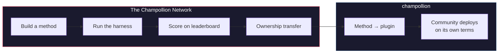

# Le Réseau Champollion

> **Résumé analytique.** Le Réseau Champollion est une infrastructure ouverte permettant de *créer et de valider* des ensembles de tests de traduction pour le plus grand nombre possible de paires de langues — construits *avec* les professionnels et les communautés, et non extraits à leur insu — et de rendre l'ensemble du domaine navigable : qui peut traduire quoi, quelle est l'efficacité de chaque méthode sur chaque type de texte, et où se situent les lacunes. Toutes les méthodes sont les bienvenues, humaines et automatiques. Vous pouvez également concevoir et soumettre une méthode pour voir comment elle se classe par rapport à des corpus réels. Pour les langues dont les données sont fournies par les communautés, la souveraineté est non négociable : les personnes qui fournissent un corpus en détiennent les clés, ainsi que celles de tout ce qui est mesuré par rapport à celui-ci.

Cette section est l'accueil de la carte. Les pages qui la composent expliquent comment le
réseau de paires mesurées est construit ([Comment fonctionne le réseau](/docs/network/how-it-works)), pourquoi la file d'attente de travail publique classe ce qu'elle
classe ([Pourquoi la file d'attente](/docs/network/perspectives/why-the-queue) et la
[Spécification de construction de la file d'attente](/docs/network/specifications/queue-construction)),
et comment la force d'une connexion est calculée
([Force de connexion](/docs/network/specifications/connection-strength)).
Si vous cherchez à déterminer si vous pouvez faire confiance au projet, commencez par
[Limites honnêtes](/docs/network/honest-limitations) ; si vous savez déjà
ce que vous souhaitez construire, les portes se trouvent dans
[Ce qu'est Champollion](/docs/what-is-champollion).

**Il repose sur deux types de bancs d'essai (benchmarks).** Les *bancs d'essai publics* utilisent des jeux de données ouverts pour cartographier et classer chaque méthode de manière économique et ouverte — le niveau de base des données extraites/ouvertes, avec le risque de contamination signalé. Les *bancs d'essai souverains* constituent la référence absolue : des ensembles de tests secrets que les communautés linguistiques créent, possèdent et contrôlent, et que Champollion **ne voit jamais** — évalués à l'aveugle, et uniquement lorsque la communauté l'autorise. L'infrastructure elle-même est à code source ouvert (source-available) et gérée de manière unique ; ce qui appartient à une communauté, ce sont les ensembles de tests pour sa langue et les méthodes conçues pour celle-ci.

:::info[Phase de lancement/amorçage]
Le Réseau est jeune mais actif : le classement (leaderboard) présente de véritables exécutions publiées
et est ouvert aux soumissions de tous. Pour savoir exactement ce que nous revendiquons et ne revendiquons pas encore
— vérification, validation communautaire, évaluation sur données exclues (held-out) — consultez
**[Limites honnêtes](/docs/network/honest-limitations)**.
:::

---

## Le problème

Le service Cloud Translation de Google répertorie 194 langues ([Liste publiée par Google](https://docs.cloud.google.com/translate/docs/languages)). Le modèle NLLB-200 de Meta en couvre 200, et OMT-1600 (mars 2026) en revendique 1 600. Il y en a plus de 7 000 parlées sur Terre. Pour les quelque 1 200 langues de la longue traîne d'OMT-1600 — notre calcul : les 1 600 qu'il couvre moins les plus de 400 dont les auteurs signalent que les modèles les « comprennent suffisamment bien » — les poids du modèle ne sont pas disponibles, la qualité est inférieure aux seuils utilisables, et l'évaluation a utilisé des textes du domaine biblique avec des métriques automatiques standards — aucune validation morphologique, aucun test indépendant, aucune gouvernance communautaire. Pour les quelque 5 400 langues restantes, aucun modèle pré-entraîné ne produit le moindre résultat.

Les géants de la technologie (Big Tech) investissent désormais dans la couverture des langues à faibles ressources (LRL) — mais une couverture sans vérification indépendante de la qualité, sans validation morphologique ou sans gouvernance communautaire est une couverture sans confiance. Les locuteurs qui ont le plus besoin d'outils de traduction sont les mêmes communautés qui ont le moins de chances de les voir développés.

**Le Réseau existe pour changer cela.** Il fournit l'infrastructure nécessaire pour créer des ensembles de tests, évaluer toute méthode par rapport à ceux-ci — humaine ou automatique — et cartographier les résultats, pour n'importe quelle langue, avec une notation reproductible, une soumission ouverte et une gouvernance communautaire sur qui contrôle les données et les résultats.

Les données linguistiques sont des *biodonnées*. À l'instar des données génétiques ou de santé, une langue porte l'identité et les relations des personnes qui la parlent, et elle ne peut être anonymisée de manière significative — ainsi, les personnes qui fournissent un corpus en détiennent les clés, ainsi que celles de tout ce qui est mesuré par rapport à celui-ci. La souveraineté n'est pas une fonctionnalité ajoutée après coup ici ; c'est la fondation sur laquelle repose tout le reste.

---

## Comment ça fonctionne

1. **Vous concevez une méthode de traduction** — LLM guidé, modèle affiné (fine-tuned), pipeline contrôlé par FST, ou tout autre système produisant des traductions.
2. **L'environnement de test (harness) l'évalue** — métriques standardisées (chrF++, correspondance exacte, acceptation FST), associées à l'empreinte d'un commit Git spécifique.
3. **Les résultats apparaissent dans le classement** — en direct et ouvert aux soumissions ; chaque exécution publiée est reproductible et comparable.
4. **Lorsqu'une méthode fonctionne, la propriété est transférée** — pour les langues autochtones, le code de la méthode est transféré à l'organisation de gouvernance communautaire.
5. **La communauté la déploie — si et comme elle le souhaite.** La méthode s'exporte sous forme de plugin [champollion](https://champollion.dev) et peut s'exécuter entièrement sur l'infrastructure de la communauté. Champollion ne prend aucune part sur ce qu'elle y génère.

**Concevez-le ici. Déployez-le là-bas.**

:::tip[Décryptez une langue, gagnez, restituez-la]
Il s'agit d'une opération d'évaluation de l'apprentissage automatique (ML) assumée — la compétition est le moyen de résoudre les paires difficiles.
Nous invitons les chercheurs en ML et tout développeur compétent à concevoir la meilleure
méthode pour une paire difficile spécifique, à **remporter une prime lorsqu'elle est ouverte**, *et* à remettre la
méthode résultante à l'organisation souveraine qui possède cette langue. L'énergie
compétitive est réelle ; elle est dirigée vers la mission, et non vers l'ascension d'un
classement pour le simple plaisir de le faire. Consultez la [Spécification des prix](/docs/network/specifications/prizes).
:::

---

## À qui cela s'adresse

| Vous êtes... | Le réseau vous offre... |
|---|---|
| **Ingénieur / chercheur en ML** | Des bancs d'essai standardisés, une notation reproductible, un corpus partagé pour effectuer des tests |
| **Linguiste** | Un cadre de travail (framework) pour transformer les règles de grammaire et les dictionnaires en méthodes testables |
| **Traducteur professionnel / humain** | Un espace pour enregistrer vos services et être trouvé — la traduction humaine est ici une méthode de premier plan, répertoriée et évaluée aux côtés des machines, et non une réflexion après coup |
| **Membre d'une communauté linguistique** | La gouvernance sur la façon dont les méthodes de votre langue sont développées et déployées |
| **Bailleur de fonds / évaluateur de subventions** | Des métriques transparentes et reproductibles pour évaluer les propositions de recherche en traduction |
| **Étudiant** | Une invitation ouverte avec un impact réel — concevez une méthode, contribuez avec vos résultats |

---

## Corpus de référence pris en charge

**Le tableau est en ligne et encore à ses débuts** — les premiers balayages (sweeps) sont publiés et
d'autres arrivent à mesure que les contributeurs exécutent les éléments de la file d'attente. Ce qui suit n'est pas un
classement ; c'est l'ensemble des corpus de référence publics par rapport auxquels une soumission peut être
évaluée aujourd'hui. Les corpus ne sont jamais hébergés ici : l'environnement de test récupère les références depuis la
source en amont au moment de l'exécution et évalue par rapport aux données fraîchement récupérées.

### Global Voices (OPUS) — domaine de l'actualité
- **Couverture :** 493 paires de langues cataloguées et exécutables (par ex. `eval-amh-fra-globalvoices-test-v1`, amharique → français)
- **Licence :** CC BY 3.0
- **Source :** [Global Voices via OPUS](https://opus.nlpl.eu/)

### Tatoeba — domaine conversationnel / mixte
- **Couverture :** 874 paires de langues cataloguées et exécutables (par ex. `eval-afr-eng-tatoeba-dev-v1`, afrikaans → anglais)
- **Licence :** CC BY 2.0
- **Source :** [Communauté Tatoeba](https://tatoeba.org)

:::note[EdTeKLA est réservé à la recherche — ce n'est pas un banc d'essai de classement]
Le corpus EdTeKLA en cri des plaines (*Cree: Language of the Plains*) est sous
[licence CC BY-NC-SA **modifiée** d'EdTeKLA](https://github.com/EdTeKLA/IndigenousLanguages_Corpora)
— des conditions non commerciales axées sur la souveraineté (le manuel d'origine lui-même est sous CC
BY-NC-ND 4.0). Il est **exclu de tout classement** — il n'est pas éligible pour
le classement, aucun prix, ni les voies API/commerciales — et son évaluation à distance
par API de modèle est **soumise à consentement** : l'environnement de test refuse d'envoyer
son texte à des API de modèles tiers à moins que l'autorisation explicite du détenteur des droits
ne soit enregistrée (l'évaluation locale reste possible).

FLORES+ **est** intégré et exécutable ici (870 paires cataloguées, par ex.
`eval-flores-devtest-v1-amh-fra`), mais il présente une **FORTE contamination** — des données d'évaluation publiques,
extraites du web, que les modèles de pointe ont très probablement déjà vues.
Il est donc **uniquement relatif** : utilisable pour comparer des méthodes en face à face, mais
**jamais présenté comme un banc d'essai de qualité absolue**, et il sert **uniquement de test /
d'illustration**. Un résultat FLORES+ n'est jamais classé comme un score de qualité et n'est
jamais utilisé comme un lien de chaîne sur la [carte de traduction](https://champollion.dev).
Consultez [Limites honnêtes](/docs/network/honest-limitations) pour savoir exactement ce que nous
revendiquons et ne revendiquons pas.
:::

---

## La règle unique

:::danger[Ne vous entraînez pas sur les données d'évaluation]
Les méthodes exposées au jeu de données du banc d'essai — en tant que données d'entraînement, exemples d'apprentissage en quelques essais (few-shot), entrées de dictionnaire ou éléments de prompt — seront **disqualifiées**. Affinez (fine-tune) sur ce que vous voulez. Mais pas sur l'ensemble de test.
:::

---

## Prochaines étapes

- **[Soumettre une méthode](/docs/network/getting-started/submit-a-method)** — comment soumettre votre première exécution de banc d'essai
- **[Spécification du banc d'essai](/docs/network/specifications/benchmark)** — le protocole d'expérimentation complet
- **[Règles du classement](/docs/network/leaderboard/rules)** — critères de soumission et politiques anti-triche
- **[Gérance des données](/docs/network/sovereignty/data-sovereignty)** — les corpus restent avec leurs gérants ; chaque licence est respectée
- **[Comment le travail est financé](/docs/network/sovereignty/economic-model)** — non commercial et actuellement autofinancé ; bailleurs de fonds recherchés, et la destination de chaque dollar est publiée

**[→ Voir le classement](https://champollion.dev/leaderboard)**
