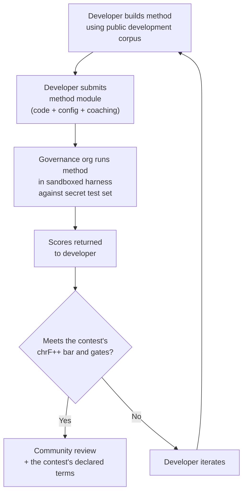

# Spécification d'évaluation comparative

> **Synthèse.** Ce document définit le protocole d'évaluation pour l'écosystème d'évaluation de TA de Champollion : format de corpus (§2), schéma de run card (§3), protocole de benchmark (§6), exigences de validation humaine (§7), mécanismes de souveraineté (§8), classement et modèle de soumission (§9), cadre de coûts (§10) et extensibilité à de nouvelles langues (§11). Pour savoir comment les exécutions sont notées (la métrique vedette chrF++, les métriques standard qui l'accompagnent, les diagnostics) ainsi que pour les formules des métriques de coût/vitesse, consultez `SCORING_SPEC.md` — la source unique de vérité pour toute la logique d'évaluation. Ce document fait référence à SCORING_SPEC pour ces détails plutôt que de les dupliquer.


---

## 1. Principes

### 1.1 Les langues sont des données biologiques

Une langue n'est pas un matériel de test neutre. Comme les données génétiques ou sanitaires, les données linguistiques sont des **données biologiques** : elles portent l'identité, la parenté et les relations des personnes qui la parlent, et elles ne peuvent pas être rendues anonymes de manière significative — supprimez les métadonnées et la langue encode toujours qui sont ses locuteurs. La conséquence pour cette spécification est concrète : les personnes qui fournissent un corpus en détiennent les clés, et tout ce qui est mesuré par rapport à celui-ci. La souveraineté (§8) n'est donc pas un ajout au protocole ; c'est une condition préalable, et tous les autres principes ci-dessous opèrent à l'intérieur de celle-ci.

### 1.2 Les métriques automatisées sont des approximations

Chaque métrique définie dans ce document est calculée par machine. chrF++, acceptation FST, précision morphologique, similarité sémantique — ce sont toutes des approximations automatisées de la qualité de traduction. Elles sont utiles pour l'itération rapide, la comparaison systématique et la détection des régressions. Elles ne sont **pas des substituts au jugement humain**.

La hiérarchie d'évaluation :

```
Automated metrics (run cards, benchmarks)
    ↓ proxy for
Human review (bilingual speakers validate output)
    ↓ proxy for
Actual utility (does this help a language community?)
```

Aucun score automatisé, aussi élevé soit-il, ne peut remplacer un locuteur fluide lisant la sortie et confirmant qu'elle est correcte, naturelle et culturellement appropriée. C'est pourquoi aucun score automatique ne porte de label de qualité (§5) : les métriques automatiques sont utiles pour suivre les progrès, mais ne suffisent jamais à elles seules.

### 1.3 Méthodes, pas modèles

Nous évaluons les **méthodes**, pas les modèles. Un modèle est un composant. Une méthode est la recette complète : sélection du modèle, conception des invites, utilisation d'outils, pré/post-traitement, données d'entraînement, stratégies de nouvelle tentative, tout. Deux équipes utilisant le même modèle avec des méthodes différentes obtiendront des scores différents. C'est le but.

### 1.4 Reproductibilité

Chaque résultat d'évaluation comparative doit être reproductible. La fiche de résultats (§3) capture la configuration complète d'une expérience. L'empreinte (§3.5) identifie la configuration expérimentale. Le hachage de la fiche de résultats (§3.6) vérifie l'intégrité du résultat. Quiconque ayant la même méthode, corpus et configuration devrait obtenir des scores à ±2 % près (en tenant compte de la non-déterminisme d'échantillonnage du LLM à température > 0).

### 1.5 Pas de données d'évaluation synthétiques

**Ce projet ne génère pas, n'utilise pas et n'approuve pas les données d'évaluation synthétiques.** Tous les corpus doivent être issus de textes authentiques rédigés par des humains — traductions publiées, manuels scolaires, documents bilingues ou traductions élicitées auprès de locuteurs courants.

Les LLM peuvent aider à :
- L'alignement de phrases (trouver des passages parallèles dans les textes bilingues existants)
- La conversion de format (convertir les matériaux publiés dans le schéma de corpus)
- L'enrichissement des métadonnées (suggérer des niveaux de difficulté, des étiquettes de registre)
- La proposition de phrases sources pour la traduction humaine (§11.3 — l'étape de traduction est toujours humaine)

Les LLM ne doivent **jamais** générer des traductions de référence ou des paires d'évaluation.

**Nous sommes neutres sur le développement concernant les données d'entraînement.** Si un développeur de méthode utilise des données d'entraînement synthétiques, la rétrotraduction ou l'augmentation de données dans sa méthode, c'est son choix — nous évaluons le résultat, pas le processus d'entraînement. OMT-1600 de Meta utilise environ 270 millions de phrases parallèles synthétiques générées via rétrotraduction. Nous n'avons aucune objection aux méthodes entraînées de cette façon. Nous testons uniquement sur la curation humaine.

> **Pourquoi pas le texte biblique pour l'évaluation ?** OMT-1600 évalue 1 560 des 1 600 langues sur du texte du domaine biblique (Meta AI, *Omnilingual MT*, arXiv:2603.16309, 2026). Les traductions bibliques ont un registre archaïque, un vocabulaire liturgique et une structure de phrase formulaïque. Nos corpus d'évaluation sont issus de textes curatés par la communauté, diversifiés par domaine — santé, juridique, éducatif, gouvernemental, conversationnel et technique (voir §2.7). C'est un choix de conception délibéré. Les communautés ont besoin de traduction pour les domaines où elles vivent et travaillent réellement, pas un seul registre religieux. Une méthode qui obtient un bon score sur Genèse 1:1 vous dit presque rien sur sa performance sur un ordre du jour du conseil de bande ou un formulaire d'admission à une clinique.

---

## 2. Schéma de corpus

Un corpus est un ensemble curé de paires de textes parallèles avec des métadonnées structurées. C'est la vérité de base par rapport à laquelle toutes les méthodes sont mesurées.

### 2.1 Enveloppe de l'ensemble de données

La structure de haut niveau d'un fichier de corpus :

```json
{
  "dataset": {
    "id": "edtekla-dev-v1",
    "version": "1.0",
    "language_pair": "EN→CRK",
    "source_language": "en",
    "target_language": "crk",
    "created": "2026-05-01",
    "license": "LicenseRef-EdTeKLA-Modified-CC-BY-NC-SA-4.0",
    "provenance": ["gold_standard", "textbook"]
  },
  "entries": [ ... ]
}
```

| Champ | Type | Requis | Description |
|-------|------|--------|-------------|
| `id` | string | ✅ | Identifiant unique de l'ensemble de données, utilisé dans les fiches de résultats et le classement |
| `version` | string | ✅ | Version sémantique. L'incrémentation invalide les comparaisons de fiches de résultats antérieures |
| `language_pair` | string | ✅ | Étiquette d'affichage (par ex., `EN→CRK`) |
| `source_language` | string | ✅ | Code de langue source BCP 47 |
| `target_language` | string | ✅ | Code de langue cible BCP 47 |
| `created` | string | ✅ | Date de création ISO 8601 |
| `license` | string | ✅ | Identifiant de licence SPDX |
| `provenance` | string[] | ✅ | Liste des étiquettes de provenance utilisées dans les entrées |

### 2.2 Schéma d'entrée

Chaque entrée du corpus représente un défi de traduction :

```json
{
  "id": 42,
  "source": "I see the dog",
  "reference": "niwâpamâw atim",
  "segment": "gold_standard",
  "difficulty": 2,
  "provenance": "gold_standard",
  "register": "conversational",
  "context": "declaration",
  "morphological_analysis": "ni-wâpam-âw atim | 1sg-see.TA-3sg.DIR dog.AN",
  "notes": "Animate noun (atim); direct form because speaker is proximate",
  "variant_class": "simple-ta-direct"
}
```

| Champ | Type | Requis | Description |
|-------|------|----------|-------------|
| `id` | integer | ✅ | Identifiant unique au sein du corpus |
| `source` | string | ✅ | Texte source dans la langue source |
| `reference` | string | ✅ | Traduction de référence (étalon-or) dans la langue cible |
| `segment` | string | 📎 | Partition du corpus : `gold_standard`, `held_out`, `development` ou `diagnostic` |
| `difficulty` | integer | 📎 | Niveau de difficulté de 1 à 5 (voir §2.4) |
| `provenance` | string | 📎 | Origine de cette entrée (voir §2.5) |
| `register` | string | 📎 | Registre/niveau de formalité (voir §2.6) |
| `context` | string | 📎 | Fonction communicative (voir §2.6) |
| `domain` | string | 📎 | Domaine d'utilisation issu de la taxonomie à 16 codes (voir §2.7). Doit être l'un des suivants : `conv`, `ecommerce`, `edu`, `financial`, `gov`, `legal`, `literary`, `marketing`, `medical`, `news`, `religious`, `scientific`, `subtitles`, `support`, `tech`, `ui`. Validé au moment de la construction. |
| `morphological_analysis` | string | ❌ | Décomposition morphologique étalon-or |
| `notes` | string | ❌ | Notes du traducteur, variantes dialectales, indicateurs d'ambiguïté |
| `variant_class` | string | ❌ | Label de classe regroupant les variantes de traduction acceptables |

> **📎 = RECOMMANDÉ.** Le banc d'évaluation (harness) gère sans problème les champs facultatifs manquants à l'aide de valeurs par défaut. Les corpus tiers n'ont besoin de fournir que `id`, `source` et `reference` par entrée.


### 2.3 Segments de corpus

Le corpus est divisé en segments avec différents niveaux d'accès :

| Segment | Objectif | Accès | Taille minimale |
|---------|----------|-------|-----------------|
| `development` | Développement et itération de méthodes. Les développeurs les utilisent librement. | **Public** | 30 entrées |
| `diagnostic` | Tests ciblés pour des phénomènes linguistiques spécifiques. | **Public** | 10 entrées |
| `gold_standard` | Évaluation comparative officielle. Les scores du classement proviennent d'ici. | **Secret** — détenu par l'organisation de gouvernance | 50 entrées |
| `held_out` | Réservé pour l'évaluation future. Jamais utilisé jusqu'à l'activation. | **Secret** — détenu par l'organisation de gouvernance | 10 entrées |

> **État actuel :** Seul le segment `development` existe dans les ensembles de données livrés. Les segments `diagnostic`, `gold_standard` et `held_out` sont définis pour une utilisation future à mesure que les corpus se développent.

Les segments `gold_standard` et `held_out` sont entièrement secrets. Les phrases sources et les traductions de référence sont conservées sur l'infrastructure contrôlée par la gouvernance. Les développeurs de méthodes ne voient jamais les questions ni les réponses. Voir §8 pour le mécanisme de souveraineté.

### 2.4 Niveaux de difficulté

| Niveau | Description | Exemples |
|--------|-------------|----------|
| 1 — Vocabulaire de base | Mots simples, salutations courantes, nombres | « bonjour » → « tânisi », « chien » → « atim » |
| 2 — Phrases simples | Sujet-verbe ou SVO, temps présent | « Je vois le chien » → « niwâpamâw atim » |
| 3 — Complexité modérée | Temps passé/futur, possessifs, animacité | « J'ai vu son chien hier » |
| 4 — Morphologie complexe | Obviation, voix passive, ordre conjoint, propositions relatives | « la femme dont le fils est allé au magasin » |
| 5 — Avancé | Multi-clause, registre formel, cérémoniel, idiomatique | Paragraphe complet avec registre approprié |

Un corpus bien construit devrait inclure des entrées dans les cinq niveaux de difficulté, avec un poids vers les niveaux 2–4 où se situent la plupart des défis de traduction du monde réel.

### 2.5 Étiquettes de provenance

Chaque entrée doit indiquer son origine :

| Étiquette | Signification |
|-----------|--------------|
| `gold_standard` | Vérifiée par des locuteurs courants |
| `textbook` | Provenant de matériaux éducatifs publiés |
| `elicited` | Produite par des sessions d'élicitation structurées |
| `corpus` | Extraite d'un corpus parallèle |

> **Remarque :** En pratique, les valeurs de provenance sont des chaînes de caractères libres. Les étiquettes ci-dessus sont des conventions, pas une énumération validée — les ensembles de données peuvent utiliser d'autres chaînes de provenance descriptives.

### 2.6 Registre et contexte

**Le registre** décrit la formalité et le contexte social :

| Registre | Description |
|----------|-------------|
| `conversational` | Discours quotidien entre égaux |
| `formal` | Langage officiel ou institutionnel |
| `technical` | Vocabulaire spécifique au domaine |
| `ceremonial` | Utilisation traditionnelle ou sacrée de la langue |
| `educational` | Matériaux d'enseignement des langues |

**Le contexte** décrit la fonction communicative :

> 🔲 **Planifié.** Le champ `context` est défini dans le schéma mais n'est pas encore rempli dans les ensembles de données actuels. Il est réservé pour l'enrichissement futur du corpus.

| Contexte | Description |
|----------|-------------|
| `greeting` | Salutation sociale ou prise de congé |
| `declaration` | Énoncé de fait |
| `question` | Interrogatif |
| `instruction` | Commande ou directive |
| `narrative` | Narration ou description |
| `label` | Étiquette d'interface utilisateur, texte de bouton ou titre |
| `error` | Message d'erreur ou avertissement |

### 2.7 Domaine {#27-domain}

**Le domaine** décrit le cas d'usage du monde réel — le type de contenu traduit. C'est orthogonal au registre et au contexte :

- **Le registre** répond à : *Quel est le niveau de formalité ?*
- **Le contexte** répond à : *Que fait cette phrase ?*
- **Le domaine** répond à : *Pour quel secteur/cas d'usage est-ce ?*

Un contrat juridique (domaine : `legal`) peut être formel (registre : `formal`) et contenir une déclaration (contexte : `declaration`). Une transcription de chatbot juridique (domaine : `legal`) peut être conversationnelle (registre : `conversational`) et contenir des questions (contexte : `question`). Même domaine, registre et contexte différents.

| Code de domaine | Description | Consommateurs typiques |
|-----------------|-------------|----------------------|
| `ui` | Chaînes d'interface logicielle | Développeurs d'applications, équipes de localisation |
| `legal` | Contrats, statuts, dossiers judiciaires, documents d'immigration | Cabinets juridiques, tribunaux, équipes de conformité, avocats en propriété intellectuelle |
| `medical` | Notes cliniques, étiquettes de médicaments, communications aux patients, protocoles d'essais | Hôpitaux, pharmacie, essais cliniques, portails patients |
| `financial` | Banque, assurance, dépôts réglementaires, rapports d'audit | Banques, assureurs, régulateurs, auditeurs |
| `edu` | Manuels scolaires, programmes d'études, plans de cours, matériaux académiques | Écoles, universités, éditeurs de manuels |
| `ecommerce` | Descriptions de produits, avis, annonces de marché | Détaillants en ligne, vendeurs de marché |
| `marketing` | Texte publicitaire, messages de marque, campagnes, slogans | Agences publicitaires, équipes de marque |
| `gov` | Documents de politique, réglementations, avis publics, législation | Agences gouvernementales, équipes de conformité |
| `scientific` | Articles de recherche, résumés, méthodologie, propositions de subventions | Chercheurs, revues, agences de subventions |
| `religious` | Écriture sainte, textes liturgiques, commentaires théologiques | Communautés de foi, éditeurs liturgiques |
| `support` | FAQ, messages d'erreur, guides de dépannage, scripts de chatbot | Entreprises SaaS, services d'assistance |
| `subtitles` | Dialogue de film, TV, streaming et jeux vidéo | Plateformes de streaming, studios, entreprises de jeux vidéo |
| `news` | Journalisme, dépêches, éditorial, communiqués de presse | Organisations médiatiques, agences de presse |
| `literary` | Fiction, poésie, narration, textes culturels | Éditeurs, organisations de préservation culturelle |
| `conv` | Conversation informelle, médias sociaux, messagerie | Applications grand public, plateformes sociales |
| `tech` | Docs API, manuels, spécifications d'ingénierie, guides techniques | Équipes de documentation, organisations d'ingénierie |

> **Évaluations comparatives spécifiques au domaine.** L'évaluation comparative générale évalue une méthode dans tous les domaines. Mais le Réseau prend également en charge les **évaluations comparatives filtrées par domaine** — où les scores sont calculés uniquement sur les entrées étiquetées avec un domaine spécifique. Cela permet aux utilisateurs de répondre à : « Quelle méthode est la meilleure pour traduire des documents juridiques en français ? » par rapport à « Quelle méthode a le meilleur score français global ? »
>
> Les classements des évaluations comparatives filtrées par domaine permettent aux utilisateurs de comparer les méthodes dans un seul cas d'usage. Différentes méthodes fonctionnent différemment selon les domaines — une méthode affinée sur la terminologie juridique peut obtenir un score beaucoup plus élevé sur le texte juridique que sur le texte conversationnel. Le Réseau aide les utilisateurs à trouver la méthode qui fonctionne le mieux pour leur cas d'usage spécifique.

> **Futur : Assistant du Réseau.** Un assistant conversationnel qui aide les utilisateurs à décrire leur cas d'usage de TA (domaine, paire de langues, exigences de qualité) et affiche les méthodes validées par la communauté pertinentes du classement — par exemple, « quelle méthode obtient le score le plus élevé sur les évaluations comparatives du domaine médical EN→JA ? » — est une aide à la navigabilité que nous envisageons, conditionnée par des données d'évaluation suffisantes étiquetées par domaine et une diversité de méthodes.

---

## 3. Schéma de fiche de résultats {#3-run-card-schema}

La fiche de résultats est l'unité atomique d'évaluation. C'est un document JSON autonome qui enregistre la configuration complète et les résultats d'une seule exécution d'évaluation : une méthode, un modèle, une configuration, un ensemble de données.

Chaque fiche de résultats capture trois dimensions :
- **Qualité** — à quel point les traductions sont-elles bonnes ?
- **Coût** — combien a coûté leur production ?
- **Vitesse** — combien de temps cela a-t-il pris ?

### 3.1 Champs de haut niveau

| Champ | Type | Description |
|-------|------|-------------|
| `run_id` | string | UUID v4 généré au début de l'exécution |
| `harness_version` | string | Version sémantique du harness (par ex., `2.0`) |
| `timestamp` | string | Horodatage UTC ISO 8601 du début de l'exécution |
| `elapsed_seconds` | number | Durée totale réelle de l'exécution complète |
| `score_caveats` | array | Présent uniquement lorsque certains éléments nuancent les scores : une liste d'objets `{kind, source, severity, message, …}`, par ex. un jeu de test dont les lignes ont des jumeaux quasi identiques dans les données d'entraînement, des sorties bien plus longues ou bien plus courtes que leurs références, des sorties qui copient leur source, ou une même sortie fournie pour plusieurs sources distinctes. Informatif : cela ne modifie jamais un score, et est affiché à côté de la métrique vedette chrF++ là où figurent les scores. Voir la [spécification de run card](/docs/network/specifications/run-card#score_caveats) |

### 3.2 Configuration de la méthode

Ces champs définissent la configuration expérimentale — ce qui a été testé et comment.

| Champ | Type | Requis | Description |
|-------|------|--------|-------------|
| `model_slug` | string | ✅ | Identifiant du modèle (par ex., `google/gemini-2.5-flash`) |
| `model_id` | string | ❌ | Identifiant du modèle résolu retourné par l'API |
| `condition` | string | ✅ | Étiquette d'expérience (par ex., `baseline`, `coached-v3`, `few-shot`) |
| `temperature` | number | ✅ | Température d'échantillonnage |
| `system_prompt_sha256` | string | ✅ | Hachage SHA-256 de l'invite système complète |
| `system_prompt_used` | string | ✅ | Texte complet de l'invite système |
| `coaching_data_sha256` | string | ❌ | Hachage SHA-256 du fichier de données d'entraînement, s'il est utilisé |
| `fst_version` | string | ❌ | Version de l'analyseur FST, s'il est utilisé |
| `tools_enabled` | string[] | ❌ | Liste des outils disponibles pour la méthode |
| `batch_size` | number | ❌ | Entrées par lot API concurrent |
| `max_retries` | number | ❌ | Nombre maximum de tentatives pour le rejet FST, le cas échéant |

:::info[Les run cards publiées incluent method_config]
Lorsqu'une run card est publiée sur le classement (via `mt-eval publish`), elle inclut également un bloc `method_config` contenant la configuration canonique MethodConfig à 8 champs (`model`, `temperature`, `batchSize`, `register`, `coachingFile`, `coachingPrompt`, `promptContext`, `qualityTier` — tous en camelCase ; `qualityTier` est toujours null sur une nouvelle carte, car les niveaux de qualité sont retirés). Cela permet une importation sans reconstruction : `champollion leaderboard --install` lit directement `method_config` et l'écrit sous forme de manifeste de plugin. Les champs de télémétrie ci-dessus (§3.2) enregistrent ce que le harness a observé ; `method_config` enregistre ce que le développeur avait prévu.
:::

### 3.3 Référence d'ensemble de données

| Champ | Type | Description |
|-------|------|-------------|
| `dataset.id` | string | Identifiant de l'ensemble de données |
| `dataset.version` | string | Version de l'ensemble de données |
| `dataset.language_pair` | string | Étiquette d'affichage |
| `dataset.sha256` | string | Hachage SHA-256 du contenu du fichier d'ensemble de données |
| `dataset.entry_count` | number | Nombre d'entrées évaluées |

Le SHA-256 de l'ensemble de données épingle le résultat à une version spécifique des données. Si l'ensemble de données change, les anciennes fiches de résultats ne sont pas comparables.

### 3.4 Scores (Qualité)

Métriques agrégées pour l'exécution entière. Toutes les métriques de qualité sont **automatisées** — voir §1.2.

| Champ | Type | Description |
|-------|------|-------------|
| `scores.total` | number | Total des entrées évaluées |
| `scores.exact_matches` | number | Entrées où la sortie correspondait exactement à la référence |
| `scores.exact_match_rate` | number | 0,0–1,0 |
| `scores.equivalent_matches` | number | Entrées correspondant à une variante acceptable |
| `scores.equivalent_match_rate` | number | 0,0–1,0 |
| `scores.fst_accepted` | number | Mots de sortie acceptés par l'analyseur FST, sommés sur toutes les entrées (un compte de mots, pas un compte d'entrées) |
| `scores.fst_acceptance_rate` | number | 0,0–1,0, moyenne des taux d'acceptation par entrée (mots acceptés de chaque entrée ÷ ses mots) ; `null` si aucun FST n'est configuré |
| `scores.morphological_accuracy` | number | 0,0–1,0, dérivé du FST (correspondance par lemme), `null` si aucun FST / aucun mot avec lemme correspondant. À titre consultatif jusqu'à son activation — voir la spécification de notation §2.2 |
| `scores.morph_coverage` | number | 0,0–1,0, fraction des mots prédits analysables avec lemme correspondant à la référence (révèle le degré de rareté de `morphological_accuracy`) |
| `scores.chrf_plus_plus` | number | **La métrique vedette et de classement :** chrF++ au niveau du corpus (0–100). Son IC de bootstrap à 95 % est `scores.confidence_intervals.corpus_chrf` et sa signature sacreBLEU est `scores.sacrebleu_signatures.chrf` |
| `scores.scoring_standard` | string | `"standard/1"` sur chaque nouvelle carte. Absent sur les cartes publiées avant la norme, qui sont lues comme `legacy-composite` |
| `scores.primary_metric` | string | `"chrf_plus_plus"` |
| `scores.spbleu` | number | spBLEU (FLORES-200 SentencePiece), affiché aux côtés de chrF++ |
| `scores.sacrebleu_signatures` | object | Signature de chaque métrique sacreBLEU calculée (`chrf`, `chrf_plain`, `bleu`, `spbleu`, `ter`) |
| `scores.semantic_score` | number | Similarité sémantique basée sur les plongements (embeddings) (0,0–1,0) |
| `scores.ter` | number | Taux d'édition de traduction (Translation Edit Rate) (0–∞, plus bas est meilleur) |
| `scores.length_ratio` | number | avg(len(prédit)/len(référence)), idéal = 1,0 |
| `scores.code_switching_rate` | number | 0,0–1,0, fraction des entrées avec fuite de la langue source |
| `scores.hallucination_rate` | number | 0,0–1,0, fraction des entrées avec contenu halluciné |
| `scores.terminology_adherence` | number | 0,0–1,0, respect des termes du glossaire (`null` si aucun glossaire) |
| `scores.tokens_per_second` | number | total_tokens / elapsed_seconds |
| `scores.entries_per_minute` | number | entrées traduites par minute |
| `scores.composite` | number \| null | **Retiré.** `null` sur chaque nouvelle carte ; une carte héritée conserve son score composite enregistré, affiché comme « composite hérité (retiré) ». Voir SCORING_SPEC §4 |
| `scores.quality_tier` | string \| null | **Retiré.** `null` sur chaque nouvelle carte. Voir SCORING_SPEC §5 |
| `scores.cost_adjusted` | number \| null | **Retiré** avec le composite ; `null` sur chaque nouvelle carte |
| `scores.errors` | number | Entrées en échec (erreur d'API, expiration de délai, etc.) |
| `scores.by_difficulty` | object | Scores ventilés par niveau de difficulté |
| `scores.by_provenance` | object | Scores ventilés par étiquette de provenance |
| `scores.by_domain` | object | ✅ Implémenté — Scores ventilés par domaine (§2.7). Permet le classement du tableau de bord filtré par domaine. Calculé par tester.py et transmis par publish.py. |

### 3.5 Totaux (Coût)

| Champ | Type | Description |
|-------|------|-------------|
| `totals.prompt_tokens` | number | Total des jetons d'entrée dans tous les appels API |
| `totals.completion_tokens` | number | Total des jetons de sortie |
| `totals.reasoning_tokens` | number | Jetons utilisés pour la chaîne de pensée (0 pour la plupart des modèles) |
| `totals.cached_tokens` | number | Jetons servis à partir du cache d'invite du fournisseur |
| `totals.total_cost_usd` | number | Coût total en USD |
| `totals.cost_per_entry_usd` | number | `total_cost_usd / entry_count` |
| `totals.cost_per_source_char` | number | USD par caractère source — comparable entre les langues |

### 3.6 Minutage (Vitesse)

| Champ | Type | Description |
|-------|------|-------------|
| `elapsed_seconds` | number | Durée murale de l'exécution complète (haut niveau) |
| `scores.avg_latency_seconds` | number | Temps de réponse moyen par entrée |
| `scores.median_latency_seconds` | number | Temps de réponse médian par entrée |
| `scores.p95_latency_seconds` | number | Temps de réponse du 95e percentile par entrée |

### 3.7 Résultats par entrée

Chaque entrée du tableau `results[]` enregistre une traduction. Les données par entrée sont conservées dans la table `run_card_entries` (migration 005) avec les verdicts LYSS dénormalisés (migration 006).

| Champ | Type | Description |
|-------|------|-------------|
| `entry_id` | string | Correspond à `entries[].id` dans le corpus |
| `source` | string | Texte source qui a été traduit |
| `expected` | string | Traduction de référence de qualité or |
| `raw_predicted` | string \| null | Sortie brute du modèle avant post-traitement |
| `predicted` | string | Sortie réelle de la méthode (post-traitée) |
| `segment` | string | Identifiant de segment (par ex., index de phrase) |
| `difficulty` | string \| null | Niveau de difficulté du corpus |
| `domain` | string | Étiquette de domaine du corpus (§2.7) |
| `exact_match` | boolean | Si la sortie correspondait exactement à la référence |
| `chrf_score` | number \| null | chrF++ au niveau de la phrase (0–100) |
| `bleu_score` | number \| null | BLEU au niveau de la phrase (0–100) |
| `latency_s` | number \| null | Temps de réponse en secondes |
| `cost_usd` | number \| null | Coût en USD pour cette entrée |
| `tool_call_count` | integer | Nombre d'appels d'outils utilisés (0 si aucun) |
| `error` | string \| null | Message d'erreur si cette entrée a échoué |
| `plugin_metrics` | object | Sortie complète du plugin par entrée (JSONB) |
| `fst_valid` | boolean \| null | L'analyseur FST GiellaLT a accepté la prédiction (LYSS-fst dénormalisé) |
| `equivalent_match` | boolean \| null | Le linter CRK a confirmé l'équivalence structurelle (LYSS-eq dénormalisé) |
| `semantic_verdict` | string \| null | Verdict LYSS-sem : `VALID`, `MISMATCH`, `UNKNOWN`, `ERROR` |
| `code_switching_detected` | boolean \| null | Jetons de langue source détectés dans la sortie |
| `hallucination_detected` | boolean \| null | Contenu fabriqué détecté dans la sortie |


### 3.8 Empreinte

Un identifiant de reproductibilité. Deux exécutions avec des empreintes identiques ont utilisé la même configuration expérimentale.

L'empreinte numérique (fingerprint) est le hachage SHA-256 du JSON canonique (clés triées) de :
- `dataset.sha256`
- `model_slug`
- `condition`
- `system_prompt_sha256`
- `temperature`
- `harness_version`
- `batch_size`
- `tools_enabled`

> **Pourquoi 8 composants ?** La taille du lot et l'appel d'outils affectent matériellement la qualité de la sortie et doivent être inclus dans l'identité. Deux exécutions avec des tailles de lot différentes ou des outils différents activés sont des configurations expérimentales différentes, même si tous les autres paramètres correspondent.

La **version 2 (harness 0.2.0 et versions ultérieures)** ajoute cinq composants :
- `api_provider` : le canal par lequel le texte a transité (OpenRouter, l'API propre d'un fournisseur, un point de terminaison local ; l'identifiant d'un moteur de TA ; pour un plugin de méthode, `local` sous `--attest-local-transport`, sinon `method-plugin`). Les journaux d'exécution de plugins et de moteurs rédigés avant cette correction indiquent `openrouter`, une valeur par défaut par laquelle ils n'ont jamais transité ; l'opération de publication enregistre également la valeur corrigée pour eux, ce qui modifie leur identité de version 2 — délibérément, puisque l'ancienne valeur était fausse
- `endpoint_host_sha256` : le SHA-256 de l'hôte du point de terminaison, jamais l'URL brute, qui peut comporter des noms d'hôtes internes ou des identifiants
- `max_tokens`
- `method_version` : la version de la fiche de méthode, sinon la version déclarée par le `method.json` d'un plugin de méthode
- `method_sha256` : le hachage du bundle exécuté, pour une méthode exécutée par un nœud de concours, sinon le hachage des fichiers d'un plugin de méthode (`method.json` et ses fichiers `.py`)

Une exécution de **plugin de méthode** (`mt-eval run --method <plugin dir>`) en ajoute deux de plus :
- `method_model` : le modèle transmis au plugin avec `-m/--model` (le plugin le lit sous la forme `config.method_model`), ou `null` lorsqu'aucun n'a été fourni
- `method_dependencies_sha256` : le SHA-256 de la liste `dependencies` déclarée par le `method.json` du plugin (JSON canonique), ou `null` lorsqu'il n'en déclare aucune

Sans cela, un même plugin exécuté sur deux modèles différents partageait une seule et même identité. Le harness 0.2.0 les ajoute avant sa publication, de sorte que l'identité d'exécution d'un plugin ne change qu'une seule fois, ici ; aucun autre type d'exécution n'est affecté.

L'exécution d'un moteur de TA exécutant un modèle qui lui est **fourni** (`mt-eval run --method local-model -m <model>`) en ajoute deux également :
- `method_model` : le modèle chargé — son identifiant Hugging Face ou le nom du répertoire du modèle
- `method_model_sha256` : pour un répertoire, le SHA-256 sur une liste de ses fichiers de style `sha256sum` (une ligne `<sha256>  <relative path>` par fichier, triée par chemin, répertoires commençant par un point exclus) ; pour un identifiant Hugging Face, la révision qui a été chargée

Deux modèles exécutés via le même moteur constituent deux expériences distinctes. Un journal d'exécution `local-model` qui ne nomme aucun modèle (les versions antérieures de 0.2.0 ne transmettaient pas `-m` au moteur, qui exécutait alors un modèle de secours, `Helsinki-NLP/opus-mt-en-es`) ne peut pas indiquer ce qui a produit ses chiffres : `mt-eval publish` le refuse et `contest qualify` ne générera aucun reçu à partir de celui-ci.

Sous la version 1, le même modèle appelé via deux canaux différents partageait la même identité, et parce qu'une carte publiée est immuable, le second des deux était refusé en tant que doublon. La run card enregistre `fingerprint.version`. Un journal d'exécution provenant d'un harness antérieur conserve la version 1, de sorte que sa republication reproduit son identité d'origine.

Deux exécutions avec des empreintes identiques devraient produire des résultats comparables. Les différences sont dues à la non-déterminisme de l'API (température > 0) ou aux mises à jour du modèle côté fournisseur.

### 3.9 Hachage de fiche de résultats

Le hachage SHA-256 de la fiche de résultats JSON entière (avec le champ `run_card_hash` lui-même défini sur `""` lors du hachage). C'est le sceau de détection de falsification. Si un champ change, le hachage se casse.

---

## 4. Métriques automatisées

Toutes les métriques de cette section sont calculées par machine. Voir §1.2.

### 4.1 Définitions de métriques

| Métrique | État | Ce qu'elle mesure | Plage |
|--------|--------|-----------------|-------|
| **chrF++** | ✅ Implémenté | F-score sur les n-grammes de caractères. Fonctionne au niveau des caractères, ce qui le rend plus robuste que les métriques au niveau des mots (BLEU) pour les langues morphologiquement riches où les mots sont longs et fortement fléchis. Calculé par sacrebleu. | 0–100 (échelle native). **La métrique vedette et de classement**, publiée avec son IC à 95 % et sa signature sacreBLEU. |
| **Taux d'acceptation FST** | ✅ Implémenté (diagnostic) | Fraction des mots prédits acceptés par l'analyseur morphologique (GiellaLT HFST) comme étant des formes valides dans la langue cible. Un mot accepté par le FST est un mot réel, structurellement valide — et non une hallucination. | 0,0–1,0 |
| **Correspondance exacte** | ✅ Implémenté (diagnostic) | Fraction des prédictions qui correspondent exactement à la référence après normalisation Unicode. Stricte mais sans ambiguïté — utile comme vérification de plafond. | 0,0–1,0 |
| **Précision morphologique** | ✅ Implémenté (diagnostic) | Dérivée du FST et avec lemme correspondant : pour chaque mot prédit dont la racine apparaît dans la référence, vérifie si sa flexion correspond. Plus granulaire que l'acceptation FST — un mot peut être valide selon le FST mais présenter une mauvaise flexion (bonne racine, mauvais temps). Nécessite un analyseur FST, et non un simple accepteur de vérification orthographique ; voir SCORING_SPEC §2.2. | 0,0–1,0 |
| **Correspondance équivalente** | ⚡ Partiel (diagnostic) | Fraction correspondant à une variante acceptable de la référence — en tenant compte de l'ordre des mots, des différences dialectales et des conventions orthographiques. Actuellement implémenté pour CRK via `CrkLinterMetric` du standard d'évaluation CRK (dans `eval_standards/crk/`) ; chargé automatiquement via la déclaration `evalMetrics` de la carte de langue CRK. L'implémentation générique nécessite `variants[]` par entrée dans le corpus. | 0,0–1,0 |
| **Score sémantique** | ⚡ Partiel (diagnostic) | Préservation du sens indépendamment de la forme de surface. Actuellement implémenté pour CRK via `CrkSemanticMetric` du standard d'évaluation CRK (dans `eval_standards/crk/`, proxy pondéré par verdict). Une similarité cosinus universelle basée sur les plongements est prévue — voir SCORING_SPEC §2.3. | 0,0–1,0 |

### 4.2 La métrique vedette et le standard qui l'accompagne

Les exécutions sont notées selon le standard d'évaluation `standard/1`, de la même manière que WMT, FLORES-200 et les tâches partagées d'AmericasNLP rapportent l'évaluation de la TA :

- **Une seule métrique vedette et de classement :** chrF++ au niveau du corpus avec son intervalle de confiance bootstrap à 95 % et sa signature sacreBLEU, notée `chrF++ 47.5 [45.9, 49.0]`.
- **Les autres métriques standard à ses côtés, jamais mélangées :** BLEU, spBLEU, TER et COMET lorsqu'elle est calculée (avec son identifiant de modèle).
- **Diagnostics rapportés séparément :** correspondance exacte, acceptation FST, précision morphologique, correspondance équivalente, score sémantique, alternance codique (code-switching), hallucination, terminologie, style d'écriture et chaque nuance de score (score caveat). Ils expliquent un score ; ils n'en constituent jamais un.
- **Le caractère « meilleur » est déterminé par un test de significativité apparié** sur chrF++ ([Significativité](/docs/network/specifications/significance)), et non en comparant deux chiffres.

**La définition complète se trouve dans `SCORING_SPEC.md`** ([Comment les exécutions sont notées](/docs/network/specifications/scoring#how-runs-are-scored)). Le code du harness la reproduit à l'identique dans `mt_eval_harness/scoring.py`.

> **Pourquoi ne pas utiliser BLEU comme métrique vedette ?** BLEU opère au niveau des mots et pénalise la variation morphologique. Pour les langues polysynthétiques, un seul mot peut constituer une proposition entière — BLEU traiterait des différences flexionnelles mineures comme des échecs complets. chrF++ gère cela bien mieux en opérant au niveau des caractères. BLEU est rapporté à ses côtés. Voir l'annexe A de SCORING_SPEC.

### 4.3 Le score composite retiré

Avant la norme, les exécutions étaient classées selon un score composite pondéré combinant chrF++, correspondance exacte, acceptation FST, précision morphologique et métriques comportementales. Il est **retiré** : les nouvelles cartes publient `composite: null` et `cost_adjusted: null`. Il pouvait être manipulé — un modèle non entraîné répétant une même phrase valide en same du Nord pour chaque entrée obtenait un score de 0,6244 avec un chrF++ de 5,5 — et un mélange de signaux qui signifient des choses différentes selon les langues est illisible. Les cartes héritées conservent leur score composite enregistré et restent vérifiables ; voir [SCORING_SPEC §4](/docs/network/specifications/scoring#4-composite-score).

---

## 5. Niveaux de qualité (retirés) {#5-quality-tiers}

**Aucun score automatique ne porte de label de qualité.** Les niveaux de qualité (Baseline, Emerging, Functional, Deployable, Fluent) qui étaient déduits du composite sont retirés avec lui : les nouvelles cartes publient `quality_tier: null`, et aucune sortie n'affiche de niveau. Un label tel que « functional » apposé sur un score automatique affirme quelque chose que seuls les locuteurs peuvent confirmer — et les niveaux retirés qualifiaient de « fonctionnel » un système qui répétait une même phrase pour chaque entrée. La qualité est certifiée par la validation humaine (§7). Les cartes héritées conservent un niveau enregistré ; [SCORING_SPEC §5](/docs/network/specifications/scoring#5-quality-tiers) ne conserve les anciens seuils que pour permettre la lecture de ces cartes.

---

## 6. Protocole d'évaluation comparative

Une **évaluation comparative** est la production systématique de fiches de résultats dans un espace de paramètres déclaré sur un ensemble de données donné. Ce n'est pas une seule exécution — c'est une exploration structurée de la façon dont différentes configurations fonctionnent.

### 6.1 Ce qu'une évaluation comparative produit

Une évaluation comparative produit une **matrice de fiches de résultats** — une pour chaque combinaison de valeurs de paramètres. La matrice permet une comparaison multifacette entre :

- **Qualité** — chrF++ avec son IC, les autres métriques standard et les diagnostics
- **Coût** — coût total et par entrée pour chaque configuration
- **Vitesse** — temps réel d'exécution et latence par entrée

Il n'existe pas de « score de benchmark » unique. Le benchmark est la matrice complète. Différentes parties prenantes s'intéresseront à différentes facettes : un chercheur recherche une amélioration significative de chrF++, un ingénieur de déploiement optimise le coût par entrée, une communauté examine la qualité.

### 6.2 Espace de paramètres

Une évaluation comparative déclare quels paramètres sont permutés :

| Axe | Valeurs typiques | Objectif |
|-----|-----------------|---------|
| `model` | 4–12 modèles (frontière + milieu de gamme + budget) | Combien la capacité du modèle compte-t-elle ? |
| `temperature` | 0.0, 0.3, 0.7 | L'aléatoire d'échantillonnage aide-t-il ou nuit-il ? |
| `prompt_version` | 2–3 stratégies d'invite | La méthode est-elle sensible à la conception de l'invite ? |
| `coaching_config` | avec/sans données d'entraînement | L'injection de connaissances linguistiques améliore-t-elle la sortie ? |
| `tool_config` | avec/sans FST, avec/sans dictionnaire | Les outils linguistiques améliorent-ils la sortie ? |

L'espace de permutation complète :
```
runs = |models| × |temperatures| × |prompts| × |coaching| × |tools|
```

Une évaluation comparative initiale typique : 12 modèles × 3 températures × 2 invites × 2 données d'entraînement = 144 exécutions.

### 6.3 Évaluation de base par rapport à l'évaluation de méthode

Une évaluation comparative sert deux objectifs distincts :

**Évaluation de base** — cartographier le paysage avec des approches naïves. « Que peuvent faire les modèles existants pour cette langue sans aucune ingénierie spécifique à la langue ? » Cela établit la barre. La matrice de base vous dit : quels modèles hallucinent le moins, quelles températures produisent la sortie la plus cohérente, si les données d'entraînement aident du tout, où tous les modèles échouent uniformément (ce qui révèle les problèmes linguistiques difficiles).

**Évaluation de méthode** — tester une méthode spécifique ingéniérée. « Ma pipeline entraînée avec FST gated bat-elle les lignes de base ? » La fiche de résultats de la méthode est comparée à la matrice de base. Une méthode est intéressante quand elle surpasse la meilleure ligne de base — quand l'ingénierie ajoute de la valeur par rapport aux appels de modèle naïfs.

Les deux activités produisent des fiches de résultats avec le même schéma. La distinction réside dans l'intention et l'espace de paramètres : les lignes de base permutent entre les modèles et les configs ; l'évaluation de méthode teste une méthode contre les meilleures configurations.

### 6.4 Évaluation de développement par rapport à l'évaluation de qualité or

Les développeurs de méthodes itèrent librement contre les segments de corpus `development` et `diagnostic`. C'est informel — pas de limites, pas de soumissions, pas d'implication de gouvernance. Le développeur apprend ce qui fonctionne.

Les scores officiels du classement proviennent uniquement de l'évaluation `gold_standard`. C'est formel :
1. Le développeur soumet sa méthode complète et exécutable (code + config + données d'entraînement)
2. L'organisation de gouvernance l'exécute dans un harnais en bac à sable contre l'ensemble de test secret
3. Seuls les scores reviennent

Voir §8 pour le mécanisme de souveraineté complet.

---

## 7. Validation humaine {#7-human-validation}

Les métriques automatisées sont des approximations. La validation humaine est la vérité de base.

### 7.1 Ce que l'examen humain détecte que les métriques manquent

- **Morphologiquement valide mais sémantiquement faux** — le FST accepte le mot, chrF++ est élevé, mais la traduction signifie quelque chose de différent
- **Culturellement inapproprié** — la traduction est techniquement correcte mais utilise un registre ou un cadrage qu'une communauté rejetterait
- **Plausibilité hallucié** — la sortie ressemble à la langue cible pour un non-locuteur mais est du charabia pour un locuteur courant
- **Variation acceptable mais non marquée** — la sortie est correcte mais les métriques automatisées la marquent fausse parce qu'elle utilise une variante dialectale absente de la référence

### 7.2 La porte de validation

Aucune méthode ne peut être qualifiée d'utilisable sans une validation humaine confirmant que des locuteurs bilingues s'accordent sur le fait que la sortie est exploitable. Ce n'est pas une formalité — c'est l'objectif même. Les métriques automatisées existent pour réduire le volume de texte nécessitant une révision humaine. Elles ne peuvent pas la remplacer.

### 7.3 Protocole d'examen communautaire

> 🔲 **Planifié** : L'interface d'examen communautaire n'est pas encore en direct. Cette section décrit le processus prévu.

1. Une méthode est soumise à examen — par son développeur, ou parce qu'elle a satisfait aux seuils automatiques d'un concours (une barre de chrF++ et les critères de diagnostic déclarés par le concours)
2. Un échantillon de sorties (stratifié par niveau de difficulté) est présenté à des locuteurs bilingues
3. Les locuteurs évaluent chaque traduction sur une échelle : **rejet** (reject), **sens général** (gist : le sens est clair mais la formulation est incorrecte), **acceptable** (correct avec des problèmes mineurs), **excellent** (indiscernable d'une traduction humaine)
4. L'organisation de gouvernance examine les évaluations agrégées
5. Si la communauté accepte la méthode, celle-ci passe aux étapes stipulées par les conditions de prix déclarées du concours (§8.3) et au déploiement

L'examen a une forme minimale avant de pouvoir conférer le niveau **Community Validated** (§9.4) : l'échantillon stratifié couvre **au moins 30 entrées**, **au moins 2 relecteurs** — tous deux qualifiés selon le protocole propre de la communauté — et **au moins 70 %** des entrées doivent respecter le seuil d'acceptation de la communauté. Le niveau n'est conféré que par le test des exécutions de la communauté elle-même, à sa discrétion, et la rétrogradation est symétrique : le même protocole d'exécution utilisé comme audit ponctuel supprime le niveau aussi publiquement qu'il a été accordé.

---

## 8. Souveraineté

Les ensembles de données d'évaluation contiennent des connaissances linguistiques curées qui appartiennent à la communauté linguistique. Cette section définit le cadre technique et juridique pour protéger ces données.

### 8.1 Le problème

Les évaluations comparatives conventionnelles publient les ensembles de test ouvertement. Une fois publiés, les données ne peuvent pas être dépubliées. Pour les communautés linguistiques autochtones et minoritaires, cela crée une dynamique extractive — les données linguistiques sont utilisées sans consentement continu. Suivant la vision pragmatique de Dhein de la souveraineté des données biologiques, nous traitons les données linguistiques comme une « ressource mercurielle avec un potentiel inconnaissable » nécessitant une gouvernance dynamique et relationnelle.

### 8.2 Exécution en bac à sable

Le mécanisme d'application principal : le développeur remet son module de méthode, l'organisation de gouvernance l'exécute contre l'ensemble de test entièrement secret sur sa propre infrastructure, et seuls les scores sont retournés. Le développeur ne voit jamais les phrases source ni les traductions de référence.



Le flux :
1. **Le corpus de développement est public.** Aucune restriction sur les segments `development` et `diagnostic`.
2. **Le jeu de test étalon-or est entièrement secret.** Les phrases sources comme les traductions de référence résident sur une infrastructure contrôlée par la gouvernance.
3. **Pour obtenir un score officiel, vous remettez votre méthode.** L'organisation de gouvernance l'exécute dans un bac à sable (sandbox). Seuls les scores sont renvoyés.
4. **L'organisation de gouvernance dispose déjà de la méthode.** La soumission EST le modèle ou la méthode ; la possession est ce qui rend un score souverain possible. Ce qu'il en advient par la suite relève des conditions de prix déclarées du concours (§8.3).
5. **La soumission exige l'acceptation des conditions.** Les conditions de soumission de méthode systématiquement, et — lorsque le concours déclare des conditions de prix — une acceptation explicite de celles-ci, par empreinte de hachage (§8.3).
6. **L'organisation de gouvernance contrôle entièrement l'accès.** Elle peut refuser ou révoquer l'évaluation à tout moment. Consentement dynamique.
7. **Le chiffrement au repos relève de la défense en profondeur.** La mise en application principale est architecturale.

### 8.3 Ce qu'il advient d'une méthode par la suite {#8-3-method-transfer}

Une chose est structurelle et non négociable : une évaluation souveraine signifie que l'organisation de gouvernance est en **possession physique de ce qu'elle a exécuté** — le modèle ou la méthode est parvenu jusqu'à son nœud afin de pouvoir être évalué. Tout ce qui va au-delà de la possession relève des **conditions de prix déclarées du concours**, choisies par l'hôte et publiées avant toute inscription.

Cette condition est l'une des trois suivantes, déclarée pour chaque concours : `pass_to_holders` (la méthode est cédée aux détenteurs du benchmark souverain, qui la notent et la conservent quoi qu'il arrive), `retain_ip` (le développeur conserve la propriété ; l'hôte conserve tout au plus une copie scellée pour audit) ou `release_open` (le développeur conserve la propriété mais doit publier la méthode sous licence libre, et cette publication constitue la condition d'attribution du prix). Ce que chaque option implique en détail — ce qui est conservé, si des droits sont transférés, ce pour quoi l'hôte peut l'utiliser, l'échéance de publication — découle de l'option choisie, et la manière dont chacune est vérifiée avant tout versement est décrite dans la [spécification des prix §1.3](/docs/network/specifications/prizes#1-3-declared-terms). Un concours qui ne déclare aucune condition de prix n'a pas de prix, et aucun droit sur la soumission n'est transféré.

**Dans tous les cas, le développeur conserve :**
- L'attribution et le crédit (son nom reste sur le classement)
- Le droit de publier des travaux sur la méthode
- Le droit d'utiliser la méthode pour d'autres paires de langues

**Ce que l'organisation de gouvernance acquiert** correspond exactement à ce qu'indiquent ses propres conditions déclarées — allant de « rien ; l'artefact a été supprimé après l'évaluation » jusqu'à une cession complète avec le droit d'utiliser, modifier, distribuer, monétiser et concéder des sous-licences sur la méthode pour sa langue. Atteindre les seuils déclarés du concours (une barre de chrF++ et d'éventuels critères de diagnostic) lors de l'évaluation étalon-or et réussir la validation humaine (§7) est ce qui rend une méthode *éligible au prix* ; cela ne transfère aucun droit en soi.

### 8.4 Exigences de l'organisation de gouvernance

Pour servir de gardien clé pour une évaluation comparative de langue :

1. **Représenter la communauté linguistique** — relation démontrable avec les locuteurs et les autorités culturelles
2. **Capacité de gestion des clés** — aptitude technique à gérer des clés cryptographiques
3. **Engagement envers la disponibilité des évaluations** — le benchmark doit demeurer évaluable
4. **Publier les conditions de participation** — documentation claire de ce à quoi consentent les développeurs
5. **Opérer selon des principes reconnus de souveraineté des données** — propriété et contrôle communautaires des données linguistiques, CARE ou équivalent

### 8.5 Respecter les principes de souveraineté des données et de CARE

**Ce que détient la communauté.** Les données linguistiques appartiennent à la communauté, et l'organisation de gouvernance gère l'infrastructure d'évaluation sur laquelle elles sont mesurées. Cette organisation décide qui peut soumettre et selon quelles conditions, et l'exécution en bac à sable est la façon dont cette décision est *appliquée* plutôt que simplement déclarée. La communauté dispose d'un accès sans restriction à ses propres données, aux résultats et aux méthodes développées à partir de celles-ci. Le jeu de test scellé ne quitte jamais l'infrastructure propre de l'organisation de gouvernance ; le chiffrement au repos constitue la seconde ligne de défense derrière cela.

**Principes CARE.**

| Principe | Mise en œuvre |
|-----------|---------------|
| **Bénéfice collectif (Collective Benefit)** | L'hôte définit les conditions de prix, de sorte qu'une communauté désireuse de voir les soumissions lui bénéficier peut exiger exactement cela — et conserve la méthode ainsi que tout ce qu'elle génère ; la plateforme ne prend aucune part dans tous les cas. |
| **Autorité de contrôle (Authority to Control)** | L'exécution en bac à sable en constitue la mise en œuvre technique. |
| **Responsabilité (Responsibility)** | Les développeurs acceptent leur responsabilité par le biais des conditions de participation. |
| **Éthique (Ethics)** | Les droits de la communauté priment sur la commodité du chercheur. |

### 8.6 Classes de dépendances et la politique du réseau de bac à sable

L'exécution en bac à sable (§8.2) et le transfert de propriété (§8.3) dépendent tous deux de savoir exactement ce qu'une méthode a besoin au moment de l'exécution. La [spécification de l'interface de méthode](/docs/network/specifications/methods#method-validity-and-dependency-classes) définit cinq **classes de dépendances** — S (autonome), O (externe ouvert), A1 (inférence LLM substituable), A2 (API externe non-substituable), X (fermé) — et le manifeste de dépendances que chaque méthode doit déclarer. Cette sous-section enregistre comment la politique du réseau de bac à sable les applique.

**Sortie par défaut-refus.** La spécification du bac à sable exige que les conteneurs de méthode n'aient pas d'accès réseau par défaut. Ce n'est pas une règle de pare-feu — la spécification supprime le réseau de l'environnement d'exécution, donc une dépendance réseau non déclarée échoue à la couche architecturale, pas à la couche politique. Les méthodes de classe S et O s'exécutent entièrement à partir d'artefacts vendus dans la soumission (les artefacts de classe O sont épinglés et mis en miroir à la soumission).

**La passerelle LLM (🔲 planifiée).** La plupart des méthodes appellent des LLM, donc la spécification du bac à sable définit exactement une exception de sortie : une **passerelle LLM** exploitée par l'infrastructure d'évaluation. La passerelle :

- relaie les requêtes d'inférence vers une **liste blanche explicite de modèles épinglés** — les identifiants de modèles enregistrés dans le manifeste de la méthode et dans la run card ;
- **journalise chaque requête et réponse** dans le journal d'audit immuable (append-only) et chaîné par hachage, afin que le trafic de la passerelle puisse être examiné pour détecter d'éventuelles tentatives d'exfiltration de données avant la publication des scores ;
- constitue l'*unique* chemin réseau — il n'y a pas d'accès sortant général, pas de DNS, pas d'autres points de terminaison.

C'est ce qui rend les méthodes de classe A1 évaluables sans abandonner les garanties de vérifiabilité de §8.2 — mais c'est un vrai compromis, et la spécification le nomme clairement : traduire une phrase source secrète via un modèle externe **divulgue cette phrase source au fournisseur du modèle**. Les traductions de référence ne quittent jamais (elles sont détenues par le harnais, en dehors du conteneur ; voir §8.2), et la méthode elle-même ne peut toujours rien exfiltrer au-delà de ce que les appels d'inférence enregistrés et autorisés contiennent. Que la divulgation bornée soit acceptable pour un corpus donné est une décision de l'intendant : autoriser une évaluation de classe A1 signifie l'autoriser en connaissance de cause, par exécution, comme tout autre usage des données.

**État.** Le **bac à sable** d'exécution de méthode isolé du réseau **est implémenté** pour les concours gérés par les organisateurs (livré le 2026-07-08 ; voir [Limites honnêtes](/docs/network/honest-limitations) pour le détail exact de ce qui est ou n'est pas construit). La **passerelle LLM est spécifiée mais pas encore construite.** Tant que la passerelle n'est pas opérationnelle, seules les méthodes de classe S et O peuvent produire des scores étalon-or ; les méthodes de classe A1 restent en principe éligibles aux prix (voir la [spécification des prix §1.6](/docs/network/specifications/prizes)) mais ne peuvent pas encore être évaluées par rapport à des segments secrets. Les dépendances de classe A2 ne peuvent pas du tout entrer dans le bac à sable tant que le détenteur des droits n'en donne pas l'autorisation — l'artefact doit être autorisé à *exister* dans le bac à sable avant même que la moindre question de réseau ne se pose.

---

## 9. Classement et soumission

### 9.1 Exigences de soumission

Une soumission valide au **classement** est une run card complète (§3) comportant tous les champs obligatoires et une référence de jeu de données résoluble. C'est tout ce qu'envoie `mt-eval publish`, et votre code reste le vôtre.

Une entrée **souveraine** (`gold_standard`) est différente — il s'agit du modèle ou de la méthode en soi, et elle doit inclure :

1. Le code de la méthode — entièrement exécutable, avec les instructions d'installation — ou le modèle, sous forme de poids déclaratifs
2. Toutes les dépendances, intégrées (vendored) — données d'entraînement/coaching, dictionnaires, binaires FST, invites (prompts)
3. Un rapport de coûts
4. Une description de l'approche de la méthode et de ses limites

Voir le §9.5 et le [guide des concours souverains](/docs/network/sovereignty/run-a-sovereign-contest).

### 9.2 Critères de légitimité

1. **Pas d'entraînement sur les données d'évaluation.** Les méthodes ne doivent pas avoir été exposées aux entrées `gold_standard` ou `held_out`. (Appliqué architecturalement — vous ne pouvez pas entraîner sur des données que vous n'avez jamais vues.)
2. **Déclarer l'utilisation des données de développement.** L'utilisation des entrées `development` pour les invites few-shot est autorisée mais doit être déclarée.
3. **Reproductibilité.** L'organisation de gouvernance doit être capable de réexécuter et d'obtenir des scores à ±2 % près.
4. **Généralisation.** Les méthodes doivent fonctionner sur des entrées non vues, pas seulement des exemples mémorisés.

### 9.3 Anti-jeu

1. **Linting de classe de variante** — la performance suspecte parfaite sur les entrées avec des variantes connues est signalée
2. **Rotation de corpus** — l'organisation de gouvernance peut faire tourner les entrées entre les segments sans préavis
3. **Examen communautaire** — la porte de validation humaine (§7) détecte les méthodes qui jouent les métriques mais produisent une mauvaise sortie

### 9.4 Niveaux de vérification

Les niveaux de vérification décrivent **qui a validé le résultat**. (Ils n'ont aucun rapport avec les niveaux de qualité retirés, §5.)

| Niveau | Signification | Comment l'obtenir |
|------|---------|--------------|
| **Self-benchmarked** | Le développeur a exécuté le harness et a soumis la run card | `mt-eval publish` sur le segment `development` |
| **Champollion Verified** | Le projet a réévalué les sorties soumises par rapport au corpus de référence épinglé par sha et a reproduit votre score | Publiez une run card ; le traitement par lots de réévaluation des mainteneurs la promeut lorsque le résultat est reproduit. Ré-*exécuter* la méthode est une couche distincte qui n'est pas encore construite |
| **Community Validated** | Des locuteurs bilingues de la langue cible, qualifiés selon le protocole propre à la communauté, ont examiné un échantillon stratifié de la sortie (≥30 entrées, ≥2 évaluateurs) et ≥70 % répondaient aux exigences de la communauté. Attribué uniquement par les tests de la communauté elle-même ; la rétrogradation par audit ponctuel est symétrique | Soumettez le code de la méthode à l'organisation de gouvernance (§8.2) ; celle-ci l'exécute sur `gold_standard` et la sortie réussit la validation humaine (§7) |


### 9.5 Modèle de soumission en couches

Le mécanisme de soumission dépend du segment de corpus que vous évaluez :

| Segment | Voie de soumission | Vérification | Code de méthode requis ? |
|---------|----------------|-------------|----------------------|
| `development` | Libre-service : exécutez le harness, publiez la run card avec `mt-eval publish` | Self-benchmarked | Non — vous conservez votre code |
| `development` | Le traitement par lots de réévaluation des mainteneurs recalcule votre score à partir de vos sorties soumises par rapport au corpus épinglé par sha | Champollion Verified | Non — les sorties sont réévaluées, la méthode n'est pas réexécutée |
| `gold_standard` | Remettez le modèle ou la méthode à l'organisation de gouvernance ; son nœud l'exécute | Champollion Verified (le nœud l'a évalué). **Community Validated** seulement si la communauté mène ensuite son propre examen (§7) — aucun examen de ce type n'a encore été mené | Oui — la soumission est remise et conservée pour l'exécution |

La voie en libre-service (segment de développement) n'a aucune restriction. La voie souveraine (segment étalon-or) exige la soumission complète de la méthode car le développeur ne voit jamais le jeu de test : la seule façon d'obtenir un score est que le nœud propre de l'organisation de gouvernance exécute la méthode. Ce que l'organisation peut ensuite en faire est défini par les conditions de prix déclarées du concours (§8.3).

### 9.6 Classes de méthodes

Les méthodes sont classées par type. L'énumération canonique est définie dans le code du harnais (`VALID_METHOD_CLASSES` dans `config.py`) :

| Classe | Description |
|--------|-------------|
| `raw-llm` | Appel LLM direct sans ingénierie spécifique à la langue |
| `coached-llm` | LLM avec données d'entraînement (exemples, notes de grammaire, entrées de dictionnaire) |
| `pipeline` | Pipeline multi-étapes (par ex., traduire → valider FST → réessayer) |
| `custom-plugin` | Plugin `TranslationMethod` personnalisé |
| `api` | API de traduction externe (Google Translate, DeepL, etc.) |
| `human` | Ligne de base du traducteur humain |

### 9.7 Champs du classement

| Champ | Description |
|-------|-------------|
| Rang | Position selon chrF++ sur ce jeu d'évaluation |
| Nom de la méthode | Identifiant choisi par le développeur |
| chrF++ | La métrique vedette : chrF++ au niveau du corpus (0–100) avec son IC à 95 % et sa signature sacreBLEU (§4.2) |
| BLEU / spBLEU / TER / COMET | Métriques standard aux côtés de la métrique vedette (COMET lorsqu'elle est calculée, avec son identifiant de modèle) |
| Acceptation FST | Diagnostic : taux de validité morphologique (0,0–1,0) |
| Correspondance exacte | Diagnostic : taux de correspondance stricte (0,0–1,0) |
| Score sémantique | Diagnostic : préservation du sens (0,0–1,0) — 🔲 lorsqu'il est disponible |
| Nuances de score (caveats) | Affichées aux côtés de la métrique vedette si l'une d'elles a été déclenchée |
| Coût par entrée | USD par entrée du corpus |
| Vitesse | Latence moyenne par entrée (secondes) |
| Classe de méthode | Issue de l'énumération du §9.6 |
| Modèle | LLM/moteur utilisé |
| Niveau de vérification | Qui a validé (§9.4) |
| Date | Date d'évaluation |

> [!NOTE]
> **Tous les scores affichés sur le classement sont des mesures de proxy automatisées.** Ils indiquent la performance relative de la méthode dans des conditions contrôlées mais ne constituent pas des garanties de qualité. Les méthodes validées par la communauté sont marquées séparément via la colonne Niveau de vérification. Pour les détails de méthodologie, voir [SCORING_SPEC.md](/docs/network/specifications/scoring).

---

## 10. Cadre de coûts {#10-cost-framework}

### 10.1 Coût par exécution

```
run_cost = entries × api_calls_per_entry × cost_per_api_call
```

Coûts typiques par exécution pour un corpus de 150 entrées :

| Méthode | Modèle | Coût estimé |
|---------|--------|------------|
| LLM naïf | Gemini 2.5 Flash | $0.15–0.30 |
| LLM entraîné | Gemini 2.5 Flash | $0.30–0.60 |
| FST-gated (3 tentatives) | Gemini 2.5 Flash | $0.45–1.20 |
| LLM naïf | Claude Sonnet 4 | $0.45–0.90 |
| LLM entraîné | GPT-4.1 | $0.60–1.50 |

### 10.2 Coût d'évaluation comparative (balayage)

```
sweep_cost = Σ run_cost(i)   for each parameter combination i
```

Balayage typique : 12 modèles × 3 températures × 2 invites × 2 données d'entraînement = 144 exécutions à ~$0.50 moyenne = **~$72 par balayage**.

### 10.3 Établissement par langue

| Composant | Plage de coûts | Remarques |
|-----------|---------------|----------|
| Compensation des locuteurs (corpus) | $2,500–6,000 | 50–150 entrées à $50–65/heure |
| Compensation des locuteurs (examen) | $500–1,500 | Examen de la sortie de la méthode |
| Calcul (balayages d'évaluation comparative) | $100–500 | Plusieurs balayages pendant le développement |
| Calcul (classement continu) | $50–200/an | Exécution des méthodes soumises |
| Infrastructure (bac à sable) | $200–500/an | Infrastructure d'évaluation de l'organisation de gouvernance |
| **Établissement total** | **$3,350–8,500** | |

### 10.4 Échelle du programme

| Échelle | Coût annuel | Remarques |
|--------|-----------|----------|
| 1 langue (maintenance) | $1,000–3,000 | Après établissement |
| 5 langues (établissement + maintenance) | $25,000–65,000 | Première année |
| 10 langues (état stable) | $15,000–40,000 | Par an après établissement |

---

## 11. Extension à de nouvelles langues {#11-extending-to-new-languages}

### 11.1 Exigences minimales

1. **50+ entrées** dans le segment `gold_standard`
2. **30+ entrées** dans le segment `development`
3. **10+ entrées** dans le segment `diagnostic` ciblant des phénomènes linguistiques spécifiques
4. **Provenance** pour chaque entrée
5. **Distribution de difficulté** — au moins 3 des 5 niveaux
6. **Distribution de registre** — au moins 2 registres
7. **Consentement communautaire** — accord documenté de la communauté linguistique

### 11.2 Optionnel mais précieux

- **Analyseur morphologique FST** — permet la métrique la plus puissante pour les langues polysynthétiques
- **Dictionnaire bilingue** — permet les méthodes basées sur un dictionnaire, réduit les hallucinations
- **Analyse morphologique étalon-or** — permet la métrique de précision morphologique
- **Classes de variantes** — permet la métrique de correspondance équivalente et le contrôle anti-manipulation (anti-gaming linting)
- **Organisation de gouvernance** — permet la souveraineté cryptographique, et c'est elle qui déclare les conditions de prix

### 11.3 Le chemin assisté par agent

> 🔲 **Planifié** : La création de corpus assistée par agent est une capacité future.

Pour les langues sans ressources existantes étendues :

1. Un agent génère des phrases source candidates dans les niveaux de difficulté et les registres
2. Un locuteur bilingue les traduit (cette étape est toujours humaine)
3. L'agent propose une analyse morphologique (validée par FST si disponible, sinon par le locuteur)
4. L'agent formate tout dans le schéma de corpus
5. Un linguiste ou un locuteur examine le corpus final

Cela réduit le temps du locuteur de ~80 heures à ~30–40 heures par langue.

---

*Cette spécification est un document vivant. À mesure que nous établissons des évaluations comparatives pour plus de langues, nous apprendrons ce qui fonctionne et affinerons en conséquence. L'objectif est suffisamment rigoureux pour être crédible, suffisamment flexible pour être utile et suffisamment ouvert pour que quiconque puisse participer — selon les conditions de la communauté.*
