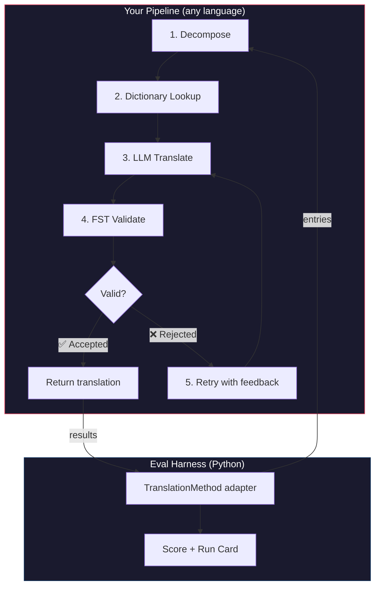
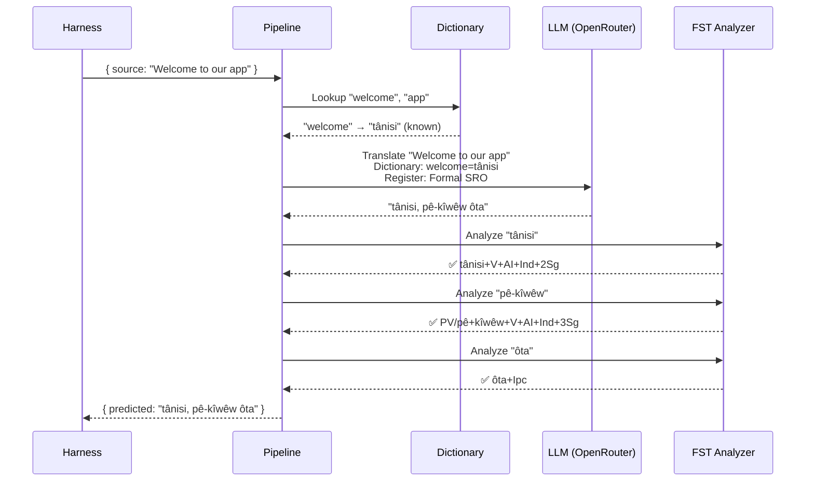
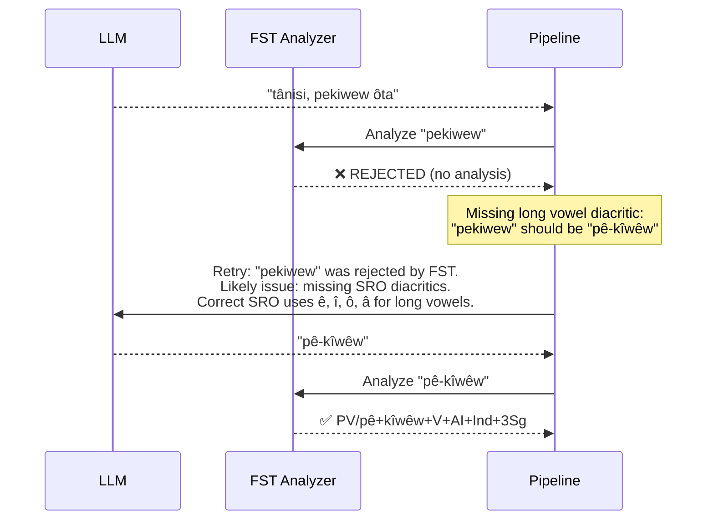

# Livre de recettes : Pipeline de traduction contrôlé par FST

Construisez un pipeline de traduction multi-étapes qui décompose le texte source, traduit via LLM, valide les résultats avec un transducteur à états finis (FST), et réessaie lorsque le FST rejette des formes de mots invalides. Ensuite, branchez-le sur le harnais d'évaluation et voyez comment il se classe.

**Ce que vous allez construire :** Un pipeline de traduction pour le cri des Plaines qui détecte les traductions morphologiquement invalides *avant* qu'elles ne comptent contre votre score.

:::info[Prérequis]
- Un binaire FST fonctionnel (par exemple, l'[analyseur pour le cri des plaines de GiellaLT/ALTLab](https://github.com/giellalt/lang-crk) — distribué via le canal nightly de GiellaLT, et non via les versions GitHub)
- Node.js 20+ (pour le pipeline) et Python 3.10+ (pour le banc d'évaluation)
- Une clé d'API OpenRouter pour l'étape LLM
:::

---

## Architecture

Le pipeline est une chaîne d'étapes. Chaque étape a un rôle spécifique. Vous pouvez construire ceci dans n'importe quel langage — cet exemple utilise JavaScript, mais le harnais ne se soucie pas de ce qu'il y a à l'intérieur. Il ne voit que le mince adaptateur Python à la limite.



### Pourquoi ces étapes

| Étape | Ce qu'elle fait | Pourquoi c'est important |
|-------|-------------|---------------|
| **Décomposer** | Diviser les chaînes d'interface utilisateur composées en segments traduisibles | Les langues polysynthétiques codent des phrases entières dans des mots uniques — le LLM a besoin d'unités plus petites |
| **Recherche dans le dictionnaire** | Vérifier un dictionnaire bilingue pour les traductions connues | Force la terminologie correcte pour les termes connus au lieu de s'appuyer sur les suppositions du LLM |
| **Traduction LLM** | Envoyer le segment à un LLM avec le contexte de registre et de grammaire | Gère les phrases nouvelles et génère une sortie fluide |
| **Validation FST** | Exécuter la sortie via un analyseur morphologique | Détecte les formes de mots invalides — si le FST rejette un mot, ce n'est pas une forme de mot valide dans la langue |
| **Réessai** | Renvoyer les mots rejetés avec les commentaires d'erreur du FST | Donne au LLM des informations spécifiques sur *pourquoi* le mot était incorrect |

---

## Le flux de données

Voici ce qui arrive à une seule entrée lorsqu'elle traverse le pipeline :



### Quand le FST rejette



---

## Implémentation

Construisez ce que vous voulez. Cet exemple utilise JavaScript, mais vous pourriez utiliser Python, Rust ou n'importe quoi d'autre. Le harnais ne se soucie pas — il ne communique qu'avec le mince adaptateur Python (montré dans la section suivante).

### Le pipeline

Chaque étape est une fonction. Le pipeline les enchaîne ensemble.

```javascript title="pipeline.js"
import { lookupDictionary } from './dictionary.js';
import { callLLM } from './llm.js';
import { analyzeWithFST } from './fst.js';

const MAX_RETRIES = 3;

/**
 * Translate a batch of keys through the full pipeline.
 *
 * @param {object} keys - Map of key → source string
 * @param {object} options - { sourceLang, targetLang }
 * @returns {{ translations: object, stats: object }}
 */
export async function translateBatch(keys, options) {
  const translations = {};
  const stats = { total: 0, fstAccepted: 0, retries: 0, dictionaryHits: 0 };

  for (const [key, sourceText] of Object.entries(keys)) {
    stats.total++;
    translations[key] = await translateSingle(sourceText, options, stats);
  }

  return { translations, stats };
}

/**
 * Translate a single string through all pipeline stages.
 */
async function translateSingle(sourceText, options, stats) {

  // ── Stage 1: Decompose ──────────────────────────────────
  // Split compound strings into segments the LLM can handle.
  // For UI strings this is often a no-op, but for longer content
  // it prevents the LLM from losing context in long prompts.
  const segments = decompose(sourceText);

  // ── Stage 2: Dictionary Lookup ──────────────────────────
  // Check each segment against the bilingual dictionary.
  // Known terms are forced — the LLM won't override them.
  const knownTerms = {};
  for (const segment of segments) {
    const entry = lookupDictionary(segment.toLowerCase());
    if (entry) {
      knownTerms[segment] = entry;
      stats.dictionaryHits++;
    }
  }

  // ── Stage 3: LLM Translate ──────────────────────────────
  let translation = await callLLM(sourceText, {
    ...options,
    knownTerms,
    register: 'nêhiyawêwin (Plains Cree). Use SRO orthography. '
            + 'Professional register for educational contexts.',
  });

  // ── Stage 4: FST Validate ──────────────────────────────
  // Split the translation into words and check each one.
  let { accepted, rejected } = await validateWords(translation);

  // ── Stage 5: Retry Loop ─────────────────────────────────
  // If any words were rejected, retry with FST feedback.
  let attempt = 0;
  while (rejected.length > 0 && attempt < MAX_RETRIES) {
    attempt++;
    stats.retries++;

    const feedback = rejected
      .map(w => `"${w}" was rejected by the morphological analyzer`)
      .join('; ');

    translation = await callLLM(sourceText, {
      ...options,
      knownTerms,
      register: 'nêhiyawêwin (Plains Cree). Use SRO orthography.',
      feedback: `Previous attempt had invalid words. ${feedback}. `
              + 'Use correct SRO diacritics (ê, î, ô, â for long vowels). '
              + 'Ensure verb forms match expected conjugation patterns.',
    });

    ({ accepted, rejected } = await validateWords(translation));
  }

  if (rejected.length === 0) stats.fstAccepted++;

  return translation;
}

/**
 * Decompose source text into translatable segments.
 *
 * For simple key-value UI strings, this usually returns the
 * original string as a single segment. For longer content,
 * it splits on sentence boundaries.
 */
function decompose(text) {
  // Simple sentence-boundary split. Replace with your own
  // morphological decomposition for more complex needs.
  return text
    .split(/(?<=[.!?])\s+/)
    .filter(s => s.trim().length > 0);
}

/**
 * Validate each word in a translation against the FST.
 *
 * @returns {{ accepted: string[], rejected: string[] }}
 */
async function validateWords(translation) {
  // Split on whitespace and punctuation, keeping only words
  const words = translation
    .split(/[\s,;:.!?'"()\[\]{}]+/)
    .filter(w => w.length > 0);

  const accepted = [];
  const rejected = [];

  for (const word of words) {
    const analyses = await analyzeWithFST(word);
    if (analyses.length > 0) {
      accepted.push(word);
    } else {
      rejected.push(word);
    }
  }

  return { accepted, rejected };
}
```

### L'enveloppe FST

Enveloppez votre binaire FST en tant que fonction asynchrone. Cet exemple utilise l'analyseur de cri des Plaines basé sur HFST d'ALTLab.

```javascript title="fst.js"
import { execFile } from 'node:child_process';
import { promisify } from 'node:util';

const execFileAsync = promisify(execFile);

// Path to your FST analyzer binary
const FST_PATH = process.env.FST_ANALYZER_PATH || './bin/crk-analyzer';

/**
 * Run a word through the FST morphological analyzer.
 *
 * Returns an array of analyses. Empty array = rejected.
 *
 * Example:
 *   analyzeWithFST("tânisi")
 *   → ["tânisi+V+AI+Ind+2Sg", "tânisi+V+AI+Cnj+2Sg"]
 *
 *   analyzeWithFST("pekiwew")
 *   → []  // rejected — missing diacritics
 *
 * @param {string} word - A single word in SRO orthography
 * @returns {string[]} Array of FST analyses (empty = rejected)
 */
export async function analyzeWithFST(word) {
  try {
    // HFST lookup: pipe the word to stdin, read analyses from stdout
    const { stdout } = await execFileAsync(
      FST_PATH,
      ['--quiet'],
      { input: word + '\n', timeout: 5000 }
    );

    // Parse HFST output: each line is "input\tanalysis\tweight"
    // Lines with "+?" indicate unrecognized forms
    return stdout
      .split('\n')
      .filter(line => line.includes('\t') && !line.includes('+?'))
      .map(line => line.split('\t')[1]);

  } catch (err) {
    // If the FST binary isn't available, log and reject
    console.error(`[WARN] FST analysis failed for "${word}": ${err.message}`);
    return [];
  }
}
```

### Modules de dictionnaire et LLM

```javascript title="dictionary.js"
/**
 * Simple bilingual dictionary backed by a JSON file.
 *
 * In production, you'd load from the coaching data directory
 * or query itwêwina (https://itwewina.altlab.app/) via API.
 */
const DICTIONARY = {
  'hello': 'tânisi',
  'welcome': 'tânisi',
  'thank you': 'kinanâskomitin',
  'home': 'kīwēwin',
  'search': 'nānātawāpahtam',
  'settings': 'isi-nākatohkēwin',
  'help': 'nīsōhkamākēwin',
  'back': 'kīwē',
};

/**
 * @param {string} term - Lowercase English term
 * @returns {string|null} Cree translation or null
 */
export function lookupDictionary(term) {
  return DICTIONARY[term] || null;
}
```

```javascript title="llm.js"
/**
 * Call an LLM via OpenRouter for translation.
 */
const OPENROUTER_API = 'https://openrouter.ai/api/v1/chat/completions';

export async function callLLM(sourceText, options) {
  const { knownTerms = {}, register, feedback } = options;

  // Build the system prompt with register and known terms
  let systemPrompt = `You are translating English to Plains Cree.\n\n`;
  systemPrompt += `Register: ${register}\n\n`;

  if (Object.keys(knownTerms).length > 0) {
    systemPrompt += `Required terminology (use these exact translations):\n`;
    for (const [en, crk] of Object.entries(knownTerms)) {
      systemPrompt += `  "${en}" → "${crk}"\n`;
    }
    systemPrompt += '\n';
  }

  if (feedback) {
    systemPrompt += `IMPORTANT correction from previous attempt:\n${feedback}\n\n`;
  }

  systemPrompt += `Rules:\n`;
  systemPrompt += `- Use Standard Roman Orthography (SRO)\n`;
  systemPrompt += `- Use macron/circumflex for long vowels: ê, î, ô, â\n`;
  systemPrompt += `- Return ONLY the Cree translation, nothing else\n`;

  const response = await fetch(OPENROUTER_API, {
    method: 'POST',
    headers: {
      'Authorization': `Bearer ${process.env.OPENROUTER_API_KEY}`,
      'Content-Type': 'application/json',
    },
    body: JSON.stringify({
      model: 'google/gemini-2.5-pro',
      messages: [
        { role: 'system', content: systemPrompt },
        { role: 'user', content: sourceText },
      ],
      temperature: 0.2,
    }),
  });

  const json = await response.json();
  return json.choices[0].message.content.trim();
}
```

---

## Branchement sur le harnais

Votre pipeline est construit. Maintenant, vous devez le connecter au harnais d'évaluation pour pouvoir l'évaluer sur le classement.

Le harnais parle une interface : `TranslationMethod`. C'est un protocole Python avec une seule méthode. Construisez ce que vous voulez dans n'importe quel langage — puis donnez-lui ce mince enveloppe et il se branche.

```python title="fst_gated_process.py"
"""
TranslationMethod adapter for the FST-gated pipeline.

This thin wrapper connects your pipeline (running as a local
subprocess or HTTP server) to the eval harness. The harness
calls translate() with corpus entries. You call your pipeline.
You return results. That's it.
"""

import time
import subprocess
import json
from mt_eval_harness.config import RunConfig


class FSTGatedProcess:
    """Adapter between the eval harness and your FST-gated pipeline.

    The pipeline runs as a Node.js subprocess. This wrapper:
    1. Receives entries from the harness
    2. Sends them to the pipeline
    3. Returns structured results the harness can score
    """

    def __init__(self, pipeline_url: str = "http://localhost:3001"):
        self.pipeline_url = pipeline_url

    async def translate(
        self,
        entries: list[dict],
        config: RunConfig,
    ) -> list[dict]:
        """Translate a batch of entries through the FST-gated pipeline.

        Args:
            entries: List of corpus entries with 'id' and source text.
            config: Harness run configuration (for context).

        Returns:
            List of result dicts, one per entry.
        """
        import httpx

        results = []

        for entry in entries:
            source_text = entry.get(config.source_field, entry.get("source", ""))
            start = time.monotonic()

            try:
                # Call your pipeline — however it's running
                async with httpx.AsyncClient() as client:
                    response = await client.post(
                        f"{self.pipeline_url}/translate",
                        json={"keys": {str(entry["id"]): source_text}},
                        timeout=30.0,
                    )
                    data = response.json()
                    predicted = data["translations"][str(entry["id"])]

                elapsed = time.monotonic() - start

                results.append({
                    "id": entry["id"],
                    "predicted": predicted,
                    "latency_s": elapsed,
                    "usage": {},  # pipeline doesn't expose token counts
                    "error": None,
                    "tool_calls": [],
                    "tool_call_count": 0,
                    "metadata": data.get("meta", {}),
                })

            except Exception as err:
                results.append({
                    "id": entry["id"],
                    "predicted": "",
                    "latency_s": time.monotonic() - start,
                    "usage": {},
                    "error": str(err),
                    "tool_calls": [],
                    "tool_call_count": 0,
                    "metadata": {},
                })

        return results
```

:::tip[Vous n'avez pas besoin de HTTP]
L'exemple ci-dessus appelle le pipeline via HTTP parce que le pipeline est en JavaScript. Si votre pipeline est en Python, vous pouvez l'appeler directement — aucun serveur nécessaire. Le wrapper `TranslationMethod` n'est qu'une limite de fonction. Ce qui se passe à l'intérieur dépend de vous.
:::

### Exécution de l'évaluation

Démarrez votre pipeline, puis exécutez le harnais :

```bash
# Terminal 1: Start the pipeline
node server.js

# Terminal 2: Run the harness with your process
export OPENROUTER_API_KEY="sk-or-v1-..."

python -c "
import asyncio
from mt_eval_harness.config import RunConfig
from mt_eval_harness.runner import execute_run
from fst_gated_process import FSTGatedProcess

async def main():
    config = RunConfig(
        corpus_path='data/your-crk-dev-v1.json',
        source_lang='English',
        target_lang='Plains Cree (nêhiyawêwin, SRO)',
        process_name='fst-gated-v1',
    )
    process = FSTGatedProcess('http://localhost:3001')
    run_log = await execute_run(config, process=process)
    print(f'Results: {run_log.output_path}')

asyncio.run(main())
"
```

Ou utilisez l'interface de ligne de commande pour comparer avec la ligne de base intégrée :

```bash
mt-eval run \
  --corpus eval-amh-fra-globalvoices-test-v1 \
  --model google/gemini-2.5-pro \
  --fst-retries 3 \
  --name fst-gated-v1 \
  --publish
```

---

## Comprendre vos résultats

Le banc d'évaluation produit une **fiche d'exécution** (*run card*) — un fichier JSON contenant vos scores. Dans les grandes lignes (chiffres donnés à titre indicatif, non issus d'une transcription réelle) :

```
  Headline     chrF++ 48.7 [47.1, 50.3]   (95% bootstrap CI, sacreBLEU signature recorded)
  Diagnostics  exact match 12.1% · FST acceptance 94.4%
  Cost         436 entries · 47 retries · $0.18 total
```

**Ce que cela vous indique en un coup d'œil :**
- **chrF++ 48.7** constitue le résultat principal : le chevauchement des n-grammes de caractères au niveau du corpus avec les traductions de référence, sur une échelle de 0 à 100. La valeur entre crochets correspond à son intervalle de confiance à 95 % ; une nouvelle exécution ou une méthode concurrente dont l'intervalle chevauche le vôtre n'est peut-être pas réellement différente. Pour le savoir, comparez les deux exécutions avec `mt-eval compare --significance`, qui exécute un test de significativité apparié sur chrF++.
- **FST acceptance 94.4%** est un diagnostic : le FST accepte 94 % des mots produits en sortie comme des formes valides, ce qui confirme que votre boucle de réessai fonctionne. Cela n'indique en rien si les mots traduisent fidèlement la source, raison pour laquelle cette métrique n'apparaît jamais dans le résultat principal.
- **Exact match 12.1%** est également un diagnostic : la marge de progression reste considérable.

:::info[Aucun label de qualité sur un score automatique]
Le banc d'évaluation n'attribue aucun label à un score (« fonctionnel », « déployable » ou autre). Ces paliers basés sur un score composite ont été abandonnés : un même score a une signification différente selon les langues et les ensembles d'évaluation, et seule une révision par des locuteurs certifie la qualité. Consultez [Comment les exécutions sont évaluées](/docs/network/specifications/scoring#how-runs-are-scored) et [pourquoi le composite a été abandonné](/docs/network/specifications/scoring#why-the-composite-was-retired).
:::

<details>
<summary><strong>Plus profond : Qu'y a-t-il dans la carte d'exécution ?</strong></summary>

Le JSON de la carte d'exécution capture tout ce qui concerne cette exécution d'évaluation. Sections clés :

**Scores** — chaque métrique calculée par le banc d'évaluation :
```json
{
  "scores": {
    "scoring_standard": "standard/1",
    "primary_metric": "chrf_plus_plus",
    "chrf_plus_plus": 48.7,
    "confidence_intervals": {
      "corpus_chrf": { "ci_lower": 47.1, "ci_upper": 50.3 }
    },
    "sacrebleu_signatures": {
      "chrf": "nrefs:1|case:mixed|eff:yes|nc:6|nw:2|space:no|version:2.4.3"
    },
    "exact_match_rate": 0.121,
    "fst_acceptance_rate": 0.944,
    "composite": null,
    "quality_tier": null
  }
}
```

**Provenance** — ce qui a produit ces résultats :
```json
{
  "method": {
    "process_name": "fst-gated-v1",
    "model": "google/gemini-2.5-pro",
    "temperature": 0.0
  },
  "corpus": {
    "id": "edtekla-dev-v1",
    "sha256": "a1b2c3..."
  }
}
```

**Résultats par entrée** — chaque traduction avec des scores individuels, pour que vous puissiez trouver où votre méthode échoue :
```json
{
  "id": 42,
  "source": "The student completed the assignment",
  "reference": "ôskiniw kî-kîsîhtâw ôhi atoskêwina",
  "predicted": "ôskiniw kî-kîsîhtâw ôhi atoskêwin",
  "chrf": 89.2,
  "exact_match": false,
  "fst_accepted": true
}
```

La fiche comporte également BLEU, spBLEU et TER (ainsi que COMET lorsqu'il a été calculé) aux côtés de chrF++, sans jamais être fusionnés avec celui-ci, ainsi que toutes les réserves sur les scores signalées par le banc d'évaluation. `composite` et `quality_tier` sont toujours `null` sur une nouvelle fiche : le composite pondéré et ses paliers ont été abandonnés, et seules les fiches publiées avant l'entrée en vigueur du standard comportent encore une valeur stockée, affichée sous la mention « legacy composite (retired) ». Consultez la [Spécification d'évaluation](/docs/network/specifications/scoring#how-runs-are-scored).

</details>

---

## Déploiement en production

Votre méthode a des scores sur le classement. Maintenant, vous voulez l'utiliser réellement. Cette section concerne le service de votre pipeline en tant que point de terminaison de production que [champollion](https://champollion.dev) peut appeler.

:::note[Cette section est facultative]
Tout ce qui précède concerne la construction et l'évaluation de votre méthode. Cette section concerne le déploiement — une préoccupation distincte. Vous pouvez soumettre au classement sans déployer quoi que ce soit.
:::

### Le serveur HTTP

Enveloppez votre pipeline en tant que serveur Express qui implémente le [contrat de méthode API](https://champollion.dev/docs/guides/serving-a-method) :

```javascript title="server.js"
import express from 'express';
import { translateBatch } from './pipeline.js';

const app = express();
app.use(express.json());

/**
 * API method contract:
 *
 * Request:  { source_locale, target_locale, method, keys: { "key": "source" } }
 * Response: { translations: { "key": "translated" }, meta: { ... } }
 */
app.post('/translate', async (req, res) => {
  const { source_locale, target_locale, method, keys } = req.body;

  // Validate request
  if (!keys || typeof keys !== 'object') {
    return res.status(400).json({ error: { message: 'Missing keys object' } });
  }

  try {
    const startTime = Date.now();
    const { translations, stats } = await translateBatch(keys, {
      sourceLang: source_locale,
      targetLang: target_locale,
    });

    res.json({
      translations,
      meta: {
        model: 'custom-pipeline/fst-gated-v1',
        method: 'decompose-lookup-translate-validate',
        elapsed_ms: Date.now() - startTime,
        fst_acceptance_rate: stats.fstAccepted / stats.total,
        retries: stats.retries,
      },
    });
  } catch (err) {
    console.error('[ERR] Pipeline failed:', err.message);
    res.status(500).json({ error: { message: err.message } });
  }
});

// Health check for connectivity verification
app.get('/health', (req, res) => res.json({ status: 'ok' }));

app.listen(3001, () => {
  console.log('FST-gated pipeline running on http://localhost:3001');
});
```

### Configurer champollion

Pointez votre paire de langues vers le service en cours d'exécution :

```json title="champollion.config.json"
{
  "version": 3,
  "inputLocale": "en",
  "pairs": {
    "en:crk": {
      "method": "api",
      "endpoint": "http://localhost:3001/translate"
    }
  },
  "languages": {
    "crk": {
      "name": "Plains Cree",
      "register": "SRO syllabics with grammatical precision."
    }
  }
}
```

```bash
# Run it
export OPENROUTER_API_KEY="sk-or-v1-..."
node server.js &
npx champollion sync
```

### Empaquetage en tant que plugin

Une fois que votre méthode a des scores, empaquetez-la pour que d'autres puissent l'utiliser :

```json title="crk-fst-gated-v1/method.json"
{
  "name": "crk-fst-gated-v1",
  "type": "api",
  "version": "1.0.0",
  "description": "FST-gated Plains Cree translation with morphological validation",
  "author": "Your Name",

  "config": {
    "endpoint": "https://your-server.example.com/translate"
  },

  "locales": ["crk"],

  "benchmarks": {
    "crk": {
      "date": "2026-06-01T00:00:00Z",
      "corpus_size": 436,
      "exact_match_rate": 0.12,
      "corpus_chrf": 48.7,
      "model": "google/gemini-2.5-pro",
      "harness_version": "2.0"
    }
  },

  "provenance": {
    "resources": [
      { "name": "GiellaLT/ALTLab CRK Analyzer", "license": "AGPL-3.0-or-later", "type": "fst" },
      { "name": "Wolvengrey Dictionary", "license": "none", "type": "dictionary" }
    ],
    "commercialReady": false,
    "flags": ["nc-resource"]
  }
}
```

---

## Extension de ce modèle

Ce livre de recettes démontre une architecture de pipeline. Vous pouvez l'adapter pour n'importe quelle langue ou méthode :

| Variation | Ce qui change |
|-----------|-------------|
| **FST différent** | Échangez le chemin du binaire. Vous pouvez télécharger des FST précompilés (comme les binaires `.hfstol` ou `lttoolbox`) pour plus de 100 langues depuis [GiellaLT GitHub](https://github.com/giellalt) ou [Apertium GitHub](https://github.com/apertium). |
| **Pas de FST disponible** | Supprimez l'étape d'exécution FST et utilisez les [fichiers de paradigme plat UniMorph](https://huggingface.co/datasets/unimorph/universal_morphologies) de Hugging Face pour effectuer une validation de recherche en base de données statique des formes fléchies. |
| **Plusieurs LLM** | Enchaînez les modèles : un modèle rapide pour le brouillon initial, un modèle de raisonnement pour les corrections. |
| **Boucle humaine** | Ajoutez une étape de file d'attente qui retient les traductions incertaines pour examen par un expert avant de retourner. |
| **Modèle affiné** | Remplacez l'appel OpenRouter par un modèle local (Ollama, vLLM, etc.). |
| **Langue différente** | Changez le dictionnaire, le FST et le registre. L'architecture reste identique. |

Le pipeline est un modèle. Les étapes sont interchangeables. Construisez ce qui fonctionne pour votre langue, prouvez-le sur le [classement](https://champollion.dev/leaderboard), et déployez-le.

---

## Voir aussi

- **[Banc d'évaluation](/docs/network/specifications/harness)** — comment exécuter le banc d'évaluation et interpréter les résultats
- **[Interface des méthodes](/docs/network/specifications/methods)** — la spécification du protocole `TranslationMethod`
- **[Règles du classement](/docs/network/leaderboard/rules)** — critères de soumission et politiques anti-fraude
- **[Soutenir une langue à faibles ressources](/docs/network/community/low-resource-languages)** — le contexte général et les principes communautaires de souveraineté des données
- **[ALTLab](https://altlab.ualberta.ca/)** — l'Alberta Language Technology Lab (FST pour le cri des plaines)
- **[Classement des méthodes](https://champollion.dev/leaderboard)** — soumettez vos scores
