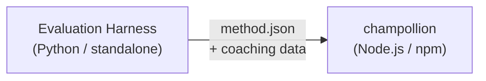

# Spécification du plugin de méthode

> **Version** : 1.1  
> **Audience** : Développeurs de plugins  
> **Schéma canonique** : [`shared/schemas/champollion-plugin.schema.json`](https://github.com/gamedaysuits/Champollion/blob/main/cli/shared/schemas/champollion-plugin.schema.json)

## Aperçu

champollion utilise un **système de méthodes enfichables**. Chaque paire de langues peut utiliser une méthode de traduction différente (LLM, coachée, convertisseur de script, etc.). Les méthodes sont enregistrées dans `lib/translate.js` et résolues par paire via `lib/pairs.js`.

Le rôle du harnais d'évaluation est de **développer, tester et exporter** les méthodes de traduction. Le rôle de champollion est de les **consommer et exécuter**. Le plugin est **données uniquement** — configuration, contenu de coaching et résultats de benchmark. Aucun code Python, aucune dépendance du harnais.

### Flux de données



Le harnais développe et teste les méthodes en Python. Lorsqu'une méthode est prête pour le déploiement, le harnais exporte un manifeste `method.json` et des fichiers de données de coaching optionnels. Champollion installe et exécute la méthode en utilisant ses propres implémentations de méthodes intégrées.

---

## Format du plugin de méthode

Un plugin de méthode est un seul fichier JSON (`method.json`) avec des fichiers de données de coaching optionnels.

### `method.json` — Obligatoire

```json
{
  "name": "french-formal-v1",
  "type": "llm-coached",
  "version": "1.0.0",
  "description": "Formally-tuned French with terminology enforcement and grammar coaching",
  "author": "Plugin Author",

  "config": {
    "model": "google/gemini-3.5-flash",
    "temperature": 0.2,
    "batchSize": 80,
    "register": "formal",
    "coachingFile": null,
    "coachingPrompt": null,
    "promptContext": null,
    "qualityTier": null
  },

  "locales": ["fr"],

  "benchmarks": {
    "fr": {
      "date": "2026-05-11T00:00:00Z",
      "corpus_size": 500,
      "exact_match_rate": 0.42,
      "corpus_chrf": 72.3,
      "corpus_bleu": 45.1,
      "model": "google/gemini-3.5-flash",
      "harness_version": "1.0.0"
    }
  },

  "provenance": {
    "resources": [],
    "commercialReady": false,
    "flags": ["license-unclear"]
  },

  "coaching": {
    "dir": "coaching"
  }
}
```

### Référence des champs

| Champ | Type | Obligatoire | Description |
|-------|------|-------------|-------------|
| `name` | string | ✅ | Identifiant de méthode unique (kebab-case) |
| `type` | string | ✅ | Type de méthode Champollion : `llm`, `llm-coached`, `api`, `google-translate`, `deepl`, `microsoft-translator`, `libretranslate`, `openai`, `anthropic`, `gemini` |
| `version` | string | ✅ | Version Semver (p. ex. `1.0.0`) |
| `locales` | string[] | ✅ | Codes de locale ciblés par cette méthode (minimum 1) |
| `description` | string | — | Description lisible par l'humain |
| `author` | string | — | Qui a développé/testé cette méthode |
| `config.model` | string | — | Identifiant du modèle OpenRouter |
| `config.temperature` | number | — | Température LLM (0,0–2,0, par défaut : 0,3) |
| `config.batchSize` | number | — | Clés par lot API (1–200, par défaut : 80) |
| `config.register` | string \| null | — | Registre/ton de la langue cible (clé prédéfinie ou texte libre) |
| `config.coachingFile` | string \| null | — | Chemin vers le fichier de prompt de coaching en texte libre (relatif à la racine du projet) |
| `config.coachingPrompt` | string \| null | — | Texte du prompt de coaching résolu (lu depuis `coachingFile` à l'exécution) |
| `config.promptContext` | string \| null | — | Contexte applicatif injecté dans le prompt système (p. ex., « Descriptions de produits e-commerce ») |
| `config.qualityTier` | string \| null | — | Niveau de qualité issu de l'évaluation de benchmark (`standard`, `high`, `research`, `verified`) |
| `benchmarks` | object | — | Résultats de benchmark par locale issus du harnais d'évaluation |
| `provenance` | object | — | Licences et dépendances de ressources |
| `coaching.dir` | string | — | Chemin relatif vers le répertoire de données de coaching |

:::info[Forme canonique de MethodConfig]
Le bloc `config` utilise le **schéma MethodConfig canonique** — les mêmes 8 champs utilisés dans `champollion.config.json`, les cartes d'exécution du harnais, `mt-eval export-config` et la publication/installation du classement. Tous les champs sont toujours présents ; les valeurs inutilisées sont `null`. Cela garantit un aller-retour sans friction entre l'évaluation et la production.
:::

### Objet Benchmark (par locale)

| Champ | Type | Obligatoire | Description |
|-------|------|-------------|-------------|
| `date` | string | ✅ | Horodatage ISO 8601 de l'exécution du benchmark |
| `corpus_size` | number | ✅ | Nombre d'entrées évaluées |
| `exact_match_rate` | number | ✅ | 0,0–1,0, proportion de correspondances exactes |
| `corpus_chrf` | number | — | Score chrF++ (0–100) |
| `corpus_bleu` | number | — | Score BLEU (0–100) |
| `model` | string | ✅ | Modèle utilisé lors de l'évaluation |
| `harness_version` | string | ✅ | Version du harnais d'évaluation utilisé |

:::info[Quelles métriques sont affichées ?]
La commande `champollion status` affiche **chrF++** et le **taux de correspondance exacte** du bloc de benchmark. `corpus_bleu` est accepté dans le manifeste mais n'est actuellement pas affiché ou utilisé par aucune commande champollion. Le [Classement des méthodes](/leaderboard) suit chrF++, la correspondance exacte et le taux d'acceptation FST.
:::

---

### Objet Provenance

Le bloc de provenance communique le statut de licence des ressources groupées du plugin.

| Champ | Type | Par défaut | Description |
|-------|------|-----------|-------------|
| `resources` | object[] | `[]` | Liste des ressources groupées avec `name`, `license` et `type` |
| `commercialReady` | boolean | `false` | Si le plugin est autorisé pour la distribution commerciale |
| `flags` | string[] | `["license-unclear"]` | Drapeaux de statut lisibles par machine |

**État par défaut** — les plugins exportés sont livrés avec `commercialReady: false` et `flags: ["license-unclear"]`.

**État autorisé** — lorsque la licence a été vérifiée : définissez `commercialReady: true` et effacez les drapeaux.

---

## Format des données de coaching

Si `type` est `llm-coached`, le plugin doit inclure des fichiers de données de coaching dans le sous-répertoire `coaching/`.

### `coaching/<locale>.json`

```json
{
  "grammar_rules": [
    "French adjectives agree in gender and number with the noun they modify",
    "Use 'vous' for formal contexts, 'tu' for informal"
  ],
  "dictionary": {
    "dashboard": "tableau de bord",
    "deployment": "déploiement",
    "settings": "paramètres"
  },
  "style_notes": "Prefer active voice. Avoid anglicisms where a native French term exists."
}
```

| Champ | Type | Obligatoire | Description |
|-------|------|-------------|-------------|
| `grammar_rules` | string[] | — | Règles injectées dans chaque prompt LLM pour cette locale |
| `dictionary` | object | — | Carte terme → traduction. Les termes correspondants sont injectés comme terminologie requise. |
| `style_notes` | string | — | Instructions de style en texte libre ajoutées au prompt |

---

## Structure du répertoire

```
french-formal-v1/
  method.json                 # Method manifest with benchmarks
  coaching/
    fr.json                   # Coaching data for French
```

Pour les méthodes multi-locale :

```
european-formal-v2/
  method.json                 # locales: ["fr", "de", "es", "it"]
  coaching/
    fr.json
    de.json
    es.json
    it.json
```

---

## Comment Champollion consomme les plugins

### Installation

```bash
champollion plugin install ./french-formal-v1/
```

Enregistre dans `.champollion/methods/french-formal-v1/`.

### Configuration

```json title="champollion.config.json"
{
  "pairs": {
    "en:fr": {
      "methodPlugin": "french-formal-v1"
    }
  }
}
```

:::info[Sémantique de fusion]
Le plugin définit *quelle* méthode utiliser (`type`). La configuration de paire règle *comment* l'exécuter (`model`, `register`, `batchSize`). Si la paire définit `model`, elle remplace la valeur par défaut du plugin.
:::

### Exécution

1. Champollion lit `method.json` depuis `.champollion/methods/french-formal-v1/`
2. Le champ `type` du plugin définit la méthode de traduction (p. ex., `llm-coached`)
3. Charge les données de coaching depuis le répertoire `coaching/` du plugin
4. Utilise le bloc `config` pour combler les lacunes dans le modèle/registre/température
5. Le bloc `benchmarks` est affiché dans la sortie `champollion status`
6. Le bloc `provenance` est vérifié par `champollion provenance` pour les drapeaux de licence

---

## Validation du schéma

Les manifestes de plugin sont validés au moment de l'installation par rapport à [`shared/schemas/champollion-plugin.schema.json`](https://github.com/gamedaysuits/Champollion/blob/main/cli/shared/schemas/champollion-plugin.schema.json).

Référencez le schéma dans votre `method.json` pour l'autocomplétion IDE :

```json
{
  "$schema": "./node_modules/champollion/shared/schemas/champollion-plugin.schema.json",
  "name": "my-method-v1"
}
```

---

## Ce qu'il NE FAUT PAS inclure

- ❌ Aucun code Python ou dépendance du harnais
- ❌ Aucune donnée de corpus brute ou journaux d'exécution
- ❌ Aucune clé API ou identifiants
- ❌ Aucune configuration du harnais
- ❌ Aucun modèle de prompt interne (ceux-ci se trouvent dans les implémentations de méthodes de champollion)

Le plugin est **données uniquement** : configuration, contenu de coaching et résultats de benchmark.

---

## Voir aussi

- [Méthodes de traduction](/docs/guides/translation-methods) — comment fonctionne chaque méthode intégrée
- [Configuration](/docs/getting-started/configuration) — configuration par paire et par langue
- [Servir une méthode via API](/docs/guides/serving-a-method) — héberger les méthodes en tant que services HTTP
- [Cookbook : Pipeline avec portail FST](/docs/network/tutorials/fst-gated-pipeline) — construire et empaqueter un pipeline
- [Évaluation MT](/docs/network/leaderboard/rules) — benchmarking des méthodes pour la soumission au classement
- [Supporter une langue peu dotée en ressources](/docs/network/community/low-resource-languages) — le cas d'usage des plugins communautaires
