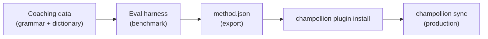

# Tutoriel : Créer un plugin de traduction

Créez une méthode de traduction personnalisée à partir de zéro, évaluez-la et déployez-la en tant que plugin champollion. Il s'agit du flux de travail complet pour ajouter une nouvelle paire linguistique qu'aucune API commerciale ne prend en charge.

**Ce que vous allez créer :** Un plugin de traduction guidée pour le français formel avec terminologie imposée, règles grammaticales et scores d'évaluation.

**Durée :** 30–45 minutes

**Prérequis :**
- champollion installé (`npm install --save-dev champollion`)
- Une clé API OpenRouter (`OPENROUTER_API_KEY`)
- Python 3.10+ (pour le harness d'évaluation)

---

## Étape 1 : Identifier le problème

Vous traduisez un tableau de bord SaaS en français. La méthode `llm` par défaut produit des traductions correctes mais incohérentes :

- Parfois « dashboard » devient « tableau de bord », d'autres fois « panneau de contrôle »
- Le registre alterne entre les formes `tu` et `vous`
- Les termes techniques sont anglicisés de manière incohérente

Vous avez besoin d'une **application de terminologie** et d'un **contrôle du registre** que l'invite générique du modèle de langage ne fournit pas.

## Étape 2 : Créer des données de coaching

Créez un fichier de coaching qui encode vos exigences linguistiques :

```bash
mkdir -p .champollion/coaching
```

```json title=".champollion/coaching/fr.json"
{
  "grammar_rules": [
    "Always use the 'vous' form for formal register",
    "French adjectives agree in gender and number with their noun",
    "Use the present tense for UI instructions, not the imperative",
    "Preserve sentence-final punctuation style from the source"
  ],
  "dictionary": {
    "dashboard": "tableau de bord",
    "deployment": "déploiement",
    "settings": "paramètres",
    "environment variable": "variable d'environnement",
    "webhook": "webhook",
    "API key": "clé API",
    "sign in": "se connecter",
    "sign out": "se déconnecter",
    "repository": "dépôt",
    "pull request": "demande de tirage"
  },
  "style_notes": "Formal technical French. Prefer native French terms over anglicisms where established equivalents exist. Keep UI labels concise — 3 words maximum where possible."
}
```

**Ce que chaque champ fait :**
- **`grammar_rules`** — Injecté dans l'invite système du modèle de langage en tant que contraintes explicites
- **`dictionary`** — Mis en correspondance avec les clés sources ; lorsqu'un terme du dictionnaire apparaît, il est injecté en tant que « terminologie requise » dans l'invite
- **`style_notes`** — Ajouté à l'invite système en tant que conseils de style général

## Étape 3 : Configurer la paire

Indiquez à champollion d'utiliser `llm-coached` pour le français :

```json title="champollion.config.json"
{
  "version": 3,
  "inputLocale": "en",
  "localesDir": "./locales",
  "pairs": {
    "en:fr": {
      "method": "llm-coached",
      "model": "google/gemini-3.5-flash",
      "temperature": 0.2
    }
  },
  "languages": {
    "fr": {
      "register": "Formal technical French (vous-form)",
      "name": "French"
    }
  }
}
```

## Étape 4 : Le tester

```bash
npx champollion sync --dry
```

Examinez la sortie de simulation. Vérifiez que :
- ✅ Les termes du dictionnaire sont utilisés de manière cohérente (« tableau de bord », pas « panneau de contrôle »)
- ✅ La forme `vous` est utilisée partout
- ✅ Les termes techniques correspondent à votre dictionnaire

Ensuite, exécutez la synchronisation réelle :

```bash
npx champollion sync
```

## Étape 5 : Évaluer avec le harness d'évaluation (Optionnel)

Si vous voulez des scores de qualité — et vous le voulez, car les plugins sont livrés avec des données d'évaluation — utilisez le harness d'évaluation compagnon.

### Installer le harness

```bash
pip install mt-eval-harness
```

### Créer un corpus de référence

Créez un fichier avec des chaînes sources et des traductions de référence :

```json title="corpus/french-formal.json"
[
  {
    "source": "Dashboard",
    "reference": "Tableau de bord"
  },
  {
    "source": "Sign in to your account",
    "reference": "Connectez-vous à votre compte"
  },
  {
    "source": "Your deployment is ready",
    "reference": "Votre déploiement est prêt"
  },
  {
    "source": "Environment variables",
    "reference": "Variables d'environnement"
  }
]
```

### Exécuter l'évaluation

```bash
mt-eval test \
  --corpus corpus/french-formal.json \
  --source en \
  --target fr \
  --model google/gemini-3.5-flash \
  --temperature 0.2 \
  --champollion-config champollion.config.json
```

Le harness produit :
- **chrF++** — Score F au niveau des caractères (0–100). Au-dessus de 70 est solide.
- **BLEU** — Chevauchement des n-grammes (0–100). Au-dessus de 40 est correct pour la traduction guidée.
- **Taux de correspondance exacte** — Proportion de traductions correspondant exactement à la référence.
- **COMET** — Métrique de qualité neuronale (si installée via `mt-eval setup --comet`).

:::tip[Tester ce que vous déployez]
L'utilisation de `--champollion-config` importe votre modèle de production, registre, température et données de coaching directement depuis votre `champollion.config.json`. Cela garantit que vous évaluez la méthode exacte que vous déploierez.
:::

### Exporter le plugin

Une fois satisfait des scores :

```bash
mt-eval export \
  --name french-formal-v1 \
  --report eval/logs/harness/run_report.json \
  --output ./french-formal-v1/
```

Cela crée :

```
french-formal-v1/
├── method.json          # Manifest with config + benchmarks
└── coaching/
    └── fr.json          # Your coaching data
```

## Étape 6 : Installer le plugin dans Champollion

```bash
npx champollion plugin install ./french-formal-v1/
```

Cela copie le plugin vers `.champollion/methods/french-formal-v1/`.

Mettez à jour votre configuration pour l'utiliser :

```json title="champollion.config.json"
{
  "pairs": {
    "en:fr": {
      "methodPlugin": "french-formal-v1"
    }
  }
}
```

## Étape 7 : Vérifier

```bash
# Check plugin is installed and shows benchmark scores
npx champollion status

# Run a sync with the plugin
npx champollion sync

# Audit licensing status
npx champollion provenance
```

La sortie `status` affichera :

```
en → fr
  Method:    french-formal-v1 (llm-coached)
  Model:     google/gemini-3.5-flash
  Quality:   high
  chrF++:    74.2
  BLEU:      46.8
  Exact:     42%
```

## Ce que vous avez créé



Vous disposez maintenant de :
1. **Données de coaching** — Règles grammaticales et terminologie qui imposent la cohérence
2. **Scores d'évaluation** — Qualité quantifiée qui est livrée avec le plugin
3. **Un plugin portable** — `method.json` + données de coaching, installable sur n'importe quelle machine
4. **Déploiement en production** — Intégré dans votre pipeline de synchronisation

## Prochaines étapes

- **[Spécification du plugin](/docs/reference/plugin-spec)** — Référence complète du format de manifeste
- **[Méthodes de traduction](/docs/guides/translation-methods)** — Comparez les quatre méthodes
- **[Langues peu dotées en ressources](/docs/network/community/low-resource-languages)** — Appliquez ce modèle aux langues sans couverture API
- **[Traduire 30 langues](/docs/tutorials/translate-30-languages)** — Étendez votre projet à un public mondial
