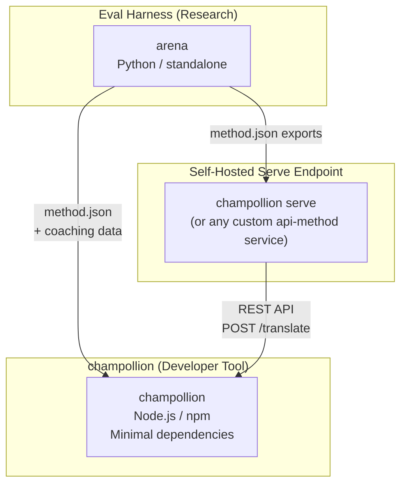
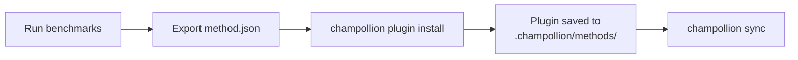
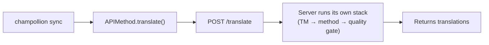
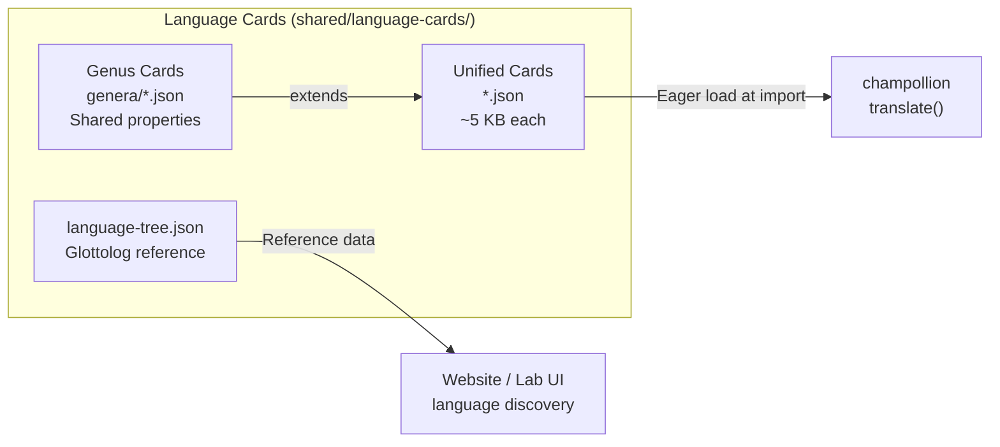

# アーキテクチャ

Champollion の翻訳エコシステムは、明確に定義されたコントラクトを通じて連携する3つの独立したツールで構成されています。ビルド時にはいずれも互いに依存しません。共有の**メソッドプラグイン形式**と**REST API コントラクト**を通じて通信します。

## 3つのコンポーネント



### champollion（本プロジェクト）

ソース公開の開発者向けツールです（非商用利用は無料）。プラグイン可能なメソッドを使用してロケールファイルを翻訳します。最小限の依存関係で、設定は任意であり、すぐに使用できます。

**組み込みメソッド:**
- `llm` → OpenRouter / 任意の LLM（200以上のモデル）
- `llm-coached` → LLM + 文法・辞書コーチング
- `openai` → OpenAI API 直接利用（GPT-4o、GPT-4o-mini）
- `anthropic` → Anthropic API 直接利用（Claude Sonnet、Haiku、Opus）
- `gemini` → Google Gemini API 直接利用（Flash、Pro — 無料枠あり）
- `google-translate` → Google Cloud Translation API v2
- `deepl` → 用語集サポート付き DeepL API
- `microsoft-translator` → Azure Cognitive Services Translator
- `libretranslate` → セルフホスト型 LibreTranslate（AGPL、無料）
- `api` → 任意のリモート REST エンドポイントへの薄いパイプ

### Eval Harness（コンパニオンプロジェクト）

翻訳メソッドの開発・テスト・ベンチマークを行うための研究ツールです。メソッドが許容できる品質に達すると、ハーネスは**メソッドプラグイン** — `method.json` マニフェストとオプションのコーチングデータファイル — をエクスポートします。

ハーネスは champollion の内部では動作しません。静的な出力（JSON ファイル）を生成する独立したツールです。Champollion はそれらのファイルを読み込むだけです。

[→ GitHub の Eval Harness](https://github.com/gamedaysuits/Champollion)

### セルフホスト型serveエンドポイント (`champollion serve`)

どのchampollionプロジェクトでも、1つのコマンド（[`champollion serve`](/docs/guides/serving-a-method#the-zero-code-path-champollion-serve)）で設定済みの翻訳スタックをHTTP経由で提供（serve）でき、他のプロジェクトは`api`メソッドを通じてそれを利用できます。プロンプト、コーチングデータ、翻訳メモリ（TM）、プロバイダーのキーは所有者のインフラストラクチャ上に保持され、利用者はソース文字列を送信して翻訳を受け取るだけです。champollionの外部に完全に独立して存在するパイプライン（FSTチェーンや研究システムなど）も、[カスタムサービス](/docs/guides/serving-a-method)として同じコントラクトを実装できます。ホスト型のChampollionサービスは存在しません。設計上、提供（serve）は常にセルフホストで行われます。

## 連携の仕組み

### Eval Harness → champollion（一方向エクスポート）



**コントラクト**: [プラグイン仕様](/docs/reference/plugin-spec)

### Serveエンドポイント → champollion (実行時のAPI)



Champollion の `APIMethod` は**ダムパイプ**です。キーを送信して翻訳結果を受け取るだけです。翻訳ロジックも独自コンテンツも一切含みません。

## 各コンポーネントが他について知っていること

| ツール | champollionを認識しているか？ | serveエンドポイントを認識しているか？ | harnessを認識しているか？ |
|------|---------------------|-------------------------------|---------------------|
| **champollion** | *(champollion自身)* | はい — `api`メソッドが呼び出します | いいえ — プラグインのエクスポートを読み取るだけです |
| **Serveエンドポイント** | はい — リクエストを処理します | *(serveエンドポイント自身)* | いいえ — 他のプロジェクトと同様にエクスポートされたメソッドをインストールします |
| **Eval Harness** | はい — プラグイン形式をエクスポートします | いいえ — メソッドは個別にデプロイされます | *(harness自身)* |

## ユーザーシナリオ

### シナリオ 1: 無料・設定不要（ほとんどのユーザー）

```bash
export OPENROUTER_API_KEY=sk-...
npx champollion sync
```

組み込みの`llm`メソッドを使用します。プラグイン、サーバー、harnessは使用しません。

### シナリオ 2: Google Translate ベースライン

```bash
export GOOGLE_TRANSLATE_API_KEY=AIza...
npx champollion sync
```

組み込みの `google-translate` メソッドを使用します。プラグインは不要です。

### シナリオ 3: コーチングデータ付きオープンプラグイン

```bash
champollion plugin install ./french-formal-v1/
champollion sync
```

プラグインに `type: "llm-coached"` が含まれており、champollion はユーザー自身の OpenRouter キーを使用します。コーチングデータはローカルにあるため、サーバーへの呼び出しは発生しません。

### シナリオ 4: DIY コーチング（プラグインなし、ハーネスなし）

```json title="champollion.config.json"
{
  "pairs": {
    "en:fr": { "method": "llm-coached" }
  }
}
```

ユーザーが `.champollion/coaching/fr.json` で独自の文法ルールと辞書を管理します。

### シナリオ5: 他のプロジェクトが提供するスタックを利用する

```bash
champollion plugin install ./their-project-serve/   # manifest from `champollion serve --emit-manifest`
CHAMPOLLION_API_KEY=<their bearer token> champollion sync
```

ペアの`api`メソッドは、ソース文字列をセルフホストされた[`champollion serve`](/docs/guides/serving-a-method#the-zero-code-path-champollion-serve)エンドポイントにPOSTします。翻訳は、そのスタック（コーチング、TM、品質ゲート）によって行われます。

## 言語カード

champollion の各言語は**言語カード** — レジスタープリセット、丁寧さのルール、メソッドサポートフラグ、タイポグラフィの慣習、系統分類、言語参照データを含む統合 JSON ファイル — を通じて設定されます。



カードはインポート時に一括で読み込まれます。各カードには翻訳エンジンと開発者ドキュメントが必要とするすべてのメタデータが含まれており、別途参照層は存在しません。カードは権威ある情報源（IANA、CLDR、[Glottolog](https://glottolog.org)、[WALS](https://wals.info)）から `scripts/generate-language-card.mjs` と `scripts/build-language-tree.mjs` を使用して生成され、その後、言語的な正確さのために人手でキュレーションされています。

## 設計原則

1. **循環依存なし。** ブリッジは一方向です。
2. **Champollionは軽量なコア。** 最小限の依存関係で、設定は任意です。プラグインとAPIは追加機能です。
3. **IP保護はアーキテクチャレベル。** 独自の技術は提供（serve）側に保持されます。エンドポイントを運用する者が、自身のプロンプト、コーチング、キーを保持します。npmパッケージには独自のものは一切含まれません。
4. **プラグイン形式がコントラクト。** すべては`method.json`を通じて処理されます。
5. **各ツールには1つの役割。** Harness → メソッドの開発。`champollion serve` → メソッドのホスト。Champollion → ファイルの翻訳。

---

## 関連項目

- [翻訳メソッド](/docs/guides/translation-methods) — 各組み込みメソッドの動作について
- [プラグイン仕様](/docs/reference/plugin-spec) — method.json マニフェスト形式について
- [Eval Harness](/docs/network/specifications/harness) — コンパニオン研究ツールについて
- [API によるメソッドの提供](/docs/guides/serving-a-method) — カスタム翻訳パイプラインのホスティングについて
- [低リソース言語のサポート](/docs/network/community/low-resource-languages) — このアーキテクチャを生み出したユースケース
