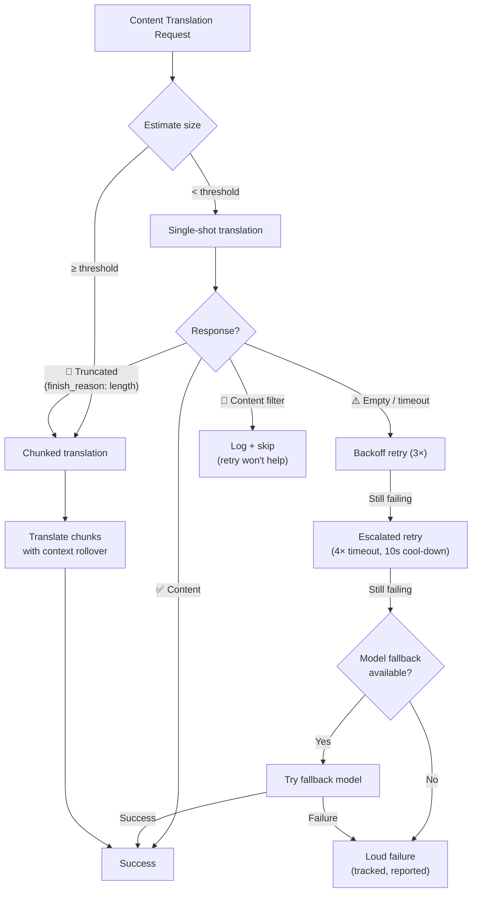

# コンテンツ翻訳のレジリエンス

Champollionのコンテンツ翻訳パイプライン（Markdown/MDXドキュメント）は、障害を適切に処理するために多層的なレジリエンスシステムを使用しています。各バッチが小さく再試行のコストが低いキーバリュー翻訳とは異なり、コンテンツ翻訳ではプロンプトが大きく出力も長くなるため、一時的な理由だけでなく構造的な理由で失敗する可能性があります。

## 課題

コンテンツ翻訳の障害モードは、キーバリュー翻訳とは根本的に異なります。

| 障害モード | キーバリュー | コンテンツ |
|---|---|---|
| レート制限 (429) | 一般的、一時的 | 一般的、一時的 |
| タイムアウト | 稀（小さなバッチ） | 一般的（長い出力） |
| 空のレスポンス | 稀 | 一般的（出力制限、フィルター） |
| 出力の切り捨て | 該当なし（JSON検証済み） | 暗黙的に発生する |
| コンテンツフィルター | 極めて稀 | 可能性あり（CLIドキュメント、セキュリティドキュメント） |
| モデルの制限 | 再試行で解決する | 再試行では解決しない |

重要な洞察：**失敗した同じリクエストを再試行することは、冗長性ではなく単なる頑固さです。** 適切なレジリエンスシステムは、*なぜ*失敗したのかを特定し、それに応じてアプローチを変更します。

## アーキテクチャの概要



## レイヤー1：診断優先の再試行

*どのように*再試行するかを決定する前に、システムはAPIレスポンスを検査して*何が*失敗したのかを理解します。

### 終了理由の分析

すべてのLLM APIは、生成されたテキストとともに`finish_reason`を返します。Champollionはこれを使用して、インテリジェントな再試行の決定を行います。

| `finish_reason` | 意味 | アクション |
|---|---|---|
| `stop` + コンテンツ | モデルが正常に完了した | ✅ 結果を受け入れる |
| `stop` + 空 | モデルが何も生成しなかった | ⚠️ 同じリクエストを再試行する（一時的） |
| `length` | 出力がトークン制限に達した | 🔶 ドキュメントを自動チャンク化する |
| `content_filter` | セーフティフィルターが出力をブロックした | 🔴 ログに記録してスキップする（再試行しても解決しない） |
| `null` / 欠落 | 不正なレスポンス | ⚠️ 同じリクエストを再試行する（一時的） |

これは、すべての障害を同一に扱いバックオフ再試行を行う現在のアプローチに代わるものです。

### 再試行バジェット

一時的な障害に対する標準的な再試行バジェットは以下の通りです。

| ラウンド | 試行回数 | タイムアウト | バックオフ |
|---|---|---|---|
| 標準 (Standard) | 4 (0→3) | 60秒 | 1秒 → 2秒 → 4秒 |
| エスカレーション (Escalated) | 4 (0→3) | 120秒 | 1秒 → 2秒 → 4秒 |
| **合計** | **8** | — | **最悪の場合 約3.5分** |

ラウンド間には10秒間のクールダウンがあり、一時的な問題が解決するのを待ちます。

## レイヤー2：コンテンツのチャンク化

ドキュメントがサイズしきい値を超えた場合、またはレイヤー1が出力の切り捨てを通知した場合、システムはドキュメントを翻訳可能なサイズのチャンクに分割します。

チャンク化の詳細な設定については、[コンテキストのロールオーバー](/docs/concepts/context-rollover#content-chunking)を参照してください。重要なポイントは以下の通りです。

### 分割ストラテジー

1. **見出しの境界** — `##`と`###`は、自然な翻訳単位の境界です。各セクションは独立して翻訳できるほど自己完結しています。
2. **段落へのフォールバック** — 単一の見出しセクションがチャンクサイズを超える場合は、二重改行で分割します。
3. **ハードスプリット** — 非常に長い段落（表など）に対する最終手段です。文の境界で分割します。

### チャンク間のコンテキスト

各チャンクは、*前のチャンクの翻訳*の最後の2〜3段落をコンテキストとして受け取ります。これにより、以下の問題を防ぎます。
- **用語のズレ** — モデルは前のチャンクで「ダッシュボード」と呼んだものを確認できます。
- **代名詞の解決** — 前のセクションの先行詞が引き継がれます。
- **文体の統一** — チャンク1で確立されたトーンがチャンクNまで維持されます。

### 自動チャンキングのトリガー

| トリガー | 動作 |
|---|---|
| 設定で`contentChunkSize`が指定されている | そのサイズを超えるドキュメントを常にチャンク化する |
| `finish_reason: "length"`が返された | フォールバックとして自動チャンク化する（設定がなくても実行） |
| 入力 > 約12KB（自動検出） | 提案をログに記録するが、強制はしない |

## レイヤー3：モデルのフォールバックチェーン

設定されたモデルが一時的ではなく構造的に継続して失敗する場合、システムは代替モデルを試行します。モデルによって、コンテキストウィンドウ、出力制限、セーフティフィルター、多言語対応の強みが異なります。

### デフォルトのフォールバックチェーン

```json title="champollion.config.json"
{
  "contentFallbackChain": [
    "google/gemini-2.5-flash",
    "anthropic/claude-sonnet-4"
  ]
}
```

常に設定されたモデルが最初に試行されます。フォールバックモデルは、すべての再試行ラウンド（標準＋エスカレーション）を使い果たした後にのみ使用されます。

### 複数のアーキテクチャを使用する理由

| シナリオ | プライマリモデルの失敗 | フォールバックモデルの成功 |
|---|---|---|
| ベトナム語のCLIドキュメント | Geminiが空を返す | Claudeは問題なく処理する |
| セーフティフィルターにかかるコンテンツ | OpenAIがブロックする | Geminiは異なるフィルターしきい値を持つ |
| 長く構造化された表 | モデルAが切り捨てる | モデルBはより大きな出力ウィンドウを持つ |

フォールバックの価値はアーキテクチャの多様性にあります。モデルファミリーが異なれば、障害モードも異なります。あるモデルにとって構造的な障害であっても、別のモデルにとっては些細な問題である場合があります。

### スコープ

> モデルのフォールバックは**コンテンツのみ**に適用されます。キーバリューのバッチは小さく、構造的に失敗することはほとんどありません。そこにフォールバックの複雑さを追加するのは過剰な設計（オーバーエンジニアリング）になります。

## レイヤー4：障害の記録

障害が発生した場合、システムは暗黙的に処理を続行するのではなく、障害を追跡して適切に報告します。

### sync 実行中の動作

- 失敗した項目は、進行状況の出力に`[FAIL]`と表示されます。
- 各障害は、特定の理由（タイムアウト、空のレスポンス、コンテンツフィルター、切り捨て）をログに記録します。
- 完了した項目は、直ちにマニフェストに保存されます（インクリメンタルな永続化）。

### 同期後

最後に障害の概要が出力されます。

```
  ┌─ Content Translation Failures ─────────────────────────────────────┐
  │                                                                     │
  │  2 of 24 content translations failed:                              │
  │                                                                     │
  │  ✗ docs/reference/cli.md → vi                                      │
  │    Reason: empty response after 8 attempts + 1 fallback model      │
  │    Models tried: google/gemini-3.1-pro-preview, gemini-2.5-flash   │
  │                                                                     │
  │  ✗ docs/guides/troubleshooting.md → ar                             │
  │    Reason: content_filter (no retry — blocked by safety filter)    │
  │                                                                     │
  │  Re-run: npx champollion@latest sync                              │
  │  (22 completed translations are cached and won't re-run)           │
  └─────────────────────────────────────────────────────────────────────┘
```

### 再試行マニフェスト

失敗したファイルは`.champollion-retry.json`に書き込まれます。

```json
{
  "failedAt": "2026-05-27T21:45:00Z",
  "files": [
    {
      "source": "docs/reference/cli.md",
      "locale": "vi",
      "reason": "empty_response",
      "attempts": 8,
      "modelsTried": ["google/gemini-3.1-pro-preview", "google/gemini-2.5-flash"]
    }
  ]
}
```

次回の`sync`実行時には、これらのファイルのみが再処理されます。完了したファイルは、コンテンツハッシュマニフェスト（`.champollion-content.lock`）を介して保持されます。

### 終了コード

| コード | 意味 |
|---|---|
| 0 | すべての翻訳が成功した |
| 1 | 設定エラー、APIキーの欠落など |
| 2 | 部分的な失敗 — 一部のコンテンツ翻訳が失敗した |

## 設定

```json title="champollion.config.json"
{
  "contentChunkSize": 4000,
  "contentOverlap": 200,
  "contentFallbackChain": [
    "google/gemini-2.5-flash",
    "anthropic/claude-sonnet-4"
  ]
}
```

| フィールド | 型 | デフォルト | 説明 |
|---|---|---|---|
| `contentChunkSize` | `number \| null` | `null` | コンテンツチャンクあたりの最大トークン数。`null` = チャンク化なし（切り捨て時のみ自動チャンク化） |
| `contentOverlap` | `number` | `200` | コンテキストの連続性を保つための、コンテンツチャンク間の重複トークン数 |
| `contentFallbackChain` | `string[]` | `[]` | 設定されたモデルが構造的に失敗した場合に試行するフォールバックモデル |

## 実装状況

| 機能 | ステータス |
|---|---|
| 診断優先の再試行（finish_reasonの解析） | 🔲 計画中 |
| コンテンツのチャンク化（見出し/段落の分割） | 🔲 計画中 |
| チャンク間のコンテキストのロールオーバー | 🔲 計画中 |
| モデルのフォールバックチェーン | 🔲 計画中 |
| 障害概要レポート | 🔲 計画中 |
| 再試行マニフェスト（.champollion-retry.json） | 🔲 計画中 |
| 部分的な失敗に対する終了コード2 | 🔲 計画中 |
| エスカレーション再試行（タイムアウトの延長） | ✅ 実装済み（v3.3.3） |
| 試行回数付きの再試行メッセージ | ✅ 実装済み（v3.3.3） |
| コンテンツエラー時の明示的な失敗通知 | ✅ 実装済み（v3.3.3） |

## 関連項目

- [コンテキストのロールオーバー](/docs/concepts/context-rollover) — バッチ処理の一貫性とコンテンツのチャンク化設定
- [同期の仕組み](/docs/concepts/how-sync-works) — 完全な同期パイプライン
- [翻訳メソッド](/docs/guides/translation-methods) — 利用可能なメソッドとその特徴
