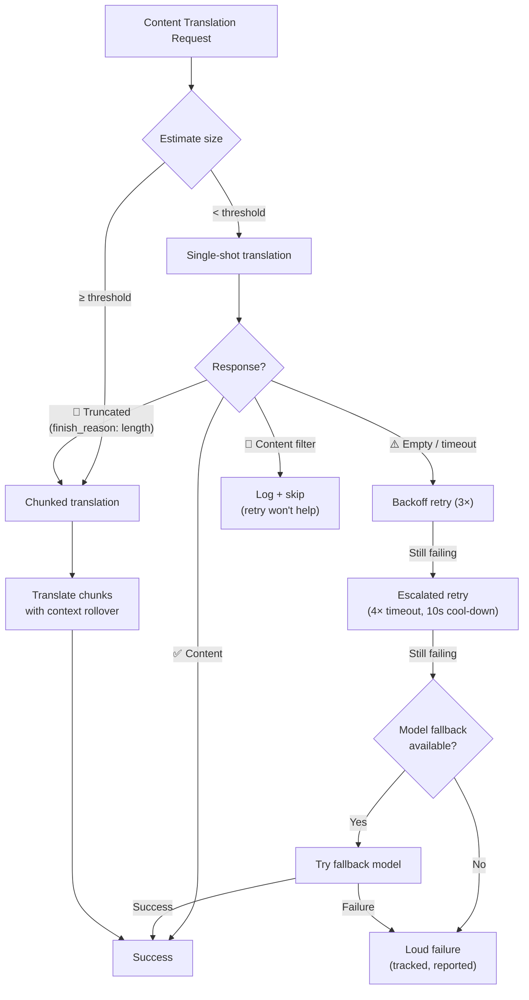

# コンテンツ翻訳のレジリエンス

Champollionのコンテンツ翻訳パイプライン（Markdown/MDXドキュメント）は、多層的なレジリエンス（耐障害）システムを採用してエラーを適切に処理します。各バッチが小さく再試行のコストが低いキー・バリュー翻訳とは異なり、コンテンツ翻訳ではプロンプトが大きく出力が長くなるため、一時的な理由だけでなく構造的な理由による失敗も発生し得ます。

## 課題

コンテンツ翻訳には、キー・バリュー翻訳とは根本的に異なる失敗モードが存在します。

| 失敗モード | キー・バリュー | コンテンツ |
|---|---|---|
| レート制限 (429) | 頻発、一時的 | 頻発、一時的 |
| タイムアウト | まれ（小さなバッチ） | 頻発（長い出力） |
| 空のレスポンス | まれ | 頻発（出力制限、フィルター） |
| 出力の切り詰め（Truncation） | 該当なし（JSON検証済み） | 暗黙的に発生 |
| コンテンツフィルター | 極めてまれ | 発生し得る（CLIドキュメント、セキュリティ関連など） |
| モデルの制限 | 再試行で解消 | 再試行しても解消しない |

重要な知見は、**失敗した同じリクエストを再試行し続けるのは冗長性ではなく、単なる頑固さにすぎない**ということです。適切なレジリエンスシステムは、*なぜ*失敗したのかを特定し、それに応じてアプローチを変更します。

## アーキテクチャの概要


```mermaid
flowchart TD
    A["Content Translation Request"] --> B{"Estimate size"}
    B -->|"< threshold"| C["Single-shot translation"]
    B -->|"≥ threshold"| D["Chunked translation"]
    C --> E{"Response?"}
    E -->|"✅ Content"| F["Success"]
    E -->|"⚠️ Empty / timeout"| G["Backoff retry (3×)"]
    E -->|"🔶 Truncated\n(finish_reason: length)"| D
    E -->|"🔴 Content filter"| H["Log + skip\n(retry won't help)"]
    G -->|"Still failing"| I["Escalated retry\n(4× timeout, 10s cool-down)"]
    I -->|"Still failing"| J{"Model fallback\navailable?"}
    J -->|"Yes"| K["Try fallback model"]
    J -->|"No"| L["Loud failure\n(tracked, reported)"]
    K -->|"Success"| F
    K -->|"Failure"| L
    D --> M["Translate chunks\nwith context rollover"]
    M --> F
```

## レイヤー 1: 診断優先の再試行

システムは、*どのように*再試行するかを決定する前に、APIレスポンスを検査して*何が*失敗したのかを把握します。

### 終了理由（Finish Reason）の分析

LLM APIはすべて、生成されたテキストとともに`finish_reason`を返します。Champollionはこれを利用して、インテリジェントな再試行の判断を下します。

| `finish_reason` | 意味 | アクション |
|---|---|---|
| `stop` + コンテンツ | モデルが正常に完了 | ✅ 結果を受け入れる |
| `stop` + 空 | モデルが何も生成しなかった | ⚠️ 同じリクエストを再試行（一時的エラー） |
| `length` | 出力がトークン制限に達した | 🔶 ドキュメントを自動チャンク分割 |
| `content_filter` | セーフティフィルターが出力をブロックした | 🔴 ログに記録してスキップ（再試行しても無効） |
| `null` / 不足 | 不正な形式のレスポンス | ⚠️ 同じリクエストを再試行（一時的エラー） |

これにより、すべての失敗を一律に扱ってバックオフ再試行を行う従来のアプローチが置き換えられます。

### 再試行バジェット

一時的な失敗に対する標準の再試行バジェットは以下のとおりです。

| ラウンド | 試行回数 | タイムアウト | バックオフ |
|---|---|---|---|
| スタンダード | 4 (0→3) | 60秒 | 1秒 → 2秒 → 4秒 |
| エスカレーション | 4 (0→3) | 120秒 | 1秒 → 2秒 → 4秒 |
| **合計** | **8** | — | **最悪の場合 約3.5分** |

ラウンド間には10秒間のクールダウンが設けられており、一時的な問題が解決するのを待ちます。

## レイヤー 2: コンテンツのチャンク分割

ドキュメントがサイズのしきい値を超えた場合、またはレイヤー 1で出力の切り詰めが検知された場合、システムはドキュメントを翻訳に適したサイズのチャンクに分割します。

チャンク分割の詳細な設定については、[コンテキストのロールオーバー](/docs/concepts/context-rollover#content-chunking)を参照してください。主なポイントは以下のとおりです。

### 分割ストラテジー

1. **見出しの境界** — `##`および`###`は、自然な翻訳単位の境界となります。各セクションは独立して翻訳できる十分な自己完結性を持っています。
2. **段落フォールバック** — 単一の見出しセクションがチャンクサイズを超える場合は、連続する改行コード（空行）で分割します。
3. **強制分割** — 非常に長い段落（表など）に対する最後の手段です。文の境界で分割します。

### チャンク間のコンテキスト

各チャンクには、*前のチャンクの翻訳*の最後の2〜3段落がコンテキストとして渡されます。これにより、以下の問題を防ぎます。
- **用語の揺らぎ** — 前のチャンクで「tableau de bord」をどのように訳したかをモデルが把握できる
- **代名詞の解決** — 前のセクションの先行詞を引き継ぐことができる
- **文体（レジスター）の一貫性** — チャンク1で確立されたトーンがチャンクNまで維持される

### 自動チャンキングのトリガー

| トリガー | 動作 |
|---|---|
| 設定で`contentChunkSize`が指定されている | そのサイズを超えるドキュメントを常にチャンク分割 |
| `finish_reason: "length"`が返された | フォールバックとして自動チャンク分割（設定がない場合でも実行） |
| 入力 > 約12KB（自動検出） | 推奨事項をログに出力するが、強制はしない |

## レイヤー 3: モデルフォールバックチェーン

設定されたモデルが一時的ではなく構造的な原因で一貫して失敗する場合、システムは代替モデルを試します。モデルによって、コンテキストウィンドウ、出力制限、セーフティフィルター、多言語処理の得意分野が異なります。

### デフォルトのフォールバックチェーン

```json title="champollion.config.json"
{
  "contentFallbackChain": [
    "google/gemini-3.8-flash",
    "anthropic/claude-sonnet-4"
  ]
}
```

常に設定されたモデルが最初に試行されます。フォールバックモデルは、すべての再試行ラウンド（スタンダード＋エスカレーション）を使い果たした後にのみ使用されます。

### 複数のアーキテクチャを採用する理由

| シナリオ | プライマリモデルが失敗 | フォールバックモデルが成功 |
|---|---|---|
| ベトナム語のCLIドキュメント | Geminiが空を返す | Claudeが問題なく処理 |
| セーフティフィルターに該当するコンテンツ | OpenAIがブロック | Geminiはフィルターのしきい値が異なる |
| 長大な構造化テーブル | モデルAが出力を切り詰める | モデルBはより大きな出力ウィンドウを持つ |

フォールバックの価値はアーキテクチャの多様性にあります。異なるモデルファミリーは異なる失敗モードを持っています。あるモデルにとって構造的な失敗であっても、別のモデルにとっては些細な問題である場合があります。

### 適用範囲

> モデルのフォールバックは**コンテンツ翻訳専用**です。キー・バリューのバッチは小さく、構造的に失敗することはほとんどありません。そこにフォールバックの複雑さを導入することはオーバーエンジニアリングになります。

## レイヤー 4: 失敗のアカウンティング

実際に失敗が発生した場合、システムは黙って続行するのではなく、適切に追跡して報告します。

### sync 実行中の動作

- 失敗した項目には、進捗出力に`[FAIL]`が表示されます
- 各失敗の具体的な理由（タイムアウト、空のレスポンス、コンテンツフィルター、切り詰め）がログに記録されます
- 完了した項目はマニフェストに即座に保存されます（増分永続化）

### 同期完了後

最後に失敗のサマリーが出力されます。

```
  ┌─ Content Translation Failures ─────────────────────────────────────┐
  │                                                                     │
  │  2 of 24 content translations failed:                              │
  │                                                                     │
  │  ✗ docs/reference/cli.md → vi                                      │
  │    Reason: empty response after 8 attempts + 1 fallback model      │
  │    Models tried: google/gemini-3.1-pro-preview, gemini-3.8-flash   │
  │                                                                     │
  │  ✗ docs/guides/troubleshooting.md → ar                             │
  │    Reason: content_filter (no retry — blocked by safety filter)    │
  │                                                                     │
  │  Re-run: npx champollion@latest sync                              │
  │  (22 completed translations are cached and won't re-run)           │
  └─────────────────────────────────────────────────────────────────────┘
```

### 再試行マニフェスト

失敗したファイルは`.champollion-retry.json`に書き込まれます。

```json
{
  "failedAt": "2026-05-27T21:45:00Z",
  "files": [
    {
      "source": "docs/reference/cli.md",
      "locale": "vi",
      "reason": "empty_response",
      "attempts": 8,
      "modelsTried": ["google/gemini-3.1-pro-preview", "google/gemini-3.8-flash"]
    }
  ]
}
```

次回の`sync`実行時には、これらのファイルのみが再処理されます。完了したファイルはコンテンツハッシュマニフェスト（`.champollion-content.lock`）によって保護されます。

### 終了コード

| コード | 意味 |
|---|---|
| 0 | すべての翻訳が成功 |
| 1 | 設定エラー、APIキーの不足など |
| 2 | 部分的な失敗 — 一部のコンテンツ翻訳が失敗 |

## 設定

```json title="champollion.config.json"
{
  "contentChunkSize": 4000,
  "contentOverlap": 200,
  "contentFallbackChain": [
    "google/gemini-3.8-flash",
    "anthropic/claude-sonnet-4"
  ]
}
```

| フィールド | 型 | デフォルト | 説明 |
|---|---|---|---|
| `contentChunkSize` | `number \| null` | `null` | コンテンツチャンクあたりの最大トークン数。`null` = チャンク分割なし（切り詰め発生時のみ自動チャンク分割） |
| `contentOverlap` | `number` | `200` | コンテキストの連続性を維持するためのコンテンツチャンク間の重複トークン数 |
| `contentFallbackChain` | `string[]` | `[]` | 設定されたモデルが構造的に失敗した際に試行するフォールバックモデル |

## 実装状況

| 機能 | ステータス |
|---|---|
| 診断優先の再試行（finish_reasonの解析） | 🔲 計画中 |
| コンテンツのチャンク分割（見出し／段落分割） | 🔲 計画中 |
| チャンク間のコンテキストロールオーバー | 🔲 計画中 |
| モデルフォールバックチェーン | 🔲 計画中 |
| 失敗サマリーレポート | 🔲 計画中 |
| 再試行マニフェスト (.champollion-retry.json) | 🔲 計画中 |
| 部分的な失敗に対する終了コード 2 | 🔲 計画中 |
| エスカレーション再試行（タイムアウト延長） | ✅ 実装済み (v3.3.3) |
| 試行回数番号付きの再試行メッセージ | ✅ 実装済み (v3.3.3) |
| コンテンツエラー時の明確な失敗通知 | ✅ 実装済み (v3.3.3) |

## 関連項目

- [コンテキストのロールオーバー](/docs/concepts/context-rollover) — バッチ処理の一貫性とコンテンツのチャンク分割設定
- [同期の仕組み](/docs/concepts/how-sync-works) — 同期パイプラインの全体像
- [翻訳方式](/docs/guides/translation-methods) — 利用可能な方式とその特性
