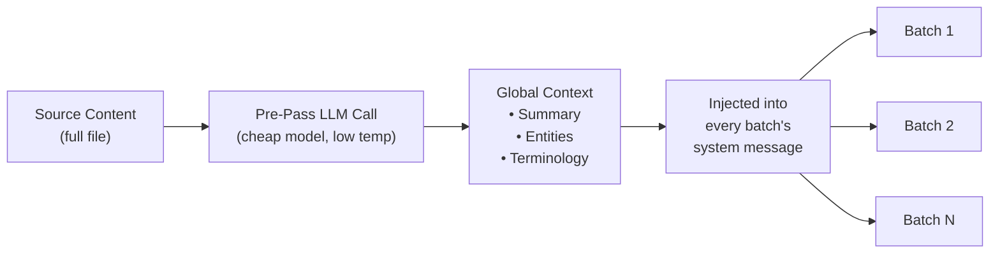

# コンテキストロールオーバーバッチ処理

コンテキストロールオーバーは、ドキュメントレベルの翻訳一貫性機能です。直前の翻訳のウィンドウを後続のバッチに引き継ぐことで、バッチ境界をまたいだ LLM の「短期記憶」を実現します。

## なぜこの機能が必要か

大きなファイル（100 件以上のキー、または長い Markdown ドキュメント）を翻訳する際、champollion は作業をバッチに分割します。ロールオーバーがない場合、各バッチは独立して翻訳されるため、LLM は前のバッチで翻訳した内容を記憶していません。これにより以下の問題が生じます。

- **用語のずれ**: 同じ英語の用語がバッチをまたいで異なる訳語になる（例：「dashboard」→ バッチ 1 では「tableau de bord」、バッチ 3 では「panneau」）
- **照応の失敗**: バッチ境界をまたぐ代名詞や参照が先行詞を失う
- **文体の不統一**: バッチ間でトーンが変化する（丁寧体 → 普通体 → 丁寧体）

これは機械翻訳の研究文献でよく知られた問題です。スライディングウィンドウアプローチは、ドキュメントレベルの機械翻訳に関する研究（ACL、WMT ワークショップ）によって有効性が検証されています。

## 仕組み

### スライディングウィンドウ

`contextRollover` が有効な場合、翻訳パイプラインは最近翻訳されたキーと値のペアのウィンドウを保持します。各バッチが完了すると、その出力の一部（デフォルト: `batchSize` の 20%）が「参照翻訳」として次のバッチのプロンプトに引き継がれます。

```
Batch 1: Translate keys 1-80         → LLM sees: system prompt + keys 1-80
Batch 2: Translate keys 81-160       → LLM sees: system prompt + [16 reference translations from batch 1] + keys 81-160
Batch 3: Translate keys 161-240      → LLM sees: system prompt + [16 reference translations from batch 2] + keys 161-240
```

参照翻訳は、明確なラベルとともにユーザーメッセージに挿入されます。

```
--- Previous translations for context (do NOT re-translate these) ---
"nav.dashboard": "Tableau de bord"
"nav.settings": "Paramètres"
"header.welcome": "Bienvenue sur la plateforme"
---

{
  "content.main_heading": "Getting Started with Your Dashboard",
  ...
}
```

### 選択ストラテジー

引き継ぐ翻訳を選ぶモードは 2 種類あります。

| ストラテジー | 動作 | 最適な用途 |
|----------|----------|----------|
| `tail`（デフォルト） | 前のバッチから最後の N 件の翻訳を使用 | 連続したドキュメント、Markdown コンテンツ |
| `diverse` | 異なるキータイプ（ボタン、見出し、説明文）をカバーするエントリを選択 | UI 要素が混在する大きな JSON ファイル |

### トークンバジェット

ロールオーバーウィンドウは入力トークンを消費します。Champollion はおおよそのトークンコストを計算し、ウィンドウがモデルの推定コンテキストウィンドウの 15% を超える場合に警告を表示します。警告には削減の提案が含まれます。

```
[WARN] Rollover window is ~2400 tokens (18% of model context).
       Consider reducing rolloverSize to 0.15 or lowering batchSize.
```

## グローバルコンテキストプレパス

翻訳開始**前**に実行されるオプションの初回 LLM 呼び出しです。LLM がソースコンテンツ全体を分析し、以下を生成します。

1. **ドキュメントサマリー** — 翻訳対象の内容を 2〜3 文で説明
2. **固有表現** — 製品名、技術用語、固有名詞と推奨される処理方法
3. **用語一貫性リスト** — LLM が一貫した翻訳を必要と判断した主要な用語

このグローバルコンテキストは、すべてのバッチの**システムメッセージ**に挿入されます。これにより、各バッチはドキュメントの一部しか参照していなくても、ドキュメント全体を把握した状態で翻訳できます。



### プレパスモデル

グローバルコンテキストの抽出には、別途安価な LLM 呼び出しを使用します（デフォルト: `google/gemini-3.5-flash`、temperature 0.1）。ユーザーが設定した翻訳モデルとは無関係です。これはメタデータ抽出タスクであり、翻訳タスクではないため、創造的な出力よりも速度とコストが重要です。

## コンテンツチャンキング {#content-chunking}

長い Markdown ドキュメント（コンテンツ翻訳）の場合、本文が LLM の有効なコンテキストウィンドウを超えたり、モデルが出力を途中で切り捨てたりすることがあります。コンテンツチャンキングは、ドキュメントを重複部分を持つセグメントに分割し、それぞれを独立して翻訳した後に再結合します。

### 分割ストラテジー

チャンキングは優先度のカスケードに従います。最も意味的に適切な分割点から順に試みます。

1. **見出し境界** — `##` および `###` マーカーが自然な翻訳単位を作ります。各セクションは独立した翻訳に十分な自己完結性を持ち、見出しは LLM に翻訳対象の構造的なコンテキストを提供します。
2. **段落境界** — 単一の見出しセクションがチャンクサイズを超える場合、二重改行（`\n\n`）で分割します。段落は完結した考えを表すため、次に適した境界です。
3. **文境界** — 非常に長い段落（大きなテーブル、密度の高い文章など）の最終手段です。略語を考慮しながら、ピリオドとスペースの境界で分割します。

保護されたブロック（コードフェンス、ショートコード — [同期の仕組み](/docs/concepts/how-sync-works)を参照）はチャンクをまたいで分割されません。保護されたブロックが切断される場合、分割点はその前後に移動します。

### 自動チャンキングのトリガー

チャンキングは 2 つの方法で有効になります。

| トリガー | 動作 |
|---------|----------|
| `contentChunkSize` がコンフィグに設定されている | そのトークン数を超えるすべてのドキュメントを事前にチャンク化 |
| モデルが `finish_reason: "length"` を返す | コンフィグがなくてもフォールバックとして自動チャンク化 |

フォールバックトリガーにより、設定しなくてもチャンキングがセーフティネットとして機能します。モデルが出力を切り捨てた場合、champollion は自動的にチャンクで再試行します。

### 設定

- **`contentChunkSize`**: チャンクあたりの最大トークン数（デフォルト: null = 本文全体を送信。長いドキュメントには例えば 4000 を設定）
- **`contentOverlap`**: チャンク間の重複トークン数（デフォルト: 200）。重複により、チャンク境界でのスムーズな接続が確保されます。

チャンキングが有効な場合、コンテキストロールオーバーはチャンク間に自動的に適用されます。前のチャンクの最後の段落の翻訳出力が、次のチャンクのプロンプトの先頭に追加されます。

```json title="champollion.config.json"
{
  "contentChunkSize": 4000,
  "contentOverlap": 200
}
```

> コンテンツ翻訳の完全なレジリエンスシステム（診断リトライ、モデルフォールバック、失敗の記録）については、[コンテンツレジリエンス](/docs/concepts/content-resilience)を参照してください。

## 設定

### クイックスタート

```json title="champollion.config.json"
{
  "contextRollover": true,
  "globalContext": true,
  "contentChunkSize": 4000,
  "contentOverlap": 200
}
```

### 全オプション

```json title="champollion.config.json (advanced)"
{
  "contextRollover": {
    "size": 0.2,
    "strategy": "tail",
    "maxTokens": null
  },
  "globalContext": {
    "model": "google/gemini-3.5-flash",
    "maxEntities": 20,
    "temperature": 0.1
  },
  "contentChunkSize": 4000,
  "contentOverlap": 200,
  "contentFallbackChain": [
    "google/gemini-2.5-flash",
    "anthropic/claude-sonnet-4"
  ]
}
```

| フィールド | 型 | デフォルト | 説明 |
|-------|------|---------|-------------|
| `contextRollover` | `boolean \| object` | `false` | スライディングウィンドウロールオーバーを有効にする |
| `contextRollover.size` | `number` | `0.2` | `batchSize` のうち引き継ぐ割合（0.0〜1.0） |
| `contextRollover.strategy` | `string` | `"tail"` | 選択ストラテジー: `"tail"` または `"diverse"` |
| `contextRollover.maxTokens` | `number \| null` | `null` | ロールオーバートークンバジェットの上限 |
| `globalContext` | `boolean \| object` | `false` | グローバルコンテキストプレパスを有効にする |
| `globalContext.model` | `string` | `"google/gemini-3.5-flash"` | プレパス呼び出しに使用するモデル |
| `globalContext.maxEntities` | `number` | `20` | 抽出する固有表現の最大数 |
| `globalContext.temperature` | `number` | `0.1` | プレパス呼び出しの temperature |
| `contentChunkSize` | `number \| null` | `null` | コンテンツチャンクあたりの最大トークン数（null = チャンキングなし） |
| `contentOverlap` | `number` | `200` | コンテンツチャンク間の重複トークン数 |
| `contentFallbackChain` | `string[]` | `[]` | 設定モデルが構造的に失敗した場合のコンテンツ翻訳フォールバックモデル |

## 使用すべき場面

| シナリオ | 推奨 |
|----------|---------------|
| 小さな JSON ファイル（50 キー未満） | 不要 — 単一バッチのため境界の問題なし |
| 大きな JSON ファイル（100 キー以上） | 用語の一貫性のために `contextRollover` を有効にする |
| 長い Markdown ドキュメント | `contextRollover` + `contentChunkSize` + `globalContext` を有効にする |
| 技術ドキュメント | 固有表現抽出のために `globalContext` を有効にする |
| 文体が混在する UI 文字列 | `strategy: "diverse"` と組み合わせて `contextRollover` を使用する |

## 実装状況

| 機能 | 状況 |
|---------|--------|
| スライディングウィンドウロールオーバー（キーと値） | 🔲 計画中 |
| スライディングウィンドウロールオーバー（コンテンツ） | 🔲 計画中 |
| グローバルコンテキストプレパス | 🔲 計画中 |
| コンテンツチャンキング | 🔲 計画中 |
| 切り捨て時の自動チャンキング | 🔲 計画中 |
| `diverse` 選択ストラテジー | 🔲 計画中 |

## 参考文献

この機能は、ドキュメントレベルの機械翻訳に関する公開研究に基づいています。

- **スライディングウィンドウアプローチ**: LLM を使用した翻訳において BLEU、chrF、COMET スコアを向上させる効果が検証されています（ACL 2023〜2025 ドキュメントレベル MT ワークショップ）
- **マルチナレッジフュージョン**: ドキュメントサマリーと固有表現リストをグローバルコンテキストとして注入することで、長いドキュメント全体の用語一貫性が向上します
- **コンテキストアウェアプロンプティング（CAP）**: アテンションスコアや意味的類似度によって関連コンテキストを選択し、インコンテキスト学習に活用します

## 関連情報

- [コンテンツレジリエンス](/docs/concepts/content-resilience) — 診断リトライ、モデルフォールバック、失敗の記録
- [同期の仕組み](/docs/concepts/how-sync-works) — ロールオーバーが拡張するバッチパイプライン
- [コーチングデータ](/docs/concepts/coaching-data) — 文法・辞書注入の補完機能
- [翻訳メモリ](/docs/concepts/translation-memory) — ロールオーバーと連携する TM キャッシュ
