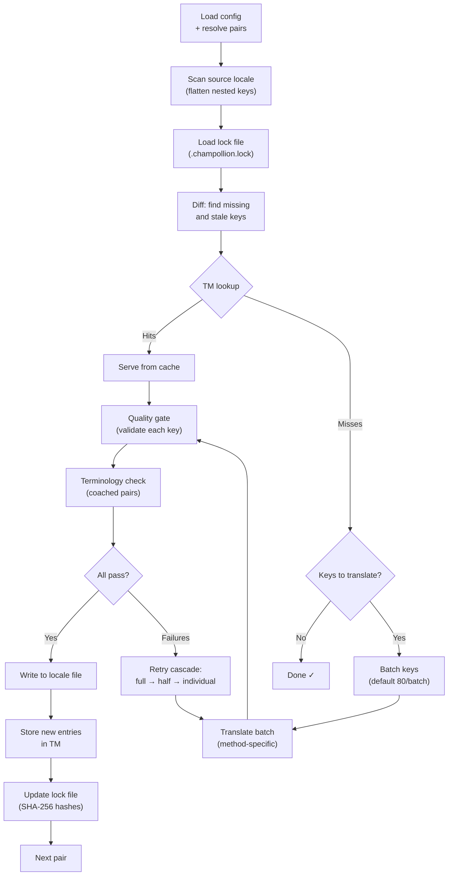

# 同期の仕組み

`sync` コマンドは Champollion のコア操作です。`npx champollion sync` を実行したときに何が起こるかを説明します。

## パイプラインの概要



## ステップごとの説明

### 1. 設定の解決

Champollion は `champollion.config.json` を読み込みます（または設定を自動検出します）。以下を解決します：
- ソースロケールとターゲットロケール
- ペアグラフ（処理するソース→ターゲットの組み合わせ）
- ペアごとのメソッド、モデル、品質設定

ファイルのスキャン前に、Champollion は起動ヘッダーを表示します：

```
champollion v0.1.0

[INFO] Detected format: json (auto)
[INFO] Detected framework: Hugo
```

- **バージョンバナー**: デバッグおよび問題報告のためにインストール済みバージョンを表示します。
- **フォーマット検出**: ファイルフォーマットと、自動検出されたか `(auto)` 明示的に設定されたか `(config)` を報告します。`json`、`toml`、`yaml` をサポートしています。
- **フレームワーク検出**: `contentDir` が設定されている場合、フレームワーク（`Hugo`）を識別し、コンテンツ同期が有効であることを確認します。

### 2. ソースのスキャン

ソースロケールファイルが読み込まれ、キー→値のマップにフラット化されます：

```json
// Input (nested)
{ "hero": { "title": "Welcome", "subtitle": "Build" } }

// Flattened
{ "hero.title": "Welcome", "hero.subtitle": "Build" }
```

### 3. 変更検出

Champollion は `.champollion.lock` を読み込みます。これは以前に翻訳されたソース値の SHA-256 ハッシュを保存しています。各キーについて、以下を確認します：

| 条件 | アクション |
|-----------|--------|
| キーがターゲットに存在しない | **翻訳** |
| 前回の同期以降にソースハッシュが変更された | **再翻訳**（古い） |
| ターゲット値が `[EN]` で始まる | **再翻訳**（レガシーフォールバックマーカー） |
| ソースハッシュが変更されておらず、キーが存在する | **スキップ** |

これが Champollion が変更されたものだけを翻訳する理由です — 同期のたびにファイル全体を再翻訳するわけではありません。

### 4. バッチ処理

キーはバッチにグループ化されます（デフォルト: LLM は 80 キー/バッチ、Google Translate は 128）。バッチ処理により、プロンプトを管理しやすい状態に保ちながら API のラウンドトリップを削減します。

翻訳中、Champollion は各バッチ完了後に更新されるインラインプログレスバーを表示します：

```
[INFO] fr.json — 2,847 missing
     ████████████████░░░░░░░░░░░░░░░░ 1,440/2,847 keys
```

バーは `\r` キャリッジリターンを使用してインプレース更新でレンダリングされます — スクロールしません。`--quiet` および `--json` モードでは非表示になります。

### 4b. 翻訳メモリ

バッチ処理の前に、Champollion は翻訳メモリキャッシュ（`.champollion/tm.json`）を確認します。ソーステキスト＋ロケール＋メソッドが以前の翻訳と一致するキーは、キャッシュから即座に提供されます — API 呼び出しは不要です。

```
  [TM] 142 key(s) served from cache
  Translating 3 key(s) to French (llm)... [OK]
```

翻訳メモリはコスト削減の主要なメカニズムです。1 つのキーを変更した後に同期を再実行しても、ファイル全体ではなくそのキーだけが翻訳されます。詳細は[翻訳メモリ](/docs/concepts/translation-memory)を参照してください。

1 回の実行でキャッシュをバイパスするには: `champollion sync --no-tm`

### 5. 翻訳

各バッチは設定された翻訳メソッドに送信されます：

- **`llm`**: レジスターおよびジェンダーガイダンス指示を含む OpenRouter への構造化プロンプト
- **`llm-coached`**: 同様ですが、文法ルール、辞書、スタイルノートが注入されます
- **`google-translate`**: Google Cloud Translation API v2 バッチリクエスト
- **`api`**: リモートエンドポイントへの HTTP POST

システムメッセージ（レジスター、ジェンダーガイダンス、ルール）は特定のロケールのバッチ間で同一であり、**プロンプトキャッシング**が可能になります — Anthropic や Google などのプロバイダーは繰り返されるシステムメッセージをキャッシュし、トークンコストを削減します。

### 6. 品質ゲート

すべての翻訳はディスクに書き込まれる前に検証されます。5 つのチェックが実行されます：

| チェック | 検出内容 | 例 |
|-------|----------------|---------|
| **空白/ブランク** | モデルが何も返さなかった | `""` |
| **ソースエコー** | モデルが英語の入力をそのまま返した | 日本語に対して `"Welcome"` |
| **ハルシネーションループ** | トライグラムの繰り返し | `"Qo' Qo' Qo' Qo'"` |
| **長さの膨張** | 出力がソースより 4 倍以上長い | 10 文字のソース → 50 文字の出力 |
| **スクリプト準拠** | ロケールに対して誤ったスクリプト | アラビア語ロケールにラテン文字テキスト |

失敗は `[GATE]` プレフィックスとともにログに記録されます。サイレントフォールバックはありません。

詳細は[品質ゲート](/docs/concepts/quality-gate)を参照してください。

### 6b. 用語検証

辞書を持つコーチ付きペアの場合、Champollion は翻訳後に LLM が実際に必要な用語を使用したかどうかを確認します。違反は `[TERM]` 警告としてログに記録されます：

```
[TERM] en→fr: 2 term violation(s)
  • "dashboard" → expected "tableau de bord" but got "panneau"
```

これらは警告であり、ブロッキングエラーではありません — 翻訳は引き続き書き込まれます。

### 7. リトライカスケード

JSON パース失敗またはバッチレベルのエラーが発生した場合、Champollion は段階的に小さなバッチでリトライします：

```
Full batch (80 keys) → Failed
  └→ Half batch (40 keys) → 1 failure
      └→ Individual keys (1 each) → Isolates the problem key
```

リトライの上限は `maxRetries`（デフォルト: 3）によって制限され、トークン消費の暴走を防ぎます。

### 8. 書き込みとロック

検証に合格した翻訳はターゲットロケールファイルに書き込まれ、元のネスト構造が保持されます。ロックファイルは新しい SHA-256 ハッシュで更新されます。

### 9. 検証

すべてのペアが処理された後、Champollion はディスクから書き込まれたロケールファイルを再読み込みし、検証パスを実行します（`--no-verify` が設定されていない限り）。これにより、同期が成功を報告したにもかかわらず実際にはキーが誤っているというギャップを検出します：

- **キーの一致** — すべてのソースキーが各ターゲットに存在する
- **`[EN]` フォールバックマーカー** — 以前の実行からのレガシーマーカー
- **空の翻訳** — すり抜けた空白の値
- **スクリプト準拠** — ASCII のみの翻訳を持つ非ラテン文字ロケール
- **プレースホルダーの保持** — ICU プレースホルダーがソースと一致する
- **エンコーディングの問題** — BOM マーカー、不可視文字

これは CI ゲート用のスタンドアロン `champollion verify` コマンドとしても利用できます。

## コンテンツ翻訳（フェーズ 2）

Docusaurus および Hugo プロジェクトの場合、`sync` は JSON キー翻訳の後に第 2 フェーズを実行します。このフェーズでは、同じメソッドと品質ゲートを使用して Markdown および MDX ファイル（ドキュメント、ブログ投稿、チュートリアル）を翻訳します。

### 仕組み

1. Champollion はコンテンツ/ドキュメントディレクトリを走査して、すべてのソースコンテンツファイル（`.md`、`.mdx`）を検出します
2. ファイル×ロケールのペアごとに、SHA-256 ハッシュの変更を確認するために別のコンテンツロックファイル（`.champollion-content.lock`）を確認します
3. 変更されたファイルまたは存在しないファイルはフラットな作業アイテムプールに収集されます
4. プールは**並列並行処理**（デフォルト: 12 件の同時 API 呼び出し）で処理されます

```
Phase 2: content (79 translations to process, 341 skipped, concurrency: 48)

    [1/79] (1%)  docs/concepts/security.md → ja [RE-TRANSLATE] (~3328s left)
    [2/79] (3%)  docs/concepts/security.md → th [RE-TRANSLATE] (~1821s left)
    ...
    [79/79] (100%) blog/v3-2-quality.md → de [OK]

  [OK] Created 79 content file(s), 341 unchanged
```

### 並列処理

フェーズ 1（JSON キー）とフェーズ 2（コンテンツ）の両方が並列で実行されるようになりました：

- **フェーズ 1**: すべてのロケール翻訳が同時に実行されます（デフォルト: 50 件の同時ロケール）。各ロケール内では、API バッチも並列で実行されます（4 件の同時バッチ）。120 キーを持つ 12 ロケールの同期は、約 15 分ではなく約 1 分で完了します。
- **フェーズ 2**: すべてのファイル×ロケールの組み合わせがフラットプールとして翻訳されます（デフォルト: 12 件の同時 API 呼び出し）。異なるファイルと異なるロケールが同時に翻訳されます。

並列処理は `--json-concurrency`、`--content-concurrency`、または `--concurrency`（両方を設定）で制御します：

```bash
# Faster JSON sync (more parallel locale translations)
npx champollion sync --json-concurrency 30

# Faster content sync (more parallel API calls)
npx champollion sync --content-concurrency 20

# Slower (gentler on rate limits)
npx champollion sync --concurrency 4
```

### コンテンツの保護

翻訳中、Champollion は翻訳不要なコンテンツを保護します：

- **コードブロック**（フェンスおよびインデント）はプレースホルダーに置き換えられます
- `translatableFields` リストにない**フロントマター**フィールドはそのまま保持されます
- **リンク**、画像パス、HTML タグは保護されます
- **ショートコード**および補間変数（例: `{count}`、`{{.Params.title}}`）はシールドされます

翻訳後、すべてのプレースホルダーが復元され検証されます。欠落または破損している場合、翻訳は拒否されリトライされます。

## 部分的な成功

1 つのバッチが失敗しても、残りはブロックされません。10 バッチ中 9 バッチが成功した場合、その 9 バッチは書き込まれます。失敗したバッチはログに記録され、`sync` を再実行してリトライできます。

## ドライラン

ファイルを書き込まずに変更内容をプレビューします：

```bash
npx champollion sync --dry-run
```

## 強制再翻訳

変更がなくても特定のキーを強制的に再翻訳します：

```bash
npx champollion sync --force-keys "hero.title,nav.about"
```

## コスト見積もり

翻訳前に、Champollion はペアごとの推定コストを示す**事前同期コストレポート**を生成します。これはすべての `sync` 実行時に自動的に実行されます — API 呼び出しが行われる前に確認できます。

```
╔══════════════════════════════════════════════════════════╗
║  Cost Estimate                                          ║
╠════════════╦═══════╦════════════╦════════════════════════╣
║ Pair       ║ Keys  ║ Est. Cost  ║ Method                 ║
╠════════════╬═══════╬════════════╬════════════════════════╣
║ en → fr    ║   142 ║ $0.07      ║ google-translate       ║
║ en → ja    ║    38 ║   —        ║ llm (model-dependent)  ║
║ en → crk   ║    38 ║   —        ║ llm-coached            ║
╚════════════╩═══════╩════════════╩════════════════════════╝
```

### 見積もりの対象

各翻訳メソッドは独自のコスト見積もりを提供します：

| メソッド | コストの根拠 | 精度 |
|--------|-----------|-----------|
| `google-translate` | Google の公開レート（$20/100 万文字） | 正確 |
| `llm` | OpenRouter モデルによって異なる | モデル依存 — [OpenRouter の料金](https://openrouter.ai/models)を確認してください |
| `llm-coached` | `llm` と同様にコーチングコンテキストトークンを加算 | モデル依存 |
| `api` | サーバー側で決定 | 不明 — エンドポイントに問い合わせなければ見積もり不可 |

メソッドがコストを判断できない場合（LLM メソッド、リモート API）、Champollion は推測するのではなく `—` を報告します。実際に翻訳せずにコスト見積もりを確認するには `--dry` を使用してください。

---

## 関連情報

- [CLI リファレンス — sync](/docs/reference/cli#sync) — コマンドフラグとオプション
- [翻訳メモリ](/docs/concepts/translation-memory) — キャッシングとコスト削減
- [品質ゲート](/docs/concepts/quality-gate) — 翻訳の検証方法
- [翻訳メソッド](/docs/guides/translation-methods) — 各メソッドの仕組み
- [プロの翻訳者との連携](/docs/guides/professional-translators) — XLIFF ワークフロー
- [設定](/docs/getting-started/configuration) — 設定リファレンス
- [CI/CD ガイド](/docs/guides/ci-cd) — パイプラインでの同期の自動化
