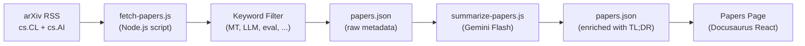

# 研究論文フィード

Champollion は、arXiv から機械翻訳および NLP に関する研究論文をキュレーションしたフィードを管理しています。論文は日次で取得・フィルタリングされ、AI による要約を経てウェブサイトに公開される、半自動化されたフィードです。実務者向けに厳選されています。

## 存在する理由

champollion の翻訳パイプラインは、公開された研究の技術を基盤としています — レジスター誘導プロンプティング、コーチングデータの注入、コンテキストロールオーバー、品質ゲートなどです。Papers フィードには三つの目的があります：

1. **透明性**：各機能を裏付ける研究をユーザーが確認できます
2. **発見**：arXiv に公開された新しい技術が、将来の機能やユーザー設定に活かされる可能性があります
3. **コミュニティ**：champollion を単なる API ラッパーではなく、研究に基づいたツールとして位置づけます

## アーキテクチャ



### パイプラインのステップ

#### 1. 取得（日次）

`scripts/fetch-papers.js` は、以下のカテゴリの最新論文を arXiv Atom API に問い合わせます：
- `cs.CL`（計算と言語）
- `cs.AI`（人工知能）

返却される情報：タイトル、著者、アブストラクト、arXiv ID、PDF リンク、公開日、カテゴリ。

#### 2. フィルタリング

論文はキーワードの関連性によってフィルタリングされます。少なくとも一つのプライマリキーワードに一致する必要があります：

**プライマリキーワード**（1つ以上に一致すること）：
- `machine translation`、`neural machine translation`、`NMT`
- `LLM`、`large language model`
- `multilingual`、`cross-lingual`
- `document-level translation`
- `low-resource language`、`endangered language`
- `translation evaluation`、`BLEU`、`COMET`、`chrF`
- `tokenization`、`morphology`、`polysynthetic`
- `context window`、`sliding window`
- `prompt engineering`（翻訳の文脈において）

**ブーストキーワード**（関連性スコアを引き上げる）：
- `i18n`、`internationalization`、`localization`
- `few-shot`、`in-context learning`
- `terminology`、`glossary`、`consistency`
- `quality estimation`、`hallucination`

#### 3. 要約（AI アシスト）

`scripts/summarize-papers.js` は未要約の新しい論文を処理します：

各論文について、以下の内容でアブストラクトを Gemini 3.5 Flash に送信します：
```
Read this ML research abstract and produce:
1. A 2-sentence TL;DR accessible to a software developer (not a researcher)
2. A single bullet: "Why this matters for MT" — how could this technique
   improve machine translation quality, cost, or speed in production?

Abstract: {abstract}
```

出力は生のメタデータとともに `papers.json` に保存されます。

#### 4. 公開

Docusaurus の Papers ページ（`website/src/pages/papers.js`）は、`papers.json` をフィルタリングおよびページネーション可能なカードグリッドとして表示します。

各カードに表示される情報：
- **タイトル**（arXiv へのリンク付き）
- **著者**（最初の3名 + "et al."）
- **日付**（公開日または最終更新日）
- **TL;DR**（AI 生成）
- **重要な理由**（AI 生成）
- **カテゴリ**（arXiv タグ）
- **PDF リンク**

### 自動化

GitHub Actions ワークフローがパイプラインを日次で実行します：

```yaml title=".github/workflows/fetch-papers.yml"
name: Fetch MT Research Papers
on:
  schedule:
    - cron: '0 6 * * *'  # 06:00 UTC daily
  workflow_dispatch: {}   # Manual trigger

jobs:
  fetch:
    runs-on: ubuntu-latest
    steps:
      - uses: actions/checkout@v4
      - uses: actions/setup-node@v4
        with:
          node-version: 20
      - run: node scripts/fetch-papers.js
      - run: node scripts/summarize-papers.js
        env:
          GEMINI_API_KEY: ${{ secrets.GEMINI_API_KEY }}
      - name: Commit if changed
        run: |
          git config user.name "github-actions[bot]"
          git config user.email "github-actions[bot]@users.noreply.github.com"
          git add website/src/data/papers.json
          git diff --cached --quiet || git commit -m "chore: update research papers feed"
          git push
```

## データスキーマ

```typescript
interface Paper {
  id: string;           // arXiv ID (e.g., "2406.12345")
  title: string;
  authors: string[];
  abstract: string;
  published: string;    // ISO date
  updated: string;      // ISO date
  pdfUrl: string;
  categories: string[];
  primaryCategory: string;

  // Computed by filter
  relevanceScore: number;
  matchedKeywords: string[];

  // Computed by summarizer (null until processed)
  tldr: string | null;
  whyItMatters: string | null;
  summarizedAt: string | null;
}
```

## ファイルの場所

| ファイル | 目的 |
|------|---------|
| `scripts/fetch-papers.js` | arXiv RSS フェッチャーおよびキーワードフィルター |
| `scripts/summarize-papers.js` | Gemini を使用した AI 要約 |
| `website/src/data/papers.json` | 論文データ（リポジトリにコミット済み） |
| `website/src/pages/papers.js` | Docusaurus ページコンポーネント |
| `website/src/pages/papers.module.css` | ページスタイル |
| `.github/workflows/fetch-papers.yml` | 日次自動化 |

## 実装状況

| 機能 | ステータス |
|---------|--------|
| `fetch-papers.js`（arXiv 取得 + フィルター） | 🔲 計画中 |
| `summarize-papers.js`（AI 要約） | 🔲 計画中 |
| Papers ページ（React コンポーネント） | 🔲 計画中 |
| GitHub Actions ワークフロー | 🔲 計画中 |
| ページ上のカテゴリ／キーワードフィルタリング | 🔲 計画中 |
| ページネーション | 🔲 計画中 |

## 関連情報

- [アーキテクチャ](/docs/concepts/architecture) — champollion の各コンポーネントの関係
- [コンテキストロールオーバー](/docs/concepts/context-rollover) — この研究フィードから直接着想を得た機能
