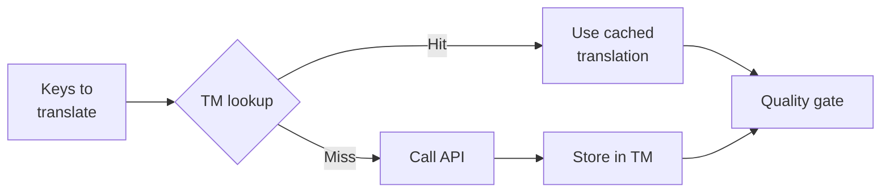

# Translation Memory

Translation Memory（TM）は、champollion に組み込まれたキャッシュレイヤーです。ソーステキスト・ロケール・メソッドの組み合わせをキーとして、すべての翻訳を保存します。これにより、`sync` を再実行した際、実際に変更されたキーに対してのみ API が呼び出されます。

## TM が存在する理由

TM がない場合、`sync` を実行するたびに、変更されたすべてのキーが再翻訳されます。以前の実行で同じ英語テキストを同じロケール向けにすでに翻訳済みであっても例外ではありません。これがコストの無駄につながる代表的なシナリオを以下に示します。

| シナリオ | TM なし | TM あり |
|----------|-----------|---------|
| 1 キー変更後に sync を再実行（500 キー × 10 ロケール） | 5,000 API 呼び出し | 10 API 呼び出し |
| キーを以前の英語の値に戻す | API 呼び出しが発生 | 即座にキャッシュヒット |
| 同じフレーズが 3 つのロケールファイルに存在する | 3 × API 呼び出し | 1 API 呼び出し + 2 キャッシュヒット |
| ドライラン → 本番 sync | 両方で API 呼び出しが発生 | 初回実行でキャッシュ、2 回目は再利用 |

TM は**デフォルトで有効**であり、設定は不要です。翻訳はすべての `sync` 実行中に自動的にキャッシュされ、以降の実行で利用されます。

## 仕組み

### キャッシュキー

各 TM エントリは、以下の 3 つの値の SHA-256 ハッシュをキーとして使用します。

```
SHA-256( sourceValue + '\x00' + locale + '\x00' + method )
```

| コンポーネント | キーに含まれる理由 |
|-----------|-------------------|
| `sourceValue` | 英語テキストが異なれば、翻訳結果も異なる |
| `locale` | "Hello" はフランス語と日本語で異なる翻訳になる |
| `method` | Google Translate の出力と GPT-4o の出力は異なる |

null バイトセパレーター（`\x00`）は、`"ab" + "c"` と `"a" + "bc"` の間の衝突を防ぎます。

### sync 実行中の動作



1. 翻訳 API を呼び出す前に、champollion はキーを **TM ヒット**と **TM ミス**に分類します
2. ヒットしたキーはキャッシュから即座に返されます — API 呼び出しなし、レイテンシなし、コストなし
3. ミスしたキーは通常の翻訳パイプラインを経由します
4. API から得られた新しい翻訳は、今後の実行のために TM に保存されます
5. すべての翻訳（キャッシュ済み・新規問わず）はクオリティゲートを通過します

### ストレージ

TM はプロジェクトルートの `.champollion/tm.json` に保存されます。ファイルサイズを抑えるため、コンパクト JSON（整形なし）形式を使用します。各エントリには以下のフィールドが含まれます。

| フィールド | 説明 |
|-------|-------------|
| `t` | 翻訳済みテキスト |
| `ts` | キャッシュされた日時の ISO-8601 タイムスタンプ |
| `l` | ターゲットロケールコード（統計・フィルタリング用） |
| `m` | 翻訳メソッド名（統計・フィルタリング用） |

50 言語 × 500 キー = 25,000 エントリの場合、ファイルサイズは約 2〜3 MB になります。

## キャッシュの管理

### 統計を確認する

```bash
champollion tm stats
```

エントリ数、ファイルサイズ、およびロケールごとの内訳が表示されます。

```
  Translation Memory — .champollion/tm.json

  Entries:      2,847
  File size:    1.2 MB
  Created:      2026-05-20
  Last entry:   2026-05-24

  By locale:
    fr       482 entries  (llm: 380, llm-coached: 102)
    de       471 entries  (llm: 471)
    ja       465 entries  (llm: 465)
```

### キャッシュをクリアする

```bash
# Clear everything (with confirmation prompt)
champollion tm clear

# Clear without prompt (CI environments)
champollion tm clear --yes

# Clear only one locale
champollion tm clear --locale fr
```

### 1 回の実行で TM をスキップする

```bash
# Force fresh API calls for all keys (useful when switching providers)
champollion sync --no-tm
```

これはキャッシュを削除するのではなく、今回の実行に限りキャッシュを無視し、新しい結果も保存しません。

## TM が効果を発揮しないケース

以下の場合、TM はキャッシュヒットを生成しません。

- **ソーステキストが変更された** — ハッシュが変わるため、ミスになります
- **メソッドが変更された** — `llm` から `google-translate` に切り替えると、キャッシュキーが異なります
- **初回実行** — コールドスタートのため、エントリがまだ存在しません
- **`--no-tm` フラグ** — 明示的にキャッシュをバイパスします

## `.champollion/tm.json` をコミットすべきか？

**基本的にはコミット不要です。** TM はローカル開発者向けの最適化です。sync 実行中に自動的に生成され、同じマシンで sync を再実行する場合にのみ効果があります。ただし、以下のような場合はコミットを検討してもよいでしょう。

- チームが翻訳を同期する単一の CI ランナーを共有している場合
- API 呼び出しなしで再現可能なビルドを実現したい場合
- コンプライアンスのために翻訳をアーカイブしたい場合

通常の使用では、`.champollion/tm.json` を `.gitignore` に追加してください。

---

## 関連情報

- [sync の仕組み](/docs/concepts/how-sync-works) — パイプライン内での TM の位置づけ
- [CLI リファレンス — tm](/docs/reference/cli#tm) — コマンドリファレンス
- [CLI リファレンス — sync --no-tm](/docs/reference/cli#sync) — TM のバイパス
