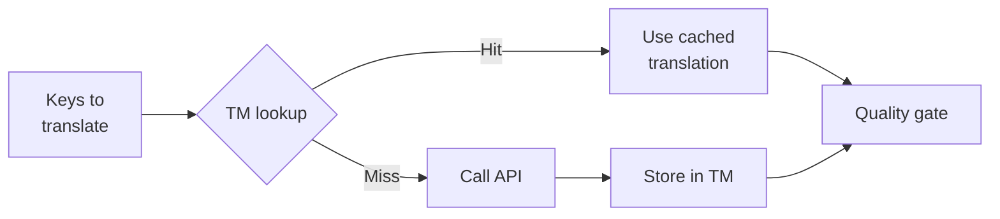

# Translation Memory

Translation Memory（TM）は、champollion に組み込まれたキャッシュレイヤーです。ソーステキスト・ロケール・メソッドの組み合わせをキーとして、すべての翻訳を保存します。これにより、`sync` を再実行した際、実際に変更されたキーに対してのみ API が呼び出されます。

## TM が存在する理由

TM がない場合、`sync` を実行するたびに、変更されたすべてのキーが再翻訳されます。以前の実行で同じ英語テキストを同じロケール向けにすでに翻訳済みであっても例外ではありません。これがコストの無駄につながる代表的なシナリオを以下に示します。

| シナリオ | TM なし | TM あり |
|----------|-----------|---------|
| 1 キー変更後に sync を再実行（500 キー × 10 ロケール） | 5,000 API 呼び出し | 10 API 呼び出し |
| キーを以前の英語の値に戻す | API 呼び出しが発生 | 即座にキャッシュヒット |
| 同じフレーズが 3 つのロケールファイルに存在する | 3 × API 呼び出し | 1 API 呼び出し + 2 キャッシュヒット |
| ドライラン → 本番 sync | 両方で API 呼び出しが発生 | 初回実行でキャッシュ、2 回目は再利用 |

TM は**デフォルトで有効**であり、設定は不要です。翻訳はすべての `sync` 実行中に自動的にキャッシュされ、以降の実行で利用されます。

## 仕組み

### キャッシュキー

各 TM エントリは、以下の 3 つの値の SHA-256 ハッシュをキーとして使用します。

```
SHA-256( sourceValue + '\x00' + locale + '\x00' + method )
```

| コンポーネント | キーに含まれる理由 |
|-----------|-------------------|
| `sourceValue` | 英語テキストが異なれば、翻訳結果も異なる |
| `locale` | "Hello" はフランス語と日本語で異なる翻訳になる |
| `method` | Google Translate の出力と GPT-4o の出力は異なる |

null バイトセパレーター（`\x00`）は、`"ab" + "c"` と `"a" + "bc"` の間の衝突を防ぎます。

`sourceValue`は、キーの翻訳元となるテキストであり、同一のテキスト同士を区別するためのあらゆる情報が組み込まれています。

- **gettextのコンテキスト（context）。** `msgctxt`を持つエントリは、そのコンテキストとともにキャッシュされます。例えば動詞の「Open」と形容詞の「Open」は2つのエントリになります。
- **翻訳元（ソース）に存在しない複数形。** i18nextは複数形をサフィックス付きキーとして格納しますが、ターゲット言語にはソースにない形式が存在する場合があります。例えばフランス語やスペイン語では`count_many`が追加され、これは英語の`count_other`テキストから翻訳されます。2つのキーは同じテキストを送信しますが、モデルには異なる形式（`"2 recettes"`および`"1 000 000 de recettes"`）が要求されるため、それぞれ独自のエントリが割り当てられます。`count_other`は通常の形式を保持し、`count_many`はテキストにその形式を加えたキーの下にキャッシュされます。他のカテゴリのテキストから翻訳されるすべての形式についても同様です（アラビア語の`_zero`、`_two`、`_few`、`_many`、ロシア語の`_few`、`_many`、序数形式など）。
- **gettextの`msgid_plural`およびARB / ICUの複数形**はキーごとに1つのメッセージ（すべての形式が1つの値に含まれる）であるため、従来どおり1つのエントリになります。

0.4.0より前では、借用された形式は翻訳元の形式のエントリを共有しており、そのエントリには最後に保存された応答が保持されていたため、`--redo all`によって両方のキーに同一の形式が書き込まれる可能性がありました。当時のキャッシュは、使用される際に修復されます。共有エントリに借用された形式のテキストが含まれている場合、その形式独自のエントリへと移動され、もう一方の形式は次回キューに追加された際に再翻訳されます。そうでない場合、エントリは借用元の形式に残され、借用された形式は最初にキューへ追加されたときに一度だけモデルに送信されます（実行時にその旨が表示されます）。`champollion verify`は、借用された形式が借用元の形式とまったく同じテキストを保持しており、モデルが意図してそのように記述したことがキャッシュから確認できない場合に警告を出します。一部の言語では2つの形式を同一に記述することがあるため、これは警告にとどまります。`--redo keys:<key>`を指定すると再問い合わせが行われます。

### sync 実行中の動作


```mermaid
flowchart LR
    A["Keys to\ntranslate"] --> B{"TM lookup"}
    B -->|Hit| C["Use cached\ntranslation"]
    B -->|Miss| D["Call API"]
    D --> E["Store in TM"]
    C --> F["Quality gate"]
    E --> F
```

1. 翻訳 API を呼び出す前に、champollion はキーを **TM ヒット**と **TM ミス**に分類します
2. ヒットしたキーはキャッシュから即座に返されます — API 呼び出しなし、レイテンシなし、コストなし
3. ミスしたキーは通常の翻訳パイプラインを経由します
4. API から得られた新しい翻訳は、今後の実行のために TM に保存されます
5. すべての翻訳（キャッシュ済み・新規問わず）はクオリティゲートを通過します

### ストレージ

TM はプロジェクトルートの `.champollion/tm.json` に保存されます。ファイルサイズを抑えるため、コンパクト JSON（整形なし）形式を使用します。各エントリには以下のフィールドが含まれます。

| フィールド | 説明 |
|-------|-------------|
| `t` | 翻訳済みテキスト |
| `ts` | キャッシュされた日時の ISO-8601 タイムスタンプ |
| `l` | ターゲットロケールコード（統計・フィルタリング用） |
| `m` | 翻訳メソッド名（統計・フィルタリング用） |

50 言語 × 500 キー = 25,000 エントリの場合、ファイルサイズは約 2〜3 MB になります。

## キャッシュの管理

### 統計を確認する

```bash
champollion tm stats
```

エントリ数、ファイルサイズ、およびロケールごとの内訳が表示されます。

```
  Translation Memory — .champollion/tm.json

  Entries:      2,847
  File size:    1.2 MB
  Created:      2026-05-20 09:14 MDT
  Last entry:   2026-05-24 17:52 MDT

  By locale:
    fr       482 entries
               380  llm · model google/gemini-3.8-flash · register formal-vous
               102  llm-coached · model google/gemini-3.8-flash · register formal-vous · coaching 3f2a9c1b
    de       471 entries
               471  llm · model google/gemini-3.8-flash · register formal-Sie
    ja       465 entries
               465  llm · model google/gemini-3.8-flash · register polite
```

日付はこのマシンのローカル時刻で表示され、タイムゾーン名が付加されます（`--json`には保存されたUTCタイムスタンプも`createdAt`および`lastEntryAt`として含まれます）。
ロケール下の各行は、それらのエントリを生成した要素を示しています。メソッド、モデル、レジスター（文体）、およびプロンプトにコーチングテキストが含まれるすべてのメソッドにおけるそのテキストのフィンガープリント（`llm`、`local`、`openai`、`anthropic`、`gemini`、`llm-coached`。これにはペア、言語、またはフォールバック独自の`coachingFile`が読み込まれ、パスではなくそのテキストが考慮されます）。
1つのロケールに2つのモデルが存在する場合は通常、モデルの切り替えを意味します。`champollion status`は、ロケールファイル自体に2つのモデルのテキストが混在しているかどうかを示します。

### キャッシュをクリアする

```bash
# Clear everything (with confirmation prompt)
champollion tm clear

# Clear without prompt (CI environments)
champollion tm clear --yes

# Clear only one locale
champollion tm clear --locale fr
```

### 1 回の実行で TM をスキップする

```bash
# Fresh API calls for everything queued (useful when debugging quality)
champollion sync --redo all --fresh     # --fresh = --no-tm
```

これによりキャッシュが削除されることはなく、今回の実行でキャッシュが読み取られないだけです。ただし、この実行で翻訳された（そして費用が発生した）内容は引き続き保存されるため、次回の実行では再びキャッシュが利用されます。

## モデルの切り替え

**切り替え方法。** モデルは`champollion.config.json`の設定項目です。`"model"`（メソッドも変更する場合は`"defaultMethod"`も）を編集するか、`"pairs"`内にあるペア独自の`"model"`を編集します。次回の`champollion sync`からその設定が使用されます。

`sync --model <name>`（および`--method <name>`）は、**1回の実行のみ**モデルを指定します。設定ファイルは変更されず、syncでもその旨が表示され、次回の通常の`sync`では再び設定済みのモデルが使用されます。その実行で翻訳された内容はファイルに残ります。その後、通常のsyncを実行すると、別のモデルによって作成された翻訳が示され、2つの対処法が提示されます。そのモデルを設定済みモデルにして保持するか（`"model"`に設定 — API送信は発生しません）、設定済みモデルで再翻訳させるか（表示されるredoコマンドとその料金）です。`champollion status`も同様の情報を表示します。切り替えのために`champollion init`を再実行する必要はありません。`init --force`はフラグで指定された内容のみを書き換え、他のすべての設定を保持します（[CLIリファレンス](/docs/reference/cli#init)）。

モデルを変更しても、キャッシュが破棄されるわけではありません。新しいモデルのもとに文字列のエントリがない場合、メソッド、レジスター、コーチングが変更されていなければ、syncは前のモデルで作成された翻訳を再利用します。再利用されたエントリは、通常のキャッシュヒットと同様の品質チェックを受けます。費用見積もりの前に、syncは再利用する翻訳の件数とそれを生成したモデルを表示します（ドライラン時、および切り替え完了後も同様です。以前のモデルでのみ翻訳されたテキストに戻された文字列には、そのモデルの翻訳が提供され、見積もり前にその旨が表示されます）。

代わりに新しいモデルでこれらを翻訳する場合（以前のモデルが翻訳したキーが送信され、新しいモデルがすでに翻訳済みのものは引き続きキャッシュから取得されます）：

```bash
champollion sync --redo all --fresh-on-model-change
```

`--fresh-on-model-change`単体では、その実行でいずれにせよ翻訳されるキー（新規または変更されたキー）にのみ影響します。完全な再翻訳が完了すると、syncはその言語に対するモデル変更の通知を停止します。新しいモデルの応答が失敗したキーは、`.champollion.lock`に**pending**（保留中）として記録されます。次回の`champollion sync`ではキャッシュではなく新しいモデルに再度問い合わせを行い、それらが完了した時点で切り替えが完了します。`champollion status`は保留中のキーを一覧表示し、ファイルに以前のモデルのテキストが（現在のモデルと混在しているか、すべてが以前のモデルかに関わらず）含まれている場合にその旨を通知します（[品質ゲート](/docs/concepts/quality-gate#a-redo-that-could-not-finish)）。
syncは各値をどのモデルが記述したかを`.champollion.lock`に記録しているため（応答したモデル、またはキャッシュされた翻訳が提供されたモデル）、それを把握できます。0.4.0より前に書き込まれた値についてはキャッシュにフォールバックし、2つのモデルが同じテキストをキャッシュしている場合は「model unknown」と表示します。翻訳対象のない通常の`champollion sync`を実行すると、ファイルが設定済みモデル以外のモデルによって書き込まれている場合に、言語ごとに1行で上記のコマンドとともに表示されます。
一括再実行（redo）によって、人間がファイル内で編集した翻訳が上書きされることは決してありません（[翻訳の編集](/docs/guides/professional-translators#editing-key-value-files)）。

メソッド、レジスター、またはコーチングを変更すると、異なるテキストを得るための変更であるため、常に新規翻訳が生成されます。キャッシュに別の方法で作成された同一テキストの翻訳が存在するにもかかわらず、キーがモデルに送信される場合（例えば`local` → `llm`への切り替え後など）、syncはそれらを生成した要素の名前とともに言語ごとに一度その旨を表示します。これが、実行時にキャッシュから何も提供されない理由です。

メソッド、レジスター、またはコーチングの変更自体によって何かが自動的に再翻訳されることはありません。翻訳対象の新規項目がない通常のsync（またはドライラン）では、ファイルはそのまま維持されます。言語ごとに、別のメソッドによって書き込まれた値の数、それらを置き換えるredoコマンド（`champollion sync --pair en:fr --redo all`）、およびその推定費用が表示されます。

## TM が効果を発揮しないケース

以下の場合、TM はキャッシュヒットを生成しません。

- **ソーステキストの変更** — ハッシュが変化するため、キャッシュミスになります
- **メソッドの変更** — `llm`から`google-translate`への切り替えは、キャッシュキーが異なることを意味します
- **レジスターまたはコーチングの変更** — キャッシュキーにこれらが含まれます（モデルの変更のみであれば再利用されます。上記参照）。ペアのフォールバックには独自のキー（メソッド、モデル、レジスター、コーチング）があります。変更後、`sync`と`status`は以前の設定によって書き込まれた値とredoコマンド（`--redo all`、モデル変更のみの場合は`--fresh-on-model-change`）を表示します。0.4.0より前に作成されたキャッシュでは、コーチングは`llm-coached`でのみキーに含まれていました。初回実行時、その時点でペアが持つコーチングで作成されたエントリは保持されます
- **キーに含まれないもの：** 用語集（glossary）、および`llm-coached`の文法規則とスタイルノート — これらを編集してもキャッシュされた内容は再翻訳されません（`--redo keys:… --fresh`を指定すると再問い合わせが行われます）
- **`--retranslate <glob>`** — 指定されたコンテンツファイルを意図的に新規翻訳します
- **初回実行** — コールドスタートのため、エントリがまだ存在しません
- **`--no-tm` / `--fresh`** — 明示的にキャッシュをバイパスします
- **保留中（pending）のキー** — redoが完了できなかったキーは、キャッシュから提供されずモデルに再問い合わせされます

キャッシュがキーを*キューに入れる*かどうかを決定することはありません。変更されておらず、すでにファイル内に翻訳が存在するキーは、ルックアップが行われる前にスキップされます（キャッシュヒットとしてはカウントされません）。また、品質ゲートによってモデルから拒否されたキーは、通常のsyncでそのモデルに再度送信されることはありません（同じ回答に対して課金されるのを防ぐため、[保留（held back）](/docs/concepts/quality-gate#refused-keys-are-held-back)されます）。ただし、そのキーに対してキャッシュの読み取りは引き続き行われます。

## `.champollion/tm.json` をコミットすべきか？

**基本的にはコミット不要です。** TM はローカル開発者向けの最適化です。sync 実行中に自動的に生成され、同じマシンで sync を再実行する場合にのみ効果があります。ただし、以下のような場合はコミットを検討してもよいでしょう。

- チームが翻訳を同期する単一の CI ランナーを共有している場合
- API 呼び出しなしで再現可能なビルドを実現したい場合
- コンプライアンスのために翻訳をアーカイブしたい場合

通常の使用では、`.champollion/tm.json` を `.gitignore` に追加してください。

---

## 関連項目

- [sync の仕組み](/docs/concepts/how-sync-works) — パイプライン内での TM の位置づけ
- [CLI リファレンス — tm](/docs/reference/cli#tm) — コマンドリファレンス
- [CLI リファレンス — sync --no-tm](/docs/reference/cli#sync) — TM のバイパス
