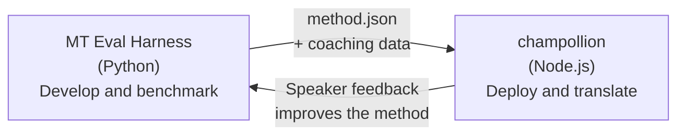

# Eval Harness ブリッジ

champollion と MT Eval Harness は、ひとつのエコシステムを形成する2つの独立したツールです。翻訳手法を**検証する**場所がハーネスであり、検証済みの手法を**デプロイする**場所が Champollion です。両者は共通のプラグイン形式を通じて連携します。



## フロー：リサーチ → プロダクション

### 1. ハーネスで手法を構築する

`async translate(entries, config) → [{id, predicted}]` を実装した Python クラスであれば、どれでもハーネスに組み込めます。ハーネスは内部の実装を問いません — プロンプトを使った LLM、カスタム学習済みモデル、決定論的なルール、何でも構いません。

### 2. ベンチマークを実行する

ハーネスは、標準化されたコーパスに対して再現可能なメトリクスで手法を評価します：chrF++、FST 受理率（形態論的に複雑な言語向け）、形態論的精度、セマンティックスコアリング。

### 3. プラグインとしてエクスポートする

手法が許容できる品質に達したら、champollion プラグインとしてパッケージ化します — オプションのコーチングデータを含む `method.json` マニフェストです。

:::info[Export CLI は計画中です]
現在、method.json マニフェストは手動で作成する必要があります。`mt-eval export` コマンドによってこの作業が自動化される予定です。プラグインの完全なフォーマットについては、[メソッドインターフェース](/docs/network/specifications/methods)を参照してください。
:::

### 4. champollion にインストールする

```bash
champollion plugin install ./my-method-plugin/
```

### 5. 実際のコンテンツを翻訳する

```bash
champollion sync
```

ベンチマーク済みの手法が、本番環境で実際の翻訳を生成するようになりました。

## フロー：プロダクション → リサーチ

デプロイされた翻訳はバイリンガルの話者によってレビューされます。そのフィードバックから体系的なエラー（時制パターンの誤り、語彙の欠落、不自然な表現など）が特定されます。研究者はハーネス上で手法を更新し、再ベンチマーク、再エクスポート、再デプロイを行います。システムは使用を通じて学習していきます。

## プラグイン形式

`method.json` マニフェストは、2つのツール間の契約です：

```json
{
  "name": "crk-coached-v3",
  "type": "llm-coached",
  "version": "3.0.0",
  "description": "Coached LLM translation for Plains Cree",
  "locales": ["crk"],
  "config": {
    "model": "google/gemini-3.5-flash",
    "temperature": 0.3
  },
  "benchmarks": {
    "crk": {
      "composite_score": 0.67,
      "fst_acceptance": 0.82,
      "corpus_size": 150
    }
  }
}
```

完全な形式については [Plugin Specification](/docs/reference/plugin-spec) を参照してください。

## 構築済みと計画中

| コンポーネント | ステータス |
|-----------|--------|
| TranslationMethod プロトコル | ✅ 構築済み |
| ハーネス ベンチマークランナー | ✅ 構築済み |
| method.json プラグイン形式 | ✅ 構築済み |
| `champollion plugin install/remove/list` | ✅ 構築済み |
| コーチングデータの読み込み | ✅ 構築済み |
| `mt-eval export` CLI | 🔲 計画中 |
| コミュニティレビューインターフェース | 🔲 計画中 |
| 暗号化テストセット評価 | 🔲 計画中 |

## 関連ドキュメント

- [翻訳メソッド](/docs/guides/translation-methods) — 利用可能なすべてのメソッドとその仕組み
- [プラグイン仕様](/docs/reference/plugin-spec) — method.json のフォーマット
- [API経由でのメソッドの提供](/docs/guides/serving-a-method) — サーバーサイドでのメソッドのホスティング
- [データ主権](/docs/network/sovereignty/data-sovereignty) — 先住民族のデータ主権の原則、CARE、および暗号学的保護
- [MT研究者向け](/docs/network/leaderboard/rules) — Eval Harness のドキュメント
