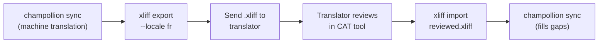

# プロフェッショナル翻訳者との連携

Champollion は機械翻訳を生成しますが、規制関連のコンテンツ、ブランドに関わるコピー、重要度の高い UI など、人間によるレビューが必要なプロジェクトもあります。XLIFF ワークフローを使うと、翻訳をエクスポートしてプロフェッショナルなレビューに回し、レビュー済みの内容をシームレスにインポートできます。

## XLIFF とは？

XLIFF（XML Localization Interchange File Format）は、翻訳ツール向けの業界標準交換フォーマットです。プロフェッショナルな CAT（Computer-Assisted Translation）ツールはすべて対応しています：

- **memoQ** — XLIFF をインポートし、コンテキストを確認しながらレビューして、レビュー済みファイルをエクスポート
- **SDL Trados Studio** — XLIFF をネイティブサポート
- **Phrase (Memsource)** — 翻訳者チーム向けに XLIFF ジョブをアップロード
- **Smartling** — XLIFF インジェストパイプライン
- **OmegaT** — XLIFF をサポートする無料・オープンソースの CAT ツール

Champollion は、ツールとの互換性を最大限に確保するため、XLIFF 2.0 以降ではなく XLIFF 1.2（広く対応されているバージョン）を生成します。

## ワークフロー



### ステップ 1：機械翻訳を生成する

まず `sync` を実行して、ベースラインとなる機械翻訳を取得します：

```bash
champollion sync
```

### ステップ 2：XLIFF をエクスポートする

ソースとターゲットのペアを XLIFF としてエクスポートします：

```bash
champollion xliff export --locale fr
```

これにより `.champollion/xliff/fr.xliff` が書き出され、以下の内容が含まれます：
- すべてのソースキーとその英語の値
- 現在の機械翻訳（存在する場合）が `<target>` として
- 翻訳のないキーは `state="new"` としてマーク

```xml
<trans-unit id="hero.title" xml:space="preserve">
  <source>Welcome to our platform</source>
  <target state="translated">Bienvenue sur notre plateforme</target>
</trans-unit>
```

### ステップ 3：翻訳者に送る

`.xliff` ファイルを翻訳者に送るか、CAT プラットフォームにアップロードします。翻訳者はソースとターゲットを並べて確認でき、以下の作業が可能です：

- 機械翻訳の編集
- 未翻訳箇所の補完
- 品質上の問題のフラグ付け
- 独自の翻訳メモリや用語集の適用

### ステップ 4：レビュー済みファイルをインポートする

翻訳者からレビュー済みの `.xliff` が返ってきたら、インポートします：

```bash
# Preview what will change
champollion xliff import .champollion/xliff/fr.xliff --dry

# Apply changes
champollion xliff import .champollion/xliff/fr.xliff
```

出力：
```
  ✓ Imported 142 translations for fr
    Updated:    23 (changed from existing)
    Added:      0 (new keys)
    Unchanged:  119
    Written to: locales/fr.json
```

### ステップ 5：不足分を補完する

XLIFF のエクスポート後に新しいキーが追加された場合は、`sync` を実行して翻訳します：

```bash
champollion sync
```

Champollion はまだ翻訳されていないキーのみを翻訳します。XLIFF インポートによるレビュー済みの翻訳は保持されます。

## ヒント

### カスタムパスへのエクスポート

```bash
# Export to a specific directory
champollion xliff export --locale ja --out ./for-review/

# Export with a specific filename
champollion xliff export --locale de --out ./review/german.xliff
```

### 複数のロケール

ロケールごとに個別にエクスポートします：

```bash
for locale in fr de ja ko; do
  champollion xliff export --locale $locale
done
```

### バージョン管理

`.champollion/xliff/` を `.gitignore` に追加してください。XLIFF ファイルは一時的な成果物であり、プロジェクトのソースではありません：

```gitignore
.champollion/xliff/
```

### XLIFF を使うべき場合と `sync` だけで済む場合

| シナリオ | 推奨 |
|----------|---------------|
| 社内アプリで品質 90% 以上が許容できる | `sync` のみ — 機械翻訳で十分 |
| ユーザー向けのマーケティングコピー | XLIFF をエクスポートして人間によるレビューを実施 |
| 法的・規制関連のコンテンツ | XLIFF をエクスポート — 人間によるレビューが必須 |
| 50 以上のロケール、タイトなスケジュール | まず `sync` を実行し、上位 5 ロケールのみ XLIFF エクスポート |
| 翻訳者がすでに CAT ツールを使用している | XLIFF が自然な引き渡しフォーマット |

---

## 関連情報

- [CLI リファレンス — xliff](/docs/reference/cli#xliff) — コマンドリファレンス
- [翻訳メモリ](/docs/concepts/translation-memory) — レビュー済み翻訳のキャッシュ
- [翻訳方法](/docs/guides/translation-methods) — 機械翻訳のオプション
