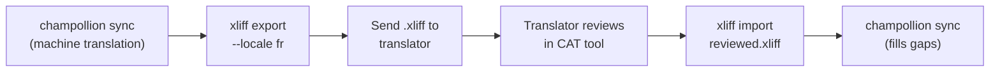

# プロフェッショナル翻訳者との連携

Champollion は機械翻訳を生成しますが、規制関連のコンテンツ、ブランドに関わるコピー、重要度の高い UI など、人間によるレビューが必要なプロジェクトもあります。XLIFF ワークフローを使うと、翻訳をエクスポートしてプロフェッショナルなレビューに回し、レビュー済みの内容をシームレスにインポートできます。

XLIFFはアプリの**文字列ファイル**（キーと値）を対象とします。翻訳済みの**Markdown**（ニュースレター、ブログ記事、ドキュメントページなど）のレビュー方法は異なり、レビュー担当者が翻訳済みの`.md`ファイルを直接編集し、sync処理がそれらの編集内容を保持します。詳細は後述の[翻訳されたMarkdownのレビュー](#reviewing-translated-markdown)を参照してください。

## XLIFF とは？

XLIFF（XML Localization Interchange File Format）は、翻訳ツール向けの業界標準交換フォーマットです。プロフェッショナルな CAT（Computer-Assisted Translation）ツールはすべて対応しています：

- **memoQ** — XLIFF をインポートし、コンテキストを確認しながらレビューして、レビュー済みファイルをエクスポート
- **SDL Trados Studio** — XLIFF をネイティブサポート
- **Phrase (Memsource)** — 翻訳者チーム向けに XLIFF ジョブをアップロード
- **Smartling** — XLIFF インジェストパイプライン
- **OmegaT** — XLIFF をサポートする無料・オープンソースの CAT ツール

Champollion は、ツールとの互換性を最大限に確保するため、XLIFF 2.0 以降ではなく XLIFF 1.2（広く対応されているバージョン）を生成します。

## ワークフロー


```mermaid
flowchart LR
    A["champollion sync\n(machine translation)"] --> B["xliff export\n--locale fr"]
    B --> C["Send .xliff to\ntranslator"]
    C --> D["Translator reviews\nin CAT tool"]
    D --> E["xliff import\nreviewed.xliff"]
    E --> F["champollion sync\n(fills gaps)"]
```

### ステップ 1：機械翻訳を生成する

まず `sync` を実行して、ベースラインとなる機械翻訳を取得します：

```bash
champollion sync
```

### ステップ 2：XLIFF をエクスポートする

ソースとターゲットのペアを XLIFF としてエクスポートします：

```bash
champollion xliff export --locale fr
```

これにより `.champollion/xliff/fr.xliff` が書き出され、以下の内容が含まれます：
- すべてのソースキーとその英語の値
- 現在の機械翻訳（存在する場合）が `<target>` として
- 翻訳のないキーは `state="new"` としてマーク

```xml
<trans-unit id="hero.title" xml:space="preserve">
  <source>Welcome to our platform</source>
  <target state="translated">Bienvenue sur notre plateforme</target>
</trans-unit>
```

### ステップ 3：翻訳者に送る

`.xliff` ファイルを翻訳者に送るか、CAT プラットフォームにアップロードします。翻訳者はソースとターゲットを並べて確認でき、以下の作業が可能です：

- 機械翻訳の編集
- 未翻訳箇所の補完
- 品質上の問題のフラグ付け
- 独自の翻訳メモリや用語集の適用

### ステップ 4：レビュー済みファイルをインポートする

翻訳者からレビュー済みの `.xliff` が返ってきたら、インポートします：

```bash
# Preview what will change
champollion xliff import .champollion/xliff/fr.xliff --dry

# Apply changes
champollion xliff import .champollion/xliff/fr.xliff
```

出力：
```
  ✓ Imported 142 translations for fr
    Updated:    23 (changed from existing)
    Added:      0 (new keys)
    Unchanged:  119
    Written to: locales/fr.json
```

### ステップ 5：不足分を補完する

XLIFF のエクスポート後に新しいキーが追加された場合は、`sync` を実行して翻訳します：

```bash
champollion sync
```

Champollion はまだ翻訳されていないキーのみを翻訳します。XLIFF インポートによるレビュー済みの翻訳は保持されます。

## ヒント

### カスタムパスへのエクスポート

```bash
# Export to a specific directory
champollion xliff export --locale ja --out ./for-review/

# Export with a specific filename
champollion xliff export --locale de --out ./review/german.xliff
```

### 複数のロケール

ロケールごとに個別にエクスポートします：

```bash
for locale in fr de ja ko; do
  champollion xliff export --locale $locale
done
```

### バージョン管理

`.champollion/xliff/` を `.gitignore` に追加してください。XLIFF ファイルは一時的な成果物であり、プロジェクトのソースではありません：

```gitignore
.champollion/xliff/
```

### XLIFF を使うべき場合と `sync` だけで済む場合

| シナリオ | 推奨 |
|----------|---------------|
| 社内アプリで品質 90% 以上が許容できる | `sync` のみ — 機械翻訳で十分 |
| ユーザー向けのマーケティングコピー | XLIFF をエクスポートして人間によるレビューを実施 |
| 法的・規制関連のコンテンツ | XLIFF をエクスポート — 人間によるレビューが必須 |
| 50 以上のロケール、タイトなスケジュール | まず `sync` を実行し、上位 5 ロケールのみ XLIFF エクスポート |
| 翻訳者がすでに CAT ツールを使用している | XLIFF が自然な引き渡しフォーマット |

## ロケールファイル内の翻訳の編集 {#editing-key-value-files}

レビュー担当者は、ロケールファイル（`messages/fr.json`、`locale/fr/LC_MESSAGES/django.po`、`app_fr.arb`など）で翻訳を直接修正してコミットすることもできます。Champollionは、自身が書き込んだすべての値のフィンガープリントを`.champollion.lock`に記録します。一致しなくなった値は人間によって変更されたとみなされ、syncはその変更を人間のものとして扱います。

| 実行内容 | 編集された値の扱い |
|-----------|----------------------------------|
| 通常の`sync`（英語に変更なし） | 変更されません（以前のまま）。 |
| `sync --redo all` / `--force`、モデルの切り替え（`--redo all --fresh-on-model-change`）、または再実行によって保留されたキーの再試行 | **保持されます。** 実行時に、保持された件数とその対象、および置換方法（`--redo keys:<key>`）が表示されます。 |
| 対象キーを指定した`sync --redo keys:<key>` | 置換されます — そのキーが名前で明示的に指定されたためです。編集された表現が先に出力されます。 |
| **対象キーの英語ソースが変更された場合** | 再度翻訳されます（編集は古いテキストに対するものだったため）。編集された表現が出力され、再適用できるようにプロジェクトルートの`.champollion-replaced-edits.jsonl`に追記されます。 |

`.champollion-replaced-edits.jsonl`はロックファイルの隣にあるGit追跡対象のファイルです（`.champollion/`キャッシュフォルダーはマシン固有であり、gitによって無視されます）。置換された編集ごとに1行のJSONで、ロケール、ファイル、キー、編集された表現、置換された理由、新しいソーステキストが記録されます。その表現の唯一のコピーとなるため、ロックファイルと一緒にコミットしてください。`champollion status`には、保持されている件数が表示されます。

この記録が存在する前に書き込まれた値や、他のツールによって書き込まれた値にはフィンガープリントがありません。そのような値は、翻訳キャッシュ内にそのキーに対して完全に一致するテキストが存在する場合にのみChampollionのものとみなされます。それ以外の場合は人間の手によるものとして扱われ、一括再実行時にも保持されます（実行時には、書き込み記録がない値として名前が表示されます）。`champollion xliff import`でインポートされた値は人間の作業によるものとみなされ、同様に保持されます。

## 翻訳されたMarkdownのレビュー {#reviewing-translated-markdown}

`contentDir`によるコンテンツファイル（例えば`newsletters/2026-10.md` → `newsletters/2026-10.crk.md`）には、XLIFFエクスポートがありません。レビュー担当者は翻訳されたファイル自体で直接作業します。

1. `champollion sync`を実行し、翻訳を`.champollion-content.lock`と一緒にコミットします。
2. レビュー担当者が翻訳されたファイルを編集し（段落、または`title`などの翻訳されたfront-matterフィールド）、コミットします。
3. その後のsync実行時にも、編集内容は保持されます。他の段落で英語ソースが変更された場合でも、レビュー担当者が編集した段落は一語一語そのまま維持され、変更された段落のみが翻訳されます。実行時には`kept the edits made by hand to …`が出力されます。

例外が2つあり、syncはいずれの場合も警告を出します。レビュー担当者が修正した英語の段落自体も変更された場合、その段落は再度翻訳され、再適用できるようにレビュー担当者の表現が出力されます。レビュー担当者が段落を追加または削除し、その後にソースが変更された場合、手動で更新されるまでファイルはそのまま維持され、毎回のsync実行時に一覧表示されます。

編集内容を破棄して機械翻訳に戻すには、対象のファイルを指定します: `champollion sync --redo files:2026-10.md`。詳細なルールは[コンテンツ翻訳](/docs/guides/content-translation#reviewing-and-editing-translations)に記載されています。

---

## 関連項目

- [CLIリファレンス — xliff](/docs/reference/cli#xliff) — コマンドリファレンス
- [翻訳メモリ](/docs/concepts/translation-memory) — レビュー済み翻訳のキャッシュ
- [翻訳方法](/docs/guides/translation-methods) — 機械翻訳のオプション
- [コンテンツ翻訳](/docs/guides/content-translation) — Markdownの翻訳とレビュー担当者の編集内容の保持方法
- [品質ゲート](/docs/concepts/quality-gate#refused-keys-are-held-back) — ゲートが拒否したキー、および再実行で保留されたキー
