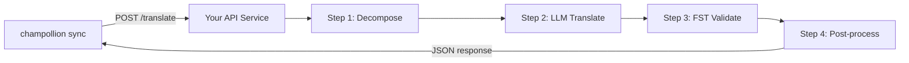

# カスタムメソッドをAPIとして提供する

champollion の **`api` メソッド**を使うと、任意の翻訳ペアを外部の HTTP エンドポイントに向けることができます。これにより、単一の LLM プロンプトでは対応できない複雑なパイプライン — 形態素解析器、有限状態トランスデューサー（FST）、複数ステップの LLM チェーン、または独自に構築したカスタム研究手法 — を統合できます。

このようなエンドポイントを立ち上げるには、2つの方法があります。

1. **`champollion serve`** — 既存のchampollionプロジェクトで設定されたスタック（メソッド、レジスター、コーチング、翻訳メモリ、品質ゲート）を、このコントラクトの背後で提供する単一のコマンドです。サーバーコードは不要です。[ゼロコードパス](#the-zero-code-path-champollion-serve)を参照してください。
2. **カスタムサービス** — champollionの外部に完全に存在するパイプライン用に、コントラクトを実装した独自のHTTPサーバーを記述します。

## なぜ API サービスを使うのか

翻訳パイプラインの中には、単純なプロンプト・レスポンスのサイクルでは実行できないものがあります：

| パイプラインのステップ | 例 |
|---|---|
| **形態素分解** | 多合成語を翻訳前に形態素に分割する |
| **FST 検証** | 音韻規則または形態規則に違反する出力を拒否する |
| **複数ステップの LLM チェーン** | 異なるモデルを使った生成 → 検証 → 修正のサイクル |
| **辞書参照** | パイプラインの途中でキュレーション済みの対訳辞書を照合する |
| **ヒューマン・イン・ザ・ループ** | 不確かな翻訳を専門家によるレビューのためにキューに入れる |

`api` メソッドはパイプラインをブラックボックスとして扱います — champollion がソース文字列を送信し、サービスが翻訳を返します。内部で何が行われるかは完全にユーザー次第です。

## アーキテクチャ



## ゼロコードパス: `champollion serve`

パイプラインがすでにchampollionプロジェクト（設定済みのメソッド（LLM、コーチング済み、またはエンジン）、レジスター、コーチングファイル、翻訳メモリ、および決定論的な品質ゲート）である場合、サーバーを記述する必要はまったくありません。`champollion serve`は、以下で説明する正確なコントラクトの背後に**独自に設定されたスタック**を立ち上げます。

```bash
# Owner side — run from the project whose champollion.config.json defines the stack
CHAMPOLLION_SERVE_TOKEN=$(openssl rand -hex 24) npx champollion serve
# [OK] champollion serve listening on http://127.0.0.1:1822/translate
```

すべてのリクエストは、`champollion sync`が使用するのと同じパイプラインを通過します。

- **翻訳メモリ** — TMがすでに保持している文字列は、アップストリームのプロバイダーにアクセスすることなく、キャッシュから無料で提供されます。ゲートで検証されたAPIの結果は、次のリクエストのためにキャッシュされます。
- **品質ゲート** — すべてのレスポンスは決定論的に検証されます（繰り返し、長さの比率、文字体系の準拠、ソースのエコー）。失敗した場合は、キーごとの構造化されたエラー（HTTP 207/422）として返され、出力が暗黙のうちに劣化することはありません。
- **コストガード** — `--max-cost-per-request`および`--max-session-cost`は、プロバイダーの呼び出しが行われる前に、*推定*アップストリームコストが上限を超えるリクエストを拒否します。価格が不明なメソッドも上限の対象として拒否されます（不明＝無料ではありません）。TMでカバーされるリクエストは既知の0ドルであり、常に通過します。

サーバーはデフォルトで`127.0.0.1`にバインドされます。ポートにアクセスできる人なら誰でもアップストリームAPIの予算を消費できるため、これを公開するには明示的な決定（`--bind 0.0.0.0`と強力なベアラートークン）が必要です。`--no-auth`は、ループバックバインドと組み合わせた場合にのみ受け入れられます。IPごとのレート制限とリクエストサイズの上限はデフォルトで有効になっています。`champollion serve --help`を参照してください。

### コンシューマーを接続する

コンシューマーがインストールするプラグインマニフェストを出力します（双方で1つのコマンドを実行します）。

```bash
# Owner side
champollion serve --emit-manifest --endpoint https://translate.example.org
# [OK] Wrote ./my-project-serve/method.json
```

```bash
# Consumer side
champollion plugin install ./my-project-serve
```

```json title="champollion.config.json (consumer)"
{
  "pairs": {
    "en:crk": { "methodPlugin": "my-project-serve" }
  }
}
```

```bash
CHAMPOLLION_API_KEY=<the server's bearer token> champollion sync
```

コンシューマーの`api`メソッドは、ソース文字列をサーバーにPOSTします。スタックは翻訳、ゲートによる検証、キャッシュを行います。マニフェストの`qualityTier`は、設定されたペアの忠実なパススルーです（異なる場合は最も保守的なティアになります）。プロンプト、コーチングデータ、プロバイダーキーがマシンから外部に出ることはありません。

このガイドの残りの部分では、**カスタム**サービスの記述について説明します。これは、パイプラインがchampollionプロジェクトではない場合（PythonのFSTチェーンや、独自の調査システムなど）に役立ちます。どちらの場合でも、ワイヤーコントラクトは同一です。

## サービスのセットアップ

API サービスは、JSON を受け取って返す単一のエンドポイントを実装する必要があります：

### リクエストの形式

champollion は以下の JSON ボディを送信します（[api.js](https://github.com/gamedaysuits/Champollion/blob/main/cli/lib/methods/api.js) を参照）：

```json
POST /translate
Content-Type: application/json
Authorization: Bearer <CHAMPOLLION_API_KEY>

{
  "source_locale": "en",
  "target_locale": "crk",
  "method": "crk-coached-v1",
  "keys": {
    "greeting": "Hello, welcome to our app",
    "farewell": "Goodbye and thanks"
  }
}
```

| フィールド | 型 | 説明 |
|-------|------|-------------|
| `source_locale` | string | BCP 47 ソース言語コード |
| `target_locale` | string | BCP 47 ターゲット言語コード |
| `method` | string | プラグイン名または `"default"` |
| `keys` | object | キー → 翻訳するソース文字列のマップ |
```

### Response Format

Your service must return a `translations` object. An optional `meta` object can include cost and diagnostic info:

```json
{
  "translations": {
    "greeting": "tânisi, pê-kîwêw ôta",
    "farewell": "ekosi mâka, kinanâskomitin"
  },
  "meta": {
    "model": "my-custom-pipeline/v1",
    "cost_usd": 0.0042,
    "method": "decompose-translate-validate"
  }
}
```

| Field | Type | Required | Description |
|-------|------|----------|-------------|
| `translations` | object | ✅ | Map of key → translated string |
| `meta` | object | — | Optional metadata |
| `meta.cost_usd` | number | — | If present, displayed in champollion's output |
| `errors` | object | — | For partial success (HTTP 207): map of key → `{ message }` |

### Minimal Express Server

```javascript
import express from 'express';

const app = express();
app.use(express.json());

/**
 * champollion API コントラクト：
 *
 * リクエスト：  { source_locale, target_locale, method, keys: { "key": "source" } }
 * レスポンス： { translations: { "key": "translated" }, meta: { ... } }
 */
app.post('/translate', async (req, res) => {
  const { source_locale, target_locale, method, keys } = req.body;

  const translations = {};

  for (const [key, source] of Object.entries(keys)) {
    // --- ここにパイプラインを記述 ---
    // ステップ 1：形態素分解
    const morphemes = await decompose(source, source_locale);

    // ステップ 2：コンテキストを使った LLM 翻訳
    const draft = await llmTranslate(morphemes, target_locale);

    // ステップ 3：FST 検証
    const validated = await fstValidate(draft, target_locale);

    // ステップ 4：後処理（正書法の正規化など）
    translations[key] = await postProcess(validated);
  }

  res.json({
    translations,
    meta: {
      model: 'my-custom-pipeline/v1',
      method: 'decompose-translate-validate',
    },
  });
});

app.listen(3001, () => {
  console.log('Translation API running on http://localhost:3001');
});
```

## Configuring champollion

Point a translation pair at your running service in `champollion.config.json`:

```json
{
  "inputLocale": "en",
  "pairs": {
    "en:crk": {
      "method": "api",
      "endpoint": "http://localhost:3001/translate",
      "register": "Formal Plains Cree. Use SRO orthography."
    }
  }
}
```

Then run sync as usual:

```bash
npx champollion sync
```

champollion will POST your source strings to the endpoint and write the returned translations to `crk.json`.

## Case Study: Plains Cree Pipeline

:::info[Under Development]
The Plains Cree pipeline described below is **under active development** and is not yet running in production. Details here reflect the current design direction and may change as the project evolves.
:::

The **arena** project demonstrates this pattern. Its Plains Cree pipeline uses:

1. **Morphological decomposition** — Break polysynthetic Cree words into translatable morpheme chains
2. **LLM translation** — Context-enriched GPT-4o translation with coaching data (SRO orthography rules, register instructions)
3. **FST validation** — Finite-state transducer checks that outputs conform to Cree phonological rules
4. **Confidence scoring** — Each translation gets a confidence score based on FST pass rate and dictionary coverage

The entire pipeline runs as a single HTTP endpoint that champollion calls via the `api` method.

### Running Evaluations

After translating, you can evaluate output quality using the harness directly:

```bash
# Clone the harness
git clone https://github.com/gamedaysuits/Champollion.git
cd Champollion/arena
pip install -e .

# 実際のバンドルされていないコーパスに対して評価を実行する
mt-eval run --corpus eval-amh-fra-globalvoices-test-v1 --model gemini-pro --yes
```

This produces structured evaluation records with chrF++, BLEU, and exact match scores that can be used as regression baselines.

## Authentication

If your API requires authentication, set the `apiKey` field or use an environment variable:

```json
{
  "pairs": {
    "en:crk": {
      "method": "api",
      "endpoint": "https://my-mt-service.example.com/translate",
      "apiKey": "${CRK_API_KEY}"
    }
  }
}
```

## Data Sovereignty

The `api` method is particularly important for **Indigenous language communities**. By self-hosting the translation pipeline, a community keeps full control over:

- **Proprietary coaching data** — register instructions, orthography rules, and domain glossaries never leave community infrastructure.
- **Linguistic resources** — curated dictionaries, FST grammars, and elder-verified translations remain under community ownership.
- **Access policies** — the community decides who can call the endpoint and under what terms.

This design follows the direction of [Indigenous data-sovereignty principles](/docs/network/community/low-resource-languages#data-sovereignty-principles) — community ownership and control of language data: sensitive language data stays governed by the community rather than a third-party platform.

:::tip
Combine the `api` method with a private deployment (e.g., a community-hosted VM or on-prem server) for the strongest data-sovereignty posture. `champollion serve` gives a community exactly this self-hosting posture without writing any server code — coaching data, provider keys, and the Translation Memory all stay on community infrastructure. See [Support a Low-Resource Language](/docs/network/community/low-resource-languages) for a full walkthrough.
:::

## Cost Estimation

The `api` method returns `null` for cost estimation by default — your service controls pricing. If you want to provide cost transparency, have your API return a `cost` field in the metadata:

```json
{
  "translations": { "...": "..." },
  "metadata": {
    "cost": {
      "estimatedCost": 0.0042,
      "currency": "USD",
      "source": "my-service-pricing"
    }
  }
}
```

## ベストプラクティス

1. **失敗時は空文字列を返す** — ソース文字列をそのまま「翻訳」として返さないでください。`""` を返すと、champollion のクオリティゲートがそれを検出します。該当キーはスキップされ、次の同期時に再試行されます。
2. **信頼スコアを含める** — パイプラインが品質を推定できる場合は、メタデータに含めて返してください。品質の監査に役立ちます。
3. **ヘルスチェックを実装する** — `GET /health` エンドポイントを追加して、大規模な同期を開始する前に champollion が接続を確認できるようにしてください。
4. **レート制限を適切に処理する** — パイプラインにスループット制限がある場合は、`429` ステータスコードを返してください。champollion のバッチシステムがバックオフします。
5. **すべてをログに記録する** — 複数ステップのパイプラインはサイレントに失敗することがあります。デバッグのために各ステップの入出力をログに記録してください。

## ライセンス

`api` メソッドのパターンは完全にオープンです — 独自の翻訳パイプラインを HTTP サービスとしてラップすることに関するライセンス上の制限はありません。`arena` eval ハーネスは AGPL-3.0-or-later（§7 eval-standard-plugin 例外付き）でライセンスされており、その条件のもとで研究・活用することができます。

## 関連項目

- [翻訳メソッド](/docs/guides/translation-methods) — すべての組み込みメソッド（`openai`、`google`、`api`など）の概要
- [プラグイン仕様](/docs/reference/plugin-spec) — `api`メソッドのフィールドを含む、`champollion.config.json`の完全なスキーマ
- [低リソース言語のサポート](/docs/network/community/low-resource-languages) — データ主権の原則を含む、リソースが不足している言語向けのエンドツーエンドガイド
- [アーキテクチャ](/docs/concepts/architecture) — champollionの同期ループ、バッチ処理、メソッドディスパッチの仕組み
- [MT評価](/docs/network/leaderboard/rules) — 評価手法、指標、およびリーダーボードへの提出プロセス
- [メソッドリーダーボード](/leaderboard) — メソッドおよび言語ペアごとのリアルタイムの品質ランキング
