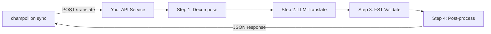

# カスタムメソッドをAPIとして提供する

champollion の **`api` メソッド**を使うと、任意の翻訳ペアを外部の HTTP エンドポイントに向けることができます。これにより、単一の LLM プロンプトでは対応できない複雑なパイプライン — 形態素解析器、有限状態トランスデューサー（FST）、複数ステップの LLM チェーン、または独自に構築したカスタム研究手法 — を統合できます。

このようなエンドポイントを立ち上げるには、主に2つの方法があります。

1. **`champollion serve`** — 既存の Champollion プロジェクトで設定されたスタック（メソッド、レジスター、コーチング、翻訳メモリ、品質ゲート）を、このコントラクトの背後で提供する1つのコマンドです。サーバーコードは不要です。[コード不要のパス](#the-zero-code-path-champollion-serve)を参照してください。
2. **カスタムサービス** — Champollion の外部に完全に存在するパイプライン向けに、コントラクトを実装した独自の HTTP サーバーを作成します。

## なぜ API サービスを使うのか

翻訳パイプラインの中には、単純なプロンプト・レスポンスのサイクルでは実行できないものがあります：

| パイプラインのステップ | 例 |
|---|---|
| **形態素分解** | 多合成語を翻訳前に形態素に分割する |
| **FST 検証** | 音韻規則または形態規則に違反する出力を拒否する |
| **複数ステップの LLM チェーン** | 異なるモデルを使った生成 → 検証 → 修正のサイクル |
| **辞書参照** | パイプラインの途中でキュレーション済みの対訳辞書を照合する |
| **ヒューマン・イン・ザ・ループ** | 不確かな翻訳を専門家によるレビューのためにキューに入れる |

`api` メソッドはパイプラインをブラックボックスとして扱います — champollion がソース文字列を送信し、サービスが翻訳を返します。内部で何が行われるかは完全にユーザー次第です。

## アーキテクチャ


```mermaid
graph LR
    A[champollion sync] -->|POST /translate| B[Your API Service]
    B --> C[Step 1: Decompose]
    C --> D[Step 2: LLM Translate]
    D --> E[Step 3: FST Validate]
    E --> F[Step 4: Post-process]
    F -->|JSON response| A
```

## コード不要のパス: `champollion serve`

パイプラインがすでに Champollion プロジェクト（設定済みのメソッド（LLM、Coached、またはエンジン）、レジスター、コーチングファイル、翻訳メモリ、決定論的品質ゲート）である場合、サーバーを記述する必要はまったくありません。`champollion serve` は、以下で説明する正確なコントラクトの背後に**ユーザー自身の設定済みスタック**を立ち上げます。

```bash
# Owner side — run from the project whose champollion.config.json defines the stack
CHAMPOLLION_SERVE_TOKEN=$(openssl rand -hex 24) npx champollion serve
# [OK] champollion serve listening on http://127.0.0.1:1822/translate
```

すべてのリクエストは、`champollion sync` が使用するのと同じパイプラインを通過します。

- **翻訳メモリ（TM）** — TM がすでに保持している文字列は、アップストリームプロバイダーにアクセスすることなく、キャッシュから無料で提供されます。ゲートによって検証された API 結果は、次のリクエストのためにキャッシュされます。
- **品質ゲート** — すべてのレスポンスは決定論的に検証されます（繰り返し、長さ比率、文字体系の適合性、ソースのエコー）。失敗した場合は、キーごとの構造化されたエラー（HTTP 207/422）として返され、暗黙的に品質が低下した出力として返されることは決してありません。
- **コストガード** — `--max-cost-per-request` および `--max-session-cost` は、プロバイダーの呼び出しが行われる前に、*推定*アップストリームコストが上限を超えるリクエストを拒否します。価格設定が不明なメソッドも上限下では拒否されます（不明なものは無料ではありません）。TM でカバーされているリクエストは既知の $0 であり、常に通過します。

サーバーはデフォルトで `127.0.0.1` にバインドされます。ポートに到達できる人なら誰でもアップストリームの API 予算を消費できるため、これを公開するのは明示的な決定となります（`--bind 0.0.0.0` と強力な Bearer トークンの併用）。`--no-auth` はループバックバインドとの組み合わせでのみ受け入れられます。IP ごとのレート制限とリクエストサイズの上限はデフォルトで有効になっています。詳細は `champollion serve --help` を参照してください。

### コンシューマーを接続する

コンシューマーがインストールするプラグインマニフェストを出力します（双方で1つのコマンドを実行）:

```bash
# Owner side
champollion serve --emit-manifest --endpoint https://translate.example.org
# [OK] Wrote ./my-project-serve/method.json
```

```bash
# Consumer side
champollion plugin install ./my-project-serve
```

```json title="champollion.config.json (consumer)"
{
  "pairs": {
    "en:crk": { "methodPlugin": "my-project-serve" }
  }
}
```

```bash
CHAMPOLLION_API_KEY=<the server's bearer token> champollion sync
```

コンシューマーの `api` メソッドは、ソース文字列をサーバーに POST します。スタックが翻訳、ゲート検証、キャッシュを行い、マニフェストの `qualityTier` は設定されたペアの忠実なパススルーとなります（異なる場合は最も保守的な階層になります）。プロンプト、コーチングデータ、プロバイダーキーがマシン外に出ることはありません。

このガイドの残りの部分では、**カスタム**サービスの作成について説明します。これは、パイプラインが Champollion プロジェクトではない場合（Python FST チェーン、独自の調査システムなど）に役立ちます。どちらの場合も、通信コントラクトは同一です。

## サービスのセットアップ

API サービスは、JSON を受け取って返す単一のエンドポイントを実装する必要があります：

### リクエストの形式

champollion は以下の JSON ボディを送信します（[api.js](https://github.com/gamedaysuits/Champollion/blob/main/cli/lib/methods/api.js) を参照）：

```json
POST /translate
Content-Type: application/json
Authorization: Bearer <CHAMPOLLION_API_KEY>

{
  "source_locale": "en",
  "target_locale": "crk",
  "method": "my-project-serve",
  "keys": {
    "greeting": "Hello, welcome to our app",
    "farewell": "Goodbye and thanks"
  }
}
```

| フィールド | 型 | 説明 |
|-------|------|-------------|
| `source_locale` | string | BCP 47 ソース言語コード |
| `target_locale` | string | BCP 47 ターゲット言語コード |
| `method` | string | プラグイン名または `"default"` |
| `keys` | object | 翻訳対象のキー → ソース文字列のマップ |
| `instructions` | object | エンドポイントが `"acceptsInstructions": true` を宣言している場合のみ: キー → キーごとのメモ（メッセージに必要な複数形、品質ゲートの再試行フィードバックなど） |
| `text_format` | string | Markdown ドキュメントテキストの場合は `"markdown"`（下記参照）、アプリ文字列の場合は省略 |

### レスポンス形式

サービスは `translations` オブジェクトを返す必要があります。任意の `meta` オブジェクトには、コストおよび診断情報を含めることができます。

```json
{
  "translations": {
    "greeting": "<the greeting, translated>",
    "farewell": "<the farewell, translated>"
  },
  "meta": {
    "model": "my-custom-pipeline/v1",
    "cost_usd": 0.0042,
    "method": "decompose-translate-validate"
  }
}
```

| フィールド | 型 | 必須 | 説明 |
|-------|------|----------|-------------|
| `translations` | object | ✅ | キー → 翻訳済み文字列のマップ |
| `meta` | object | — | 任意のメタデータ |
| `meta.cost_usd` | number | — | 存在する場合、Champollion の出力に表示されます |
| `errors` | object | — | 部分的な成功（HTTP 207）の場合: キー → `{ message }` のマップ |

### 最小限の Express サーバー

```javascript
import express from 'express';

const app = express();
app.use(express.json());

/**
 * champollion API contract:
 *
 * Request:  { source_locale, target_locale, method, keys: { "key": "source" } }
 * Response: { translations: { "key": "translated" }, meta: { ... } }
 */
app.post('/translate', async (req, res) => {
  const { source_locale, target_locale, method, keys } = req.body;

  const translations = {};

  for (const [key, source] of Object.entries(keys)) {
    // --- Your pipeline goes here ---
    // Step 1: Morphological decomposition
    const morphemes = await decompose(source, source_locale);

    // Step 2: LLM translation with context
    const draft = await llmTranslate(morphemes, target_locale);

    // Step 3: FST validation
    const validated = await fstValidate(draft, target_locale);

    // Step 4: Post-processing (orthography normalization, etc.)
    translations[key] = await postProcess(validated);
  }

  res.json({
    translations,
    meta: {
      model: 'my-custom-pipeline/v1',
      method: 'decompose-translate-validate',
    },
  });
});

app.listen(3001, () => {
  console.log('Translation API running on http://localhost:3001');
});
```

## Champollion の設定

`champollion.config.json` で、実行中のサービスを指すように翻訳ペアを設定します。

```json
{
  "inputLocale": "en",
  "pairs": {
    "en:crk": {
      "method": "api",
      "endpoint": "http://localhost:3001/translate",
      "register": "Formal Plains Cree. Use SRO orthography."
    }
  }
}
```

その後、通常どおり同期を実行します。

```bash
npx champollion sync
```

Champollion はソース文字列をエンドポイントに POST し、返された翻訳を `crk.json` に書き込みます。

### エンドポイントは指示に従いますか？

ペアの `"acceptsInstructions"`（またはプラグインの最上位の `method.json`）でそれを宣言します。

- **`false`** — `nmt-forge serve` などによってホストされるトレーニング済み NMT モデルは、テキストを翻訳するだけでそれ以外のことは行いません。2回質問されても同じ回答を返します。品質ゲートがその回答の1つを拒否した場合、Champollion はその回答を**再試行しません**（無駄な呼び出しになるため）。2回目の回答として判定されるのと同様に最初の回答を判定し（そのまま保持された名前は承認されます）、残りをペアの `fallback` に送信します。
- **`true`** — エンドポイントの背後にある LLM はキーごとのメモを使用できます。リクエストには `instructions` オブジェクトが含まれ、拒否されたキーはゲートのフィードバックとともに再試行されます。
- **未設定** — Champollion には判断できません。拒否されたキーはフィードバックなしで一度だけ再試行され、実行時にエンドポイントがそれを無視する可能性があることが示されます。

```json
{
  "pairs": {
    "en:crk": {
      "method": "api",
      "endpoint": "http://127.0.0.1:8378/translate",
      "acceptsInstructions": false,
      "fallback": { "method": "llm-coached" }
    }
  }
}
```

ここでのフォールバックはホストされたモデルです。すべてをこのマシン上に保持するには、代わりに `"fallback": { "method": "local", "model": "<your local model>" }` を使用します（どちらを使用すべきかについては[フォールバックメソッド](/docs/getting-started/configuration#fallback)を参照してください）。

## ケーススタディ: プレーンズ・クリー語パイプライン

:::info[開発中]
以下で説明するプレーンズ・クリー語のパイプラインは**現在活発に開発中**であり、まだ本番環境では稼働していません。ここでの詳細は現在の設計方針を反映したものであり、プロジェクトの進展に伴い変更される可能性があります。
:::

**arena** プロジェクトはこのパターンを実証しています。そのプレーンズ・クリー語パイプラインでは以下を使用しています。

1. **形態素分解** — 複統合的なクリー語の単語を、翻訳可能な形態素チェーンに分解
2. **LLM 翻訳** — コーチングデータ（SRO 正書法ルール、レジスター指示）を用いた、コンテキスト豊富な GPT-4o 翻訳
3. **FST 検証** — 有限状態トランスデューサーが、出力がクリー語の音韻規則に準拠していることをチェック
4. **信頼度スコアリング** — 各翻訳は、FST 通過率と辞書カバレッジに基づいた信頼度スコアを取得

パイプライン全体は、Champollion が `api` メソッド経由で呼び出す単一の HTTP エンドポイントとして実行されます。

### 評価の実行

翻訳後、ハーネスを直接使用して出力品質を評価できます。

```bash
# Clone the harness
git clone https://github.com/gamedaysuits/Champollion.git
cd Champollion/arena
python3 -m pip install -e .

# Run the evaluation against a real, non-bundled corpus
mt-eval run --corpus eval-amh-fra-globalvoices-test-v1 --model google/gemini-3.1-pro-preview --yes
```

これにより、リグレッションのベースラインとして使用できる chrF++、BLEU、完全一致スコアを含む構造化された評価レコードが生成されます。

## 認証

API で認証が必要な場合は、ペア上でそのトークンを保持する環境変数を指定するか（`"${VAR}"`、環境または `.env.local` から読み取られます）、`CHAMPOLLION_API_KEY` を設定します。Champollion はそのトークンのみをエンドポイントに送信し、他のプロバイダーのキーを送信することはありません。ループバックエンドポイント（`nmt-forge serve`, `champollion serve`）では認証は不要です。

```json
{
  "pairs": {
    "en:crk": {
      "method": "api",
      "endpoint": "https://my-mt-service.example.com/translate",
      "apiKey": "${CRK_API_KEY}"
    }
  }
}
```

コンテンツ（Markdown の本文）も同じコントラクトで送信されます。各ブロックが1つのキーとなり（ブロックごとの場合は `segment.<N>`、ページ全体の場合は `body`）、リクエストには `"text_format": "markdown"` が含まれるため、サーバーはドキュメントテキストとアプリ文字列を区別できます。このフィールドを認識しないサーバーは無視して構いません。

## データ主権

`api` メソッドは、**先住民族の言語コミュニティ**にとって特に重要です。翻訳パイプラインをセルフホストすることで、コミュニティは以下に対する完全な制御を維持できます。

- **専有のコーチングデータ** — レジスターの指示、正書法ルール、ドメイン用語集がコミュニティのインフラ外に出ることはありません。
- **言語リソース** — 厳選された辞書、FST 文法、長老によって検証された翻訳は、コミュニティの所有権の下に留まります。
- **アクセス権ポリシー** — エンドポイントを誰がどのような条件で呼び出せるかをコミュニティが決定します。

この設計は、言語データのコミュニティによる所有と管理という[先住民族のデータ主権の原則](/docs/network/community/low-resource-languages#data-sovereignty-principles)の方針に沿っています。機密性の高いい言語データは、サードパーティのプラットフォームではなく、コミュニティによって管理され続けます。

:::tip
最も強固なデータ主権の態勢を整えるには、`api` メソッドとプライベートデプロイ（コミュニティがホストする VM やオンプレミスサーバーなど）を組み合わせてください。`champollion serve` を使用すると、サーバーコードを記述することなく、まさにこのセルフホスト態勢をコミュニティに提供できます。コーチングデータ、プロバイダーキー、翻訳メモリはすべてコミュニティのインフラ上に保持されます。詳細な手順については、[低リソース言語のサポート](/docs/network/community/low-resource-languages)を参照してください。
:::

## コスト見積もり

`api` メソッドは、コスト見積もりのためにデフォルトで `null` を返します。価格設定はサービス側で管理されます。コストの透明性を提供したい場合は、API からメタデータ内に `cost` フィールドを返すようにします。

```json
{
  "translations": { "...": "..." },
  "metadata": {
    "cost": {
      "estimatedCost": 0.0042,
      "currency": "USD",
      "source": "my-service-pricing"
    }
  }
}
```

## ベストプラクティス

1. **失敗時は翻訳を返さない** — ソース文字列を「翻訳」として返さないでください。キーを `translations` から除外するか（または HTTP 207 とともに `errors` 配下で報告する）、キーはスキップされ、次回の同期で再試行されます。品質ゲートによって拒否された回答（空の文字列、ソースのエコーなど）は記憶され、通常の同期では誰かが `--redo keys:` で明示的に指定するまで、そのキーがエンドポイントに再度送信されることはありません（同じ回答に対して課金が発生するため）。
2. **信頼度スコアを含める** — パイプラインで品質を推定できる場合は、メタデータにそれを含めて返します。これは品質監査に役立ちます。
3. **ヘルスチェックを実装する** — `GET /health` エンドポイントを追加して、大規模な同期を開始する前に Champollion が接続性を確認できるようにします。
4. **適切にレート制限を行う** — パイプラインにスループットの制限がある場合は、`429` ステータスコードを返します。Champollion のバッチシステムがバックオフします。
5. **すべてをログに記録する** — マルチステップのパイプラインは気付かないうちに失敗することがあります。デバッグのために各ステップの入力/出力をログに記録してください。

## ライセンス

`api` メソッドのパターンは完全にオープンです — 独自の翻訳パイプラインを HTTP サービスとしてラップすることに関するライセンス上の制限はありません。`arena` eval ハーネスは AGPL-3.0-or-later（§7 eval-standard-plugin 例外付き）でライセンスされており、その条件のもとで研究・活用することができます。

## 関連項目

- [翻訳メソッド](/docs/guides/translation-methods) — すべての組み込みメソッド（`openai`、`google`、`api` など）の概要
- [プラグイン仕様](/docs/reference/plugin-spec) — `api` メソッドフィールドを含む `champollion.config.json` の完全なスキーマ
- [低リソース言語のサポート](/docs/network/community/low-resource-languages) — データ主権の原則を含む、リソースの乏しい言語向けのエンドツーエンドガイド
- [アーキテクチャ](/docs/concepts/architecture) — Champollion の同期ループ、バッチ処理、メソッドディスパッチの仕組み
- [MT 評価](/docs/network/leaderboard/rules) — 評価方法、メトリクス、リーダーボードへの提出プロセス
- [メソッドリーダーボード](/leaderboard) — メソッドおよび言語ペアにわたるリアルタイムの品質ランキング
