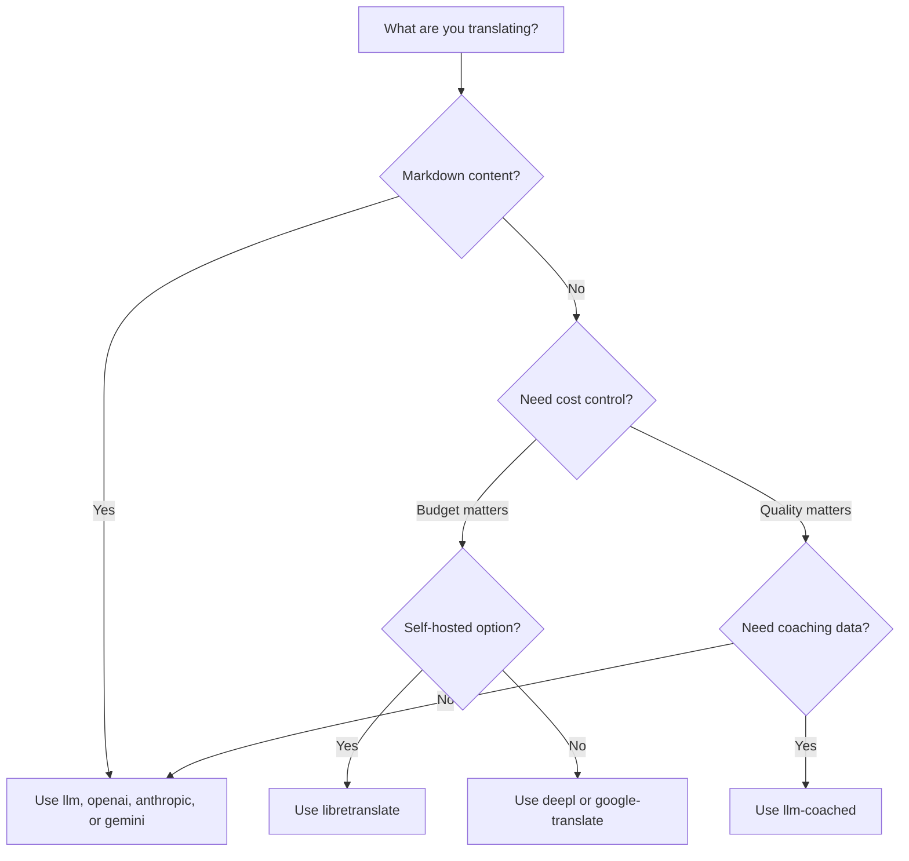

# 翻訳メソッド

Champollionは複数の翻訳メソッドをサポートしています。言語ペアごとに異なるメソッドを使用できるため、プロジェクト全体で1つのアプローチに縛られることはありません。

## メソッド比較

### LLM プロバイダー

品質重視、Markdown 対応、コーチング対応。コンテンツ量の多いプロジェクトに最適です。

| メソッド | キー | 機能 |
|--------|-----|-------------|
| `llm`（デフォルト） | `OPENROUTER_API_KEY` | OpenRouter 経由の LLM — 200以上のモデル、自動ルーティング |
| `llm-coached` | `OPENROUTER_API_KEY` | LLM ＋ 文法ルール、辞書、スタイルノート |
| `openai` | `OPENAI_API_KEY` | OpenAI API 直接接続（gpt-4o、gpt-4o-mini） |
| `anthropic` | `ANTHROPIC_API_KEY` | Anthropic API 直接接続（Claude Sonnet、Haiku、Opus） |
| `gemini` | `GEMINI_API_KEY` | Google Gemini API 直接接続（Flash、Pro）— 無料枠あり |

### 従来の MT

速度とコスト重視。大量のキーバリューペアに最適です。

| メソッド | キー | 説明 |
|--------|-----|-------------|
| `google-translate` | `GOOGLE_TRANSLATE_API_KEY` | Google Cloud Translation API v2 (194言語) |
| `deepl` | `DEEPL_API_KEY` | 用語集対応のDeepL API (33言語) |
| `microsoft-translator` | `MICROSOFT_TRANSLATOR_API_KEY` | Azure Cognitive Services Translator (135言語) |
| `libretranslate` | *(セルフホスト)* | セルフホスト型のLibreTranslate (AGPL、無料) |
| `tilde` | `TILDE_API_KEY` | Tilde MT — EU開発のエンジン、バルト語派およびヨーロッパ言語に強み |
| `translated` | `LARA_ACCESS_KEY_ID` + `LARA_ACCESS_KEY_SECRET` | Translated's Lara — プロフェッショナル向け適応型機械翻訳 (200言語) |

### インフラストラクチャー

| メソッド | キー | 機能 |
|--------|-----|-------------|
| `api` | *（プロバイダーごと）* | 任意の REST 翻訳エンドポイント向け軽量 HTTP クライアント |

## 決定ツリー



---

## `llm` — LLM 翻訳（デフォルト）

[OpenRouter](https://openrouter.ai) 上の任意の LLM を通じて翻訳します。これはデフォルトのメソッドであり、最も汎用性が高いです。

**動作の仕組み:**
1. キーをバッチ処理（デフォルト 80件/バッチ）し、レジスターとコンテキストの指示を付加
2. 構造化プロンプトとして OpenRouter に送信
3. JSON レスポンスを解析
4. [品質ゲート](/docs/concepts/quality-gate)を通じて各翻訳を検証
5. 合格した翻訳を書き込み、失敗した翻訳はリトライまたは棄却

**使用場面:** ほとんどのプロジェクト。特に Markdown を含むコンテンツ量の多いサイトで、コードブロックやショートコードをシールドする必要がある場合に適しています。

**設定:**

```json
{
  "defaultMethod": "llm",
  "model": "google/gemini-3.5-flash"
}
```

## `llm-coached` — コーチング付き LLM 翻訳

`llm` と同じですが、文法ルール、用語辞書、スタイルノートがすべてのプロンプトに注入されます。

**動作の仕組み:**
1. `.champollion/coaching/<locale>.json` またはプラグインの `coaching/` ディレクトリからコーチングデータを読み込む
2. 文法ルール、辞書用語、スタイルノートをシステムプロンプトに注入
3. ソースキーに一致する辞書用語は必須用語として含まれる
4. `llm` と同様に翻訳が進み、コーチングデータが精度を向上させる

**使用場面:** 低リソース言語、専門用語（法律、医療）、フォーマルなレジスター、または汎用 LLM の出力が十分に精確でない場合。

**コーチングデータの形式:**

```json title=".champollion/coaching/fr.json"
{
  "grammar_rules": [
    "French adjectives agree in gender and number with the noun they modify",
    "Use 'vous' for formal contexts, 'tu' for informal"
  ],
  "dictionary": {
    "dashboard": "tableau de bord",
    "deployment": "déploiement",
    "settings": "paramètres"
  },
  "style_notes": "Prefer active voice. Avoid anglicisms where a native French term exists."
}
```

関連情報: [低リソース言語ガイド](/docs/network/community/low-resource-languages)

---

## `openai` — OpenAI API 直接接続

OpenAI Chat Completions API を通じて直接翻訳します。OpenRouter を介さず、ご自身のキー、アカウント、使用状況ダッシュボードで管理できます。

**モデル:** `gpt-4o`（デフォルト）、`gpt-4o-mini`

**機能:**
- ✅ Markdown 対応（コンテンツ翻訳）
- ✅ コーチングサポート（文法ルール、辞書オーバーライド、スタイルノート）
- ✅ 構造化キーバリュー出力のための JSON モード
- ✅ 指数バックオフによるリトライ

**設定:**

```json
{
  "pairs": {
    "en:fr": { "method": "openai", "model": "gpt-4o-mini" }
  }
}
```

```bash
export OPENAI_API_KEY=sk-proj-...
```

キーの取得は [platform.openai.com/api-keys](https://platform.openai.com/api-keys) から。

## `anthropic` — Anthropic API 直接接続

Anthropic Messages API を通じて直接翻訳します。コーチングデータに `system` パラメーターを使用し、Anthropic のプロンプトキャッシングを有効にします。

**モデル:** `claude-sonnet-4-6`（デフォルト）、`claude-haiku-4-5`、`claude-opus-4-7`

**機能:**
- ✅ Markdown 対応（コンテンツ翻訳）
- ✅ コーチングサポート（文法ルール、辞書オーバーライド、スタイルノート）
- ✅ システムプロンプトキャッシング（バッチ間でコーチングコストを分散）
- ✅ 指数バックオフによるリトライ

**設定:**

```json
{
  "pairs": {
    "en:ja": { "method": "anthropic", "model": "claude-haiku-4-5" }
  }
}
```

```bash
export ANTHROPIC_API_KEY=sk-ant-...
```

キーの取得は [console.anthropic.com](https://console.anthropic.com/settings/keys) から。

## `gemini` — Google Gemini API 直接接続

Google Gemini `generateContent` API を通じて直接翻訳します。**無料枠あり** — ゼロコストで始めるのに最適です。

**モデル:** `gemini-2.5-flash`（デフォルト）、`gemini-2.5-pro`

**機能:**
- ✅ Markdown 対応（コンテンツ翻訳）
- ✅ コーチングサポート（文法ルール、辞書オーバーライド、スタイルノート）
- ✅ `responseMimeType` による JSON レスポンスモード
- ✅ 無料枠（寛大な日次クォータ）
- ✅ 指数バックオフによるリトライ

**設定:**

```json
{
  "pairs": {
    "en:ko": { "method": "gemini", "model": "gemini-2.5-pro" }
  }
}
```

```bash
export GEMINI_API_KEY=AI...
```

キーの取得は [aistudio.google.com/apikey](https://aistudio.google.com/apikey) から。

### モデルの検証 {#model-validation}

直接 LLM プロバイダー（`openai`、`anthropic`、`gemini`）は、初回使用時にモデル文字列を検証します。これにより、3種類のミスを検出できます。

**メソッド形式の誤り** — 直接プロバイダーに OpenRouter 形式のモデルパスを使用している場合:

```
[WARN] OpenAI: model "google/gemini-3.5-flash" looks like an OpenRouter path.
       Direct providers use bare model names (e.g., "gpt-4o").
       To use OpenRouter models, set method to 'llm' instead.
```

**プロバイダーの誤り** — 別のプロバイダーのモデルを使用している場合:

```
[WARN] Gemini: model "claude-sonnet-4-6" is an Anthropic model.
       This provider (gemini) cannot serve Anthropic models.
       Use --method anthropic or set "method": "anthropic" in config.
```

**非推奨またはスペルミスのモデル** — 最初の API 呼び出し時に、champollion はプロバイダーのライブモデルリストを取得し、指定したモデルと照合します:

```
[WARN] Gemini: model "gemini-1.5-flash" not found in available models.
       Similar models: gemini-2.0-flash, gemini-2.5-flash, gemini-2.5-pro
       The API call will proceed — the provider will give the final verdict.
```

:::note[これは警告であり、エラーではありません]
モデルの検証は警告をログに記録しますが、API 呼び出しをブロックしません。プロバイダーの API が最終的な判断を下します — 将来のモデル名が異なるパターンに一致する可能性があるため、ヒューリスティックに基づいてゲートを設けることは避けています。
:::

---

## `google-translate` — Google Cloud Translation API

Google Cloud Translation API v2 との直接統合。REST API を使用します。SDK もサービスアカウントも不要で、API キーだけで利用できます。

**使用する場面:** ニュアンスよりもスピードとコストが重視される、大量のキーと値の文字列ペア。標準で194言語をサポートしています（[Googleの公開リスト](https://docs.cloud.google.com/translate/docs/languages)）。

**制限事項:**
- ⚠️ **Markdown 非対応。** コードブロック、ショートコード、補間変数が破損します。
- レジスター/トーン制御なし
- コーチングや用語の強制適用なし

```bash
npx champollion sync --method google-translate
```

:::tip[自動検出]
`GOOGLE_TRANSLATE_API_KEY` のみが設定されている場合（OpenRouter キーなし）、champollion は自動的に Google Translate に切り替えます。設定の変更は不要です。
:::

## `deepl` — DeepL API

DeepL 翻訳 API との直接統合。一貫した用語のために用語集をサポートしています。

**使用場面:** DeepL が優れているヨーロッパ言語（ドイツ語、フランス語、スペイン語、オランダ語、ポーランド語など）。用語集サポートにより、コーチングデータなしで一貫した用語を強制適用できます。

**機能:**
- ✅ 無料/プロエンドポイントの自動検出（無料キーの `:fx` サフィックス）
- ✅ 用語集の作成と管理
- ✅ 丁寧さレベルの制御
- ⚠️ **Markdown 非対応** — キーバリューペアのみ

**設定:**

```json
{
  "pairs": {
    "en:de": { "method": "deepl" }
  }
}
```

```bash
export DEEPL_API_KEY=your-key-here
```

キーの取得は [deepl.com/pro-api](https://www.deepl.com/pro-api) から。

## `microsoft-translator` — Azure Cognitive Services

Microsoft Translator Text API v3 との直接統合。

**使用する場面:** 既存のAzureインフラストラクチャを持つエンタープライズ環境。Google翻訳がカバーしていない一部の言語（チベット語、フェロー語、イヌクティトゥット語など）を含む135言語をサポートしています。

**機能:**
- ✅ リクエストあたり最大100セグメント（高スループット）
- ✅ レイテンシー最適化のためのオプションのリージョンパラメーター
- ⚠️ **Markdown 非対応** — キーバリューペアのみ
- ⚠️ **コンテンツ翻訳非対応** — キーバリューペアのみ

**設定:**

```json
{
  "pairs": {
    "en:ar": { "method": "microsoft-translator" }
  }
}
```

```bash
export MICROSOFT_TRANSLATOR_API_KEY=your-key
export MICROSOFT_TRANSLATOR_REGION=global  # optional
```

キーの取得は [Azure Portal](https://portal.azure.com) → Cognitive Services → Translator から。

## `libretranslate` — セルフホスト翻訳

LibreTranslate を使用したセルフホストのオープンソース翻訳。ローカルまたは独自のインフラ上で動作します。API コストゼロ、完全なデータ主権を実現します。

**使用場面:** オフライン翻訳、データプライバシーコンプライアンス（GDPR）、またはゼロコスト運用が必要なプロジェクト。外部 API に依存すべきでない CI パイプラインに特に有用です。

**機能:**
- ✅ セルフホスト — 外部 API 呼び出しなし
- ✅ 無料かつオープンソース（AGPL-3.0）
- ✅ Docker デプロイメント対応
- ⚠️ **Markdown 非対応** — キーバリューペアのみ
- ⚠️ **コンテンツ翻訳非対応** — キーバリューペアのみ
- ⚠️ 言語ペアによって品質が異なる

**セットアップ:**

```bash
# Run LibreTranslate locally with Docker
docker run -d -p 5000:5000 libretranslate/libretranslate

# Configure (optional — defaults to localhost:5000)
export LIBRETRANSLATE_API_URL=http://localhost:5000/translate
```

```json
{
  "pairs": {
    "en:es": { "method": "libretranslate" }
  }
}
```

---

## `api` — リモート翻訳 API

コミュニティホストまたは IP 保護された翻訳エンドポイント向けの軽量 HTTP クライアントです。Champollion はキーを送信して翻訳を受け取るだけで、翻訳ロジックは一切含まれていません。

**使用場面:** 翻訳メソッドがサーバーサイドでホストされている場合（例: 独自のコーチングデータ、ファインチューニング済みモデル、配布できない FST パイプライン）。

```json
{
  "pairs": {
    "en:crk": {
      "method": "api",
      "endpoint": "https://api.example.com/v1/translate",
      "apiKey": "your-key"
    }
  }
}
```

:::note[コミュニティ管理の翻訳 (主権の実現を目指す sovereignty-aspirant)]
`api` メソッドは、**コミュニティの管理下にあるコミュニティホスト型翻訳（主権の実現を目指す sovereignty-aspirant）** への架け橋となります。先住民や少数言語のコミュニティは、独自の翻訳エンドポイントをホストすることで、コーチングデータ、ファインチューニングされたモデル、言語的IP（知的財産）をコミュニティの管理下に置くことができます。その間、Champollionはシンクライアントとしてそれらに接続します。

コミュニティホスティングの詳細なウォークスルーは [低リソース言語のサポート](/docs/network/community/low-resource-languages) を、エンドポイント要件は [API によるメソッドの提供](/docs/guides/serving-a-method) をご覧ください。
:::

---

## 言語ペアごとの設定

真の強みは、言語ペアごとにメソッドを組み合わせることにあります。

```json title="champollion.config.json"
{
  "version": 3,
  "pairs": {
    "en:fr": { "method": "deepl" },
    "en:ja": { "method": "openai", "model": "gpt-4o" },
    "en:ko": { "method": "gemini" },
    "en:ar": { "method": "microsoft-translator" },
    "en:crk": { "methodPlugin": "crk-coached-v1" }
  }
}
```

これにより、フランス語は DeepL（用語集サポート）、日本語は OpenAI（品質）、韓国語は Gemini（無料枠）、アラビア語は Microsoft Translator（カバレッジ）、Plains Cree はコーチング付きプラグイン（専門特化）でそれぞれ翻訳されます。

## プラグイン

プラグインは特定の言語ペア向けに事前パッケージ化された翻訳レシピです。コードではなく JSON マニフェストであり、使用するメソッド、設定内容、ベンチマーク済みの品質をchampollion に伝えます。

:::tip[評価ハーネスから本番環境へ、コマンド一つで]
[評価ハーネス](/docs/network/specifications/harness)で開発・検証されたプラグインは、そのまま直接インストールできます — そこで検証したメソッドは、`plugin install` コマンド一つでここにデプロイされます。完全な評価ワークフローについては、[MT 評価](/docs/network/leaderboard/rules)をご覧ください。
:::

```bash
champollion plugin install ./french-formal-v1/
champollion plugin list
champollion plugin remove french-formal-v1
```

完全なマニフェスト形式については [プラグイン仕様](/docs/reference/plugin-spec) をご覧ください。

---

## プロバイダーの切り替え

メソッド間を移行する場合、モデル形式と環境変数が変わります。対応表は以下のとおりです。

### OpenRouter → 直接プロバイダー

```diff title="champollion.config.json"
 {
   "pairs": {
     "en:fr": {
-      "method": "llm",
-      "model": "openai/gpt-4o"
+      "method": "openai",
+      "model": "gpt-4o"
     }
   }
 }
```

```diff title="Environment variables"
- export OPENROUTER_API_KEY=sk-or-v1-...
+ export OPENAI_API_KEY=sk-proj-...
```

**主な違い:**
- OpenRouter は `provider/model` 形式を使用します（例: `openai/gpt-4o`）。直接プロバイダーはベアモデル名を使用します（例: `gpt-4o`）。
- 直接プロバイダーにはそれぞれ固有の環境変数があります（`OPENAI_API_KEY`、`ANTHROPIC_API_KEY`、`GEMINI_API_KEY`）。
- 誤ったモデル形式を使用した場合、champollion が警告を表示します。詳細は [モデルの検証](#model-validation) をご覧ください。

### 直接プロバイダー → OpenRouter

```diff title="champollion.config.json"
 {
   "pairs": {
     "en:ja": {
-      "method": "anthropic",
-      "model": "claude-sonnet-4-6"
+      "method": "llm",
+      "model": "anthropic/claude-sonnet-4-6"
     }
   }
 }
```

:::tip[OpenRouter と Direct の使い分け]
**OpenRouter を使用する**のは、環境変数を変更せずにモデルを切り替えたい場合や、単一のキーで 200 以上のモデルにアクセスしたい場合です。**直接プロバイダーを使用する**のは、シンプルな課金体系を望む場合、レイテンシを低減したい場合（中間業者なし）、または Anthropic のプロンプトキャッシングのようなプロバイダー固有の機能にアクセスしたい場合です。
:::

---

## コスト比較

1,000件の翻訳キーあたりのおおよそのコスト（キーあたり約10トークン、バッチあたり80キーを想定）:

| メソッド | 1Kキーあたりのコスト | 速度 | 品質 | 最適な用途 |
|--------|----------------|-------|---------|----------|
| `gemini`（Flash） | **無料**（枠内） | 速い | 良好 | 入門、個人プロジェクト |
| `google-translate` | 約$0.02 | 最速 | 十分 | 大量処理、ヨーロッパ言語 |
| `deepl` | 約$0.02 | 速い | 良好 | ヨーロッパ言語、用語管理 |
| `microsoft-translator` | 約$0.01 | 速い | 十分 | Azure 環境、幅広い言語カバレッジ |
| `libretranslate` | **無料**（セルフホスト） | 可変 | 普通 | エアギャップ、GDPR、CI パイプライン |
| `gemini`（Pro） | 約$0.07 | 中程度 | 非常に良好 | 品質重視、無料クォータあり |
| `openai`（GPT-4o-mini） | 約$0.01 | 速い | 良好 | 低コスト LLM |
| `openai`（GPT-4o） | 約$0.10 | 中程度 | 非常に良好 | 品質重視 |
| `anthropic`（Haiku） | 約$0.01 | 速い | 良好 | 低コスト LLM |
| `anthropic`（Sonnet） | 約$0.10 | 中程度 | 非常に良好 | 品質重視 |
| `anthropic`（Opus） | 約$0.50 | 遅い | 優秀 | 最高品質 |
| `llm`（OpenRouter） | モデルによる | 可変 | 可変 | モデル比較、実験 |

:::note[これらは概算です]
実際のコストは、ソーステキストの長さ、バッチサイズ、およびプロバイダーの料金変更によって異なります。正確な料金については、各プロバイダーの最新の料金ページをご確認ください。
:::

---

## 関連項目

- [サポート言語](/docs/reference/supported-languages)
- [コーチングデータ](/docs/concepts/coaching-data)
- [低リソース言語のサポート](/docs/network/community/low-resource-languages)
- [プラグイン仕様](/docs/reference/plugin-spec)
- [API によるメソッドの提供](/docs/guides/serving-a-method)
- [品質ゲート](/docs/concepts/quality-gate)
- [アーキテクチャー](/docs/concepts/architecture)
- [トラブルシューティング](/docs/guides/troubleshooting) — モデルエラー、API の問題
