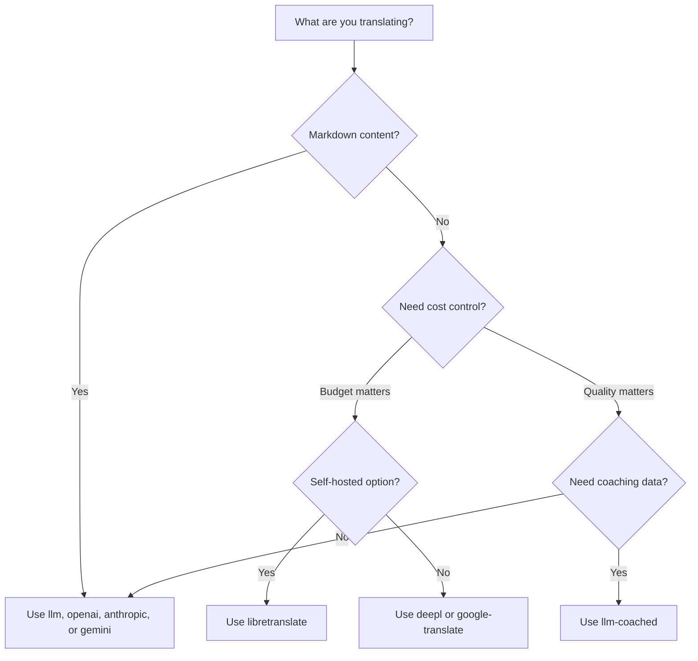

# 翻訳メソッド

Champollionは複数の翻訳方式に対応しています。言語ペアごとに異なる方式を使用できるため、プロジェクト全体で1つのアプローチに縛られることはありません。

## メソッド比較

### LLM プロバイダー

品質重視、Markdown 対応、コーチング対応。コンテンツ量の多いプロジェクトに最適です。

| 方式 | キー | 説明 |
|------|-----|-------------|
| `llm`（デフォルト） | `OPENROUTER_API_KEY` | OpenRouter経由のLLM — 200以上のモデル、自動ルーティング |
| `llm-coached` | `OPENROUTER_API_KEY` | LLM + 文法規則、辞書、スタイルメモ |
| `openai` | `OPENAI_API_KEY` | OpenAI API直接（gpt-4o、gpt-4o-mini） |
| `anthropic` | `ANTHROPIC_API_KEY` | Anthropic API直接（Claude Sonnet、Haiku、Opus） |
| `gemini` | `GEMINI_API_KEY` | Google Gemini API直接（Flash、Pro）— 無料枠あり |
| `local` | *（なし）* | 自前のマシンやサーバー上のモデル: Ollama、vLLM、LM Studio、llama.cpp、または`nmt-forge`でトレーニングしたモデル。テキストがインフラ外に出ることはありません |

### 従来の MT

速度とコスト重視。大量のキーバリューペアに最適です。

| 方式 | キー | 説明 |
|------|-----|-------------|
| `google-translate` | `GOOGLE_TRANSLATE_API_KEY` | Google Cloud Translation API v2（194言語） |
| `deepl` | `DEEPL_API_KEY` | 用語集対応のDeepL API（33言語） |
| `microsoft-translator` | `MICROSOFT_TRANSLATOR_API_KEY` | Azure Cognitive Services Translator（135言語） |
| `libretranslate` | *（セルフホスト）* | セルフホストのLibreTranslate（AGPL、無料） |
| `tilde` | `TILDE_API_KEY` | Tilde MT — EUで開発されたエンジン、バルト系およびヨーロッパの言語に強い |
| `translated` | `LARA_ACCESS_KEY_ID` + `LARA_ACCESS_KEY_SECRET` | TranslatedのLara — プロ向け適応型MT（200言語） |

### インフラストラクチャー

| メソッド | キー | 機能 |
|--------|-----|-------------|
| `api` | *（プロバイダーごと）* | 任意の REST 翻訳エンドポイント向け軽量 HTTP クライアント |

## 決定ツリー


```mermaid
flowchart TD
    A["What are you translating?"] --> B{"Markdown content?"}
    B -->|Yes| C["Use llm, openai, anthropic, or gemini"]
    B -->|No| D{"Need cost control?"}
    D -->|Budget matters| E{"Self-hosted option?"}
    D -->|Quality matters| F{"Need coaching data?"}
    E -->|Yes| G["Use libretranslate"]
    E -->|No| H["Use deepl or google-translate"]
    F -->|Yes| I["Use llm-coached"]
    F -->|No| C
```

---

## `llm` — LLM 翻訳（デフォルト）

[OpenRouter](https://openrouter.ai) 上の任意の LLM を通じて翻訳します。これはデフォルトのメソッドであり、最も汎用性が高いです。

**動作の仕組み:**
1. キーをバッチ処理（デフォルト 80件/バッチ）し、レジスターとコンテキストの指示を付加
2. 構造化プロンプトとして OpenRouter に送信
3. JSON レスポンスを解析
4. [品質ゲート](/docs/concepts/quality-gate)を通じて各翻訳を検証
5. 合格した翻訳を書き込み、失敗した翻訳はリトライまたは棄却

**使用場面:** ほとんどのプロジェクト。特に Markdown を含むコンテンツ量の多いサイトで、コードブロックやショートコードをシールドする必要がある場合に適しています。

**設定:**

```json
{
  "defaultMethod": "llm",
  "model": "google/gemini-3.8-flash"
}
```

## `llm-coached` — コーチング付き LLM 翻訳

`llm` と同じですが、文法ルール、用語辞書、スタイルノートがすべてのプロンプトに注入されます。

**動作の仕組み:**
1. `.champollion/coaching/<locale>.json` またはプラグインの `coaching/` ディレクトリからコーチングデータを読み込む
2. 文法ルール、辞書用語、スタイルノートをシステムプロンプトに注入
3. ソースキーに一致する辞書用語は必須用語として含まれる
4. `llm` と同様に翻訳が進み、コーチングデータが精度を向上させる

**使用場面:** 低リソース言語、専門用語（法律、医療）、フォーマルなレジスター、または汎用 LLM の出力が十分に精確でない場合。

**コーチングデータの形式:**

```json title=".champollion/coaching/fr.json"
{
  "grammar_rules": [
    "French adjectives agree in gender and number with the noun they modify",
    "Use 'vous' for formal contexts, 'tu' for informal"
  ],
  "dictionary": {
    "dashboard": "tableau de bord",
    "deployment": "déploiement",
    "settings": "paramètres"
  },
  "style_notes": "Prefer active voice. Avoid anglicisms where a native French term exists."
}
```

関連情報: [低リソース言語ガイド](/docs/network/community/low-resource-languages)

---

## `openai` — OpenAI API 直接接続

OpenAI Chat Completions API を通じて直接翻訳します。OpenRouter を介さず、ご自身のキー、アカウント、使用状況ダッシュボードで管理できます。

**モデル:** `gpt-5.4-mini-2026-03-17`（デフォルト — 日付指定スナップショット）、またはOpenAIがリストしている任意の正確なモデルID

**機能:**
- ✅ Markdown対応（コンテンツ翻訳）
- ✅ `llm`と同じプロンプト — レジスター、性別の指針、プロンプトのコンテキスト、保護された用語、`coachingFile`の指針、および各バッチの用語集の語句（[以下を参照](#one-prompt-every-llm-method)）
- ✅ 構造化されたキー・値出力のためのJSONモード
- ✅ リトライ付きのエクスポネンシャルバックオフ

**設定:**

```json
{
  "pairs": {
    "en:fr": { "method": "openai", "model": "gpt-4o-mini" }
  }
}
```

```bash
export OPENAI_API_KEY=sk-proj-...
```

キーの取得は [platform.openai.com/api-keys](https://platform.openai.com/api-keys) から。

## `local` — 自前のモデル（Ollama、vLLM、LM Studio、トレーニング済みモデル）

ご自身が実行している**OpenAI互換**エンドポイントの背後にある任意のモデルで翻訳します: Ollama、vLLM、LM Studio、llama.cppのサーバー、または`nmt-forge`でトレーニングしたモデル。APIキーは不要で、テキストがサードパーティに送信されることもありません。機密性の高いテキストに適した方式であり、ご自身で構築したモデルをデプロイする際にも使用します。

```json
{ "defaultMethod": "local", "model": "llama3.1" }
```

```bash
# Optional: only if your server is not at Ollama's default address
export LOCAL_API_BASE=http://localhost:11434/v1
npx champollion sync --method local
```

エンドポイントは、`LOCAL_API_BASE`、`OPENAI_API_BASE`、`OPENAI_BASE_URL`、そしてOllamaのデフォルトである`http://localhost:11434/v1`の順に読み取られます。エンドポイントがこのマシン上にある場合（`localhost`、`127.0.0.1`、`::1`）、コストは**$0 API cost (runs on this machine)**と表示されます。API請求は発生せず、ハードウェアや電力の消費はカウントされません。そして`--max-cost`は実行を許可します。それ以外のエンドポイント（Groq、Together、ネットワーク上のサーバー）は、ツール側で請求額を把握できないため、$0ではなく**unknown**と報告され、`--max-cost`は推測せずに実行を拒否します。`--json`では、見積もり行に前者の場合は`"estimatedCost": 0, "local": true`が、後者の場合は`"estimatedCost": null`が表示されます。（有料APIに転送するこのマシン上のプロキシ — LiteLLMやゲートウェイ — は上流で課金されますが、Champollionからは検知できません。そちら側で予算を管理してください。）

翻訳を開始する前に、syncはエンドポイントでサーバーが応答するかを確認します。応答がない場合、データを送信しようとする実行は何も送信せずに停止し（終了コード `1`）、アドレスを表示します。何も送信しない実行 — キューが空であるか、翻訳済みテキストの再実行のようにキュー内のすべてのキーがキャッシュから取得される場合 — は、サーバーが停止している旨の警告を出して続行します。CIランナー上（`CI`または`GITHUB_ACTIONS`が設定されている場合）では、応答しないサーバーがあると、キューが空の実行であってもすべての実行が停止します。これにより、依然として`local`を使用しているワークフローが、文字列が変更されたときではなく最初のプッシュ時に失敗するようになります（[CIガイド](/docs/guides/ci-cd)）。

`openai`方式は、キーを使用して任意のOpenAI互換プロバイダー（Groq、Togetherなど）に接続するための同じ`OPENAI_API_BASE` / `OPENAI_BASE_URL`の上書きを受け入れます。

## `anthropic` — Anthropic API 直接接続

Anthropic Messages API経由で直接翻訳します。指示は`system`パラメータに渡され、Anthropicのプロンプトキャッシングが有効になります。

**モデル:** `claude-sonnet-4-6`（デフォルト）、`claude-haiku-4-5`、`claude-opus-4-7`

**機能:**
- ✅ Markdown対応（コンテンツ翻訳）
- ✅ `llm`と同じプロンプト — レジスター、性別の指針、プロンプトのコンテキスト、保護された用語、`coachingFile`の指針、および各バッチの用語集の語句（[以下を参照](#one-prompt-every-llm-method)）
- ✅ システムプロンプトキャッシング（バッチ間で指示のコストを償却）
- ✅ リトライ付きのエクスポネンシャルバックオフ

**設定:**

```json
{
  "pairs": {
    "en:ja": { "method": "anthropic", "model": "claude-haiku-4-5" }
  }
}
```

```bash
export ANTHROPIC_API_KEY=sk-ant-...
```

キーの取得は [console.anthropic.com](https://console.anthropic.com/settings/keys) から。

## `gemini` — Google Gemini API 直接接続

Google Gemini `generateContent` API を通じて直接翻訳します。**無料枠あり** — ゼロコストで始めるのに最適です。

**モデル:** `gemini-3.8-flash`（デフォルト）、またはGoogleがリストしている任意の正確なモデルID

**機能:**
- ✅ Markdown対応（コンテンツ翻訳）
- ✅ `llm`と同じプロンプト — レジスター、性別の指針、プロンプトのコンテキスト、保護された用語、`coachingFile`の指針、および各バッチの用語集の語句（[以下を参照](#one-prompt-every-llm-method)）
- ✅ `responseMimeType`によるJSONレスポンスモード
- ✅ 無料枠あり（十分な日次クォータ）
- ✅ リトライ付きのエクスポネンシャルバックオフ

**設定:**

```json
{
  "pairs": {
    "en:ko": { "method": "gemini", "model": "gemini-2.5-pro" }
  }
}
```

```bash
export GEMINI_API_KEY=AI...
```

キーの取得は [aistudio.google.com/apikey](https://aistudio.google.com/apikey) から。

### すべてのLLM方式で統一された1つのプロンプト {#one-prompt-every-llm-method}

`llm`、`openai`、`anthropic`、`gemini`、および`local`は、同じプロジェクトに対して同一の指示を送信します。異なるのはリクエストの送信先のみです。システムメッセージには、レジスター、言語の性別の指針、`promptContext`、`protectedTerms`、および`coachingFile`のテキストが含まれます。各バッチのメッセージには、そこに含まれる用語集の語句（`.champollion/coaching/<locale>.json`内の`dictionary`）、キーごとの指示（複数形、gettextコンテキスト、説明文）、および対象の文字列が含まれます。実際のプロンプトを確認してください（何も送信されません）:

```bash
npx champollion sync --dry --method local --show-prompt
```

コーチングファイルの文法規則とスタイルメモは、任意のプロバイダーにおいて`llm-coached`によって読み取られます: `{ "method": "llm-coached", "provider": "openai" }`。

### モデル名 {#model-names}

直接プロバイダーには、そのプロバイダー独自のモデル名が送信されます。プロバイダーがそのモデルを提供している場合、OpenRouter形式のIDがマッピングされます: `openai`では`openai/gpt-5.5` → `gpt-5.5`、`anthropic`では`anthropic/claude-haiku-4.5` → `claude-haiku-4-5`、`gemini`では`google/gemini-3.8-flash` → `gemini-3.8-flash`。プロバイダーに対応するモデルがないIDが指定された場合、何も送信される前に実行が停止します:

```
[ERR] sync failed: en:fr: model "google/gemini-3.8-flash" (from the top-level "model") is an OpenRouter model id
      — openai calls OpenAI directly, which has no model by that name. Use an OpenAI model (e.g. --model gpt-4o),
      --method gemini (its name for it: "gemini-3.8-flash") or --method llm to run it through OpenRouter.
```

`local`、および`OPENAI_API_BASE`で別のサーバーに向けられた`openai`は、入力された名前をそのまま送信し、その意味の解決はそのサーバーに委ねられます。

### 正確なスラッグのみ受け付け {#exact-slugs}

すべてのモデルは、すべての方式において正確なスラッグで指定されます: OpenRouterでの`google/gemini-3.8-flash`、`openai`での直接プロバイダー自身の正確な名前（`gpt-5.5`）。短縮名がモデルに解決されることはなく、変動するID（OpenRouterの`~vendor/…`ルーターIDや、任意の`…-latest`または`:latest`名）も拒絶されます。これらはプロバイダーがその時点で割り当てているモデルを指すため、どのモデルが翻訳したかを特定できなくなるからです。どちらの場合も、何も送信される前に実行が停止します:

```
[ERR] sync failed: "gemini-flash" (from --model) is not a model id — Champollion takes exact model slugs only,
      no aliases. Did you mean google/gemini-3.8-flash (what "gemini-flash" used to stand for)? List models:
      https://openrouter.ai/models (OpenRouter slugs), or champollion models --method <gemini|openai|anthropic>
      (a direct provider's own names).
```

### モデルの検証 {#model-validation}

直接LLMプロバイダー（`openai`、`anthropic`、`gemini`）も、初回使用時にモデル名をチェックします（`OPENAI_API_BASE`経由で別のサーバーと通信している場合は除きます）。これにより、2つのカテゴリのミスを防ぐことができます:

**プロバイダーの誤り** — 別のプロバイダーのモデルを使用している場合:

```
[WARN] Gemini: model "claude-sonnet-4-6" is an Anthropic model.
       This provider (gemini) cannot serve Anthropic models.
       Use --method anthropic or set "method": "anthropic" in config.
```

**非推奨またはスペルミスのモデル** — 最初の API 呼び出し時に、champollion はプロバイダーのライブモデルリストを取得し、指定したモデルと照合します:

```
[WARN] Gemini: model "gemini-1.5-flash" not found in available models.
       Similar models: gemini-2.0-flash, gemini-2.5-flash, gemini-2.5-pro
       The API call will proceed — the provider will give the final verdict.
```

:::note[これは警告であり、エラーではありません]
モデルの検証は警告をログに記録しますが、API 呼び出しをブロックしません。プロバイダーの API が最終的な判断を下します — 将来のモデル名が異なるパターンに一致する可能性があるため、ヒューリスティックに基づいてゲートを設けることは避けています。
:::

---

## `google-translate` — Google Cloud Translation API

Google Cloud Translation API v2 との直接統合。REST API を使用します。SDK もサービスアカウントも不要で、API キーだけで利用できます。

**適用場面:** ニュアンスよりも処理速度とコストが重要となる、大量のキー・値文字列ペア。初期状態で194言語に対応しています（[Googleの公開リスト](https://docs.cloud.google.com/translate/docs/languages)）。

**制限事項:**
- ⚠️ **Markdown 非対応。** コードブロック、ショートコード、補間変数が破損します。
- レジスター/トーン制御なし
- コーチングや用語の強制適用なし

```bash
npx champollion sync --method google-translate
```

:::tip[自動検出]
`GOOGLE_TRANSLATE_API_KEY` のみが設定されている場合（OpenRouter キーなし）、champollion は自動的に Google Translate に切り替えます。設定の変更は不要です。
:::

## `deepl` — DeepL API

DeepL 翻訳 API との直接統合。一貫した用語のために用語集をサポートしています。

**使用場面:** DeepL が優れているヨーロッパ言語（ドイツ語、フランス語、スペイン語、オランダ語、ポーランド語など）。用語集サポートにより、コーチングデータなしで一貫した用語を強制適用できます。

**機能:**
- ✅ 無料/プロエンドポイントの自動検出（無料キーの `:fx` サフィックス）
- ✅ 用語集の作成と管理
- ✅ 丁寧さレベルの制御
- ⚠️ **Markdown 非対応** — キーバリューペアのみ

**設定:**

```json
{
  "pairs": {
    "en:de": { "method": "deepl" }
  }
}
```

```bash
export DEEPL_API_KEY=your-key-here
```

キーの取得は [deepl.com/pro-api](https://www.deepl.com/pro-api) から。

## `microsoft-translator` — Azure Cognitive Services

Microsoft Translator Text API v3 との直接統合。

**適用場面:** 既存のAzureインフラを活用するエンタープライズ環境。Google翻訳がカバーしていない一部の言語（チベット語、フェロー語、イヌクティトゥット語など）を含む、135言語に対応しています。

**機能:**
- ✅ リクエストあたり最大100セグメント（高スループット）
- ✅ レイテンシー最適化のためのオプションのリージョンパラメーター
- ⚠️ **Markdown 非対応** — キーバリューペアのみ
- ⚠️ **コンテンツ翻訳非対応** — キーバリューペアのみ

**設定:**

```json
{
  "pairs": {
    "en:ar": { "method": "microsoft-translator" }
  }
}
```

```bash
export MICROSOFT_TRANSLATOR_API_KEY=your-key
export MICROSOFT_TRANSLATOR_REGION=global  # optional
```

キーの取得は [Azure Portal](https://portal.azure.com) → Cognitive Services → Translator から。

## `libretranslate` — セルフホスト翻訳

LibreTranslate を使用したセルフホストのオープンソース翻訳。ローカルまたは独自のインフラ上で動作します。API コストゼロ、完全なデータ主権を実現します。

**使用場面:** オフライン翻訳、データプライバシーコンプライアンス（GDPR）、またはゼロコスト運用が必要なプロジェクト。外部 API に依存すべきでない CI パイプラインに特に有用です。

**機能:**
- ✅ セルフホスト — 外部 API 呼び出しなし
- ✅ 無料かつオープンソース（AGPL-3.0）
- ✅ Docker デプロイメント対応
- ⚠️ **Markdown 非対応** — キーバリューペアのみ
- ⚠️ **コンテンツ翻訳非対応** — キーバリューペアのみ
- ⚠️ 言語ペアによって品質が異なる

**セットアップ:**

```bash
# Run LibreTranslate locally with Docker
docker run -d -p 5000:5000 libretranslate/libretranslate

# Configure (optional — defaults to localhost:5000)
export LIBRETRANSLATE_API_URL=http://localhost:5000/translate
```

```json
{
  "pairs": {
    "en:es": { "method": "libretranslate" }
  }
}
```

---

## `api` — リモート翻訳 API

コミュニティホストまたは IP 保護された翻訳エンドポイント向けの軽量 HTTP クライアントです。Champollion はキーを送信して翻訳を受け取るだけで、翻訳ロジックは一切含まれていません。

**使用場面:** 翻訳メソッドがサーバーサイドでホストされている場合（例: 独自のコーチングデータ、ファインチューニング済みモデル、配布できない FST パイプライン）。

```json
{
  "pairs": {
    "en:crk": {
      "method": "api",
      "endpoint": "https://api.example.com/v1/translate",
      "apiKey": "your-key"
    }
  }
}
```

:::note[コミュニティ主導の翻訳（主権志向）]
`api`方式は、**コミュニティ主導の管理下にあるセルフホスト翻訳（主権志向）**への架け橋となります。先住民族やマイノリティ言語のコミュニティは、独自の翻訳エンドポイントをホストし、コーチングデータ、ファインチューニング済みモデル、言語的知的財産をコミュニティの管理下に置きながら、Champollionを軽量クライアントとして接続できます。

コミュニティホスティングの詳細なウォークスルーは [低リソース言語のサポート](/docs/network/community/low-resource-languages) を、エンドポイント要件は [API によるメソッドの提供](/docs/guides/serving-a-method) をご覧ください。
:::

---

## 言語ペアごとの設定

真の強みは、言語ペアごとにメソッドを組み合わせることにあります。

```json title="champollion.config.json"
{
  "version": 3,
  "pairs": {
    "en:fr": { "method": "deepl" },
    "en:ja": { "method": "openai", "model": "gpt-4o" },
    "en:ko": { "method": "gemini" },
    "en:ar": { "method": "microsoft-translator" },
    "en:crk": { "method": "llm-coached" }
  }
}
```

これにより、フランス語はDeepL（用語集対応）、日本語はOpenAI（高品質）、韓国語はGemini（無料枠）、アラビア語はMicrosoft Translator（カバレッジ）、そして平原クリー語は提供した文法ノートや辞書を用いたコーチング付きLLM方式で翻訳されます。

## フォールバック — 単一ペアに対する2つ目の方式 {#fallback}

1つの方式ですべてに対応できるケースは稀です。独自にトレーニングした小規模モデルは、大半の文を適切に翻訳できても、`{name}`プレースホルダーを落としたり、複数形を壊したり、「Home」を1つの文にしてしまったりすることがあります。そのようなペアには`fallback`を設定します:

```json title="champollion.config.json"
{
  "pairs": {
    "en:crk": {
      "method": "api",
      "endpoint": "http://127.0.0.1:8378/translate",
      "fallback": { "method": "llm-coached", "model": "google/gemini-3.8-flash" }
    }
  }
}
```

データをマシン外に出せない場合は、ご自身で実行しているモデルをフォールバックとして代わりに使用してください: `"fallback": { "method": "local", "model": "<your local model>" }`（このマシン上のOpenAI互換サーバー。[`local`](#local--your-own-model-ollama-vllm-lm-studio-a-trained-model)を参照）。ホスト型のモデルは通常、セカンドオピニオンとしてより強力でありリクエストごとに課金されますが、`local`ならAPIコスト$0でテキストをオンプレミス内に維持できます。

まずメインのモデルが翻訳を行います。品質ゲートによって拒否されたキーや、脱落・破損したMarkdownブロックは、一度フォールバックへと送られ、同一のゲートを通過します。どちらの方式でも翻訳できなかったものは、フォールバックがない場合と同様に未翻訳のまま残ります。`sync`はペアごとに`[FALLBACK]`行を出力し、フォールバックに送られた件数と修正された件数を表示します。`--method`および`--model`は、そのペア自身の方式を変更するものであり、フォールバックを変更することはありません。`--max-cost`が設定されている場合、各フォールバックバッチは実行前にコストが計算され、上限を超える場合はスキップされます。詳細: [フォールバック方式](/docs/getting-started/configuration#fallback)。

## プラグイン

プラグインは特定の言語ペア向けに事前パッケージ化された翻訳レシピです。コードではなく JSON マニフェストであり、使用するメソッド、設定内容、ベンチマーク済みの品質をchampollion に伝えます。

:::tip[評価ハーネスから本番環境へ、コマンド一つで]
[評価ハーネス](/docs/network/specifications/harness)で開発・検証されたプラグインは、そのまま直接インストールできます — そこで検証したメソッドは、`plugin install` コマンド一つでここにデプロイされます。完全な評価ワークフローについては、[MT 評価](/docs/network/leaderboard/rules)をご覧ください。
:::

```bash
champollion plugin install ./french-formal-v1/
champollion plugin list
champollion plugin remove french-formal-v1
```

完全なマニフェスト形式については [プラグイン仕様](/docs/reference/plugin-spec) をご覧ください。

---

## プロバイダーの切り替え

メソッド間を移行する場合、モデル形式と環境変数が変わります。対応表は以下のとおりです。

### OpenRouter → 直接プロバイダー

```diff title="champollion.config.json"
 {
   "pairs": {
     "en:fr": {
-      "method": "llm",
-      "model": "openai/gpt-4o"
+      "method": "openai",
+      "model": "gpt-4o"
     }
   }
 }
```

```diff title="Environment variables"
- export OPENROUTER_API_KEY=sk-or-v1-...
+ export OPENAI_API_KEY=sk-proj-...
```

**主な違い:**
- OpenRouter は `provider/model` 形式を使用します（例: `openai/gpt-4o`）。直接プロバイダーはベアモデル名を使用します（例: `gpt-4o`）。
- 直接プロバイダーにはそれぞれ固有の環境変数があります（`OPENAI_API_KEY`、`ANTHROPIC_API_KEY`、`GEMINI_API_KEY`）。
- 誤ったモデル形式を使用した場合、champollion が警告を表示します。詳細は [モデルの検証](#model-validation) をご覧ください。

### 直接プロバイダー → OpenRouter

```diff title="champollion.config.json"
 {
   "pairs": {
     "en:ja": {
-      "method": "anthropic",
-      "model": "claude-sonnet-4-6"
+      "method": "llm",
+      "model": "anthropic/claude-sonnet-4.6"
     }
   }
 }
```

:::tip[OpenRouter と Direct の使い分け]
**OpenRouter を使用する**のは、環境変数を変更せずにモデルを切り替えたい場合や、単一のキーで 200 以上のモデルにアクセスしたい場合です。**直接プロバイダーを使用する**のは、シンプルな課金体系を望む場合、レイテンシを低減したい場合（中間業者なし）、または Anthropic のプロンプトキャッシングのようなプロバイダー固有の機能にアクセスしたい場合です。
:::

---

## コスト比較

1,000件の翻訳キーあたりのおおよそのコスト（キーあたり約10トークン、バッチあたり80キーを想定）:

| メソッド | 1Kキーあたりのコスト | 速度 | 品質 | 最適な用途 |
|--------|----------------|-------|---------|----------|
| `gemini`（Flash） | **無料**（枠内） | 速い | 良好 | 入門、個人プロジェクト |
| `google-translate` | 約$0.02 | 最速 | 十分 | 大量処理、ヨーロッパ言語 |
| `deepl` | 約$0.02 | 速い | 良好 | ヨーロッパ言語、用語管理 |
| `microsoft-translator` | 約$0.01 | 速い | 十分 | Azure 環境、幅広い言語カバレッジ |
| `libretranslate` | **無料**（セルフホスト） | 可変 | 普通 | エアギャップ、GDPR、CI パイプライン |
| `gemini`（Pro） | 約$0.07 | 中程度 | 非常に良好 | 品質重視、無料クォータあり |
| `openai`（GPT-4o-mini） | 約$0.01 | 速い | 良好 | 低コスト LLM |
| `openai`（GPT-4o） | 約$0.10 | 中程度 | 非常に良好 | 品質重視 |
| `anthropic`（Haiku） | 約$0.01 | 速い | 良好 | 低コスト LLM |
| `anthropic`（Sonnet） | 約$0.10 | 中程度 | 非常に良好 | 品質重視 |
| `anthropic`（Opus） | 約$0.50 | 遅い | 優秀 | 最高品質 |
| `llm`（OpenRouter） | モデルによる | 可変 | 可変 | モデル比較、実験 |

:::note[これらは概算です]
実際のコストは、ソーステキストの長さ、バッチサイズ、およびプロバイダーの料金変更によって異なります。正確な料金については、各プロバイダーの最新の料金ページをご確認ください。
:::

---

## 関連項目

- [サポート言語](/docs/reference/supported-languages)
- [コーチングデータ](/docs/concepts/coaching-data)
- [低リソース言語のサポート](/docs/network/community/low-resource-languages)
- [プラグイン仕様](/docs/reference/plugin-spec)
- [API によるメソッドの提供](/docs/guides/serving-a-method)
- [品質ゲート](/docs/concepts/quality-gate)
- [アーキテクチャー](/docs/concepts/architecture)
- [トラブルシューティング](/docs/guides/troubleshooting) — モデルエラー、API の問題
