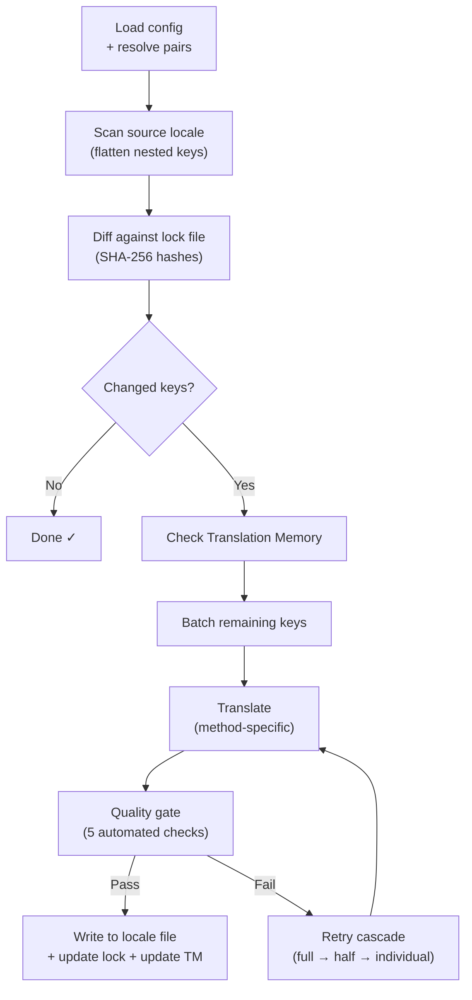

# champollion の仕組み

champollion は1つのコマンドでアプリのロケールファイルを翻訳します。内部で何が起きているかを説明します。

## パイプライン

`npx champollion sync` を実行すると、champollion は6段階のパイプラインを実行します：



**主要な設計上の決定：**

- **SHA-256 ハッシュによる変更検出。** Champollion は `.champollion.lock` 内のハッシュですべてのソース値を追跡します。英語の文字列を更新すると、そのキーのみが再翻訳されます。これが、繰り返し実行時に `sync` が高速な理由です — 最小限の処理しか行いません。

- **翻訳メモリのキャッシュ。** API 呼び出しを行う前に、champollion は `.champollion/tm.json` でキャッシュされた翻訳（ソーステキスト + ロケール + メソッドをキーとする）を確認します。1つのキーを変更した後の典型的な再同期では、142 個のキーがキャッシュから取得され、1 個のキーが API にアクセスします。

- **書き込み前の品質チェック。** すべての翻訳は、ファイルに書き込まれる前に5つの自動チェック（空文字、ソースのエコー、幻覚ループ、長さの膨張、スクリプト準拠）を通過します。失敗はログに記録され、サイレントに受け入れられることはありません。

- **失敗時のリトライカスケード。** バッチが失敗した場合（JSON パースエラー、API タイムアウト）、champollion は段階的に小さなバッチでリトライします：全体 → 半分 → 個別。これにより、残りの処理をブロックすることなく問題のあるキーを特定できます。

## 翻訳メソッド

Champollionは複数の翻訳方法をサポートしており、それぞれ異なるシナリオに適しています。主要なものは以下の通りです：

| メソッド | 仕組み | 最適な用途 |
|--------|-------------|----------|
| **`llm`** | 任意の OpenRouter モデルへの構造化プロンプト | リソースが豊富な言語 |
| **`llm-coached`** | 同じプロンプト + 文法規則、辞書、スタイルノート | LLM が予測可能なエラーを起こしやすい言語 |
| **`google-translate`** | Google Cloud Translation API バッチリクエスト | GT サポートが充実した高リソース言語 |
| **`api`** | 独自エンドポイントへの HTTP POST | カスタムパイプライン、コミュニティ管理モデル |

メソッドは言語ペアごとに設定します。フランス語には `google-translate` を使い、Plains Cree には `llm-coached` を使うといった具合に、各ペアに最適なメソッドを選択できます。

## コーチングデータ

`llm-coached` ペアでは、コーチングデータによって LLM に明示的な言語知識（文法規則、強制用語、スタイルの好み）を与えます。これは構造化されたコンテキストとしてすべてのプロンプトに注入されます。

```json title="coaching/crk.json"
{
  "grammar_rules": ["Animate nouns take different plural forms than inanimate nouns"],
  "dictionary": {"welcome": "ᑕᓂᓯ", "settings": "ᐃᑕᐢᑌᐘᐃᓇ"},
  "style_notes": "Use Standard Roman Orthography (SRO) unless explicitly configured otherwise."
}
```

コーチングデータは、モデルのファインチューニングなしに翻訳品質を向上させるための主要なメカニズムです。ルールを変更 → 同期を再実行 → 効果を確認、という反復が即座に行えます。

## プラグイン

プラグインは特定の言語ペア向けに事前パッケージ化された翻訳レシピです。コードではなく JSON マニフェストであり、使用するメソッド、設定内容、ベンチマーク済みの品質をchampollion に伝えます。

```bash
champollion plugin install ./crk-coached-v3/
champollion sync   # uses the installed plugin for en→crk
```

プラグインは研究と本番環境のギャップを埋めます：[Network](/arena) で高スコアを記録したメソッドをプラグインとしてパッケージ化し、ここにデプロイできます。

## 全体像

champollion は2つのパートからなるエコシステムの一方を担います：

- **[the Network](/arena)** — 翻訳メソッドが再現可能なベンチマークによって**開発・検証**される場所
- **champollion** — 検証済みのメソッドを使って実際のコンテンツを**翻訳・デプロイ**する場所

[Eval Harness Bridge](/docs/guides/bridge) が両者をつなぎます。Network で実力を証明したメソッドがここにデプロイされます。本番環境からの話者フィードバックが次のバージョンの改善につながります。

---

## さらに詳しく

- [同期の仕組み](/docs/concepts/how-sync-works) — 詳細なステップバイステップのパイプライン解説
- [品質ゲート](/docs/concepts/quality-gate) — 5つの自動チェック
- [翻訳メモリ](/docs/concepts/translation-memory) — キャッシュとコスト削減
- [翻訳メソッド](/docs/guides/translation-methods) — 詳細なメソッド比較
- [アーキテクチャ](/docs/concepts/architecture) — システム設計の概要
