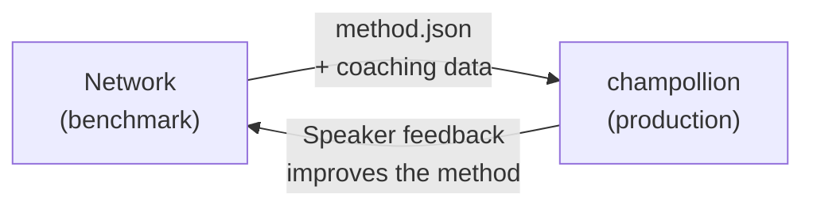

# 本番環境へのデプロイ

Network での動作確認が取れたら、次はデプロイです。

Network はR&D用のツールです — 翻訳手法の構築、ベンチマーク、比較を行う場所です。**本番デプロイ**は、開発者向け翻訳CLI の [champollion](https://champollion.dev) を通じて行います。両者は共通のプラグイン形式で連携します。



---

## デプロイの流れ

### 1. 手法をプラグインとしてエクスポートする

ベンチマーク結果をパッケージ化した `method.json` マニフェストを作成します：

```json
{
  "name": "crk-coached-v3",
  "type": "llm-coached",
  "version": "3.0.0",
  "description": "Coached LLM translation for Plains Cree",
  "locales": ["crk"],
  "config": {
    "model": "google/gemini-2.5-flash",
    "temperature": 0.3
  },
  "benchmarks": {
    "crk": {
      "composite_score": 0.67,
      "fst_acceptance": 0.82,
      "corpus_size": 150
    }
  }
}
```

マニフェストと合わせて、コーチングデータ（文法ルール、辞書など）も含めてください。

### 2. Champollion にインストールする

```bash
champollion plugin install ./my-method-plugin/
```

### 3. 言語ペアを設定する

```json title="champollion.config.json"
{
  "pairs": {
    "en-crk": { "method": "plugin", "plugin": "crk-coached-v3" }
  }
}
```

### 4. 実際のコンテンツを翻訳する

```bash
npx champollion sync
```

ベンチマーク済みの手法が、本番環境で実際の翻訳を生成するようになりました。

---

## 先住民族の言語について

先住民言語コミュニティを対象とする手法は、本番環境へのデプロイ前に**コミュニティの同意**を必要とします。先住民族のデータ主権の原則 — 言語データのコミュニティによる所有と管理 — が、翻訳手法の開発、評価、およびデプロイの方法を規定しています。

Deployable ティア（0.70以上）に達した手法が自動的にデプロイされるわけではありません — その言語コミュニティのガバナンス機関が同意を示した**場合に限り、そのタイミングで**デプロイされます。

ガバナンスの全体的な枠組みについては、[データ主権](/docs/network/sovereignty/data-sovereignty)および[所有権の移転](/docs/network/sovereignty/ownership-transfer)をご覧ください。

---

## 関連項目

- [Eval Harness Bridge](https://champollion.dev/docs/guides/bridge) — Network→champollion パイプラインの詳細なウォークスルー
- [プラグイン仕様](https://champollion.dev/docs/reference/plugin-spec) — method.json マニフェストの形式
- [champollion エージェントガイド](https://champollion.dev/docs/guides/agent-guide) — champollion を使った翻訳の方法

