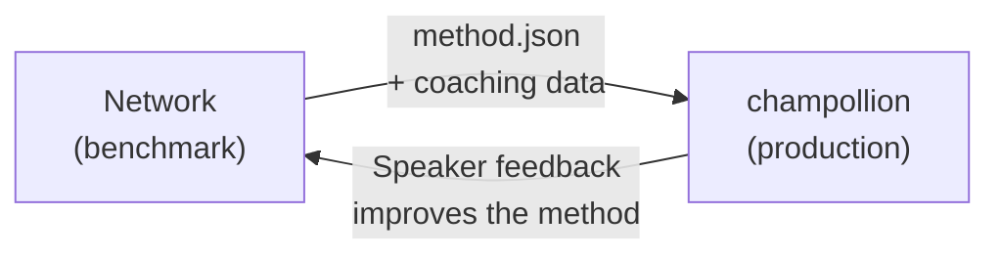

# 本番環境へのデプロイ

Network での動作確認が取れたら、次はデプロイです。

Network はR&D用のツールです — 翻訳手法の構築、ベンチマーク、比較を行う場所です。**本番デプロイ**は、開発者向け翻訳CLI の [champollion](https://champollion.dev) を通じて行います。両者は共通のプラグイン形式で連携します。


```mermaid
graph LR
    A["Network\n(benchmark)"] -->|"method.json\n+ coaching data"| B["champollion\n(production)"]
    B -->|"Speaker feedback\nimproves the method"| A
```

---

## デプロイの流れ

### 1. 手法をプラグインとしてエクスポートする

ベンチマーク結果をパッケージ化した `method.json` マニフェストを作成します：

```json
{
  "name": "french-formal-v1",
  "type": "llm-coached",
  "version": "1.0.0",
  "description": "Formal-register French (example manifest; the benchmark values are illustrative)",
  "locales": ["fr"],
  "config": {
    "model": "google/gemini-2.5-flash",
    "temperature": 0.3
  },
  "benchmarks": {
    "fr": {
      "corpus_chrf": 72.3,
      "exact_match_rate": 0.42,
      "corpus_size": 500
    }
  }
}
```

マニフェストと合わせて、コーチングデータ（文法ルール、辞書など）も含めてください。

### 2. Champollion にインストールする

```bash
champollion plugin install ./french-formal-v1/
```

### 3. 言語ペアを設定する

```json title="champollion.config.json"
{
  "pairs": {
    "en:fr": { "methodPlugin": "french-formal-v1" }
  }
}
```

### 4. 実際のコンテンツを翻訳する

```bash
npx champollion sync
```

ベンチマーク済みの手法が、本番環境で実際の翻訳を生成するようになりました。

---

## 先住民族の言語について

先住民族の言語コミュニティを対象とする手法には、本番環境へデプロイする前に**コミュニティの同意**が必要です。先住民族のデータ主権の原則 — 言語データのコミュニティによる所有と管理 — は、翻訳手法の開発、評価、デプロイの方法を規定します。

いかなるスコアも、手法をデプロイ可能にはできません。高いchrF++スコアであろうと、賞の基準値であろうと関係ありません。デプロイされるのは、その言語の話者が訳出結果を評価した上で、言語コミュニティの統治組織が同意を与えた**場合、かつそのときに限られます**。

ガバナンスの全体的な枠組みについては、[データ主権](/docs/network/sovereignty/data-sovereignty)および[所有権の移転](/docs/network/sovereignty/ownership-transfer)をご覧ください。

---

## 関連項目

- [Eval Harness Bridge](https://champollion.dev/docs/guides/bridge) — Network→champollion パイプラインの詳細なウォークスルー
- [プラグイン仕様](https://champollion.dev/docs/reference/plugin-spec) — method.json マニフェストの形式
- [champollion エージェントガイド](https://champollion.dev/docs/guides/agent-guide) — champollion を使った翻訳の方法
