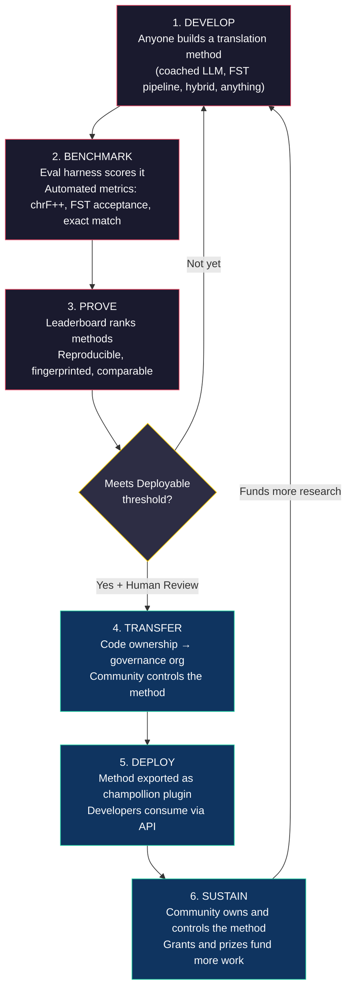
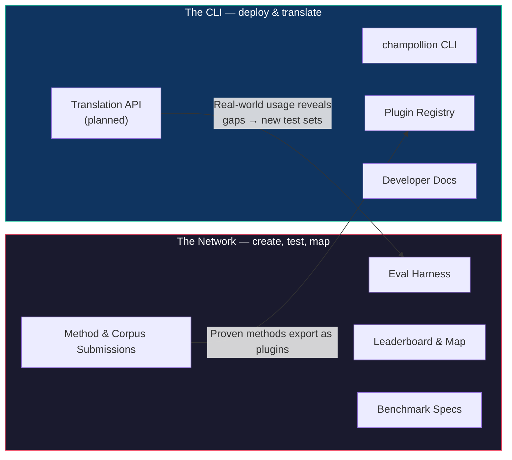
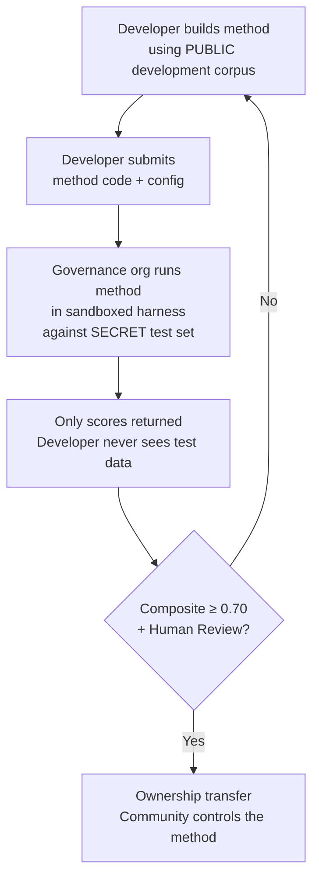

# How the Network Works: Build, Test, Develop, Deploy
# ネットワークの仕組み：構築、テスト、開発、デプロイ

> **Executive Summary.** Machine translation for the world's underserved languages is not a model-training problem — it is an *infrastructure* problem. No single model, lab, or company will solve it. This document describes a platform architecture that turns the global community of ML engineers, linguists, and language speakers into a distributed research lab: anyone builds a translation method, the network tests whether it works — including against community-held evaluation data the platform never sees — and methods that work become assets owned by the communities whose languages they serve. The mechanism is open, collaborative method development paired with flexible, steward-set terms — a combination still rare in practice, and the one we think this problem demands.

> **エグゼクティブサマリー** 世界の十分なサービスを受けていない言語（underserved languages）における機械翻訳は、モデル学習の問題ではなく、*インフラストラクチャ*の問題です。単一のモデル、研究室、または企業がこれを解決することはありません。本ドキュメントでは、MLエンジニア、言語学者、および言語話者のグローバルコミュニティを分散型研究ラボに変えるプラットフォームアーキテクチャについて説明します。誰でも翻訳メソッドを構築でき、ネットワークがその有効性をテストします（プラットフォームが直接参照することのない、コミュニティが保持する評価データに対するテストも含みます）。そして、有効なメソッドは、その言語を使用するコミュニティが所有する資産となります。このメカニズムは、オープンで協調的なメソッド開発と、管理者が設定する柔軟な条件を組み合わせたものです。これは実践においてはまだ稀な組み合わせですが、この問題が求めているものだと私たちは考えています。

---

> [!IMPORTANT]
> **Scope.** This platform evaluates **formal written text translation** — documents, educational materials, official communications, UI strings. It is not a chatbot, real-time interpreter, or unrestricted-domain conversational system. The leaderboard ranks translation methods against curated parallel corpora in specific text domains (see [Benchmark Specification §2.7](/docs/network/specifications/benchmark#27-domain) for the domain taxonomy). MT is infrastructure for language revitalization, not a substitute for it. Children learn language from people, not machines.

> [!IMPORTANT]
> **スコープ** このプラットフォームは、文書、教育教材、公式なコミュニケーション、UI文字列などの**フォーマルな書記言語の翻訳**を評価します。チャットボット、リアルタイム通訳、またはドメイン無制限の対話システムではありません。リーダーボードは、特定のテキストドメインにおけるキュレーションされた対訳コーパスに対して翻訳メソッドをランク付けします（ドメインの分類については、[Benchmark Specification §2.7](/docs/network/specifications/benchmark#27-domain)を参照してください）。機械翻訳（MT）は言語復興のためのインフラであり、その代替ではありません。子どもたちは機械からではなく、人から言語を学びます。

### Current Domain Coverage
### 現在のドメインカバレッジ

The board is **live and populating** — runs publish to it continuously, and
anyone can add more. The table below shows which public reference corpora
are *supported* per domain; the [leaderboard](/leaderboard) has the live
rankings.
Corpora are fetched from source at run time, never hosted here.

ボードは**稼働中であり、データが蓄積されています**。実行結果は継続的に公開され、誰でも追加することができます。以下の表は、ドメインごとにどの公開リファレンスコーパスが*サポートされているか*を示しています。最新のランキングは[リーダーボード](/leaderboard)で確認できます。
コーパスは実行時にソースから取得され、ここでホストされることはありません。

| Domain | Reference corpus | Status | Notes |
|--------|------------------|--------|-------|
| News / journalism | Global Voices (OPUS) | Supported — open for submissions | 493 language pairs, CC BY 3.0 |
| Everyday / mixed (written) | Tatoeba | Supported — open for submissions | 874 language pairs, CC BY 2.0 |
| Educational / textbook | EdTeKLA (Plains Cree) | Research-only — **not ranked**; remote model-API evaluation consent-gated | EdTeKLA's modified CC BY-NC-SA (sovereignty-scoped, non-commercial); carved out of the leaderboard, prizes, and API/commercial lanes |
| Narrative / literary | — | Planned | No runnable corpus wired yet |
| Religious / scriptural | FLORES+ (Bible-domain) | Wired, relative-only | Runnable corpus; HIGH contamination, so relative-only — never used for official scoring |
| Spoken / real-time | — | Out of scope | This system evaluates written text, not speech |
| Technical / scientific | — | Future | Requires domain-specific terminology validation |

| ドメイン | リファレンスコーパス | ステータス | 備考 |
|--------|------------------|--------|-------|
| ニュース / ジャーナリズム | Global Voices (OPUS) | サポート済み — 提出受付中 | 493言語ペア、CC BY 3.0 |
| 日常 / 混合（書記） | Tatoeba | サポート済み — 提出受付中 | 874言語ペア、CC BY 2.0 |
| 教育 / 教科書 | EdTeKLA (Plains Cree) | 研究専用 — **ランク付けなし**。リモートモデルAPI評価は同意が必要 | EdTeKLAの改変版CC BY-NC-SA（主権スコープ、非営利）。リーダーボード、賞、API/商用レーンからは除外 |
| 物語 / 文学 | — | 計画中 | 実行可能なコーパスは未接続 |
| 宗教 / 聖典 | FLORES+ (Bible-domain) | 接続済み、相対評価のみ | 実行可能なコーパス。汚染度が高いため相対評価のみ — 公式スコアリングには使用しない |
| 音声 / リアルタイム | — | スコープ外 | 本システムは書記テキストを評価し、音声は評価しない |
| 技術 / 科学 | — | 将来の予定 | ドメイン固有の用語検証が必要 |

## What the Network Is For
## ネットワークの目的

Before the mechanics, the mission. The Champollion Network rests on four commitments:
仕組みの前に、ミッションについて説明します。Champollion Networkは、以下の4つのコミットメントに基づいています。

1. **Create and trust translation test sets.** For most languages the scarce, valuable thing is not another model — it is a *trustworthy* test set: human-authored, domain-honest, and version-pinned. The Network exists to create those test sets and to make them trustworthy.
2. **Make the field navigable.** Who can translate what, how good each method is on each kind of text, and where the gaps are — surfaced as a public map, not buried in scattered papers and PDFs.
3. **Every method is welcome — human and machine.** We are pragmatists with a solutions bias. A professional translator, a rule-based system, a coached LLM, a fine-tuned model — all are first-class. We care about getting languages translated, not about which tool wins.
4. **Built *with* communities, never scraped — and sovereignty is non-negotiable.** Language data is biodata; the people who provide a corpus hold the keys to it, and to anything measured against it.

1. **翻訳テストセットの作成と信頼性の確保** ほとんどの言語において、希少で価値があるのは新しいモデルではなく、人間が作成し、ドメインに忠実で、バージョンが固定された*信頼できる*テストセットです。ネットワークは、これらのテストセットを作成し、信頼できるものにするために存在します。
2. **分野のナビゲーションを可能にする** 誰が何を翻訳できるのか、各メソッドが各種類のテキストでどの程度優れているのか、そしてどこにギャップがあるのかを、散在する論文やPDFに埋もれさせるのではなく、公開されたマップとして表面化させます。
3. **人間と機械、すべてのメソッドを歓迎する** 私たちは解決策を重視するプラグマティストです。プロの翻訳者、ルールベースのシステム、コーチングされたLLM、ファインチューニングされたモデルなど、すべてが第一級（ファーストクラス）の扱いです。私たちが重視するのは言語が翻訳されることであり、どのツールが勝つかではありません。
4. **スクレイピングではなく、コミュニティと*共に*構築する — そして主権は交渉の余地がない** 言語データは生体データ（バイオデータ）です。コーパスを提供する人々が、そのコーパスと、それに対して測定されるすべてのものに対する鍵を握っています。

Everything below — the loop, the harness, the leaderboard, the deployment bridge — is in service of those four commitments.
以下に説明するすべて（ループ、ハーネス、リーダーボード、デプロイメントブリッジ）は、これら4つのコミットメントを実現するためのものです。

---

## 1. The Problem: Machine Translation ≠ Machine Learning
## 1. 課題：機械翻訳 ≠ 機械学習

Machine translation for low-resource languages (LRLs) is commonly framed as a machine learning problem: collect data, train a model, deploy. This framing is wrong, and the error is consequential — it directs funding, talent, and infrastructure toward an approach that structurally cannot work for the majority of the world's languages.
低資源言語（LRL）の機械翻訳は、一般的に「データを収集し、モデルを学習させ、デプロイする」という機械学習の問題として捉えられています。この捉え方は間違っており、その誤りは重大な結果をもたらします。なぜなら、世界の大多数の言語に対して構造的に機能しないアプローチに、資金、人材、インフラを向かわせてしまうからです。

### 1.1 Why the ML Framing Fails
### 1.1 なぜMLの枠組みは失敗するのか

The standard ML pipeline for MT requires three things: large parallel corpora, validated evaluation benchmarks, and a deployment path. For the 194 languages on Google's Cloud Translation list and the 200 covered by NLLB-200, all three exist. For the ~1,200 languages in OMT-1600's long tail — our arithmetic: the 1,600 it covers minus the 400+ its authors report the models "understand sufficiently well" — evaluation data exists but quality is mostly below usable thresholds, the model weights are not publicly available, and there is no deployment pipeline. For the remaining ~5,400+, none exist at all.
MTの標準的なMLパイプラインには、大規模な対訳コーパス、検証済みの評価ベンチマーク、そしてデプロイメントパスの3つが必要です。GoogleのCloud Translationリストにある194言語や、NLLB-200がカバーする200言語については、これら3つすべてが存在します。OMT-1600のロングテールにある約1,200言語（私たちの計算：カバーする1,600言語から、著者がモデルが「十分に理解している」と報告している400以上の言語を引いた数）については、評価データは存在しますが、品質はほとんどが実用的な閾値を下回っており、モデルの重みは公開されておらず、デプロイメントパイプラインもありません。残りの約5,400以上の言語については、どれも全く存在しません。

| Requirement | High-Resource Languages | OMT-1600 Long Tail (~1,200 LRLs) | Remaining ~5,400 Languages |
|-------------|------------------------|-------------------------------|---------------------------|
| **Parallel corpora** | Millions of sentence pairs (Europarl, UN Corpus, OpenSubtitles) | Bible-domain bitext, web scrapes, synthetic backtranslation. No community-curated data. | Hundreds to low thousands, if any |
| **Evaluation benchmarks** | WMT, FLORES, NTREX — standardized, reproducible | BOUQuET (Bible-domain), met-BOUQuET. No morphological validation. No independent evaluation. | No standard benchmarks; ad hoc evaluation |
| **Deployment path** | Google Translate, DeepL, Azure — commercial APIs | Model weights not released. No CLI, no plugin system, no community-deployable API. | Nothing. No API, no product, no market. |

| 要件 | 高資源言語 | OMT-1600のロングテール（約1,200のLRL） | 残りの約5,400言語 |
|-------------|------------------------|-------------------------------|---------------------------|
| **対訳コーパス** | 数百万の文ペア（Europarl、UN Corpus、OpenSubtitles） | 聖書ドメインの対訳テキスト、ウェブスクレイピング、合成逆翻訳。コミュニティがキュレーションしたデータはなし。 | あったとしても数百から数千程度 |
| **評価ベンチマーク** | WMT、FLORES、NTREX — 標準化され、再現可能 | BOUQuET（聖書ドメイン）、met-BOUQuET。形態素の検証なし。独立した評価なし。 | 標準的なベンチマークなし。アドホックな評価 |
| **デプロイメントパス** | Google Translate、DeepL、Azure — 商用API | モデルの重みは未公開。CLI、プラグインシステム、コミュニティがデプロイ可能なAPIはなし。 | なし。API、製品、市場は存在しない。 |

The ML approach works when the data exists to train on and the market exists to deploy into. OMT-1600 has expanded the first condition significantly — but expansion without independent quality verification, morphological validation, or community governance is expansion without trust. The problem isn't just "we need a better model" — it's "we need infrastructure that proves the model works, on terms the community controls."
MLアプローチは、学習するためのデータが存在し、デプロイするための市場が存在する場合に機能します。OMT-1600は最初の条件を大幅に拡大しましたが、独立した品質検証、形態素の検証、またはコミュニティのガバナンスを伴わない拡大は、信頼を伴わない拡大です。問題は単に「より良いモデルが必要だ」ということではなく、「コミュニティが管理する条件の下で、モデルが機能することを証明するインフラが必要だ」ということです。

### 1.2 What MT for LRLs Actually Requires
### 1.2 LRLのMTが実際に必要としているもの

Translation for underserved languages is not primarily a training problem. It is a **method engineering** problem — the challenge of assembling available resources (LLMs, morphological tools, community knowledge, linguistic rules) into working translation pipelines, then proving they work with rigorous evaluation.
十分なサービスを受けていない言語の翻訳は、主に学習の問題ではありません。それは**メソッドエンジニアリング**の問題です。つまり、利用可能なリソース（LLM、形態素解析ツール、コミュニティの知識、言語規則）を組み合わせて機能する翻訳パイプラインを構築し、厳密な評価によってそれが機能することを証明するという課題です。

The distinction matters:
この違いは重要です。

| Dimension | ML Approach | Method Engineering Approach |
|-----------|------------|---------------------------|
| **Core activity** | Train a model on data | Combine tools, prompts, and linguistic knowledge into a pipeline |
| **Bottleneck** | Parallel data volume | Engineering creativity + evaluation infrastructure |
| **Who can contribute** | Teams with GPU clusters and datasets | Anyone with an API key, a dictionary, and an idea |
| **Evaluation** | BLEU/chrF on held-out test sets | Morphological validation + human review + automated metrics |
| **Deployment** | Serve the model | Package the method as a plugin |

| 側面 | MLアプローチ | メソッドエンジニアリングアプローチ |
|-----------|------------|---------------------------|
| **コアアクティビティ** | データでモデルを学習させる | ツール、プロンプト、言語知識をパイプラインに組み合わせる |
| **ボトルネック** | 対訳データの量 | エンジニアリングの創造性 + 評価インフラ |
| **貢献できる人** | GPUクラスターとデータセットを持つチーム | APIキー、辞書、アイデアを持つすべての人 |
| **評価** | ホールドアウトされたテストセットでのBLEU/chrF | 形態素の検証 + 人間によるレビュー + 自動化された指標 |
| **デプロイ** | モデルを提供する | メソッドをプラグインとしてパッケージ化する |

Modern LLMs already contain latent knowledge of many low-resource languages — enough to produce output that *looks* plausible. The problem is that this output is often morphologically invalid (the model hallucinates word forms that don't exist in the language). The engineering challenge is: how do you extract what the LLM knows, validate it against linguistic reality, and package the result for production use?
現代のLLMは、すでに多くの低資源言語に関する潜在的な知識を持っています。それは、もっともらしく*見える*出力を生成するのに十分なレベルです。問題は、この出力が形態素的に無効であることが多い点です（モデルは、その言語に存在しない語形をハルシネーションとして生成します）。エンジニアリング上の課題は、LLMが知っていることをどのように抽出し、言語学的な現実と照らし合わせて検証し、その結果を本番環境での使用に向けてパッケージ化するか、ということです。

This is why we benchmark **methods**, not models. A method is the full recipe: model selection + prompt engineering + tool usage + pre/post-processing + coaching data + retry strategies. Two teams using the same model with different methods will get different scores. That's the point.
これが、私たちがモデルではなく**メソッド**をベンチマークする理由です。メソッドとは、モデルの選択 + プロンプトエンジニアリング + ツールの使用 + 前処理/後処理 + コーチングデータ + リトライ戦略を含む、完全なレシピです。同じモデルを使用しても、異なるメソッドを使用する2つのチームは異なるスコアを得ることになります。そこが重要なポイントです。

### 1.3 Why Polysynthetic Languages Break Everything
### 1.3 なぜ抱合語（複統合的言語）がすべてを破綻させるのか

Many of the world's most underserved languages are **polysynthetic** — they encode entire sentences into single words through productive morphological processes. Consider the Plains Cree word:
世界で最もサービスが行き届いていない言語の多くは**抱合語（複統合的言語）**です。これらの言語は、生産的な形態論的プロセスを通じて、文全体を単一の単語にエンコードします。Plains Cree（平原クリー語）の単語を考えてみましょう。

> **ê-kî-nitawi-kîskinwahamâkosiyân**
> *"when I had gone to school"*

> **ê-kî-nitawi-kîskinwahamâkosiyân**
> *"when I had gone to school"（私が学校に行っていたとき）*

One word. It encodes tense (past), direction (going to), the root (learn), voice (passive/reflexive), and person (first singular). English needs six words for what Cree expresses in one.
これは1つの単語です。時制（過去）、方向（〜へ行く）、語根（学ぶ）、態（受動/再帰）、および人称（一人称単数）がエンコードされています。クリー語が1語で表現することを、英語では6語必要とします。

This breaks standard MT at every level:
これは、標準的なMTをあらゆるレベルで破綻させます。

- **Tokenization** — BPE and SentencePiece shred polysynthetic words into meaningless fragments, because they were designed for concatenative morphology.
- **Hallucination** — LLMs produce plausible-looking strings that are not valid words. A non-speaker cannot tell the difference. Without morphological validation, hallucinations are invisible.
- **Evaluation** — Word-level metrics (BLEU) penalize the natural inflectional variation that is fundamental to how these languages work. Character-level metrics (chrF++) are better but still insufficient without structural validation.

- **トークン化** — BPEやSentencePieceは、連結的な形態論のために設計されているため、抱合語の単語を無意味な断片に切り刻んでしまいます。
- **ハルシネーション** — LLMは、もっともらしく見えるが無効な単語である文字列を生成します。話者でない人にはその違いがわかりません。形態素の検証がなければ、ハルシネーションは目に見えません。
- **評価** — 単語レベルの指標（BLEU）は、これらの言語の機能の基本である自然な屈折の変化をペナルティとして扱います。文字レベルの指標（chrF++）の方が優れていますが、構造的な検証がなければ依然として不十分です。

The solution isn't a bigger model or more training data. It's **infrastructure that catches hallucinations before they reach users** — morphological analyzers (FSTs) that can definitively say "this is not a word in this language."
解決策は、より大きなモデルやより多くの学習データではありません。それは、**ハルシネーションがユーザーに届く前に捕捉するインフラ**、つまり「これはこの言語の単語ではない」と明確に判定できる形態素解析器（FST）です。

---

## 2. Why Existing Approaches Don't Work
## 2. 既存のアプローチが機能しない理由

### 2.1 Commercial MT
### 2.1 商用MT

Commercial translation services have historically optimized for market volume. Meta's OMT-1600 (March 2026) represents a significant shift — 1,600 languages in one system. But for the ~1,200 in its long tail (our arithmetic: 1,600 minus the 400+ its authors report the models "understand sufficiently well"), quality is below usable thresholds, the model weights are not available, and there is no deployment pipeline. The structural incentive problem has evolved: Big Tech can now build models for LRLs, but without independent evaluation, morphological validation, or community governance, coverage alone doesn't solve the problem.
商用の翻訳サービスは、歴史的に市場規模を最適化してきました。MetaのOMT-1600（2026年3月）は、1つのシステムで1,600言語をカバーするという大きな転換を示しています。しかし、そのロングテールにある約1,200言語（私たちの計算：1,600言語から、著者がモデルが「十分に理解している」と報告している400以上の言語を引いた数）については、品質は実用的な閾値を下回っており、モデルの重みは利用できず、デプロイメントパイプラインもありません。構造的なインセンティブの問題は進化しました。ビッグテックはLRL向けのモデルを構築できるようになりましたが、独立した評価、形態素の検証、またはコミュニティのガバナンスがなければ、カバレッジだけでは問題は解決しません。

### 2.2 Academic Research
### 2.2 学術研究

Academic MT research focuses overwhelmingly on high-resource language pairs because that's where the training data, shared tasks, and publication venues are. Researchers who work on low-resource pairs struggle to publish, struggle to fund compute, and struggle to deploy — because deployment infrastructure for LRLs doesn't exist.
学術的なMT研究は、圧倒的に高資源の言語ペアに焦点を当てています。なぜなら、そこに学習データ、共有タスク、そして発表の場があるからです。低資源のペアに取り組む研究者は、論文の発表に苦労し、計算資源の資金調達に苦労し、デプロイに苦労します。LRL向けのデプロイメントインフラが存在しないからです。

### 2.3 One-Off Competitions
### 2.3 単発のコンペティション

You could run a Kaggle competition: "English→Plains Cree, best chrF++ wins $10,000." Here's what happens:
「英語→Plains Cree、最高のchrF++スコアに10,000ドル」というKaggleコンペティションを開催することは可能です。しかし、その結果は次のようになります。

1. Someone wins, submits a notebook, collects the prize, goes home.
2. The notebook rots in Kaggle's archive. Nobody deploys it. Nobody maintains it.
3. The test set is eventually published — contaminated forever.
4. The governance organization uploaded their linguistic data to Google's infrastructure under Google's terms of service, with no real control over the lifecycle.
5. No deployment bridge. A winning notebook is not a working API.

1. 誰かが勝ち、ノートブックを提出し、賞金を受け取り、帰っていきます。
2. ノートブックはKaggleのアーカイブで腐敗します。誰もデプロイせず、誰もメンテナンスしません。
3. テストセットは最終的に公開され、永遠に汚染されます。
4. ガバナンス組織は、Googleの利用規約の下でGoogleのインフラに言語データをアップロードしたため、ライフサイクルに対する実質的なコントロールを持っていません。
5. デプロイメントブリッジがありません。優勝したノートブックは、機能するAPIではありません。

A one-time bounty attracts bounty hunters. An ongoing leaderboard with community governance creates sustained engagement.
単発の報奨金は賞金稼ぎを引き寄せます。コミュニティのガバナンスを伴う継続的なリーダーボードは、持続的なエンゲージメントを生み出します。

### 2.4 Fine-Tuning
### 2.4 ファインチューニング

Fine-tuning an open model on parallel text is the obvious ML approach. But for most LRLs, the parallel corpus needed for fine-tuning is exactly the data that doesn't exist — and creating it requires the same bilingual speakers and community engagement that the fine-tuning is meant to replace. You can't bootstrap your way out of a data scarcity problem with a technique that requires data.
オープンモデルを対訳テキストでファインチューニングすることは、明白なMLアプローチです。しかし、ほとんどのLRLにとって、ファインチューニングに必要な対訳コーパスこそが存在しないデータなのです。そして、それを作成するには、ファインチューニングが代替しようとしているのと同じバイリンガル話者とコミュニティの関与が必要になります。データを必要とする技術を使って、データ不足の問題から抜け出すことはできません。

---

## 3. The Solution: Collaborative Method Development with Sovereign Evaluation
## 3. 解決策：主権的評価を伴う協調的なメソッド開発

The platform inverts the traditional approach: instead of one team building one model, **the global community builds and tests translation methods together**, the network verifies what works, and methods that work deploy to production with the language community retaining ownership and control.
このプラットフォームは従来のアプローチを反転させます。1つのチームが1つのモデルを構築するのではなく、**グローバルコミュニティが共同で翻訳メソッドを構築してテストし**、ネットワークが何が機能するかを検証します。そして、機能するメソッドは、言語コミュニティが所有権とコントロールを保持したまま本番環境にデプロイされます。

### 3.1 The Full Loop
### 3.1 全体のループ

Each stage has a specific function:
各ステージには特定の機能があります。

| Stage | What Happens | Who Benefits |
|-------|-------------|--------------|
| **Develop** | A researcher, student, or hobbyist builds a translation method using whatever tools they want — LLM prompting, FST pipelines, dictionaries, fine-tuned models, rule-based systems, or hybrids | The contributor learns, experiments, publishes |
| **Benchmark** | The eval harness scores the method against a standardized corpus with reproducible metrics. Every run produces a [run card](/docs/network/specifications/benchmark#3-run-card-schema) — a complete record of what was tested and how it performed | Researchers get reproducible, comparable results |
| **Prove** | Results appear on the public leaderboard. Methods are ranked, compared, and scrutinized. The community sees what works and what doesn't | Everyone gains visibility into the state of the art |
| **Transfer** | For Indigenous languages, methods that reach the Deployable threshold (composite ≥ 0.70) AND pass human validation have their code ownership transferred to the language community's governance organization | Community owns the method outright — code, weights, and deployment decisions |
| **Deploy** | The method is exported as a [champollion](https://github.com/gamedaysuits/Champollion) plugin the community can run on its own infrastructure. Developers consume translations without needing to understand the underlying method | Developers get translation for languages commercial APIs don't serve |
| **Sustain** | Grant funding and sponsored prizes — which the project is actively seeking; it is self-funded today — pay for more corpora, speaker validation, and research. Champollion is non-commercial and takes no share of anything a community earns from an asset it owns | Paid corpus work and community-owned methods outlive any single grant |

| ステージ | 行われること | 恩恵を受ける人 |
|-------|-------------|--------------|
| **開発 (Develop)** | 研究者、学生、または趣味のプログラマーが、LLMプロンプティング、FSTパイプライン、辞書、ファインチューニングされたモデル、ルールベースのシステム、またはそれらのハイブリッドなど、好きなツールを使用して翻訳メソッドを構築します。 | 貢献者は学習し、実験し、公開します。 |
| **ベンチマーク (Benchmark)** | 評価ハーネスが、再現可能な指標を用いて標準化されたコーパスに対してメソッドをスコアリングします。すべての実行は[ランカード (run card)](/docs/network/specifications/benchmark#3-run-card-schema)を生成します。これは、何がテストされ、どのようなパフォーマンスであったかの完全な記録です。 | 研究者は再現可能で比較可能な結果を得ます。 |
| **証明 (Prove)** | 結果は公開リーダーボードに表示されます。メソッドはランク付けされ、比較され、精査されます。コミュニティは何が機能し、何が機能しないかを確認します。 | 誰もが最先端の状況を可視化できます。 |
| **移管 (Transfer)** | 先住民言語の場合、デプロイ可能（Deployable）な閾値（複合スコア ≥ 0.70）に達し、かつ人間による検証に合格したメソッドは、そのコードの所有権が言語コミュニティのガバナンス組織に移管されます。 | コミュニティはメソッド（コード、重み、デプロイの決定権）を完全に所有します。 |
| **デプロイ (Deploy)** | メソッドは、コミュニティが独自のインフラで実行できる[champollion](https://github.com/gamedaysuits/Champollion)プラグインとしてエクスポートされます。開発者は、基盤となるメソッドを理解することなく翻訳を利用できます。 | 開発者は、商用APIが提供していない言語の翻訳を得ることができます。 |
| **維持 (Sustain)** | 助成金やスポンサー付きの賞金（プロジェクトは現在自己資金で運営されており、積極的に資金を求めています）が、より多くのコーパス、話者による検証、および研究の費用を支払います。Champollionは非営利であり、コミュニティが所有する資産から得る収益の分配を受け取ることはありません。 | 有償のコーパス作業とコミュニティが所有するメソッドは、単一の助成金よりも長く存続します。 |

### 3.2 Why Open Collaboration Works
### 3.2 なぜオープンなコラボレーションが機能するのか

Open participation is not incidental — it is the mechanism. Here's why:
オープンな参加は付随的なものではなく、メカニズムそのものです。その理由は以下の通りです。

**Diversity of approaches.** The best method for English→Plains Cree might be an FST-gated coached LLM. The best for English→Quechua might be a dictionary-augmented pipeline. The best for English→Inuktitut might be a fine-tuned model bootstrapped from the Nunavut Hansard corpus. No single team or approach will dominate across all languages. The leaderboard reveals which *kinds* of approaches work for which *kinds* of languages — a meta-result that is itself a research contribution.
**アプローチの多様性** 英語→Plains Creeの最適なメソッドは、FSTでゲートされたコーチング済みLLMかもしれません。英語→ケチュア語の最適なメソッドは、辞書で拡張されたパイプラインかもしれません。英語→イヌクティトゥット語の最適なメソッドは、ヌナブト準州議会議事録（Nunavut Hansard）コーパスからブートストラップされたファインチューニングモデルかもしれません。単一のチームやアプローチがすべての言語を支配することはありません。リーダーボードは、どの*種類*の言語にどの*種類*のアプローチが機能するかを明らかにします。このメタな結果自体が研究への貢献となります。

**Sustained engagement.** A leaderboard is never finished. There's always a better method to build. Every submission donates compute and intellectual effort to the problem. Unlike a one-time grant, the open, ongoing process generates sustained research investment from the global community.
**持続的なエンゲージメント** リーダーボードに終わりはありません。常に構築すべきより良いメソッドが存在します。すべての提出物は、この問題に対して計算資源と知的努力を提供します。単発の助成金とは異なり、オープンで継続的なプロセスは、グローバルコミュニティからの持続的な研究投資を生み出します。

**Low barrier to entry.** You need an API key, a dictionary, and an idea. The eval harness is open source. The corpus format is simple JSON. A linguistics student can match a well-resourced lab — and sometimes do better, because domain knowledge (understanding the language) can outweigh compute resources.
**低い参入障壁** 必要なのは、APIキー、辞書、そしてアイデアだけです。評価ハーネスはオープンソースです。コーパスのフォーマットはシンプルなJSONです。言語学の学生が、豊富なリソースを持つ研究室と互角に渡り合うことができ、時にはそれ以上の成果を上げることもあります。なぜなら、ドメイン知識（言語の理解）が計算資源を上回ることがあるからです。

**Deployment bridge.** The same method that scores well in the harness deploys to production with one config change. "Prove it here, deploy it there." This is the gap that Kaggle, WMT shared tasks, and academic publications don't bridge.
**デプロイメントブリッジ** ハーネスで高スコアを出したのと同じメソッドが、設定を1つ変更するだけで本番環境にデプロイされます。「ここで証明し、あそこでデプロイする」。これは、Kaggle、WMTの共有タスク、学術出版物が埋められないギャップです。

### 3.3 The Platform Architecture
### 3.3 プラットフォームアーキテクチャ

champollion.dev is **one hub with two faces**. The same site hosts the Network — where test sets are created, methods are evaluated, and results are mapped — and the CLI, where proven methods are deployed into real projects. They share one domain, one set of docs, and one data layer; the labels below describe two *roles*, not two sites.
champollion.devは**2つの顔を持つ1つのハブ**です。同じサイトが、テストセットが作成され、メソッドが評価され、結果がマッピングされる「Network」と、証明されたメソッドが実際のプロジェクトにデプロイされる「CLI」をホストしています。これらは1つのドメイン、1つのドキュメントセット、1つのデータレイヤーを共有しています。以下のラベルは2つのサイトではなく、2つの*役割*を説明しています。

**The [Network](/docs/network/)** is the proving ground. Its audience is translators, linguists, communities, and researchers. Everything here is about creating test sets, evaluating methods against them — human or machine — and mapping where the gaps are.
**[Network](/docs/network/)**は実験場（プルービンググラウンド）です。その対象者は、翻訳者、言語学者、コミュニティ、および研究者です。ここでのすべては、テストセットを作成し、それに対してメソッド（人間または機械）を評価し、どこにギャップがあるかをマッピングすることに関するものです。

**The [CLI](https://champollion.dev)** is the deployment side. Its audience is developers who need translation for their apps. They don't need to understand how a method works — they just call it.
**[CLI](https://champollion.dev)**はデプロイメント側です。その対象者は、アプリの翻訳を必要とする開発者です。彼らはメソッドがどのように機能するかを理解する必要はなく、ただそれを呼び出すだけです。

The bridge between the two faces is the **method**: created and trusted on the Network, packaged for deployment through the CLI, and — for community languages — owned by the community.
この2つの顔の架け橋となるのが**メソッド**です。Network上で作成され信頼を得て、CLIを通じてデプロイ用にパッケージ化され、コミュニティ言語の場合はコミュニティによって所有されます。

---

## 4. Sovereign Evaluation: Why the Infrastructure Matters
## 4. 主権的評価：なぜインフラが重要なのか

The evaluation infrastructure is not a technical detail — it is the core of the sovereignty model. Standard evaluation (upload your test set to a shared platform) doesn't work for Indigenous languages because it surrenders control over the linguistic data.
評価インフラは技術的な詳細ではなく、主権モデルの核心です。標準的な評価（テストセットを共有プラットフォームにアップロードする）は、言語データに対するコントロールを放棄することになるため、先住民言語には機能しません。

### 4.1 The Sovereignty Mechanism
### 4.1 主権メカニズム

The developer never sees the gold-standard evaluation data. They develop against a public development corpus, then submit their method code to the governance organization, which runs it in a sandbox against the secret test set. Only scores come back. This is not just security — it is built toward the Indigenous data-sovereignty principles that community ownership and control of language data require. Whether it meets them is not our call: the determination belongs to the communities involved.
開発者がゴールドスタンダードの評価データを見ることは決してありません。開発者は公開されている開発コーパスに対して開発を行い、メソッドのコードをガバナンス組織に提出します。ガバナンス組織は、秘密のテストセットに対してサンドボックス内でそれを実行します。返ってくるのはスコアのみです。これは単なるセキュリティではありません。言語データのコミュニティによる所有と管理が要求する、先住民族のデータ主権の原則に向けて構築されています。それが原則を満たしているかどうかを判断するのは私たちではなく、関与するコミュニティに委ねられています。

### 4.2 Why This Can't Run on Someone Else's Platform
### 4.2 なぜこれを他人のプラットフォームで実行できないのか

On Kaggle, the governance organization uploads their linguistic data to Google's infrastructure under Google's terms of service. They can't revoke access on their own timeline. They can't attach custom legal terms (like ownership transfer) to submissions. They have no cryptographic guarantee the data won't be used for other purposes. Data sovereignty means the community controls the evaluation endpoint, holds the keys, and can shut it down.
Kaggleでは、ガバナンス組織はGoogleの利用規約の下でGoogleのインフラに言語データをアップロードします。彼らは独自のタイムラインでアクセスを取り消すことはできません。提出物にカスタムの法的条件（所有権の移管など）を付与することもできません。データが他の目的に使用されないという暗号学的な保証もありません。データ主権とは、コミュニティが評価エンドポイントを管理し、鍵を保持し、それをシャットダウンできることを意味します。

---

## 5. Evaluation Philosophy: Microeval and LYSS
## 5. 評価の哲学：マイクロ評価とLYSS

Standard MT metrics (BLEU, chrF++, COMET) are designed to generalize across languages. That generality is their strength — and their blindspot. For polysynthetic languages, a morphologically invalid word that shares character n-grams with the reference scores well on chrF++ but would be recognized as gibberish by any speaker.
標準的なMT指標（BLEU、chrF++、COMET）は、言語間で一般化できるように設計されています。その一般性は強みであると同時に、盲点でもあります。抱合語の場合、リファレンスと文字n-gramを共有する形態素的に無効な単語は、chrF++では高いスコアを出しますが、話者であれば誰でも意味不明な言葉（ジブリッシュ）として認識するでしょう。

**Microeval development** means building evaluation metrics tailored to specific languages using the best available linguistic tools. The framework is called **LYSS** (Linguistically-informed Yield & Structural Scoring):
**マイクロ評価（Microeval）の開発**とは、利用可能な最良の言語ツールを使用して、特定の言語に合わせた評価指標を構築することを意味します。このフレームワークは**LYSS**（Linguistically-informed Yield & Structural Scoring：言語学に基づく歩留まりおよび構造スコアリング）と呼ばれます。

| Component | What it measures | Tool | Status |
|-----------|-----------------|------|--------|
| **LYSS-fst** | Morphological validity | Finite-state transducer | ✅ Implemented (Plains Cree) |
| **LYSS-eq** | Linguistic equivalence | Linguist-curated variant rules | ✅ Implemented (Plains Cree) |
| **LYSS-sem** | Semantic preservation | Language-specific semantic models | ✅ Implemented (Plains Cree) |

| コンポーネント | 測定対象 | ツール | ステータス |
|-----------|-----------------|------|--------|
| **LYSS-fst** | 形態素の妥当性 | 有限状態トランスデューサ (FST) | ✅ 実装済み (Plains Cree) |
| **LYSS-eq** | 言語学的な等価性 | 言語学者がキュレーションしたバリアント規則 | ✅ 実装済み (Plains Cree) |
| **LYSS-sem** | 意味の保持 | 言語固有の意味モデル | ✅ 実装済み (Plains Cree) |

The universal metrics (chrF++, BLEU) serve as baselines and as the primary signals for languages without LYSS tooling. Wherever language-specific tools exist, LYSS components carry the scoring weight — because the things that matter most for each language are the things only language-specific tools can measure.
普遍的な指標（chrF++、BLEU）は、ベースラインとして、またLYSSツールがない言語の主要なシグナルとして機能します。言語固有のツールが存在する場合、LYSSコンポーネントがスコアリングの重みを担います。なぜなら、各言語にとって最も重要なことは、言語固有のツールでしか測定できないことだからです。

For the full LYSS specification and composite scoring logic, see [SCORING_SPEC.md §4](/docs/network/specifications/scoring#4-composite-score).
LYSSの完全な仕様と複合スコアリングのロジックについては、[SCORING_SPEC.md §4](/docs/network/specifications/scoring#4-composite-score)を参照してください。

> [!WARNING]
> **Cross-run comparability.** When comparing runs with different metric availability (e.g., one run has FST scores, another doesn't), the composite scores are not directly comparable. The composite normalizes to available metrics, but a run evaluated on 5 metrics carries more information than one evaluated on 2. The leaderboard indicates metric coverage for each entry.

> [!WARNING]
> **実行間の比較可能性** 利用可能な指標が異なる実行（例：一方の実行にはFSTスコアがあり、もう一方にはない場合）を比較する場合、複合スコアを直接比較することはできません。複合スコアは利用可能な指標に対して正規化されますが、5つの指標で評価された実行は、2つの指標で評価された実行よりも多くの情報を持っています。リーダーボードには、各エントリの指標カバレッジが示されています。

---

## 6. Who This Serves
## 6. 誰のためのものか

### For ML Engineers & Researchers
### MLエンジニアと研究者向け

An open leaderboard with standardized benchmarks for language pairs that no shared task covers. Reproduce any result with the eval harness. Publish your method. Beat the top score. Every submission is fingerprinted to a specific configuration and dataset version — no ambiguity about what was tested.
どの共有タスクもカバーしていない言語ペアのための、標準化されたベンチマークを備えたオープンなリーダーボードです。評価ハーネスを使用してあらゆる結果を再現できます。メソッドを公開し、トップスコアを打ち破りましょう。すべての提出物は、特定の構成とデータセットのバージョンに対してフィンガープリントが作成されるため、何がテストされたかについて曖昧さはありません。

### For Language Communities
### 言語コミュニティ向け

Ownership and control over translation technology built for your language. The competitive dynamic means multiple teams are working on your language simultaneously — you benefit from all of them and own the result. The benefit flows through ownership, attribution, capacity, and data terms the community governs — never a revenue share: Champollion is non-commercial and takes no cut of anything a community earns from an asset it owns.
あなたの言語のために構築された翻訳技術に対する所有権とコントロールです。競争的なダイナミクスにより、複数のチームがあなたの言語に同時に取り組むことになります。あなたはそれらすべてから恩恵を受け、その結果を所有します。その恩恵は、コミュニティが管理する所有権、帰属、キャパシティ、およびデータ条件を通じて流れます。収益分配ではありません。Champollionは非営利であり、コミュニティが所有する資産から得る収益のいかなる部分も受け取ることはありません。

### For Funders & Grant Reviewers
### 資金提供者と助成金審査員向け

Transparent, reproducible metrics to evaluate translation research proposals. Measurable outcomes beyond publications: quality metrics over time, language coverage, corpora built and registered under steward control, paid speaker-hours delivered to communities. A successful method becomes a community-owned asset running on open evaluation infrastructure — the grant's impact compounds through reusable methods and public benchmarks rather than ending when the funding does.
翻訳研究の提案を評価するための、透明で再現可能な指標です。論文発表にとどまらない測定可能な成果を提供します。経時的な品質指標、言語カバレッジ、管理者のコントロール下で構築および登録されたコーパス、コミュニティに提供された有償の話者時間などです。成功したメソッドは、オープンな評価インフラ上で稼働するコミュニティ所有の資産となります。助成金の影響は、資金提供が終了した時点で終わるのではなく、再利用可能なメソッドと公開ベンチマークを通じて複利的に増大します。

### For Developers
### 開発者向け

Translation for languages no commercial API serves. One CLI command (`npx champollion sync`) translates your locale files using community-proven methods. Use Google Translate for French, a coached LLM for Plains Cree, and a community API for Quechua — all in the same project, all with the same interface.
商用APIが提供していない言語の翻訳です。1つのCLIコマンド（`npx champollion sync`）で、コミュニティで証明されたメソッドを使用してロケールファイルを翻訳します。フランス語にはGoogle Translate、Plains CreeにはコーチングされたLLM、ケチュア語にはコミュニティAPIを使用するなど、すべて同じプロジェクト内で、すべて同じインターフェースで利用できます。

### For Students
### 学生向け

An open challenge with real-world impact. Build a translation method for an underserved language, benchmark it, and publish your results. The infrastructure is free, the datasets are open, and the leaderboard doesn't care whether you're at a top-10 university or working from a library terminal.
現実世界に影響を与えるオープンな課題です。十分なサービスを受けていない言語の翻訳メソッドを構築し、ベンチマークを行い、結果を公開しましょう。インフラは無料で、データセットはオープンです。リーダーボードは、あなたがトップ10の大学にいるか、図書館の端末から作業しているかを気にしません。

---

## 7. Social and Technical Context
## 7. 社会的および技術的背景

### 7.1 Language Revitalization Is Accelerating
### 7.1 言語復興の加速

Language revitalization efforts are growing worldwide. Immersion schools, community language nests, and digital archiving projects are expanding across Indigenous communities in Canada, the United States, Australia, New Zealand, and Northern Europe. These efforts need technology — specifically, translation technology that respects community sovereignty over linguistic data.
言語復興の取り組みは世界中で拡大しています。イマージョンスクール、コミュニティの言語の巣（language nests）、デジタルアーカイブプロジェクトが、カナダ、米国、オーストラリア、ニュージーランド、北欧の先住民コミュニティ全体で広がっています。これらの取り組みには技術が必要です。具体的には、言語データに対するコミュニティの主権を尊重する翻訳技術です。

### 7.2 LLMs Changed the Baseline
### 7.2 LLMが変えたベースライン

Before 2023, building any MT capability for a polysynthetic language required significant NLP expertise, custom model training, and large compute budgets. Modern LLMs have changed the baseline: a well-crafted prompt with coaching data and morphological validation can produce usable translations for some language pairs — no training required. This dramatically lowers the barrier to entry for method development. The problem has shifted from "how do we build a model?" to "how do we build a pipeline that validates and corrects what the model produces?"
2023年以前は、抱合語のMT機能を構築するには、高度なNLPの専門知識、カスタムモデルの学習、および大規模な計算予算が必要でした。現代のLLMはベースラインを変えました。コーチングデータと形態素の検証を伴うよく練られたプロンプトがあれば、一部の言語ペアでは学習なしで実用的な翻訳を生成できます。これにより、メソッド開発の参入障壁が劇的に下がりました。問題は「どのようにモデルを構築するか？」から「モデルが生成したものを検証し、修正するパイプラインをどのように構築するか？」へと移行しました。

### 7.3 Open, Reproducible Measurement
### 7.3 オープンで再現可能な測定

Public, shared evaluation has reshaped how the field learns what works. The Chatbot Arena, LMSYS, and the Hugging Face Open LLM Leaderboard showed that open, reproducible measurement — anyone can run it, anyone can check it — surfaces real progress faster than closed, self-reported claims. We take that lesson, not the tournament culture, and point it at translation for the thousands of languages where commercial MT either doesn't exist or hasn't been independently verified. The goal is a shared, checkable map of what works for which languages and which kinds of text — not a ranking of who beat whom.
公開された共有の評価は、この分野が「何が機能するか」を学ぶ方法を再構築しました。Chatbot Arena、LMSYS、およびHugging Face Open LLM Leaderboardは、オープンで再現可能な測定（誰でも実行でき、誰でも確認できる）が、閉鎖的で自己申告による主張よりも早く真の進歩を表面化させることを示しました。私たちはトーナメント文化ではなく、その教訓を取り入れ、商用MTが存在しないか、独立して検証されていない何千もの言語の翻訳に向けます。目標は、誰が誰に勝ったかのランキングではなく、どの言語のどの種類のテキストに何が機能するかを示す、共有可能で検証可能なマップを作成することです。

### 7.4 Indigenous Data Sovereignty Is Non-Negotiable
### 7.4 先住民のデータ主権は交渉の余地がない

Indigenous data-sovereignty principles — community ownership and control of language data, the CARE principles (Collective Benefit, Authority to Control, Responsibility, Ethics), and frameworks like Te Mana Raraunga (Māori Data Sovereignty) — are not optional add-ons — they are structural requirements for any technology that touches Indigenous linguistic resources. Our evaluation infrastructure is built to align with these principles architecturally, not just in policy statements — and whether it meets them is a determination that belongs to the communities, not to us.
先住民族のデータ主権の原則 — 言語データのコミュニティによる所有と管理、CARE原則（Collective Benefit, Authority to Control, Responsibility, Ethics）、およびTe Mana Raraunga（マオリのデータ主権）のようなフレームワーク — は、オプションの追加機能ではありません。これらは、先住民の言語リソースに触れるあらゆる技術にとっての構造的な要件です。私たちの評価インフラは、ポリシーの声明だけでなく、アーキテクチャ的にもこれらの原則に適合するように構築されています。そして、それが原則を満たしているかどうかの判断は、私たちではなくコミュニティに委ねられています。

---

## 8. Tensions and Limitations {#8-tensions-and-limitations}
## 8. 緊張と限界 {#8-tensions-and-limitations}

This project uses a Western mechanism — competitive benchmarking — to serve knowledge systems that are often communal, relational, and Elder-guided. That tension is real and must be named, not resolved by assertion.
このプロジェクトは、競争的ベンチマーキングという西洋のメカニズムを使用して、多くの場合、共同体的で、関係性を重んじ、長老（Elder）によって導かれる知識システムに奉仕しようとしています。その緊張は現実のものであり、主張によって解決するのではなく、明確に名指しされなければなりません。

**Benchmarking vs. communal knowledge.** Leaderboards rank individuals and optimize numerical scores. Indigenous knowledge traditions emphasize relational authority, communal correction, and relationship-based legitimacy. We cannot claim to serve these knowledge systems while building a platform whose core mechanism is individual competitive optimization. The sovereignty architecture (§4) — where communities own methods, control evaluation, and decide what gets deployed — is our structural response, but it does not dissolve the tension. A leaderboard is still a leaderboard.
**ベンチマーキング vs. 共同体の知識** リーダーボードは個人をランク付けし、数値スコアを最適化します。先住民の知識の伝統は、関係的な権威、共同体による修正、および関係に基づく正当性を強調します。個人の競争的最適化をコアメカニズムとするプラットフォームを構築しながら、これらの知識システムに奉仕していると主張することはできません。コミュニティがメソッドを所有し、評価を管理し、何をデプロイするかを決定する主権アーキテクチャ（§4）は、私たちの構造的な対応ですが、緊張を解消するものではありません。リーダーボードは依然としてリーダーボードです。

**What we are doing about it.** The platform supports team and community submissions alongside individual ones. The leaderboard frames results as "current state of the art" rather than "who is winning." The governance organization — not the leaderboard score — determines what gets deployed. No automated score entitles a developer to anything; the community decides. And we maintain an ongoing advisory feedback loop with partner communities about whether the platform's framing and incentive structure serves them. If it doesn't, we change it.
**私たちがそれに対して行っていること** プラットフォームは、個人の提出物と並んで、チームやコミュニティの提出物をサポートしています。リーダーボードは、結果を「誰が勝っているか」ではなく「現在の最先端」として位置づけます。何をデプロイするかを決定するのは、リーダーボードのスコアではなく、ガバナンス組織です。自動化されたスコアが開発者に何かを保証するわけではありません。コミュニティが決定します。そして私たちは、プラットフォームの枠組みとインセンティブ構造がコミュニティに役立っているかどうかについて、パートナーコミュニティと継続的なアドバイザリーフィードバックループを維持しています。もし役立っていなければ、私たちはそれを変更します。

**MT is not revitalization.** Translation converts text between languages. Revitalization creates new speakers. A perfect MT system does not solve the transmission problem, the prestige problem, or the pedagogical problem. It might even create the illusion that "the computer can speak the language," undermining urgency for human transmission. We build MT as infrastructure — draft translation for post-editing, morphological tools for language learning apps, political leverage for communities demanding services in their language — not as a replacement for intergenerational transmission. The community controls if, when, and how the technology is deployed.
**MTは復興ではない** 翻訳は言語間でテキストを変換します。復興は新しい話者を生み出します。完璧なMTシステムであっても、伝承の問題、威信の問題、または教育上の問題を解決するわけではありません。それどころか、「コンピュータがその言語を話せる」という幻想を生み出し、人間による伝承の緊急性を損なう可能性すらあります。私たちはMTを、ポストエディット用の下訳、言語学習アプリ用の形態素ツール、自言語でのサービスを要求するコミュニティのための政治的影響力といったインフラとして構築しており、世代間の伝承の代替として構築しているわけではありません。コミュニティが、この技術をデプロイするかどうか、いつ、どのようにデプロイするかを管理します。

This section exists because these tensions were identified in an invited critique (May 2026) and we committed to naming them publicly rather than burying them in internal documents.
このセクションが存在するのは、これらの緊張が招待された批評（2026年5月）で指摘され、私たちがそれらを内部文書に埋もれさせるのではなく、公に明記することを約束したためです。

> [!NOTE]
> **Leaderboard scores are automated proxies.** All scores displayed on the leaderboard are automated measurements computed by the evaluation harness under controlled conditions. They indicate relative method performance but do not constitute quality guarantees. Community-validated methods are marked separately. No automated score entitles a developer to deployment — the governance organization makes that decision.

> [!NOTE]
> **リーダーボードのスコアは自動化されたプロキシです** リーダーボードに表示されるすべてのスコアは、制御された条件下で評価ハーネスによって計算された自動測定値です。これらはメソッドの相対的なパフォーマンスを示しますが、品質を保証するものではありません。コミュニティによって検証されたメソッドは別途マークされます。自動化されたスコアが開発者にデプロイの権利を与えることはありません。その決定はガバナンス組織が行います。

---

## 9. Current State
## 9. 現在の状況

### What Exists Today
### 現在存在するもの

- **champollion** — the CLI tool. Multiple translation methods, per-pair configuration, quality gates, and support for the common locale file formats.
- **MT Eval Harness** — Working evaluation framework. chrF++, FST acceptance, and exact match metrics implemented. Run card schema finalized. Fingerprinting and integrity verification working.
- **EDTeKLA Dev v1** — Plains Cree evaluation corpus (EdTeKLA's modified CC BY-NC-SA — sovereignty-scoped, non-commercial), sourced from the University of Alberta's EdTeKLA research group. Carved out of the leaderboard, prizes, and the API/commercial path (non-commercial license); entry counts are stated once on the [Evaluation Datasets page](/docs/network/leaderboard/datasets#edtekla-development-set-v1).
- **FLORES+ Devtest** — 1,012 sentences × 870 catalogued language pairs (CC BY-SA 4.0).
- **Network website** — Docusaurus-based documentation site with leaderboard, specifications, tutorials, and sovereignty framework.
- **Benchmark Specification** — [Canonical spec](/docs/network/specifications/benchmark) defining corpus schema, run card format, and evaluation protocol. For metric definitions, composite weights, and quality tiers, see [SCORING_SPEC.md](/docs/network/specifications/scoring).

- **champollion** — CLIツール。複数の翻訳メソッド、ペアごとの構成、品質ゲート、および一般的なロケールファイル形式のサポート。
- **MT Eval Harness** — 稼働中の評価フレームワーク。chrF++、FSTの受容性、および完全一致の指標が実装済み。ランカードのスキーマが確定。フィンガープリントと整合性検証が機能。
- **EDTeKLA Dev v1** — Plains Creeの評価コーパス（EdTeKLAの改変版CC BY-NC-SA — 主権スコープ、非営利）。アルバータ大学のEdTeKLA研究グループから提供。リーダーボード、賞、およびAPI/商用パスから除外（非営利ライセンス）。エントリ数は[Evaluation Datasetsページ](/docs/network/leaderboard/datasets#edtekla-development-set-v1)に一度記載されています。
- **FLORES+ Devtest** — 1,012文 × 870のカタログ化された言語ペア（CC BY-SA 4.0）。
- **Networkウェブサイト** — Docusaurusベースのドキュメントサイト。リーダーボード、仕様、チュートリアル、および主権フレームワークを含む。
- **Benchmark Specification** — コーパススキーマ、ランカードフォーマット、および評価プロトコルを定義する[正規の仕様](/docs/network/specifications/benchmark)。指標の定義、複合的な重み付け、および品質ティアについては、[SCORING_SPEC.md](/docs/network/specifications/scoring)を参照してください。

### What's Next
### 今後の予定

| Phase | What | Status |
|-------|------|--------|
| Baseline sweep | 12 models × 3 temperatures × 2 coaching configs on EDTeKLA | ⏸ Consent-gated — awaits the rights-holder's recorded permission for remote model-API evaluation |
| Composite score | Weighted metric implementation in harness | ✅ Done |
| Semantic score | Verdict-weighted score from CrkSemanticMetric (eval standard) | ✅ Done |
| Morphological accuracy | Per-morpheme scoring against gold-standard analysis | 🔲 Planned |
| Equivalent match | Variant-class matching via CrkLinterMetric (eval standard) | ✅ Done |
| Champollion API | API for community-owned methods | 🔲 Planned |
| Second language | Expand to a second language pair (Inuktitut, Quechua, or Sámi) | 🔲 Planned |

| フェーズ | 内容 | ステータス |
|-------|------|--------|
| ベースラインスイープ | EDTeKLAでの12モデル × 3つの温度パラメータ × 2つのコーチング構成 | ⏸ 同意が必要 — リモートモデルAPI評価に対する権利者の記録された許可待ち |
| 複合スコア | ハーネスでの重み付け指標の実装 | ✅ 完了 |
| 意味スコア | CrkSemanticMetric（評価標準）からの判定重み付けスコア | ✅ 完了 |
| 形態素の精度 | ゴールドスタンダード分析に対する形態素ごとのスコアリング | 🔲 計画中 |
| 等価一致 | CrkLinterMetric（評価標準）を介したバリアントクラスのマッチング | ✅ 完了 |
| Champollion API | コミュニティ所有メソッドのためのAPI | 🔲 計画中 |
| 第2言語 | 2つ目の言語ペア（イヌクティトゥット語、ケチュア語、またはサーミ語）への拡張 | 🔲 計画中 |

---

## 10. Getting Started
## 10. はじめに

**Build a method:** Clone the [eval harness](https://github.com/gamedaysuits/Champollion), run a baseline experiment, and see where you land on the leaderboard.
**メソッドを構築する:** [評価ハーネス](https://github.com/gamedaysuits/Champollion)をクローンし、ベースライン実験を実行して、リーダーボードのどこに位置するかを確認します。

**Contribute a corpus:** If you speak an underserved language, even 50 curated translation pairs are enough to open a new leaderboard track. See [For Language Communities](/docs/network/community/for-language-communities).
**コーパスを提供する:** もしあなたが十分なサービスを受けていない言語を話すなら、キュレーションされた50の翻訳ペアであっても、新しいリーダーボードトラックを開設するのに十分です。[言語コミュニティ向け](/docs/network/community/for-language-communities)を参照してください。

**Deploy translations:** Install [champollion](https://github.com/gamedaysuits/Champollion) and translate your app with `npx champollion sync`.
**翻訳をデプロイする:** [champollion](https://github.com/gamedaysuits/Champollion)をインストールし、`npx champollion sync`を使用してアプリを翻訳します。

**Fund the effort:** See [The Economic Model](/docs/network/sovereignty/economic-model) for cost frameworks and sustainability projections.
**取り組みに資金を提供する:** コストの枠組みと持続可能性の予測については、[経済モデル](/docs/network/sovereignty/economic-model)を参照してください。

---

## 関連項目

- **[Benchmark Specification](/docs/network/specifications/benchmark)** — corpus format, run card schema, evaluation protocol, sovereignty
- **[Scoring Specification](/docs/network/specifications/scoring)** — metrics, composite weights, quality tiers, cost/speed formulas
- **[the Network](/arena)** — the R&D proving ground
- **[champollion](https://github.com/gamedaysuits/Champollion)** — the deployment platform
- **[Support a Low-Resource Language](/docs/network/community/low-resource-languages)** — deep dive into polysynthetic MT challenges and approaches

- **[Benchmark Specification](/docs/network/specifications/benchmark)** — コーパスフォーマット、ランカードスキーマ、評価プロトコル、主権
- **[Scoring Specification](/docs/network/specifications/scoring)** — 指標、複合的な重み付け、品質ティア、コスト/速度の計算式
- **[the Network](/arena)** — R&Dの実験場
- **[champollion](https://github.com/gamedaysuits/Champollion)** — デプロイメントプラットフォーム
- **[Support a Low-Resource Language](/docs/network/community/low-resource-languages)** — 抱合語のMTの課題とアプローチについての詳細な解説

---

*This document is the entry point for anyone encountering the project for the first time. For the full technical specification, see [BENCHMARK_SPEC.md](/docs/network/specifications/benchmark) (protocol) and [SCORING_SPEC.md](/docs/network/specifications/scoring) (metrics).*
*このドキュメントは、初めてプロジェクトに触れるすべての人のためのエントリーポイントです。完全な技術仕様については、[BENCHMARK_SPEC.md](/docs/network/specifications/benchmark)（プロトコル）および[SCORING_SPEC.md](/docs/network/specifications/scoring)（指標）を参照してください。*
