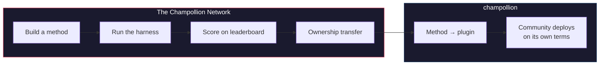

# The Champollion Network

> **エグゼクティブサマリー:** Champollion Networkは、可能な限り多くの言語ペアの翻訳テストセットを*作成し、信頼する*ためのオープンなインフラストラクチャです。専門家やコミュニティ*とともに*構築され、彼らからスクレイピング（無断収集）されることは決してありません。また、誰が何を翻訳できるのか、各手法がどの種類のテキストでどの程度優れているのか、そしてどこにギャップがあるのかなど、分野全体をナビゲートできるようにします。人間による翻訳も機械翻訳も、あらゆる手法を歓迎します。独自の手法を構築して提出し、実際のコーパスに対してどのようなスコアを出すかを確認することもできます。コミュニティがデータを提供する言語において、主権は交渉の余地のないものです。コーパスを提供する人々が、そのコーパスと、それに対して測定されるすべてのものに対する鍵（権限）を握っています。

このセクションはマップのホームです。配下のページでは、測定されたペアのネットワークがどのように構築されるか（[ネットワークの仕組み](/docs/network/how-it-works)）、公開ワークキューがなぜその順位付けを行うのか（[キューの理由](/docs/network/perspectives/why-the-queue)および[キュー構築仕様](/docs/network/specifications/queue-construction)）、そして接続の強度がどのように計算されるか（[接続強度](/docs/network/specifications/connection-strength)）について説明しています。プロジェクトを信頼すべきかどうかを判断しようとしている場合は、まず[誠実な制限事項](/docs/network/honest-limitations)からお読みください。すでに構築したいものが決まっている場合は、[Champollionとは](/docs/what-is-champollion)から始めてください。

**2種類のベンチマークで稼働します。** *公開ベンチマーク（Public benchmarks）*は、オープンデータセットを使用して、あらゆる手法を低コストかつオープンにマッピングし、ランク付けします。これはスクレイピングされたデータやオープンデータのベースライン層であり、データ汚染のリスクが明記されます。*主権ベンチマーク（Sovereign benchmarks）*はゴールドスタンダードです。これは言語コミュニティが作成、所有、管理する非公開のテストセットであり、Champollionが**見ることは決してありません**。コミュニティが承認した場合にのみ、ブラインド評価が行われます。インフラストラクチャ自体はソースが公開されており、単一の管理者によって運営されていますが、コミュニティに属するのは、その言語のテストセットと、その言語のために構築された手法です。

:::info[ローンチ/シード段階]
ネットワークはまだ初期段階ですが、すでに稼働しています。リーダーボードには実際に公開された実行結果が掲載されており、誰でも提出可能です。検証、コミュニティによる妥当性確認、ホールドアウト評価など、私たちが現在主張していることと、まだ主張していないことの正確な内容については、**[誠実な制限事項](/docs/network/honest-limitations)**を参照してください。
:::

---

## 課題

GoogleのCloud Translationサービスは194言語をリストアップしています（[Googleの公開リスト](https://docs.cloud.google.com/translate/docs/languages)）。MetaのNLLB-200は200言語をカバーし、OMT-1600（2026年3月）は1,600言語を主張しています。地球上では7,000以上の言語が話されています。OMT-1600のロングテールにある約1,200言語（カバーする1,600言語から、著者がモデルが「十分に理解している」と報告している400以上の言語を引いた計算）については、モデルの重みは公開されておらず、品質は実用的な閾値を下回っています。また、評価には聖書ドメインのテキストと標準的な機械翻訳の指標が使用されており、形態素の検証、独立したテスト、コミュニティによるガバナンスは存在しません。残りの約5,400言語については、事前学習済みモデルは一切の出力を生成しません。

大手テクノロジー企業は現在、LRL（低資源言語）のカバー範囲拡大に投資していますが、独立した品質検証、形態素の検証、またはコミュニティによるガバナンスを伴わないカバー範囲は、信頼のないカバー範囲にすぎません。翻訳ツールを最も必要としている話者は、ツールが構築される可能性が最も低いコミュニティの人々でもあります。

**ネットワークはこれを変えるために存在します。** テストセットを作成し、人間か機械かを問わずあらゆる手法をそれに対して評価し、その結果をマッピングするためのインフラストラクチャを提供します。これは、あらゆる言語において、再現可能なスコアリング、オープンな提出、そして誰がデータと結果を管理するかについてのコミュニティガバナンスを伴います。

言語データは*生体データ（biodata）*です。遺伝子データや健康データと同様に、言語はそれを話す人々のアイデンティティと関係性を帯びており、意味のある形での匿名化は不可能です。そのため、コーパスを提供する人々が、そのコーパスと、それに対して測定されるすべてのものに対する鍵（権限）を握っています。主権は後付けの機能ではなく、他のすべてが構築される基盤です。

---

## 仕組み

1. **翻訳手法を構築する** — 指導済みLLM、ファインチューニングされたモデル、FST（有限状態トランスデューサ）ゲートパイプラインなど、翻訳を生成するあらゆるものが対象です。
2. **ハーネスがベンチマークを実行する** — 標準化された指標（chrF++、完全一致、FST受容）を使用し、特定のGitコミットにフィンガープリントを付与します。
3. **結果がリーダーボードに表示される** — リアルタイムで更新され、提出はオープンです。公開されたすべての実行結果は再現可能であり、比較可能です。
4. **手法が機能した場合、所有権が移転する** — 先住民言語の場合、手法のコードはコミュニティのガバナンス組織に移譲されます。
5. **コミュニティがそれをデプロイする（導入するかどうか、およびその方法はコミュニティが選択）** — 手法は[champollion](https://champollion.dev)プラグインとしてエクスポートされ、完全にコミュニティのインフラストラクチャ上で実行できます。Champollionは、そこから得られる収益のいかなるシェアも受け取りません。

**ここで構築し、そこでデプロイする。**

:::tip[言語を解読し、勝利し、還元する]
これは意図的に機械学習のベンチマーク運用として設計されています。競争こそが、困難な言語ペアを解決するための手段だからです。私たちは、機械学習の研究者や有能な開発者に対し、特定の困難なペアに最適な手法を構築し、**報奨金が公開されている場合はそれを獲得し**、*さらに*その結果得られた手法を、その言語を所有する主権組織に引き渡すことを呼びかけています。競争のエネルギーは本物ですが、それはリーダーボードを単に駆け上がるためではなく、ミッションに向けられています。詳細は[賞金仕様](/docs/network/specifications/prizes)を参照してください。
:::

---

## 対象者

| 対象者 | ネットワークが提供するもの |
|---|---|
| **機械学習エンジニア / 研究者** | 標準化されたベンチマーク、再現可能なスコアリング、テスト用の共有コーパス |
| **言語学者** | 文法規則や辞書をテスト可能な手法に変換するためのフレームワーク |
| **プロフェッショナル / 人間による翻訳者** | サービスを登録し、見つけてもらうための場所。ここでは人間の翻訳は第一級の手法であり、後付けではなく、機械と並んでリストアップされ、ベンチマークされます |
| **言語コミュニティのメンバー** | 自身の言語の手法がどのように開発され、デプロイされるかに関するガバナンス |
| **資金提供者 / 助成金審査員** | 翻訳研究の提案を評価するための、透明で再現可能な指標 |
| **学生** | 実際のインパクトをもたらすオープンな招待。手法を構築し、結果を貢献できます |

---

## サポートされている参照コーパス

**ボードは稼働中ですが、まだ初期段階です。** 最初のスイープが公開されており、コントリビューターがキューのアイテムを実行するにつれてさらに追加されます。以下に示すのはリーダーボードではなく、現在提出物をスコアリングできる公開参照コーパスのセットです。コーパスがここにホストされることは決してありません。ハーネスは実行時にアップストリームのソースから参照を取得し、新しく取得したデータに対してスコアリングを行います。

### Global Voices (OPUS) — ニュースドメイン
- **カバー範囲:** 493の言語ペアがカタログ化され、実行可能（例: `eval-amh-fra-globalvoices-test-v1`、アムハラ語 → フランス語）
- **ライセンス:** CC BY 3.0
- **ソース:** [Global Voices via OPUS](https://opus.nlpl.eu/)

### Tatoeba — 会話 / 混合ドメイン
- **カバー範囲:** 874の言語ペアがカタログ化され、実行可能（例: `eval-afr-eng-tatoeba-dev-v1`、アフリカーンス語 → 英語）
- **ライセンス:** CC BY 2.0
- **ソース:** [Tatoeba community](https://tatoeba.org)

:::note[EdTeKLAは研究専用であり、ランキングのベンチマークではありません]
EdTeKLAの平原クリー語コーパス（*Cree: Language of the Plains*）には、[EdTeKLAの**改変版** CC BY-NC-SA](https://github.com/EdTeKLA/IndigenousLanguages_Corpora)が適用されています。これは主権をスコープとした非営利の条件です（ルートとなる教科書自体はCC BY-NC-ND 4.0です）。これは**すべてのランキングから除外**されており、リーダーボード、いかなる賞、またはAPI/商用レーンの対象にはなりません。また、リモートのモデルAPIによる評価は**同意ゲート**によって管理されています。権利者の明示的な許可が記録されていない限り、ハーネスはそのテキストをサードパーティのモデルAPIに送信することを拒否します（ローカルでの評価は引き続き可能です）。

FLORES+はここで接続され、実行可能**です**（870のカタログ化されたペア、例: `eval-flores-devtest-v1-amh-fra`）。しかし、これは**高汚染（HIGH-contamination）**です。つまり、公開されたウェブクロールによる評価データであり、最先端のモデルがすでに学習している可能性が非常に高いものです。したがって、これは**相対的な比較専用**となります。手法同士を直接比較するために使用することはできますが、**絶対的な品質のベンチマークとして報告されることは決してなく**、**テスト/例示のみ**を目的としています。FLORES+の結果が品質スコアとしてランク付けされることはなく、[翻訳マップ](https://champollion.dev)上のチェーンエッジとして使用されることもありません。私たちが主張していることと主張していないことの正確な内容については、[誠実な制限事項](/docs/network/honest-limitations)を参照してください。
:::

---

## 唯一のルール

:::danger[評価データで学習させないでください]
ベンチマークデータセットにさらされた手法（トレーニングデータ、Few-shotの例、辞書のエントリ、またはプロンプトの素材として）は**失格**となります。ファインチューニングには好きなものを使用してください。ただし、テストセットだけは使用しないでください。
:::

---

## 次のステップ

- **[手法を提出する](/docs/network/getting-started/submit-a-method)** — 最初のベンチマーク実行を提出する方法
- **[ベンチマーク仕様](/docs/network/specifications/benchmark)** — 完全な実験プロトコル
- **[リーダーボードのルール](/docs/network/leaderboard/rules)** — 提出基準と不正防止ポリシー
- **[データスチュワードシップ](/docs/network/sovereignty/data-sovereignty)** — コーパスは管理者の元に留まり、すべてのライセンスが尊重されます
- **[活動の資金源について](/docs/network/sovereignty/economic-model)** — 非営利であり、現在は自己資金で運営されています。資金提供者を募集しており、すべての資金の使途が公開されます

**[→ リーダーボードを見る](https://champollion.dev/leaderboard)**
