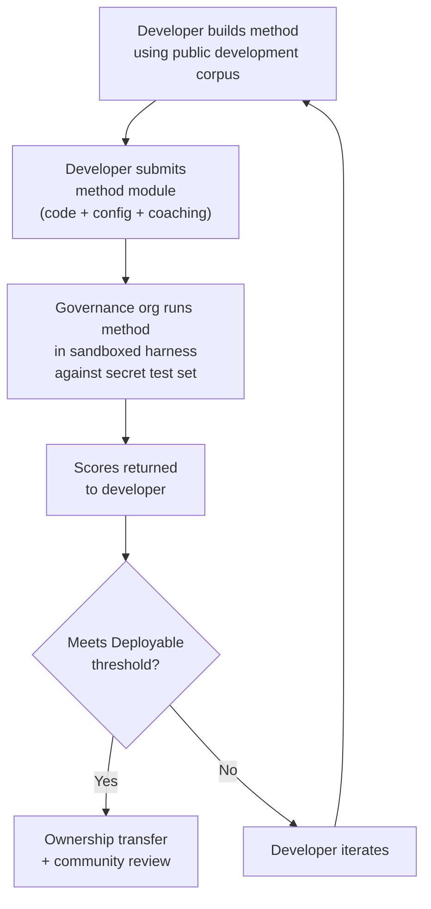

# ベンチマーク仕様

> **エグゼクティブサマリー** 本ドキュメントでは、Champollion MT評価エコシステムの評価プロトコルを定義します。これには、コーパスフォーマット（§2）、ランカードスキーマ（§3）、ベンチマークプロトコル（§6）、人間による検証要件（§7）、主権メカニズム（§8）、リーダーボードと提出モデル（§9）、コストフレームワーク（§10）、および新しい言語への拡張性（§11）が含まれます。指標の定義、複合スコアリングの重み付け、品質ティアのしきい値、およびコスト/速度指標の計算式については、すべてのスコアリングロジックの唯一の信頼できる情報源（Single Source of Truth）である`SCORING_SPEC.md`を参照してください。本ドキュメントでは、これらの詳細を重複して記載する代わりに、SCORING_SPECを参照しています。


---

## 1. 原則

### 1.1 言語はバイオデータである

言語は中立的なテスト素材ではありません。遺伝データや健康データと同様に、言語データは**バイオデータ**です。それはその言語を話す人々のアイデンティティ、親族関係、および人間関係を担っており、意味のある形で匿名化することはできません。メタデータを取り除いても、言語はその人々が誰であるかをエンコードし続けます。この仕様における具体的な帰結として、コーパスを提供する人々がそのコーパスの、そしてそれに対して測定されるあらゆるものの鍵を握っています。したがって、主権（§8）はプロトコルへの付加機能ではなく、その前提条件であり、以下のすべての原則はその内側で機能します。

### 1.2 自動指標はプロキシである

本ドキュメントで定義されるすべてのメトリクスは機械によって計算されます。chrF++、FST受理率、形態論的精度、意味的類似度——これらはすべて翻訳品質の自動化されたプロキシです。これらは迅速なイテレーション、体系的な比較、および回帰の検出に有用です。しかし、**人間の判断の代替にはなりません**。

評価の階層：

```
Automated metrics (run cards, benchmarks)
    ↓ proxy for
Human review (bilingual speakers validate output)
    ↓ proxy for
Actual utility (does this help a language community?)
```

どれほど高い自動化スコアも、流暢な話者が出力を読んで正確で自然かつ文化的に適切であることを確認することの代わりにはなりません。§5で定義される品質ティアは、自動化された複合スコアに対するヒューリスティックなラベルです。進捗の追跡には有用ですが、それだけでは決して十分ではありません。

### 1.3 モデルではなく手法を評価する

私たちはモデルではなく**手法**をベンチマークします。モデルは一つの構成要素です。手法とは完全なレシピです。モデルの選択、プロンプト設計、ツールの使用、前処理・後処理、コーチングデータ、リトライ戦略、そのすべてを含みます。同じモデルを使用する二つのチームが異なる手法を用いれば、異なるスコアを得ます。それがこの評価の意図するところです。

### 1.4 再現性

すべてのベンチマーク結果は再現可能でなければなりません。ランカード（§3）は実験の完全な設定を記録します。フィンガープリント（§3.5）は実験的セットアップを識別します。ランカードハッシュ（§3.6）は結果の整合性を検証します。同じ手法、コーパス、および設定を持つ誰もが、±2%以内のスコアを達成できるはずです（temperature > 0でのLLMサンプリングの非決定性を考慮）。

### 1.5 合成評価データの不使用

**本プロジェクトは合成評価データを生成・使用・推奨しません。** すべてのコーパスは、真に人間が著した文章——公開された翻訳、教科書、バイリンガル文書、または流暢な話者から引き出された翻訳——から取得しなければなりません。

LLMが支援できる作業：
- 文のアライメント（既存のバイリンガルテキストにおける対訳箇所の発見）
- フォーマット変換（公開資料をコーパススキーマに変換する）
- メタデータの充実（難易度ティアやレジスターラベルの提案）
- 人間が翻訳するためのソース文の提案（§11.3——翻訳ステップは常に人間が行う）

LLMは参照翻訳や評価ペアを**絶対に生成してはなりません**。

**私たちはトレーニングデータについては開発中立の立場をとります。** 手法開発者が合成トレーニングデータ、逆翻訳、またはデータ拡張を手法に使用する場合、それは開発者の選択です。私たちはトレーニングプロセスではなく出力を評価します。MetaのOMT-1600は、逆翻訳によって生成された約2億7000万の合成対訳文を使用しています。このような方法でトレーニングされた手法に異議はありません。私たちは人間によるキュレーションのみでテストします。

> **なぜ聖書テキストを評価に使わないのか？** OMT-1600は1,600言語中1,560言語を聖書ドメインのテキストで評価しています（Meta AI、*Omnilingual MT*、arXiv:2603.16309、2026年）。聖書の翻訳は古風なレジスター、典礼的な語彙、および定型的な文構造を持っています。私たちの評価コーパスは、コミュニティがキュレーションした多様なドメインのテキスト——医療、法律、教育、行政、会話、技術ドメイン（§2.7参照）——から取得されています。これは意図的な設計上の選択です。コミュニティが実際に生活し働くドメインでの翻訳を必要としており、単一の宗教的レジスターではありません。創世記1章1節で高いスコアを出す手法は、バンドカウンシルの議題やクリニックの受付フォームでのパフォーマンスについてほとんど何も教えてくれません。

---

## 2. コーパススキーマ

コーパスは、構造化されたメタデータを持つ対訳テキストペアのキュレーションされたセットです。すべての手法が測定される基準となる正解データです。

### 2.1 データセットエンベロープ

コーパスファイルのトップレベル構造：

```json
{
  "dataset": {
    "id": "edtekla-dev-v1",
    "version": "1.0",
    "language_pair": "EN→CRK",
    "source_language": "en",
    "target_language": "crk",
    "created": "2026-05-01",
    "license": "LicenseRef-EdTeKLA-Modified-CC-BY-NC-SA-4.0",
    "provenance": ["gold_standard", "textbook"]
  },
  "entries": [ ... ]
}
```

| フィールド | 型 | 必須 | 説明 |
|-------|------|----------|-------------|
| `id` | string | ✅ | 一意のデータセット識別子。ランカードとリーダーボードで使用される |
| `version` | string | ✅ | セマンティックバージョン。インクリメントすると以前のランカードとの比較が無効になる |
| `language_pair` | string | ✅ | 表示ラベル（例：`EN→CRK`） |
| `source_language` | string | ✅ | BCP 47ソース言語コード |
| `target_language` | string | ✅ | BCP 47ターゲット言語コード |
| `created` | string | ✅ | ISO 8601作成日 |
| `license` | string | ✅ | SPDXライセンス識別子 |
| `provenance` | string[] | ✅ | エントリ全体で使用される出典タグのリスト |

### 2.2 エントリスキーマ

コーパスの各エントリは一つの翻訳チャレンジを表します：

```json
{
  "id": 42,
  "source": "I see the dog",
  "reference": "niwâpamâw atim",
  "segment": "gold_standard",
  "difficulty": 2,
  "provenance": "gold_standard",
  "register": "conversational",
  "context": "declaration",
  "morphological_analysis": "ni-wâpam-âw atim | 1sg-see.TA-3sg.DIR dog.AN",
  "notes": "Animate noun (atim); direct form because speaker is proximate",
  "variant_class": "simple-ta-direct"
}
```

| フィールド | 型 | 必須 | 説明 |
|-------|------|----------|-------------|
| `id` | integer | ✅ | コーパス内の一意の識別子 |
| `source` | string | ✅ | ソース言語のソーステキスト |
| `reference` | string | ✅ | ターゲット言語のゴールドスタンダード参照翻訳 |
| `segment` | string | 📎 | コーパスパーティション：`gold_standard`、`held_out`、`development`、または`diagnostic` |
| `difficulty` | integer | 📎 | 難易度評価1〜5（§2.4参照） |
| `provenance` | string | 📎 | このエントリの出典（§2.5参照） |
| `register` | string | 📎 | レジスター・フォーマリティレベル（§2.6参照） |
| `context` | string | 📎 | コミュニケーション機能（§2.6参照） |
| `domain` | string | 📎 | 16コード分類法によるユースケースドメイン（§2.7参照）。次のいずれかでなければならない：`conv`、`ecommerce`、`edu`、`financial`、`gov`、`legal`、`literary`、`marketing`、`medical`、`news`、`religious`、`scientific`、`subtitles`、`support`、`tech`、`ui`。構築時に検証される。 |

> **📎 = 推奨。** ハーネスはデフォルト値によって欠落したオプションフィールドを適切に処理します。サードパーティのコーパスは、エントリごとに`id`、`source`、および`reference`のみを提供すれば十分です。
| `morphological_analysis` | string | ❌ | ゴールドスタンダードの形態論的分解 |
| `notes` | string | ❌ | 翻訳者のメモ、方言的変異、曖昧さのフラグ |
| `variant_class` | string | ❌ | 許容可能な翻訳バリアントをグループ化するクラスラベル |


### 2.3 コーパスセグメント

コーパスは異なるアクセスレベルを持つセグメントに分割されます：

| セグメント | 目的 | アクセス | 最小サイズ |
|---------|---------|--------|-------------|
| `development` | 手法の開発とイテレーション。開発者が自由に使用する。 | **公開** | 30エントリ |
| `diagnostic` | 特定の言語現象に対するターゲットテスト。 | **公開** | 10エントリ |
| `gold_standard` | 公式ベンチマーク評価。リーダーボードのスコアはここから算出される。 | **秘密** — ガバナンス組織が保持 | 50エントリ |
| `held_out` | 将来の評価のために予約。有効化されるまで使用されない。 | **秘密** — ガバナンス組織が保持 | 10エントリ |

> **現在の状態：** 出荷済みデータセットには`development`セグメントのみが存在します。`diagnostic`、`gold_standard`、および`held_out`セグメントは、コーパスが成長するにつれて将来使用するために定義されています。

`gold_standard`および`held_out`セグメントは完全に秘密です。ソース文と参照翻訳の両方がガバナンス管理のインフラストラクチャ上に保持されます。手法開発者は問題も答えも見ることができません。主権メカニズムについては§8を参照してください。

### 2.4 難易度ティア

| ティア | 説明 | 例 |
|------|-------------|----------|
| 1 — 基本語彙 | 単語、一般的な挨拶、数字 | "hello" → "tânisi"、"dog" → "atim" |
| 2 — 単純な文 | 主語-動詞またはSVO、現在時制 | "I see the dog" → "niwâpamâw atim" |
| 3 — 中程度の複雑さ | 過去・未来時制、所有格、生物性 | "I saw his dog yesterday" |
| 4 — 複雑な形態論 | 遠称、受動態、接続法語順、関係節 | "the woman whose son went to the store" |
| 5 — 上級 | 複数節、フォーマルレジスター、儀礼的、慣用的 | レジストリに適したトーンを持つ完全な段落 |

適切に構築されたコーパスは、5つの難易度ティアすべてにわたるエントリを含み、実際の翻訳課題の大部分が該当するティア2〜4に重点を置くべきです。

### 2.5 出典タグ

すべてのエントリはその出典を示さなければなりません：

| タグ | 意味 |
|-----|---------|
| `gold_standard` | 流暢な話者によって検証済み |
| `textbook` | 公開された教育資料から取得 |
| `elicited` | 構造化された引き出しセッションを通じて作成 |
| `corpus` | 対訳コーパスから抽出 |

> **注意：** 実際には、出典の値は自由形式の文字列です。上記のタグは規約であり、検証済みの列挙型ではありません。データセットは他の説明的な出典文字列を使用することができます。

### 2.6 レジスターとコンテキスト

**レジスター**はフォーマリティと社会的コンテキストを説明します：

| レジスター | 説明 |
|----------|-------------|
| `conversational` | 対等な者同士の日常会話 |
| `formal` | 公式または機関の言語 |
| `technical` | ドメイン固有の語彙 |
| `ceremonial` | 伝統的または神聖な言語使用 |
| `educational` | 言語教育資料 |

**コンテキスト**はコミュニケーション機能を説明します：

> 🔲 **計画中。** `context`フィールドはスキーマで定義されていますが、現在のデータセットではまだ入力されていません。将来のコーパス充実のために予約されています。

| コンテキスト | 説明 |
|---------|-------------|
| `greeting` | 社交的な挨拶または別れ |
| `declaration` | 事実の陳述 |
| `question` | 疑問文 |
| `instruction` | 命令または指示 |
| `narrative` | 物語または説明 |
| `label` | UIラベル、ボタンテキスト、または見出し |
| `error` | エラーメッセージまたは警告 |

### 2.7 ドメイン {#27-domain}

**ドメイン**は実際のユースケース——翻訳されるコンテンツの種類——を説明します。これはレジスターやコンテキストとは直交する概念です：

- **レジスター**が答える問い：*これはどの程度フォーマルか？*
- **コンテキスト**が答える問い：*この文は何をしているか？*
- **ドメイン**が答える問い：*これはどの業界・ユースケース向けか？*

法的契約（ドメイン：`legal`）はフォーマル（レジスター：`formal`）で宣言（コンテキスト：`declaration`）を含む場合があります。法的チャットボットのトランスクリプト（ドメイン：`legal`）は会話的（レジスター：`conversational`）で質問（コンテキスト：`question`）を含む場合があります。同じドメインでも、レジスターとコンテキストは異なります。

| ドメインコード | 説明 | 主な利用者 |
|-------------|-------------|-------------------|
| `ui` | ソフトウェアインターフェース文字列 | アプリ開発者、ローカライゼーションチーム |
| `legal` | 契約書、法令、裁判所への申立書、移民関連書類 | 法律事務所、裁判所、コンプライアンスチーム、知財弁護士 |
| `medical` | 臨床メモ、薬品ラベル、患者向けコミュニケーション、治験プロトコル | 病院、製薬会社、臨床試験、患者ポータル |
| `financial` | 銀行業務、保険、規制当局への申告書、監査報告書 | 銀行、保険会社、規制当局、監査人 |
| `edu` | 教科書、カリキュラム、授業計画、学術資料 | 学校、大学、教科書出版社 |
| `ecommerce` | 商品説明、レビュー、マーケットプレイスの出品情報 | オンライン小売業者、マーケットプレイス出品者 |
| `marketing` | 広告コピー、ブランドメッセージ、キャンペーン、スローガン | 広告代理店、ブランドチーム |
| `gov` | 政策文書、規制、公告、法律 | 政府機関、コンプライアンスチーム |
| `scientific` | 研究論文、要旨、方法論、研究助成金申請書 | 研究者、学術誌、助成機関 |
| `religious` | 聖典、典礼テキスト、神学的解説 | 信仰コミュニティ、典礼出版社 |
| `support` | FAQ、エラーメッセージ、トラブルシューティングガイド、チャットボットスクリプト | SaaS企業、ヘルプデスク |
| `subtitles` | 映画、TV、ストリーミング、ゲームのセリフ | ストリーミングプラットフォーム、スタジオ、ゲーム会社 |
| `news` | ジャーナリズム、通信社レポート、社説、プレスリリース | メディア組織、通信社 |
| `literary` | フィクション、詩、物語、文化的テキスト | 出版社、文化保存団体 |
| `conv` | 非公式な会話、ソーシャルメディア、メッセージング | コンシューマーアプリ、ソーシャルプラットフォーム |
| `tech` | APIドキュメント、マニュアル、エンジニアリング仕様書、技術ガイド | ドキュメントチーム、エンジニアリング組織 |

> **ドメイン固有のベンチマーク。** 一般ベンチマークはすべてのドメインにわたって手法を評価します。しかしNetworkは**ドメインフィルタリングされたベンチマーク**もサポートしています。これは特定のドメインにタグ付けされたエントリのみでスコアを計算するものです。これにより、「法的文書をフランス語に翻訳するのに最適な手法はどれか？」対「フランス語の総合スコアが最も高い手法はどれか？」という問いに答えることができます。
>
> ドメインフィルタリングされたリーダーボードランキングにより、ユーザーは単一のユースケース内で手法を比較できます。手法はドメインによってパフォーマンスが異なります。法律用語でファインチューニングされた手法は、会話テキストよりも法的テキストで大幅に高いスコアを出す可能性があります。Networkはユーザーが特定のユースケースに最適な手法を見つけるのを支援します。

> **将来の機能：Networkアシスタント。** ユーザーがMTのユースケース（ドメイン、言語ペア、品質要件）を説明するのを支援し、リーダーボードからコミュニティ検証済みの手法を提示する会話型アシスタント——例えば「医療ドメインのEN→JAベンチマークで最高スコアの手法はどれか？」——は、十分なドメインタグ付き評価データと手法の多様性を条件として検討中のナビゲーション支援機能です。

---

## 3. ランカードスキーマ {#3-run-card-schema}

ランカードは評価の最小単位です。これは一つの評価ランの完全な設定と結果を記録する自己完結型のJSONドキュメントです。一つの手法、一つのモデル、一つの設定、一つのデータセットに対応します。

すべてのランカードは三つの次元を記録します：
- **品質** — 翻訳はどの程度優れているか？
- **コスト** — 翻訳の生成にいくらかかったか？
- **速度** — どのくらいの時間がかかったか？

### 3.1 トップレベルフィールド

| フィールド | 型 | 説明 |
|-------|------|-------------|
| `run_id` | string | ランの開始時に生成されるUUID v4 |
| `harness_version` | string | ハーネスのセマンティックバージョン（例：`2.0`） |
| `timestamp` | string | ランが開始されたISO 8601 UTCタイムスタンプ |
| `elapsed_seconds` | number | ラン全体のウォールクロック時間 |

### 3.2 手法設定

これらのフィールドは実験的セットアップを定義します——何が、どのようにテストされたか。

| フィールド | 型 | 必須 | 説明 |
|-------|------|----------|-------------|
| `model_slug` | string | ✅ | モデル識別子（例：`google/gemini-2.5-flash`） |
| `model_id` | string | ❌ | APIが返す解決済みモデル識別子 |
| `condition` | string | ✅ | 実験ラベル（例：`baseline`、`coached-v3`、`few-shot`） |
| `temperature` | number | ✅ | サンプリング温度 |
| `system_prompt_sha256` | string | ✅ | 完全なシステムプロンプトのSHA-256ハッシュ |
| `system_prompt_used` | string | ✅ | 完全なシステムプロンプトテキスト |
| `coaching_data_sha256` | string | ❌ | 使用した場合、コーチングデータファイルのSHA-256ハッシュ |
| `fst_version` | string | ❌ | 使用した場合、FSTアナライザーのバージョン |
| `tools_enabled` | string[] | ❌ | 手法が利用可能なツールのリスト |
| `batch_size` | number | ❌ | 同時APIバッチあたりのエントリ数 |
| `max_retries` | number | ❌ | 該当する場合、FST拒否に対する最大リトライ回数 |

:::info[公開されたランカードには method_config が含まれます]
ランカードがリーダーボードに公開される際（`mt-eval publish` 経由）、正規の8フィールドからなる MethodConfig（`model`、`temperature`、`batchSize`、`register`、`coachingFile`、`coachingPrompt`、`promptContext`、`qualityTier` — すべて camelCase）を含む `method_config` ブロックも一緒に含まれます。これにより、再構築なしのインポートが可能になります。`champollion leaderboard --install` は `method_config` を直接読み取り、プラグインマニフェストとして書き出します。上記のテレメトリフィールド（§3.2）はハーネスが観測した内容を記録し、`method_config` は開発者が意図した内容を記録します。
:::

### 3.3 データセット参照

| フィールド | 型 | 説明 |
|-------|------|-------------|
| `dataset.id` | string | データセット識別子 |
| `dataset.version` | string | データセットバージョン |
| `dataset.language_pair` | string | 表示ラベル |
| `dataset.sha256` | string | データセットファイル内容のSHA-256ハッシュ |
| `dataset.entry_count` | number | 評価されたエントリ数 |

データセットのSHA-256は結果を特定バージョンのデータに固定します。データセットが変更された場合、古いランカードとの比較はできません。

### 3.4 スコア（品質）

ラン全体の集計メトリクス。すべての品質メトリクスは**自動化**されています——§1.2を参照してください。

| フィールド | 型 | 説明 |
|-------|------|-------------|
| `scores.total` | number | 評価されたエントリの総数 |
| `scores.exact_matches` | number | 出力が参照と完全に一致したエントリ数 |
| `scores.exact_match_rate` | number | 0.0〜1.0 |
| `scores.equivalent_matches` | number | 許容可能なバリアントと一致したエントリ数 |
| `scores.equivalent_match_rate` | number | 0.0〜1.0 |
| `scores.fst_accepted` | number | FSTアナライザーに受理されたエントリ数 |
| `scores.fst_acceptance_rate` | number | 0.0〜1.0、FSTが設定されていない場合は`null` |
| `scores.morphological_accuracy` | number | 0.0〜1.0、FST由来（レンマ一致）、FSTなし/レンマ一致語なしの場合は`null`。有効化されるまで諮問的——スコアリング仕様§2.2を参照 |
| `scores.morph_coverage` | number | 0.0〜1.0、分析可能な予測語のうち参照にレンマ一致した割合（`morphological_accuracy`がどの程度疎かを開示） |
| `scores.chrf_plus_plus` | number | コーパスレベルのchrF++スコア（0〜100） |
| `scores.semantic_score` | number | 埋め込みベースの意味的類似度（0.0〜1.0） |
| `scores.ter` | number | 翻訳編集率（0〜∞、低いほど良い） |
| `scores.length_ratio` | number | avg(len(predicted)/len(reference))、理想値 = 1.0 |
| `scores.code_switching_rate` | number | 0.0〜1.0、ソース言語の漏れがあるエントリの割合 |
| `scores.hallucination_rate` | number | 0.0〜1.0、幻覚コンテンツがあるエントリの割合 |
| `scores.terminology_adherence` | number | 0.0〜1.0、用語集用語への準拠（用語集なしの場合は`null`） |
| `scores.tokens_per_second` | number | total_tokens / elapsed_seconds |
| `scores.entries_per_minute` | number | 1分あたりに翻訳されたエントリ数 |
| `scores.composite` | number | 重み付き複合スコア（0.0〜1.0）。SCORING_SPEC §4を参照 |
| `scores.errors` | number | 失敗したエントリ数（APIエラー、タイムアウトなど） |
| `scores.by_difficulty` | object | 難易度ティア別のスコア内訳 |
| `scores.by_provenance` | object | 出典タグ別のスコア内訳 |
| `scores.by_domain` | object | ✅ 実装済み — ドメイン別のスコア内訳（§2.7）。ドメインフィルタリングされたリーダーボードランキングを可能にする。tester.pyで計算され、publish.pyを通じて渡される。 |

### 3.5 合計（コスト）

| フィールド | 型 | 説明 |
|-------|------|-------------|
| `totals.prompt_tokens` | number | すべてのAPI呼び出しにわたる入力トークンの合計 |
| `totals.completion_tokens` | number | 出力トークンの合計 |
| `totals.reasoning_tokens` | number | 思考の連鎖に使用されたトークン（ほとんどのモデルでは0） |
| `totals.cached_tokens` | number | プロバイダーのプロンプトキャッシュから提供されたトークン |
| `totals.total_cost_usd` | number | USD単位の総コスト |
| `totals.cost_per_entry_usd` | number | `total_cost_usd / entry_count` |
| `totals.cost_per_source_char` | number | ソース文字あたりのUSD——言語間で比較可能 |

### 3.6 タイミング（速度）

| フィールド | 型 | 説明 |
|-------|------|-------------|
| `elapsed_seconds` | number | ラン全体のウォールクロック時間（トップレベル） |
| `scores.avg_latency_seconds` | number | エントリあたりの平均応答時間 |
| `scores.median_latency_seconds` | number | エントリあたりの中央値応答時間 |
| `scores.p95_latency_seconds` | number | エントリあたりの95パーセンタイル応答時間 |

### 3.7 エントリごとの結果

`results[]`配列の各エントリは一つの翻訳を記録します。エントリごとのデータは`run_card_entries`テーブル（マイグレーション005）に非正規化されたLYSSベルディクト（マイグレーション006）とともに永続化されます。

| フィールド | 型 | 説明 |
|-------|------|-------------|
| `entry_id` | string | コーパスの`entries[].id`と一致 |
| `source` | string | 翻訳されたソーステキスト |
| `expected` | string | ゴールドスタンダードの参照翻訳 |
| `raw_predicted` | string \| null | 後処理前の生のモデル出力 |
| `predicted` | string | 手法の実際の出力（後処理済み） |
| `segment` | string | セグメント識別子（例：文インデックス） |
| `difficulty` | string \| null | コーパスからの難易度ティア |
| `domain` | string | コーパスからのドメインタグ（§2.7） |
| `exact_match` | boolean | 出力が参照と完全に一致したかどうか |
| `chrf_score` | number \| null | 文レベルのchrF++（0〜100） |
| `bleu_score` | number \| null | 文レベルのBLEU（0〜100） |
| `latency_s` | number \| null | 秒単位の応答時間 |
| `cost_usd` | number \| null | このエントリのUSD単位のコスト |
| `tool_call_count` | integer | 使用されたツール呼び出し数（なしの場合は0） |
| `error` | string \| null | このエントリが失敗した場合のエラーメッセージ |
| `plugin_metrics` | object | エントリごとの完全なプラグイン出力（JSONB） |
| `fst_valid` | boolean \| null | GiellaLT FSTが予測を受理した（非正規化LYSS-fst） |
| `equivalent_match` | boolean \| null | CRKリンターが構造的等価性を確認した（非正規化LYSS-eq） |
| `semantic_verdict` | string \| null | LYSS-semベルディクト：`VALID`、`MISMATCH`、`UNKNOWN`、`ERROR` |
| `code_switching_detected` | boolean \| null | 出力でソース言語トークンが検出された |
| `hallucination_detected` | boolean \| null | 出力で捏造コンテンツが検出された |


### 3.8 フィンガープリント

再現性の識別子です。フィンガープリントが同一の2つの実行は、同じ実験設定を使用しています。

フィンガープリントは以下のソートされた連結のSHA-256ハッシュです：
- `dataset.sha256`
- `model_slug`
- `condition`
- `system_prompt_sha256`
- `temperature`
- `harness_version`
- `batch_size`
- `tools_enabled`

> **なぜ8つのコンポーネントなのか？** バッチサイズとツール呼び出しは出力品質に実質的な影響を与えるため、アイデンティティに含める必要があります。バッチサイズが異なる、またはツールの有効化が異なる二つのランは、他のすべてのパラメータが一致していても、異なる実験的セットアップです。

同一のフィンガープリントを持つ二つのランは比較可能な結果を生成するはずです。差異はAPIの非決定性（temperature > 0）またはプロバイダー側のモデル更新によるものです。

### 3.9 ランカードハッシュ

ランカードJSON全体のSHA-256ハッシュ（ハッシュ計算中は`run_card_hash`フィールド自体を`""`に設定）。これは改ざん検出のシールです。いずれかのフィールドが変更されると、ハッシュが壊れます。

---

## 4. 自動化メトリクス

このセクションのすべてのメトリクスは機械によって計算されます。§1.2を参照してください。

### 4.1 メトリクスの定義

| メトリクス | ステータス | 測定対象 | 範囲 |
|--------|--------|-----------------|-------|
| **chrF++** | ✅ 実装済み | 文字n-gramのFスコア。文字レベルで動作するため、語が長く高度に活用される形態論的に豊かな言語では、単語レベルのメトリクス（BLEU）よりも堅牢です。sacrebleuによって計算されます。 | 0〜100（ネイティブスケール）。複合スコアで使用する際は100で除算。 |
| **FST受理率** | ✅ 実装済み | 形態論的アナライザー（GiellaLT HFST）によってターゲット言語の有効な形式として受理された予測語の割合。FSTが受理した語は実際の構造的に有効な語であり、幻覚ではありません。 | 0.0〜1.0 |
| **完全一致** | ✅ 実装済み | Unicode正規化後に参照と完全に一致した予測の割合。厳格ですが明確——上限チェックとして有用です。 | 0.0〜1.0 |
| **形態論的精度** | 🔲 計画中 | ゴールドスタンダードの形態論的分析を持つエントリについて：正しく生成された形態素の割合。FST受理よりも細かい粒度——語はFST有効でも形態素構造が誤っている場合があります（語根は正しいが時制が誤り）。 | 0.0〜1.0 |
| **等価一致** | ⚡ 部分的 | 参照の許容可能なバリアントと一致した割合——語順、方言的差異、正書法的慣習を考慮します。現在CRKのCRK評価標準の`CrkLinterMetric`（`eval_standards/crk/`内）を通じて実装済み；CRK言語カードの`evalMetrics`宣言を通じて自動的に読み込まれます。汎用実装にはコーパスのエントリごとの`variants[]`が必要です。 | 0.0〜1.0 |
| **意味スコア** | ⚡ 部分的 | 表面形式に関わらない意味の保持。現在CRKのCRK評価標準の`CrkSemanticMetric`（`eval_standards/crk/`内、ベルディクト重み付きプロキシ）を通じて実装済み。汎用埋め込みベースのコサイン類似度は計画中——SCORING_SPEC §2.3を参照。 | 0.0〜1.0 |

### 4.2 複合スコア

複合スコアは利用可能なすべてのメトリクスの加重平均です：

```
composite = Σ (weight_i × metric_i)   for all available metrics
             ─────────────────────
             Σ weight_i              (renormalized to sum to 1.0)
```

メトリクスが利用できない場合（FSTが設定されていない、バリアントクラスが定義されていない、埋め込みモデルがない）、その重みは残りのメトリクスに比例して再配分されます。これにより、複合スコアは常に言語内で比較可能です——その言語で利用可能なメトリクスを使用し、それに応じて正規化します。

**重みテーブル、入力正規化ルール、および完全なメトリクスインベントリは`SCORING_SPEC.md` §4で定義されています。** そのドキュメントは以下のSSOTです：
- プロファイルAの重み（FST対応言語——9メトリクス、構造メトリクスが40%を占める）
- プロファイルBの重み（FST非対応言語——8メトリクス）
- 正規化ルール（chrF++ ÷ 100、コードスイッチングと幻覚率の反転）
- 複合スコアから除外されるメトリクス（BLEU、COMET、TER、長さ比率、一貫性）とその理由

ハーネスコードはこれらのテーブルを`mt_eval_harness/scoring.py`に反映します。SCORING_SPECが変更された場合、`scoring.py`が一致するように更新され、`test_scoring_ssot.py`がアライメントを検証します。

> **なぜBLEUを使わないのか？** BLEUは単語レベルで動作し、形態論的変異にペナルティを与えます。多合成語言語では、一つの語が節全体になり得ます——BLEUは軽微な活用の差異を完全なミスとして扱います。chrF++は文字レベルで動作することでこれをより適切に処理します。BLEUは両方の重みテーブルから除外されています。完全な根拠についてはSCORING_SPEC付録Aを参照してください。


### 4.3 コスト調整スコア

有料APIを使用する手法については、二次ランキングも報告します。コスト調整の計算式は`SCORING_SPEC.md` §6.3で定義されています。

---

## 5. 品質ティア {#5-quality-tiers}

品質ティアは自動化された複合スコアに対するヒューリスティックなラベルです。各レベルの出力に対する人間によるレビューに基づいて、スコアが実際に何を意味するかを説明します。**これらは検証済みの品質判断ではありません**——実際の使用可能性を確認できるのは人間によるレビュー（§6）のみです。

**ティアの閾値と説明は`SCORING_SPEC.md` §5で定義されています。** ティアは：Baseline（0.00〜0.30）、Emerging（0.30〜0.50）、Functional（0.50〜0.70）、Deployable（0.70〜0.85）、Fluent（0.85〜1.00）です。

> [!IMPORTANT]
> **自動化ティアは暫定的です。** これらのラベルはレビューのための候補であり、品質の宣言ではありません。自動化メトリクスで「Deployable」に達した手法はコミュニティ評価の候補です——出荷する製品ではありません。実際の使用可能性を確認できるのは人間によるレビュー（§7）のみです。ティアの境界は言語によって異なる場合があります。

これらのティアは暫定的です。人間による検証データが蓄積され、各言語で「話者がこれを有用と感じる」閾値がどこにあるかを学ぶにつれて、再調整されます。ティアの境界は言語によって異なる場合があります。

バイリンガル話者が出力を使用可能と同意するコミュニティレビューなしに、いかなる手法も**Deployable**以上を主張することはできません。

---

## 6. ベンチマークプロトコル

**ベンチマーク**とは、特定のデータセットに対して宣言されたパラメータ空間全体にわたってランカードを体系的に生成することです。単一のランではなく、異なる設定がどのようにパフォーマンスするかの構造化された探索です。

### 6.1 ベンチマークが生成するもの

ベンチマークは**ランカードのマトリクス**を生成します——パラメータ値の各組み合わせに対して一つずつ。このマトリクスにより、以下の多面的な比較が可能になります：

- **品質** — 複合スコア、個別メトリクスの内訳
- **コスト** — 各設定の総コストとエントリあたりのコスト
- **速度** — ウォールクロック時間とエントリあたりのレイテンシ

単一の「ベンチマークスコア」は存在しません。ベンチマークは完全なマトリクスです。異なるステークホルダーは異なる側面を重視します：研究者は複合スコアを最適化し、デプロイメントエンジニアはエントリあたりのコストを最適化し、コミュニティは品質をレビューします。

### 6.2 パラメータ空間

ベンチマークはどのパラメータを順列するかを宣言します：

| 軸 | 典型的な値 | 目的 |
|------|---------------|---------|
| `model` | 4〜12モデル（フロンティア + 中間層 + バジェット） | モデルの能力はどの程度重要か？ |
| `temperature` | 0.0、0.3、0.7 | サンプリングのランダム性は助けになるか、それとも害になるか？ |
| `prompt_version` | 2〜3のプロンプト戦略 | 手法はプロンプト設計にどの程度敏感か？ |
| `coaching_config` | コーチングデータあり/なし | 言語知識の注入は出力を改善するか？ |
| `tool_config` | FSTあり/なし、辞書あり/なし | 言語ツールは出力を改善するか？ |

完全な順列空間：
```
runs = |models| × |temperatures| × |prompts| × |coaching| × |tools|
```

典型的な初期ベンチマーク：12モデル × 3温度 × 2プロンプト × 2コーチング = 144ラン。

### 6.3 ベースラインと手法評価

ベンチマークは二つの異なる目的を果たします：

**ベースライン設定** — ナイーブなアプローチで状況を把握する。「言語固有のエンジニアリングなしに、既存のモデルはこの言語に対して何ができるか？」これが基準を確立します。ベースラインマトリクスは以下を示します：どのモデルが最も幻覚が少ないか、どの温度が最も一貫した出力を生成するか、コーチングデータがそもそも役立つかどうか、すべてのモデルが一様に失敗する箇所（これにより困難な言語的問題が明らかになる）。

**手法評価** — 特定のエンジニアリングされた手法をテストする。「私のFSTゲート付きコーチングパイプラインはベースラインを上回るか？」手法のランカードはベースラインマトリクスと比較されます。手法が最良のベースラインを上回る場合——エンジニアリングがナイーブなモデル呼び出しに対して価値を付加する場合——に興味深いと言えます。

どちらの活動も同じスキーマのランカードを生成します。区別は意図とパラメータ空間にあります：ベースラインはモデルと設定全体を順列し、手法評価は一つの手法を最良の設定に対してテストします。

### 6.4 開発用とゴールドスタンダード評価

手法開発者は`development`および`diagnostic`コーパスセグメントに対して自由にイテレーションします。これは非公式です——制限なし、提出なし、ガバナンスの関与なし。開発者は何が機能するかを学んでいます。

公式リーダーボードのスコアは`gold_standard`評価のみから得られます。これは公式です：
1. 開発者は完全に実行可能な手法（コード + 設定 + コーチングデータ）を提出する
2. ガバナンス組織がサンドボックス化されたハーネスで秘密のテストセットに対して実行する
3. スコアのみが返ってくる

完全な主権メカニズムについては§8を参照してください。

---

## 7. 人間による検証 {#7-human-validation}

自動化メトリクスはプロキシです。人間による検証が正解データです。

### 7.1 人間によるレビューがメトリクスでは捉えられないもの

- **形態論的に有効だが意味的に誤り** — FSTが語を受理し、chrF++が高いが、翻訳が異なる意味を持つ
- **文化的に不適切** — 翻訳は技術的に正しいが、コミュニティが拒否するレジスターや表現を使用している
- **幻覚の妥当性** — 出力は非話者には対象言語のように見えるが、流暢な話者には意味不明
- **許容可能だが未マークのバリエーション** — 出力は正しいが、参照にない方言的バリアントを使用しているため自動化メトリクスが誤りとマークする

### 7.2 検証ゲート

バイリンガル話者が出力を使用可能と同意することを確認する人間による検証なしに、いかなる手法も**Functional**から**Deployable**ティアに進むことはできません。これは形式的なものではなく——それが要点です。自動化メトリクスは人間によるレビューが必要な出力の量を減らすために存在します。それを置き換えることはできません。

### 7.3 コミュニティレビュープロトコル

> 🔲 **計画中**：コミュニティレビューインターフェースはまだ稼働していません。このセクションは意図されたプロセスを説明します。

1. 手法が自動化メトリクスでDeployable閾値に達する
2. 出力のサンプル（難易度ティアで層別化）がバイリンガル話者に提示される
3. 話者は各翻訳を以下のスケールで評価する：**reject**（拒否）、**gist**（意味は明確だが表現が誤り）、**acceptable**（軽微な問題はあるが正しい）、**excellent**（人間の翻訳と区別がつかない）
4. ガバナンス組織が集計された評価をレビューする
5. コミュニティが手法を受け入れた場合、所有権移転とデプロイメントに進む

レビューが **Community Validated** ティア（§9.4）を付与するには、最低限満たすべき条件があります。層別サンプルが**30エントリ以上**を対象とし、コミュニティ独自のプロトコルに基づいて資格を持つ**2名以上のレビュアー**が参加し、エントリの**70%以上**がコミュニティの承認基準を満たす必要があります。このティアはコミュニティ自身がその裁量でテストを実施した場合にのみ付与されます。また、降格も対称的です。スポット監査として同じプロトコルを実行することで、付与されたときと同様に公開の形でティアが取り消されます。

---

## 8. 主権

評価データセットには言語コミュニティに属するキュレーションされた言語知識が含まれています。このセクションはそのデータを保護するための技術的・法的フレームワークを定義します。

### 8.1 問題

従来のベンチマークはテストセットを公開します。一度公開されたデータは非公開にできません。先住民族および少数言語コミュニティにとって、これは搾取的なダイナミクスを生み出します——言語データが継続的な同意なしに使用されます。バイオデータ主権に関するDheinの実用的な見解に従い、私たちは言語データを「未知の可能性を持つ流動的なリソース」として扱い、動的で関係的なガバナンスを必要とします。

### 8.2 サンドボックス実行

主要な執行メカニズム：開発者が手法モジュールを引き渡し、ガバナンス組織が自分たちのインフラストラクチャ上で完全に秘密のテストセットに対して実行し、スコアのみが返されます。開発者はソース文も参照翻訳も見ることができません。



フロー：
1. **開発コーパスは公開。** `development`および`diagnostic`セグメントに制限なし。
2. **ゴールドスタンダードテストセットは完全に秘密。** ソース文と参照翻訳の両方がガバナンス管理のインフラストラクチャ上に存在する。
3. **公式スコアを得るには手法を引き渡す。** ガバナンス組織がサンドボックスで実行する。スコアのみが返ってくる。
4. **ガバナンス組織はすでに手法を持っている。** 提出物は手法コードそのものです。Deployable閾値に達した場合、所有権移転はすでに進行中です。
5. **提出には条件への同意が必要。** 所有権移転条項（§8.3）を含む。
6. **ガバナンス組織がアクセスを完全に制御する。** いつでも評価を拒否または取り消すことができる。動的な同意。
7. **保存時の暗号化は多層防御。** 主要な執行はアーキテクチャ的なものです。

### 8.3 所有権移転

ゴールドスタンダード評価に対してDeployable閾値（0.70）以上の複合スコアを達成し、**かつ**人間による検証（§7）に合格した手法は、所有権移転の対象となります。

**開発者が保持するもの：**
- 帰属とクレジット（名前はリーダーボードに残る）
- 手法について公開する権利
- 他の言語ペアに手法を使用する権利

**ガバナンス組織が得るもの：**
- 自分たちの言語のために手法を使用、修正、配布、収益化する権利
- サブライセンスの権利
- 手法コードの物理的な所有（評価提出から既に保持）

### 8.4 ガバナンス組織の要件

言語ベンチマークの主要な管理者として機能するために：

1. **言語コミュニティを代表する** — 話者および文化的権威との実証可能な関係
2. **鍵管理の能力** — 暗号鍵を管理する技術的能力
3. **評価の可用性へのコミット** — ベンチマークは評価可能な状態を維持しなければならない
4. **参加条件の公開** — 開発者が同意する内容の明確なドキュメント
5. **認められたデータ主権の原則の下で運営** — 言語データのコミュニティによる所有と管理、CARE、または同等のもの

### 8.5 データ主権およびCARE原則の実現

| 原則 | 実装 |
|-----------|---------------|
| **Ownership**（所有） | 言語データはコミュニティに帰属します。ガバナンス組織が評価インフラストラクチャを管理します。 |
| **Control**（管理） | ガバナンス組織は、サンドボックス化された実行環境を通じて評価を管理します。誰がどのような条件で提出するかを決定します。 |
| **Access**（アクセス） | コミュニティは、自身のデータ、結果、およびそれに対して開発された手法に無制限にアクセスできます。 |
| **Possession**（保持） | テストセットがガバナンスインフラストラクチャから外部に出ることはありません。バックアップとして保存時の暗号化（Encryption at rest）が行われます。 |
| **Collective Benefit** (CARE) | 所有権の移転により、手法がコミュニティに利益をもたらすことが保証されます。コミュニティは手法とそれが生み出すあらゆるものを保持し、プラットフォームは一切のシェアを受け取りません。 |
| **Authority to Control** (CARE) | サンドボックス化された実行環境がその技術的な実装です。 |
| **Responsibility** (CARE) | 開発者は参加条件を通じて責任を受け入れます。 |
| **Ethics** (CARE) | 研究者の利便性よりもコミュニティの権利が優先されます。 |

### 8.6 依存クラスとサンドボックスネットワークポリシー

サンドボックス実行（§8.2）と所有権移転（§8.3）はどちらも、手法が実行時に何を必要とするかを正確に把握することに依存しています。[手法インターフェース仕様](/docs/network/specifications/methods#method-validity-and-dependency-classes)は五つの**依存クラス**——S（自己完結型）、O（オープン外部）、A1（代替可能なLLM推論）、A2（代替不可能な外部API）、X（クローズド）——と、すべての手法が宣言しなければならない依存マニフェストを定義しています。このサブセクションは、サンドボックスネットワークポリシーがそれらをどのように執行するかを記録します。

**デフォルト拒否のエグレス。** サンドボックス仕様は、手法コンテナがデフォルトでネットワークアクセスを持たないことを要求します。これはファイアウォールルールではありません——仕様は実行環境からネットワークを削除するため、未宣言のネットワーク依存はポリシー層ではなくアーキテクチャ層で失敗します。クラスSおよびOの手法は、提出時にベンダリングされたアーティファクトから完全に実行されます（クラスOのアーティファクトは提出時にピン留めされミラーリングされます）。

**LLMゲートウェイ（🔲 計画中）。** ほとんどの手法はLLMを呼び出すため、サンドボックス仕様は正確に一つのエグレス例外を定義します：評価インフラストラクチャが運営する**LLMゲートウェイ**。ゲートウェイは：

- 推論リクエストを、手法のマニフェストとランカードに記録されたモデル識別子である、**固定されたモデルの明示的な許可リスト**にプロキシします。
- スコアが公開される前に、データ持ち出しの試みがないかゲートウェイトラフィックをレビューできるように、追記専用のハッシュチェーン監査ログに**すべてのリクエストとレスポンスを記録します**。
- これが*唯一の*ネットワーク経路です。一般的なエグレス（外部への通信）、DNS、その他のエンドポイントは存在しません。

これがクラスA1の手法を§8.2の検証可能性の保証を放棄せずに評価可能にするものですが、これは実際のトレードオフであり、仕様はそれを明確に述べています：秘密のソース文を外部モデルを通じて翻訳することは、そのソース文をモデルプロバイダーに**開示します**。参照翻訳は離れません（ハーネスによって保持され、コンテナの外にあります；§8.2参照）、手法自体もログに記録された許可リスト済みの推論呼び出しが含む以上のものを漏洩することはできません。その限定的な開示が特定のコーパスに対して許容可能かどうかは管理者の決定です：クラスA1評価を承認することは、他のデータ使用と同様に、ランごとに意識的にそれを承認することを意味します。

**ステータス** 主催者が運営するコンテスト向けに、ネットワークから隔離された手法実行**サンドボックスが実装されています**（2026年7月8日リリース。正確に何が構築され、何が構築されていないかについては、[Honest Limitations](/docs/network/honest-limitations)を参照してください）。**LLMゲートウェイは仕様が策定されていますが、まだ構築されていません。** ゲートウェイが稼働するまでは、クラスSおよびOの手法のみがゴールドスタンダードのスコアを生成できます。クラスA1の手法は原則として賞の対象となりますが（[Prize Specification §1.6](/docs/network/specifications/prizes)を参照）、シークレットセグメントに対する評価はまだできません。クラスA2の依存関係は、権利者が許可を与えるまでサンドボックスに一切入ることができません。ネットワークの問題が発生する前に、アーティファクトがサンドボックス内に*存在*することが許可されている必要があります。

---

## 9. リーダーボードと提出

### 9.1 提出要件

有効なリーダーボード提出には以下が含まれなければなりません：

1. すべての必須フィールドを含む完全なランカード（§3）
2. 手法コード——完全に実行可能で、インストール手順付き
3. すべての依存関係——コーチングデータ、辞書、FSTバイナリ、プロンプト
4. コストレポート
5. 手法のアプローチと制限を説明するREADME

### 9.2 正当性基準

1. **評価データでのトレーニングなし。** 手法は`gold_standard`または`held_out`エントリに露出していてはなりません。（アーキテクチャ的に執行——見たことのないデータでトレーニングすることはできません。）
2. **開発データの使用を宣言する。** 少数ショットプロンプティングに`development`エントリを使用することは許可されていますが、宣言しなければなりません。
3. **再現性。** ガバナンス組織が再実行して±2%以内のスコアを達成できなければなりません。
4. **汎化。** 手法は未見のエントリで機能しなければならず、記憶された例だけではいけません。

### 9.3 ゲーミング対策

1. **バリアントクラスのリンティング** — 既知のバリアントを持つエントリで不審なほど完璧なパフォーマンスはフラグが立てられる
2. **コーパスローテーション** — ガバナンス組織は予告なしにセグメント間でエントリをローテーションできる
3. **コミュニティレビュー** — 人間による検証ゲート（§7）は、メトリクスをゲームするが悪い出力を生成する手法を捕捉する

### 9.4 検証ティア

検証ティアは**誰が結果を検証したか**を説明します——品質ティア（§5）とは直交しており、品質ティアは自動化スコアが何を意味するかを説明します。

| ティア | 意味 | 達成方法 |
|------|---------|--------------|
| **Self-benchmarked** | 開発者がハーネスを実行し、ランカードを提出した | `development`セグメントに対するPRまたは`--publish`フラグ |
| **Champollion Verified** | メンテナーが結果を独立して再現した | インストール可能なプラグインとして手法を提出し、メンテナーが再実行する |
| **Community Validated** | コミュニティ独自のプロトコルに基づいて資格を得たターゲット言語のバイリンガル話者が、出力の層化抽出サンプル（30エントリ以上、2名以上のレビュアー）をレビューし、70%以上がコミュニティの基準を満たした。コミュニティ独自のテストによってのみ付与され、スポット監査による降格も同様に行われる | ガバナンス組織に手法のコードを提出し（§8.2）、組織が`gold_standard`に対して実行し、その出力が人間による検証（§7）に合格する |

手法はFunctional品質ティアで自己ベンチマークされることができます。品質ティアと検証ティアはリーダーボード上の独立した軸です。

### 9.5 階層化された提出モデル

提出メカニズムは評価対象のコーパスセグメントによって異なります：

| セグメント | 提出経路 | 検証 | 手法のコードは必要か？ |
|---------|----------------|-------------|----------------------|
| `development` | セルフサーブ: ハーネスを実行し、PRまたはAPI経由でランカードを提出する | Self-benchmarked | いいえ — コードは保持したままでよい |
| `development` | メンテナーによる再実行: プラグインとして手法を提出する | Champollion Verified | はい — 手法はインストール可能である必要がある |
| `gold_standard` | ガバナンス組織に手法を提出し、組織がサンドボックス内で実行する | Community Validated | はい — 手法は提出され、保持される |

セルフサーブパス（開発セグメント）に制限はありません。主権パス（ゴールドスタンダードセグメント）は完全な手法提出を必要とします。なぜなら（a）開発者はテストセットを見ることができず、（b）Deployableに達した手法は所有権移転の対象となるからです（§8.3）。

### 9.6 手法クラス

手法はタイプによって分類されます。正規の列挙型はハーネスコードベース（`config.py`内の`VALID_METHOD_CLASSES`）で定義されています：

| クラス | 説明 |
|-------|-------------|
| `raw-llm` | 言語固有のエンジニアリングなしの直接LLM呼び出し |
| `coached-llm` | コーチングデータ付きLLM（例、文法メモ、辞書エントリ） |
| `pipeline` | マルチステップパイプライン（例：翻訳 → FST検証 → リトライ） |
| `custom-plugin` | カスタム`TranslationMethod`プラグイン |
| `api` | 外部翻訳API（Google Translate、DeepLなど） |
| `human` | 人間翻訳者ベースライン |

### 9.7 リーダーボードフィールド

| フィールド | 説明 |
|-------|-------------|
| ランク | 複合スコアによる順位 |
| 手法名 | 開発者が選んだ識別子 |
| 複合スコア | 利用可能なメトリクスの加重平均（§4.2） |
| chrF++ | 文字n-gramスコア（0〜100） |
| FST受理率 | 形態論的有効性率（0.0〜1.0） |
| 完全一致 | 厳格な一致率（0.0〜1.0） |
| 意味スコア | 意味の保持（0.0〜1.0）——利用可能な場合は🔲 |
| エントリあたりのコスト | コーパスエントリあたりのUSD |
| 速度 | エントリあたりの平均レイテンシ（秒） |
| コスト調整スコア | 二次ランキング（§4.3） |
| 手法クラス | §9.6の列挙型から |
| モデル | 使用されたLLM/エンジン |
| 品質ティア | 自動化複合範囲（§5） |
| 検証ティア | 誰が検証したか（§9.4） |
| 日付 | 評価された日時 |

> [!NOTE]
> **リーダーボードに表示されるすべてのスコアは自動化されたプロキシ測定値です。** これらは管理された条件下での相対的な手法パフォーマンスを示しますが、品質の保証を構成するものではありません。コミュニティ検証済みの手法は検証ティア列で別途マークされます。方法論の詳細については、[SCORING_SPEC.md](/docs/network/specifications/scoring)を参照してください。

---

## 10. コストフレームワーク {#10-cost-framework}

### 10.1 ランあたりのコスト

```
run_cost = entries × api_calls_per_entry × cost_per_api_call
```

150エントリのコーパスに対する典型的なランあたりのコスト：

| 手法 | モデル | 推定コスト |
|--------|-------|---------------|
| ナイーブLLM | Gemini 2.5 Flash | $0.15〜0.30 |
| コーチングLLM | Gemini 2.5 Flash | $0.30〜0.60 |
| FSTゲート付き（3リトライ） | Gemini 2.5 Flash | $0.45〜1.20 |
| ナイーブLLM | Claude Sonnet 4 | $0.45〜0.90 |
| コーチングLLM | GPT-4.1 | $0.60〜1.50 |

### 10.2 ベンチマーク（スイープ）コスト

```
sweep_cost = Σ run_cost(i)   for each parameter combination i
```

典型的なスイープ：12モデル × 3温度 × 2プロンプト × 2コーチング = 144ラン × 平均約$0.50 = **スイープあたり約$72**。

### 10.3 言語ごとの確立コスト

| コンポーネント | コスト範囲 | 備考 |
|-----------|-----------|-------|
| 話者への報酬（コーパス） | $2,500〜6,000 | 50〜150エントリ、時給$50〜65 |
| 話者への報酬（レビュー） | $500〜1,500 | 手法の出力をレビュー |
| 計算（ベンチマークスイープ） | $100〜500 | 開発中の複数スイープ |
| 計算（継続的リーダーボード） | $50〜200/年 | 提出された手法の実行 |
| インフラストラクチャ（サンドボックス） | $200〜500/年 | ガバナンス組織の評価インフラ |
| **確立合計** | **$3,350〜8,500** | |

### 10.4 プログラム規模

| 規模 | 年間コスト | 備考 |
|-------|------------|-------|
| 1言語（維持） | $1,000〜3,000 | 確立後 |
| 5言語（確立 + 維持） | $25,000〜65,000 | 初年度 |
| 10言語（安定状態） | $15,000〜40,000 | 確立後の年間 |

---

## 11. 新言語への拡張 {#11-extending-to-new-languages}

### 11.1 最小要件

1. `gold_standard`セグメントに**50以上のエントリ**
2. `development`セグメントに**30以上のエントリ**
3. 特定の言語現象を対象とした`diagnostic`セグメントに**10以上のエントリ**
4. すべてのエントリの**出典**
5. **難易度分布** — 5ティアのうち少なくとも3ティア
6. **レジスター分布** — 少なくとも2つのレジスター
7. **コミュニティの同意** — 言語コミュニティからの文書化された合意

### 11.2 オプションだが価値のあるもの

- **FST形態論的アナライザー** — 多合成語言語に対して最も強力なメトリクスを有効にする
- **バイリンガル辞書** — 辞書ベースの手法を有効にし、幻覚を減らす
- **ゴールドスタンダードの形態論的分析** — 形態論的精度メトリクスを有効にする
- **バリアントクラス** — 等価一致メトリクスとゲーミング対策リンティングを有効にする
- **ガバナンス組織** — 暗号的主権と所有権移転を有効にする

### 11.3 エージェント支援パス

> 🔲 **計画中**：エージェント支援コーパス作成は将来の機能です。

既存のリソースが少ない言語の場合：

1. エージェントが難易度ティアとレジスターにわたる候補ソース文を生成する
2. バイリンガル話者がそれらを翻訳する（このステップは常に人間が行う）
3. エージェントが形態論的分析を提案する（利用可能な場合はFSTで検証、そうでない場合は話者が検証）
4. エージェントがすべてをコーパススキーマにフォーマットする
5. 言語学者または話者が最終コーパスをレビューする

これにより、言語あたりの話者の時間が約80時間から約30〜40時間に削減されます。

---

*この仕様は生きたドキュメントです。より多くの言語のベンチマークを確立するにつれて、何が機能するかを学び、それに応じて改善していきます。目標は、信頼性があるほど厳格で、有用であるほど柔軟で、コミュニティの条件の下で誰もが参加できるほどオープンであることです。*
