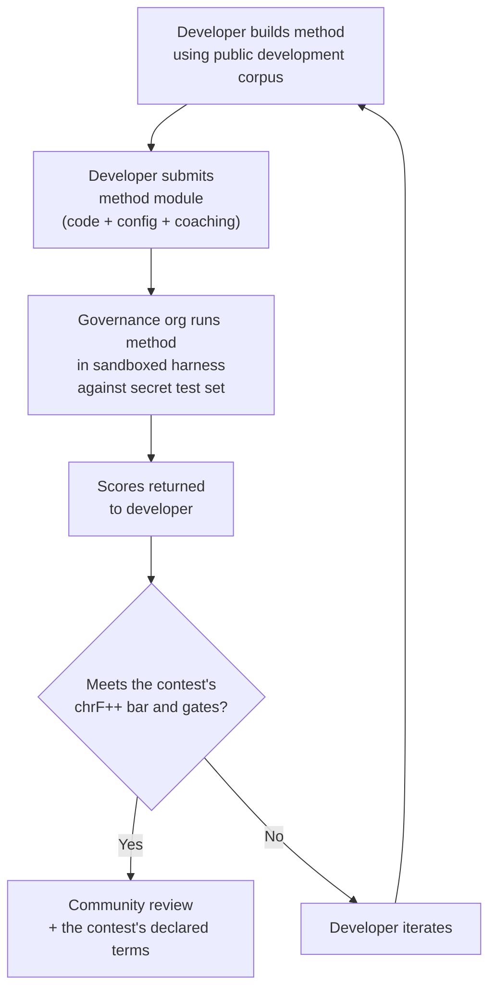

# ベンチマーク仕様

> **概要。** 本ドキュメントでは、Champollion MT評価エコシステムの評価プロトコルを定義します：コーパス形式（§2）、ランカードスキーマ（§3）、ベンチマークプロトコル（§6）、人間による検証要件（§7）、主権メカニズム（§8）、リーダーボードおよび提出モデル（§9）、コストフレームワーク（§10）、新しい言語への拡張性（§11）。実行のスコアリング方法（ヘッドラインとなるchrF++、それに並ぶ標準メトリクス、診断項目）およびコスト/速度メトリクスの計算式については、すべてのスコアリングロジックにおける信頼できる唯一の情報源（single source of truth）である`SCORING_SPEC.md`を参照してください。本ドキュメントでは、それらの詳細を重複して記載せず、SCORING_SPECを参照します。


---

## 1. 原則

### 1.1 言語はバイオデータである

言語は中立的なテスト素材ではありません。遺伝データや健康データと同様に、言語データは**バイオデータ**です。それはその言語を話す人々のアイデンティティ、親族関係、および人間関係を担っており、意味のある形で匿名化することはできません。メタデータを取り除いても、言語はその人々が誰であるかをエンコードし続けます。この仕様における具体的な帰結として、コーパスを提供する人々がそのコーパスの、そしてそれに対して測定されるあらゆるものの鍵を握っています。したがって、主権（§8）はプロトコルへの付加機能ではなく、その前提条件であり、以下のすべての原則はその内側で機能します。

### 1.2 自動指標はプロキシである

本ドキュメントで定義されるすべてのメトリクスは機械によって計算されます。chrF++、FST受理率、形態論的精度、意味的類似度——これらはすべて翻訳品質の自動化されたプロキシです。これらは迅速なイテレーション、体系的な比較、および回帰の検出に有用です。しかし、**人間の判断の代替にはなりません**。

評価の階層：

```
Automated metrics (run cards, benchmarks)
    ↓ proxy for
Human review (bilingual speakers validate output)
    ↓ proxy for
Actual utility (does this help a language community?)
```

どれほど高い自動スコアであっても、流暢な話者が訳文を読んでそれが正確で自然であり、文化的に適切であることを確認することに代わるものはありません。そのため、自動スコアに品質ラベルが付与されることはありません（§5）。自動メトリクスは進捗の追跡には有用ですが、それ単体では決して十分ではありません。

### 1.3 モデルではなく手法を評価する

私たちはモデルではなく**手法**をベンチマークします。モデルは一つの構成要素です。手法とは完全なレシピです。モデルの選択、プロンプト設計、ツールの使用、前処理・後処理、コーチングデータ、リトライ戦略、そのすべてを含みます。同じモデルを使用する二つのチームが異なる手法を用いれば、異なるスコアを得ます。それがこの評価の意図するところです。

### 1.4 再現性

すべてのベンチマーク結果は再現可能でなければなりません。ランカード（§3）は実験の完全な設定を記録します。フィンガープリント（§3.5）は実験的セットアップを識別します。ランカードハッシュ（§3.6）は結果の整合性を検証します。同じ手法、コーパス、および設定を持つ誰もが、±2%以内のスコアを達成できるはずです（temperature > 0でのLLMサンプリングの非決定性を考慮）。

### 1.5 合成評価データの不使用

**本プロジェクトは合成評価データを生成・使用・推奨しません。** すべてのコーパスは、真に人間が著した文章——公開された翻訳、教科書、バイリンガル文書、または流暢な話者から引き出された翻訳——から取得しなければなりません。

LLMが支援できる作業：
- 文のアライメント（既存のバイリンガルテキストにおける対訳箇所の発見）
- フォーマット変換（公開資料をコーパススキーマに変換する）
- メタデータの充実（難易度ティアやレジスターラベルの提案）
- 人間が翻訳するためのソース文の提案（§11.3——翻訳ステップは常に人間が行う）

LLMは参照翻訳や評価ペアを**絶対に生成してはなりません**。

**私たちはトレーニングデータについては開発中立の立場をとります。** 手法開発者が合成トレーニングデータ、逆翻訳、またはデータ拡張を手法に使用する場合、それは開発者の選択です。私たちはトレーニングプロセスではなく出力を評価します。MetaのOMT-1600は、逆翻訳によって生成された約2億7000万の合成対訳文を使用しています。このような方法でトレーニングされた手法に異議はありません。私たちは人間によるキュレーションのみでテストします。

> **なぜ聖書テキストを評価に使わないのか？** OMT-1600は1,600言語中1,560言語を聖書ドメインのテキストで評価しています（Meta AI、*Omnilingual MT*、arXiv:2603.16309、2026年）。聖書の翻訳は古風なレジスター、典礼的な語彙、および定型的な文構造を持っています。私たちの評価コーパスは、コミュニティがキュレーションした多様なドメインのテキスト——医療、法律、教育、行政、会話、技術ドメイン（§2.7参照）——から取得されています。これは意図的な設計上の選択です。コミュニティが実際に生活し働くドメインでの翻訳を必要としており、単一の宗教的レジスターではありません。創世記1章1節で高いスコアを出す手法は、バンドカウンシルの議題やクリニックの受付フォームでのパフォーマンスについてほとんど何も教えてくれません。

---

## 2. コーパススキーマ

コーパスは、構造化されたメタデータを持つ対訳テキストペアのキュレーションされたセットです。すべての手法が測定される基準となる正解データです。

### 2.1 データセットエンベロープ

コーパスファイルのトップレベル構造：

```json
{
  "dataset": {
    "id": "edtekla-dev-v1",
    "version": "1.0",
    "language_pair": "EN→CRK",
    "source_language": "en",
    "target_language": "crk",
    "created": "2026-05-01",
    "license": "LicenseRef-EdTeKLA-Modified-CC-BY-NC-SA-4.0",
    "provenance": ["gold_standard", "textbook"]
  },
  "entries": [ ... ]
}
```

| フィールド | 型 | 必須 | 説明 |
|-------|------|----------|-------------|
| `id` | string | ✅ | 一意のデータセット識別子。ランカードとリーダーボードで使用される |
| `version` | string | ✅ | セマンティックバージョン。インクリメントすると以前のランカードとの比較が無効になる |
| `language_pair` | string | ✅ | 表示ラベル（例：`EN→CRK`） |
| `source_language` | string | ✅ | BCP 47ソース言語コード |
| `target_language` | string | ✅ | BCP 47ターゲット言語コード |
| `created` | string | ✅ | ISO 8601作成日 |
| `license` | string | ✅ | SPDXライセンス識別子 |
| `provenance` | string[] | ✅ | エントリ全体で使用される出典タグのリスト |

### 2.2 エントリスキーマ

コーパスの各エントリは一つの翻訳チャレンジを表します：

```json
{
  "id": 42,
  "source": "I see the dog",
  "reference": "niwâpamâw atim",
  "segment": "gold_standard",
  "difficulty": 2,
  "provenance": "gold_standard",
  "register": "conversational",
  "context": "declaration",
  "morphological_analysis": "ni-wâpam-âw atim | 1sg-see.TA-3sg.DIR dog.AN",
  "notes": "Animate noun (atim); direct form because speaker is proximate",
  "variant_class": "simple-ta-direct"
}
```

| フィールド | 型 | 必須 | 説明 |
|-------|------|----------|-------------|
| `id` | integer | ✅ | コーパス内の一意の識別子 |
| `source` | string | ✅ | 原語の原文テキスト |
| `reference` | string | ✅ | 目的言語のゴールドスタンダードな参照訳 |
| `segment` | string | 📎 | コーパスのパーティション: `gold_standard`、`held_out`、`development`、または`diagnostic` |
| `difficulty` | integer | 📎 | 難易度レーティング 1–5（§2.4を参照） |
| `provenance` | string | 📎 | このエントリの出所（§2.5を参照） |
| `register` | string | 📎 | レジスター/フォーマリティレベル（§2.6を参照） |
| `context` | string | 📎 | コミュニケーション機能（§2.6を参照） |
| `domain` | string | 📎 | 16コードの分類体系によるユースケースドメイン（§2.7を参照）。次のいずれかである必要があります: `conv`、`ecommerce`、`edu`、`financial`、`gov`、`legal`、`literary`、`marketing`、`medical`、`news`、`religious`、`scientific`、`subtitles`、`support`、`tech`、`ui`。構築時に検証されます。 |
| `morphological_analysis` | string | ❌ | ゴールドスタンダードな形態素分解 |
| `notes` | string | ❌ | 翻訳者メモ、方言による異形、曖昧さフラグ |
| `variant_class` | string | ❌ | 許容される翻訳バリアントをグループ化するクラスラベル |

> **📎 = 推奨（RECOMMENDED）。** ハーネスは、デフォルト値を通じて欠落しているオプションフィールドを適切に処理します。サードパーティ製コーパスは、エントリごとに`id`、`source`、および`reference`を提供するだけで済みます。


### 2.3 コーパスセグメント

コーパスは異なるアクセスレベルを持つセグメントに分割されます：

| セグメント | 目的 | アクセス | 最小サイズ |
|---------|---------|--------|-------------|
| `development` | 手法の開発とイテレーション。開発者が自由に使用する。 | **公開** | 30エントリ |
| `diagnostic` | 特定の言語現象に対するターゲットテスト。 | **公開** | 10エントリ |
| `gold_standard` | 公式ベンチマーク評価。リーダーボードのスコアはここから算出される。 | **秘密** — ガバナンス組織が保持 | 50エントリ |
| `held_out` | 将来の評価のために予約。有効化されるまで使用されない。 | **秘密** — ガバナンス組織が保持 | 10エントリ |

> **現在の状態：** 出荷済みデータセットには`development`セグメントのみが存在します。`diagnostic`、`gold_standard`、および`held_out`セグメントは、コーパスが成長するにつれて将来使用するために定義されています。

`gold_standard`および`held_out`セグメントは完全に秘密です。ソース文と参照翻訳の両方がガバナンス管理のインフラストラクチャ上に保持されます。手法開発者は問題も答えも見ることができません。主権メカニズムについては§8を参照してください。

### 2.4 難易度ティア

| ティア | 説明 | 例 |
|------|-------------|----------|
| 1 — 基本語彙 | 単語、一般的な挨拶、数字 | "hello" → "tânisi"、"dog" → "atim" |
| 2 — 単純な文 | 主語-動詞またはSVO、現在時制 | "I see the dog" → "niwâpamâw atim" |
| 3 — 中程度の複雑さ | 過去・未来時制、所有格、生物性 | "I saw his dog yesterday" |
| 4 — 複雑な形態論 | 遠称、受動態、接続法語順、関係節 | "the woman whose son went to the store" |
| 5 — 上級 | 複数節、フォーマルレジスター、儀礼的、慣用的 | レジストリに適したトーンを持つ完全な段落 |

適切に構築されたコーパスは、5つの難易度ティアすべてにわたるエントリを含み、実際の翻訳課題の大部分が該当するティア2〜4に重点を置くべきです。

### 2.5 出典タグ

すべてのエントリはその出典を示さなければなりません：

| タグ | 意味 |
|-----|---------|
| `gold_standard` | 流暢な話者によって検証済み |
| `textbook` | 公開された教育資料から取得 |
| `elicited` | 構造化された引き出しセッションを通じて作成 |
| `corpus` | 対訳コーパスから抽出 |

> **注意：** 実際には、出典の値は自由形式の文字列です。上記のタグは規約であり、検証済みの列挙型ではありません。データセットは他の説明的な出典文字列を使用することができます。

### 2.6 レジスターとコンテキスト

**レジスター**はフォーマリティと社会的コンテキストを説明します：

| レジスター | 説明 |
|----------|-------------|
| `conversational` | 対等な者同士の日常会話 |
| `formal` | 公式または機関の言語 |
| `technical` | ドメイン固有の語彙 |
| `ceremonial` | 伝統的または神聖な言語使用 |
| `educational` | 言語教育資料 |

**コンテキスト**はコミュニケーション機能を説明します：

> 🔲 **計画中。** `context`フィールドはスキーマで定義されていますが、現在のデータセットではまだ入力されていません。将来のコーパス充実のために予約されています。

| コンテキスト | 説明 |
|---------|-------------|
| `greeting` | 社交的な挨拶または別れ |
| `declaration` | 事実の陳述 |
| `question` | 疑問文 |
| `instruction` | 命令または指示 |
| `narrative` | 物語または説明 |
| `label` | UIラベル、ボタンテキスト、または見出し |
| `error` | エラーメッセージまたは警告 |

### 2.7 ドメイン {#27-domain}

**ドメイン**は実際のユースケース——翻訳されるコンテンツの種類——を説明します。これはレジスターやコンテキストとは直交する概念です：

- **レジスター**が答える問い：*これはどの程度フォーマルか？*
- **コンテキスト**が答える問い：*この文は何をしているか？*
- **ドメイン**が答える問い：*これはどの業界・ユースケース向けか？*

法的契約（ドメイン：`legal`）はフォーマル（レジスター：`formal`）で宣言（コンテキスト：`declaration`）を含む場合があります。法的チャットボットのトランスクリプト（ドメイン：`legal`）は会話的（レジスター：`conversational`）で質問（コンテキスト：`question`）を含む場合があります。同じドメインでも、レジスターとコンテキストは異なります。

| ドメインコード | 説明 | 主な利用者 |
|-------------|-------------|-------------------|
| `ui` | ソフトウェアインターフェース文字列 | アプリ開発者、ローカライゼーションチーム |
| `legal` | 契約書、法令、裁判所への申立書、移民関連書類 | 法律事務所、裁判所、コンプライアンスチーム、知財弁護士 |
| `medical` | 臨床メモ、薬品ラベル、患者向けコミュニケーション、治験プロトコル | 病院、製薬会社、臨床試験、患者ポータル |
| `financial` | 銀行業務、保険、規制当局への申告書、監査報告書 | 銀行、保険会社、規制当局、監査人 |
| `edu` | 教科書、カリキュラム、授業計画、学術資料 | 学校、大学、教科書出版社 |
| `ecommerce` | 商品説明、レビュー、マーケットプレイスの出品情報 | オンライン小売業者、マーケットプレイス出品者 |
| `marketing` | 広告コピー、ブランドメッセージ、キャンペーン、スローガン | 広告代理店、ブランドチーム |
| `gov` | 政策文書、規制、公告、法律 | 政府機関、コンプライアンスチーム |
| `scientific` | 研究論文、要旨、方法論、研究助成金申請書 | 研究者、学術誌、助成機関 |
| `religious` | 聖典、典礼テキスト、神学的解説 | 信仰コミュニティ、典礼出版社 |
| `support` | FAQ、エラーメッセージ、トラブルシューティングガイド、チャットボットスクリプト | SaaS企業、ヘルプデスク |
| `subtitles` | 映画、TV、ストリーミング、ゲームのセリフ | ストリーミングプラットフォーム、スタジオ、ゲーム会社 |
| `news` | ジャーナリズム、通信社レポート、社説、プレスリリース | メディア組織、通信社 |
| `literary` | フィクション、詩、物語、文化的テキスト | 出版社、文化保存団体 |
| `conv` | 非公式な会話、ソーシャルメディア、メッセージング | コンシューマーアプリ、ソーシャルプラットフォーム |
| `tech` | APIドキュメント、マニュアル、エンジニアリング仕様書、技術ガイド | ドキュメントチーム、エンジニアリング組織 |

> **ドメイン固有のベンチマーク。** 一般ベンチマークはすべてのドメインにわたって手法を評価します。しかしNetworkは**ドメインフィルタリングされたベンチマーク**もサポートしています。これは特定のドメインにタグ付けされたエントリのみでスコアを計算するものです。これにより、「法的文書をフランス語に翻訳するのに最適な手法はどれか？」対「フランス語の総合スコアが最も高い手法はどれか？」という問いに答えることができます。
>
> ドメインフィルタリングされたリーダーボードランキングにより、ユーザーは単一のユースケース内で手法を比較できます。手法はドメインによってパフォーマンスが異なります。法律用語でファインチューニングされた手法は、会話テキストよりも法的テキストで大幅に高いスコアを出す可能性があります。Networkはユーザーが特定のユースケースに最適な手法を見つけるのを支援します。

> **将来の機能：Networkアシスタント。** ユーザーがMTのユースケース（ドメイン、言語ペア、品質要件）を説明するのを支援し、リーダーボードからコミュニティ検証済みの手法を提示する会話型アシスタント——例えば「医療ドメインのEN→JAベンチマークで最高スコアの手法はどれか？」——は、十分なドメインタグ付き評価データと手法の多様性を条件として検討中のナビゲーション支援機能です。

---

## 3. ランカードスキーマ {#3-run-card-schema}

ランカードは評価の最小単位です。これは一つの評価ランの完全な設定と結果を記録する自己完結型のJSONドキュメントです。一つの手法、一つのモデル、一つの設定、一つのデータセットに対応します。

すべてのランカードは三つの次元を記録します：
- **品質** — 翻訳はどの程度優れているか？
- **コスト** — 翻訳の生成にいくらかかったか？
- **速度** — どのくらいの時間がかかったか？

### 3.1 トップレベルフィールド

| フィールド | 型 | 説明 |
|-------|------|-------------|
| `run_id` | string | 実行開始時に生成されるUUID v4 |
| `harness_version` | string | ハーネスのセマンティックバージョン（例: `2.0`） |
| `timestamp` | string | 実行が開始された日時のISO 8601 UTCタイムスタンプ |
| `elapsed_seconds` | number | 実行全体の経過時間（実時間） |
| `score_caveats` | array | スコアに何らかの条件が付く場合にのみ存在: `{kind, source, severity, message, …}`オブジェクトのリスト（例: 訓練データとほぼ同一の行を含むテストセット、参照訳より極端に長いまたは短い出力、原文をそのままコピーした出力、多数の異なる原文に対して同じ出力が返された場合など）。情報提供目的であり、スコアを変更することはなく、スコアが表示される場所では必ずchrF++ヘッドラインの隣に表示されます。[ランカード仕様](/docs/network/specifications/run-card#score_caveats)を参照してください |

### 3.2 手法設定

これらのフィールドは実験的セットアップを定義します——何が、どのようにテストされたか。

| フィールド | 型 | 必須 | 説明 |
|-------|------|----------|-------------|
| `model_slug` | string | ✅ | モデル識別子（例：`google/gemini-2.5-flash`） |
| `model_id` | string | ❌ | APIが返す解決済みモデル識別子 |
| `condition` | string | ✅ | 実験ラベル（例：`baseline`、`coached-v3`、`few-shot`） |
| `temperature` | number | ✅ | サンプリング温度 |
| `system_prompt_sha256` | string | ✅ | 完全なシステムプロンプトのSHA-256ハッシュ |
| `system_prompt_used` | string | ✅ | 完全なシステムプロンプトテキスト |
| `coaching_data_sha256` | string | ❌ | 使用した場合、コーチングデータファイルのSHA-256ハッシュ |
| `fst_version` | string | ❌ | 使用した場合、FSTアナライザーのバージョン |
| `tools_enabled` | string[] | ❌ | 手法が利用可能なツールのリスト |
| `batch_size` | number | ❌ | 同時APIバッチあたりのエントリ数 |
| `max_retries` | number | ❌ | 該当する場合、FST拒否に対する最大リトライ回数 |

:::info[公開されるランカードにはmethod_configが含まれます]
ランカードがリーダーボードに公開される際（`mt-eval publish`経由）、標準の8フィールドを持つMethodConfig（`model`、`temperature`、`batchSize`、`register`、`coachingFile`、`coachingPrompt`、`promptContext`、`qualityTier` — すべてキャメルケース。品質ティアは廃止されたため、新しいカードでは`qualityTier`は常にnullです）を含む`method_config`ブロックも含まれます。これにより、ゼロからの再構築なしのインポートが可能になります: `champollion leaderboard --install`は`method_config`を直接読み取り、プラグインマニフェストとして書き込みます。上記のテレメトリフィールド（§3.2）はハーネスが観測した内容を記録し、`method_config`は開発者が意図した内容を記録します。
:::

### 3.3 データセット参照

| フィールド | 型 | 説明 |
|-------|------|-------------|
| `dataset.id` | string | データセット識別子 |
| `dataset.version` | string | データセットバージョン |
| `dataset.language_pair` | string | 表示ラベル |
| `dataset.sha256` | string | データセットファイル内容のSHA-256ハッシュ |
| `dataset.entry_count` | number | 評価されたエントリ数 |

データセットのSHA-256は結果を特定バージョンのデータに固定します。データセットが変更された場合、古いランカードとの比較はできません。

### 3.4 スコア（品質）

ラン全体の集計メトリクス。すべての品質メトリクスは**自動化**されています——§1.2を参照してください。

| フィールド | 型 | 説明 |
|-------|------|-------------|
| `scores.total` | number | 評価されたエントリの総数 |
| `scores.exact_matches` | number | 出力が参照訳と完全に一致したエントリ数 |
| `scores.exact_match_rate` | number | 0.0–1.0 |
| `scores.equivalent_matches` | number | 許容されるバリアントと一致したエントリ数 |
| `scores.equivalent_match_rate` | number | 0.0–1.0 |
| `scores.fst_accepted` | number | FSTアナライザーが受容した出力単語数（全エントリでの合計。エントリ数ではなく単語数） |
| `scores.fst_acceptance_rate` | number | 0.0–1.0。エントリごとの受容率の平均（各エントリの受容単語数 ÷ そのエントリの単語数）。FSTが設定されていない場合は`null` |
| `scores.morphological_accuracy` | number | 0.0–1.0。FST由来（見出し語一致）。FSTがない、または見出し語が一致する単語がない場合は`null`。有効化されるまでは参考値 — スコアリング仕様§2.2を参照 |
| `scores.morph_coverage` | number | 0.0–1.0。分析可能な予測単語のうち参照訳と見出し語が一致した割合（`morphological_accuracy`の疎密の程度を示す） |
| `scores.chrf_plus_plus` | number | **ヘッドラインおよびランキングメトリクス:** コーパスレベルのchrF++（0–100）。その95%ブートストラップ信頼区間は`scores.confidence_intervals.corpus_chrf`、sacreBLEUシグネチャは`scores.sacrebleu_signatures.chrf` |
| `scores.scoring_standard` | string | 新しいカードすべてで`"standard/1"`。標準化以前に公開されたカードには存在せず、`legacy-composite`として読み取られます |
| `scores.primary_metric` | string | `"chrf_plus_plus"` |
| `scores.spbleu` | number | spBLEU（FLORES-200 SentencePiece）。chrF++の隣に表示 |
| `scores.sacrebleu_signatures` | object | 計算されたすべてのsacreBLEUメトリクスのシグネチャ（`chrf`、`chrf_plain`、`bleu`、`spbleu`、`ter`） |
| `scores.semantic_score` | number | 埋め込みベースのセマンティック類似度（0.0–1.0） |
| `scores.ter` | number | 翻訳編集率（TER: 0–∞、低いほど良好） |
| `scores.length_ratio` | number | avg(len(predicted)/len(reference))、理想値 = 1.0 |
| `scores.code_switching_rate` | number | 0.0–1.0。原語の混入（leakage）があるエントリの割合 |
| `scores.hallucination_rate` | number | 0.0–1.0。幻覚（ハルシネーション）コンテンツを含むエントリの割合 |
| `scores.terminology_adherence` | number | 0.0–1.0。用語集の用語の遵守率（用語集がない場合は`null`） |
| `scores.tokens_per_second` | number | total_tokens / elapsed_seconds |
| `scores.entries_per_minute` | number | 1分あたりに翻訳されたエントリ数 |
| `scores.composite` | number \| null | **廃止。** 新しいカードではすべて`null`。レガシーカードは保存されている総合スコアを保持し、「legacy composite (retired)」として表示されます。SCORING_SPEC §4を参照 |
| `scores.quality_tier` | string \| null | **廃止。** 新しいカードではすべて`null`。SCORING_SPEC §5を参照 |
| `scores.cost_adjusted` | number \| null | 総合スコアとともに**廃止**。新しいカードではすべて`null` |
| `scores.errors` | number | 失敗したエントリ数（APIエラー、タイムアウトなど） |
| `scores.by_difficulty` | object | 難易度ティアごとのスコアの内訳 |
| `scores.by_provenance` | object | 出所タグごとのスコアの内訳 |
| `scores.by_domain` | object | ✅ 実装済み — ドメイン（§2.7）ごとのスコア内訳。ドメインで絞り込んだリーダーボードランキングを可能にします。tester.pyによって計算され、publish.pyを通じて渡されます。 |

### 3.5 合計（コスト）

| フィールド | 型 | 説明 |
|-------|------|-------------|
| `totals.prompt_tokens` | number | すべてのAPI呼び出しにわたる入力トークンの合計 |
| `totals.completion_tokens` | number | 出力トークンの合計 |
| `totals.reasoning_tokens` | number | 思考の連鎖に使用されたトークン（ほとんどのモデルでは0） |
| `totals.cached_tokens` | number | プロバイダーのプロンプトキャッシュから提供されたトークン |
| `totals.total_cost_usd` | number | USD単位の総コスト |
| `totals.cost_per_entry_usd` | number | `total_cost_usd / entry_count` |
| `totals.cost_per_source_char` | number | ソース文字あたりのUSD——言語間で比較可能 |

### 3.6 タイミング（速度）

| フィールド | 型 | 説明 |
|-------|------|-------------|
| `elapsed_seconds` | number | ラン全体のウォールクロック時間（トップレベル） |
| `scores.avg_latency_seconds` | number | エントリあたりの平均応答時間 |
| `scores.median_latency_seconds` | number | エントリあたりの中央値応答時間 |
| `scores.p95_latency_seconds` | number | エントリあたりの95パーセンタイル応答時間 |

### 3.7 エントリごとの結果

`results[]`配列の各エントリは一つの翻訳を記録します。エントリごとのデータは`run_card_entries`テーブル（マイグレーション005）に非正規化されたLYSSベルディクト（マイグレーション006）とともに永続化されます。

| フィールド | 型 | 説明 |
|-------|------|-------------|
| `entry_id` | string | コーパスの`entries[].id`と一致 |
| `source` | string | 翻訳されたソーステキスト |
| `expected` | string | ゴールドスタンダードの参照翻訳 |
| `raw_predicted` | string \| null | 後処理前の生のモデル出力 |
| `predicted` | string | 手法の実際の出力（後処理済み） |
| `segment` | string | セグメント識別子（例：文インデックス） |
| `difficulty` | string \| null | コーパスからの難易度ティア |
| `domain` | string | コーパスからのドメインタグ（§2.7） |
| `exact_match` | boolean | 出力が参照と完全に一致したかどうか |
| `chrf_score` | number \| null | 文レベルのchrF++（0〜100） |
| `bleu_score` | number \| null | 文レベルのBLEU（0〜100） |
| `latency_s` | number \| null | 秒単位の応答時間 |
| `cost_usd` | number \| null | このエントリのUSD単位のコスト |
| `tool_call_count` | integer | 使用されたツール呼び出し数（なしの場合は0） |
| `error` | string \| null | このエントリが失敗した場合のエラーメッセージ |
| `plugin_metrics` | object | エントリごとの完全なプラグイン出力（JSONB） |
| `fst_valid` | boolean \| null | GiellaLT FSTが予測を受理した（非正規化LYSS-fst） |
| `equivalent_match` | boolean \| null | CRKリンターが構造的等価性を確認した（非正規化LYSS-eq） |
| `semantic_verdict` | string \| null | LYSS-semベルディクト：`VALID`、`MISMATCH`、`UNKNOWN`、`ERROR` |
| `code_switching_detected` | boolean \| null | 出力でソース言語トークンが検出された |
| `hallucination_detected` | boolean \| null | 出力で捏造コンテンツが検出された |


### 3.8 フィンガープリント

再現性の識別子です。フィンガープリントが同一の2つの実行は、同じ実験設定を使用しています。

フィンガープリントは、以下の標準JSON（キーをソートしたもの）のSHA-256ハッシュです:
- `dataset.sha256`
- `model_slug`
- `condition`
- `system_prompt_sha256`
- `temperature`
- `harness_version`
- `batch_size`
- `tools_enabled`

> **なぜ8つのコンポーネントなのか？** バッチサイズとツール呼び出しは出力品質に実質的な影響を与えるため、アイデンティティに含める必要があります。バッチサイズが異なる、またはツールの有効化が異なる二つのランは、他のすべてのパラメータが一致していても、異なる実験的セットアップです。

**バージョン2（ハーネス0.2.0以降）**では、次の5つのコンポーネントが追加されます:
- `api_provider`: テキストが通過したチャネル（OpenRouter、ベンダー独自のAPI、ローカルエンドポイント、MTエンジンのID。メソッドプラグインの場合は`--attest-local-transport`配下の`local`、それ以外は`method-plugin`）。これが修正される前に書き込まれたプラグインおよびエンジンの実行ログには、送信されることのなかったデフォルト値である`openrouter`と記載されています。公開時（publish）にそれらについても修正された値が記録され、バージョン2のアイデンティティが変更されます — 以前の値は誤っていたため、これは意図的な変更です
- `endpoint_host_sha256`: エンドポイントのホストのSHA-256（内部ホスト名や認証情報が含まれる可能性があるため、生のURLは絶対に使用されません）
- `max_tokens`
- `method_version`: メソッドカードのバージョン。存在しない場合はメソッドプラグインの`method.json`が宣言するバージョン
- `method_sha256`: コンテストノードが実行したメソッドの場合は実行されたバンドルのハッシュ。それ以外の場合はメソッドプラグインのファイル（`method.json`およびその`.py`ファイル）に対するハッシュ

**メソッドプラグイン**の実行（`mt-eval run --method <plugin dir>`）では、さらに2つ追加されます:
- `method_model`: `-m/--model`でプラグインに渡されたモデル（プラグインはこれを`config.method_model`として読み取ります）。指定されなかった場合は`null`
- `method_dependencies_sha256`: プラグインの`method.json`が宣言する`dependencies`リストのSHA-256（標準JSON）。何も宣言されていない場合は`null`

これらがない場合、2つの異なるモデルで同じプラグインを実行しても、1つのアイデンティティが共有されていました。ハーネス0.2.0ではリリース前にこれらを追加するため、プラグイン実行のアイデンティティはここで1度だけ変更されます。他の種類の実行には影響しません。

**与えられた**モデルを実行するMTエンジンの実行（`mt-eval run --method local-model -m <model>`）でも、同様に2つ追加されます:
- `method_model`: ロードされたモデル — そのHugging Face ID、またはモデルディレクトリ名
- `method_model_sha256`: ディレクトリの場合は、そのファイルの`sha256sum`形式のリスト（ファイルごとに1行の`<sha256>  <relative path>`、パス順でソート、ドットディレクトリは除外）に対するSHA-256。Hugging Face IDの場合は、ロードされたリビジョン

同じエンジンを通じた2つのモデルは、2つの異なる実験です。モデルを指定していない`local-model`の実行ログ（以前の0.2.0ビルドではエンジンに`-m`を渡しておらず、エンジンはフォールバックモデルである`Helsinki-NLP/opus-mt-en-es`を実行していました）は、何がその数値を生成したかを特定できません。そのため、`mt-eval publish`はそれを受理せず、`contest qualify`もそれに対するレシートを発行しません。

バージョン1では、2つの異なるチャネルを介して呼び出された同一モデルが1つのアイデンティティを共有していたため、公開されたカードがイミュータブル（不変）であることから、2つ目のモデルは重複として拒否されていました。ランカードには`fingerprint.version`が記録されます。以前のハーネスの実行ログはバージョン1を保持するため、再公開しても元のアイデンティティが再現されます。

同一のフィンガープリントを持つ二つのランは比較可能な結果を生成するはずです。差異はAPIの非決定性（temperature > 0）またはプロバイダー側のモデル更新によるものです。

### 3.9 ランカードハッシュ

ランカードJSON全体のSHA-256ハッシュ（ハッシュ計算中は`run_card_hash`フィールド自体を`""`に設定）。これは改ざん検出のシールです。いずれかのフィールドが変更されると、ハッシュが壊れます。

---

## 4. 自動化メトリクス

このセクションのすべてのメトリクスは機械によって計算されます。§1.2を参照してください。

### 4.1 メトリクスの定義

| メトリクス | ステータス | 測定対象 | 範囲 |
|--------|--------|-----------------|-------|
| **chrF++** | ✅ 実装済み | 文字n-gramのFスコア。単語が長く高度に活用・屈折する形態素豊かな言語において、単語レベルのメトリクス（BLEU）よりも堅牢な文字レベルで機能します。sacrebleuによって計算されます。 | 0–100（ネイティブスケール）。**ヘッドラインおよびランキングメトリクス**であり、95% CIおよびsacreBLEUシグネチャとともに公開されます。 |
| **FST受容率** | ✅ 実装済み（診断用） | 形態素解析器（GiellaLT HFST）によって目的言語の有効な形式として受容された予測単語の割合。FSTが受容する単語は、幻覚（ハルシネーション）ではなく、実在する構造的に有効な単語です。 | 0.0–1.0 |
| **完全一致** | ✅ 実装済み（診断用） | Unicode正規化後に参照訳と完全に一致した予測の割合。厳格ですが曖昧さがなく、上限チェックとして有用です。 | 0.0–1.0 |
| **形態素精度** | ✅ 実装済み（診断用） | FST由来かつ見出し語一致: 語根が参照訳に出現する各予測単語について、その語形変化（屈折）が一致しているかどうか。FST受容率よりも詳細です — 単語がFSTとして有効であっても、誤った活用・屈折を持つ可能性があります（語根は正しいが時制が誤っているなど）。スペルチェック用アクセプタではなく、FSTアナライザーが必要です。SCORING_SPEC §2.2を参照してください。 | 0.0–1.0 |
| **等価一致** | ⚡ 部分的（診断用） | 語順、方言の違い、正書法上の慣例を考慮し、許容される参照訳のバリアントと一致した割合。現在はCRK評価標準の`CrkLinterMetric`（`eval_standards/crk/`内）を介してCRK向けに実装されています。CRK言語カードの`evalMetrics`宣言を介して自動的に読み込まれます。汎用的な実装には、コーパス内のエントリごとの`variants[]`が必要です。 | 0.0–1.0 |
| **セマンティックスコア** | ⚡ 部分的（診断用） | 表層形式に関係ない意味の保持。現在はCRK評価標準の`CrkSemanticMetric`（`eval_standards/crk/`内、判定の加重プロキシ）を介してCRK向けに実装されています。埋め込みベースの普遍的なコサイン類似度の導入が計画されています — SCORING_SPEC §2.3を参照してください。 | 0.0–1.0 |

### 4.2 ヘッドラインメトリクスとそれに並ぶ標準メトリクス

WMT、FLORES-200、およびAmericasNLPの共有タスクがMT評価を報告するのと同様に、実行はスコアリング標準`standard/1`に基づいてスコアリングされます:

- **1つのヘッドラインおよびランキングメトリクス:** 95%ブートストラップ信頼区間とsacreBLEUシグネチャを伴うコーパスchrF++（`chrF++ 47.5 [45.9, 49.0]`と表記）。
- **それに並ぶ他の標準メトリクス（決してブレンドされません）:** BLEU、spBLEU、TER、および計算された場合のCOMET（モデルID付き）。
- **個別に報告される診断項目:** 完全一致、FST受容率、形態素精度、等価一致、セマンティックスコア、コードスイッチング、ハルシネーション、用語、表記スタイル、およびすべてのスコアに関する注意点（score caveats）。これらはスコアを説明するものであり、それ自体がスコアになることはありません。
- **「より優れている」かどうかは、chrF++の対応のある有意差検定（paired significance test）によって決定され**（[有意性](/docs/network/specifications/significance)）、2つの数値を単に比較することでは決定されません。

**完全な定義は`SCORING_SPEC.md`にあります**（[実行のスコアリング方法](/docs/network/specifications/scoring#how-runs-are-scored)）。ハーネスのコードは`mt_eval_harness/scoring.py`でこれを反映しています。

> **なぜBLEUをヘッドラインにしないのか？** BLEUは単語レベルで動作し、形態素のバリエーションに対してペナルティを科します。複統合的言語では、単一の単語が文全体を構成することもあり、BLEUはわずかな屈折の違いでも完全な不一致として扱ってしまいます。chrF++は文字レベルで動作するため、この問題をより適切に処理できます。BLEUはその隣に併記されます。SCORING_SPEC付録Aを参照してください。

### 4.3 廃止された総合スコア

この標準の導入以前は、chrF++、完全一致、FST受容率、形態素精度、および行動メトリクスの加重総合スコアによって実行がランク付けされていました。これは**廃止**されました。新しいカードでは`composite: null`および`cost_adjusted: null`が公開されます。この指標は悪用が可能であり（未学習のモデルがすべての入力に対して1つの有効な北部サーミ語の文を繰り返すだけで、chrF++が5.5であっても0.6244のスコアを獲得できた）、言語によって意味が異なるシグナルの混合物は解釈不能でした。レガシーカードは保存された総合スコアを保持し、引き続き検証可能です。[SCORING_SPEC §4](/docs/network/specifications/scoring#4-composite-score)を参照してください。

---

## 5. 品質ティア（廃止） {#5-quality-tiers}

**自動スコアに品質ラベルが付与されることはありません。** 総合スコアから読み取られていた品質ティア（Baseline、Emerging、Functional、Deployable、Fluent）は、総合スコアとともに廃止されました。新しいカードでは`quality_tier: null`が公開され、出力にティアが表示されることはありません。自動スコアに対して「実用的（functional）」といったラベルを付けることは、話者のみが確認できる事柄を主張することになります — 廃止されたティアでは、すべての入力に対して同じ1文を繰り返すシステムも「functional」と判定されていました。品質は人間による検証（§7）によって認定されます。レガシーカードには引き続きティアが保存されます。[SCORING_SPEC §5](/docs/network/specifications/scoring#5-quality-tiers)では、それらのカードを読み取れるようにするためだけに従来のしきい値を保持しています。

---

## 6. ベンチマークプロトコル

**ベンチマーク**とは、特定のデータセットに対して宣言されたパラメータ空間全体にわたってランカードを体系的に生成することです。単一のランではなく、異なる設定がどのようにパフォーマンスするかの構造化された探索です。

### 6.1 ベンチマークが生成するもの

ベンチマークは**ランカードのマトリクス**を生成します——パラメータ値の各組み合わせに対して一つずつ。このマトリクスにより、以下の多面的な比較が可能になります：

- **品質** — 信頼区間付きのchrF++、その他の標準メトリクス、および診断項目
- **コスト** — 各構成の合計コストおよびエントリあたりのコスト
- **速度** — 実時間（経過時間）およびエントリあたりのレイテンシ

単一の「ベンチマークスコア」というものは存在しません。ベンチマークとはマトリクス全体のことです。ステークホルダーごとに重視する側面は異なります。研究者は統計的に有意なchrF++の向上を求め、導入エンジニアはエントリあたりのコストを最適化し、コミュニティは品質をレビューします。

### 6.2 パラメータ空間

ベンチマークはどのパラメータを順列するかを宣言します：

| 軸 | 典型的な値 | 目的 |
|------|---------------|---------|
| `model` | 4〜12モデル（フロンティア + 中間層 + バジェット） | モデルの能力はどの程度重要か？ |
| `temperature` | 0.0、0.3、0.7 | サンプリングのランダム性は助けになるか、それとも害になるか？ |
| `prompt_version` | 2〜3のプロンプト戦略 | 手法はプロンプト設計にどの程度敏感か？ |
| `coaching_config` | コーチングデータあり/なし | 言語知識の注入は出力を改善するか？ |
| `tool_config` | FSTあり/なし、辞書あり/なし | 言語ツールは出力を改善するか？ |

完全な順列空間：
```
runs = |models| × |temperatures| × |prompts| × |coaching| × |tools|
```

典型的な初期ベンチマーク：12モデル × 3温度 × 2プロンプト × 2コーチング = 144ラン。

### 6.3 ベースラインと手法評価

ベンチマークは二つの異なる目的を果たします：

**ベースライン設定** — ナイーブなアプローチで状況を把握する。「言語固有のエンジニアリングなしに、既存のモデルはこの言語に対して何ができるか？」これが基準を確立します。ベースラインマトリクスは以下を示します：どのモデルが最も幻覚が少ないか、どの温度が最も一貫した出力を生成するか、コーチングデータがそもそも役立つかどうか、すべてのモデルが一様に失敗する箇所（これにより困難な言語的問題が明らかになる）。

**手法評価** — 特定のエンジニアリングされた手法をテストする。「私のFSTゲート付きコーチングパイプラインはベースラインを上回るか？」手法のランカードはベースラインマトリクスと比較されます。手法が最良のベースラインを上回る場合——エンジニアリングがナイーブなモデル呼び出しに対して価値を付加する場合——に興味深いと言えます。

どちらの活動も同じスキーマのランカードを生成します。区別は意図とパラメータ空間にあります：ベースラインはモデルと設定全体を順列し、手法評価は一つの手法を最良の設定に対してテストします。

### 6.4 開発用とゴールドスタンダード評価

手法開発者は`development`および`diagnostic`コーパスセグメントに対して自由にイテレーションします。これは非公式です——制限なし、提出なし、ガバナンスの関与なし。開発者は何が機能するかを学んでいます。

公式リーダーボードのスコアは`gold_standard`評価のみから得られます。これは公式です：
1. 開発者は完全に実行可能な手法（コード + 設定 + コーチングデータ）を提出する
2. ガバナンス組織がサンドボックス化されたハーネスで秘密のテストセットに対して実行する
3. スコアのみが返ってくる

完全な主権メカニズムについては§8を参照してください。

---

## 7. 人間による検証 {#7-human-validation}

自動化メトリクスはプロキシです。人間による検証が正解データです。

### 7.1 人間によるレビューがメトリクスでは捉えられないもの

- **形態論的に有効だが意味的に誤り** — FSTが語を受理し、chrF++が高いが、翻訳が異なる意味を持つ
- **文化的に不適切** — 翻訳は技術的に正しいが、コミュニティが拒否するレジスターや表現を使用している
- **幻覚の妥当性** — 出力は非話者には対象言語のように見えるが、流暢な話者には意味不明
- **許容可能だが未マークのバリエーション** — 出力は正しいが、参照にない方言的バリアントを使用しているため自動化メトリクスが誤りとマークする

### 7.2 検証ゲート

バイリンガル話者がその出力が実用的であると合意したことを確認する「人間による検証」なしには、いかなる手法も実用的であるとは言えません。これは形式的な手続きではなく、核心となる部分です。自動メトリクスは、人間によるレビューが必要な出力の量を減らすために存在しています。それらが人間のレビューに取って代わることはできません。

### 7.3 コミュニティレビュープロトコル

> 🔲 **計画中**：コミュニティレビューインターフェースはまだ稼働していません。このセクションは意図されたプロセスを説明します。

1. 手法がレビューのために提出される — 開発者による申請、またはコンテストの自動しきい値（chrF++の基準およびコンテストで宣言された診断ゲート）を満たしたことによる
2. 出力のサンプル（難易度ティアごとに層化）がバイリンガル話者に提示される
3. 話者が各翻訳を次の尺度で評価する: **不合格（reject）**、**要旨のみ（gist）**（意味は明確だが表現が誤っている）、**許容可能（acceptable）**（軽微な問題はあるが正しい）、**極めて優れている（excellent）**（人手翻訳と区別がつかない）
4. ガバナンス組織が集計評価をレビューする
5. コミュニティが手法を受け入れた場合、コンテストで宣言された賞の条件（§8.3）で規定された内容および本番デプロイへと進む

レビューが **Community Validated** ティア（§9.4）を付与するには、最低限満たすべき条件があります。層別サンプルが**30エントリ以上**を対象とし、コミュニティ独自のプロトコルに基づいて資格を持つ**2名以上のレビュアー**が参加し、エントリの**70%以上**がコミュニティの承認基準を満たす必要があります。このティアはコミュニティ自身がその裁量でテストを実施した場合にのみ付与されます。また、降格も対称的です。スポット監査として同じプロトコルを実行することで、付与されたときと同様に公開の形でティアが取り消されます。

---

## 8. 主権

評価データセットには言語コミュニティに属するキュレーションされた言語知識が含まれています。このセクションはそのデータを保護するための技術的・法的フレームワークを定義します。

### 8.1 問題

従来のベンチマークはテストセットを公開します。一度公開されたデータは非公開にできません。先住民族および少数言語コミュニティにとって、これは搾取的なダイナミクスを生み出します——言語データが継続的な同意なしに使用されます。バイオデータ主権に関するDheinの実用的な見解に従い、私たちは言語データを「未知の可能性を持つ流動的なリソース」として扱い、動的で関係的なガバナンスを必要とします。

### 8.2 サンドボックス実行

主要な執行メカニズム：開発者が手法モジュールを引き渡し、ガバナンス組織が自分たちのインフラストラクチャ上で完全に秘密のテストセットに対して実行し、スコアのみが返されます。開発者はソース文も参照翻訳も見ることができません。


```mermaid
graph TD
    A["Developer builds method\nusing public development corpus"] --> B["Developer submits\nmethod module\n(code + config + coaching)"]
    B --> C["Governance org runs method\nin sandboxed harness\nagainst secret test set"]
    C --> D["Scores returned\nto developer"]
    D --> E{"Meets the contest's\nchrF++ bar and gates?"}
    E -->|Yes| F["Community review\n+ the contest's declared terms"]
    E -->|No| G["Developer iterates"]
    G --> A
```

フロー:
1. **開発用コーパスは公開されています。** `development`および`diagnostic`セグメントには制限がありません。
2. **ゴールドスタンダードなテストセットは完全に秘匿されます。** 原文と参照訳の双方が、ガバナンスが管理するインフラストラクチャ上に置かれます。
3. **公式スコアを取得するには、手法を引き渡す必要があります。** ガバナンス組織がそれをサンドボックス内で実行します。返されるのはスコアのみです。
4. **ガバナンス組織はすでにその手法を保持しています。** 提出物とはモデルまたは手法そのものです。物理的な保持こそが、主権的スコアリング（sovereign score）をそもそも可能にするものです。スコアリング後にそれがどう扱われるかは、コンテストで宣言された賞の条件（§8.3）によります。
5. **提出には規約への同意が必要です。** メソッド提出規約への同意は常に必要であり、コンテストで賞の条件が宣言されている場合は、ハッシュによるそれらの明示的な受諾が必要です（§8.3）。
6. **ガバナンス組織がアクセスを完全に制御します。** ガバナンス組織はいつでも評価を拒否または取り消すことができます（動的同意）。
7. **保管時暗号化は多層防御です。** 主要な強制力はアーキテクチャによるものです。

### 8.3 手法のその後の扱いについて {#8-3-method-transfer}

構造上、妥協できない点が1つあります。主権的評価とは、ガバナンス組織が**実行したものを物理的に保持している**ことを意味します — そもそもスコアリングを行うためには、モデルまたは手法がそのノードに到達していなければなりません。保持以上のすべての事項は、主催者が選択し、参加者がエントリーする前に公開される**コンテストで宣言された賞の条件**によって定められます。

その条件は、コンテストごとに宣言される3つのうちのいずれかです: `pass_to_holders`（手法は主権ベンチマーク保持者に譲渡され、結果にかかわらず保持・スコアリングされる）、`retain_ip`（開発者が所有権を保持し、主催者は監査用の封印されたコピーのみを保持する）、または`release_open`（開発者は所有権を保持するが、オープンライセンスの下で手法を公開する必要があり、その公開が賞の受給条件となる）。各選択肢の詳細な意味 — 何が保持されるか、権利が移転するか、主催者が何に使用できるか、公開期日はいつか — はその選択肢に基づいて決定され、支払い前にそれぞれがどのように検証されるかは[賞の仕様 §1.3](/docs/network/specifications/prizes#1-3-declared-terms)に記載されています。賞の条件が宣言されていないコンテストには賞はなく、エントリーに関するいかなる権利も移転しません。

**いずれの場合も開発者が保持するもの:**
- 帰属表記とクレジット（リーダーボードに名前が残ります）
- 手法について発表・出版する権利
- 他の言語ペアにその手法を使用する権利

**ガバナンス組織が得るもの**は、自らが宣言した規約の内容そのものです — 「何も得ない。アーティファクトはスコアリング後に削除された」から、その言語向けの手法を使用、修正、配布、収益化、サブライセンスする完全な譲渡まで多岐にわたります。ゴールドスタンダード評価に対してコンテストで宣言されたしきい値（chrF++の基準および任意の診断ゲート）を満たし、人間による検証（§7）に合格することは、手法を*賞の受給資格を満たす*状態にするものであり、それ自体で権利が移転することはありません。

### 8.4 ガバナンス組織の要件

言語ベンチマークの主要な管理者として機能するために：

1. **言語コミュニティを代表していること** — 話者および文化的権威者との証明可能な関係
2. **鍵管理の能力** — 暗号鍵を管理する技術的能力
3. **評価の可用性の約束** — ベンチマークが評価可能な状態を維持すること
4. **参加規約の公開** — 開発者が同意する内容の明確な文書化
5. **認知されたデータ主権原則に基づく運用** — 言語データのコミュニティ所有権と管理権、CARE原則、または同等のもの

### 8.5 データ主権とCARE原則への対応

**コミュニティが保持するもの。** 言語データはコミュニティのものであり、ガバナンス組織はそれが測定される評価インフラストラクチャを運用します。その組織が誰がどのような条件で提出できるかを決定し、サンドボックス実行はその決定を単に言及するだけでなく*強制*するための手段です。コミュニティは自らのデータ、結果、およびそれに対して開発された手法に無制限にアクセスできます。封印されたテストセットがガバナンス組織自身のインフラストラクチャ外に出ることはありません。保管時の暗号化は、その背後にある第2の防御線です。

**CARE原則。**

| 原則 | 実装 |
|-----------|---------------|
| **集団の利益（Collective Benefit）** | 主催者が賞の条件を設定するため、エントリーがコミュニティの利益になることを望むコミュニティはまさにそれを要求できます — そして手法およびそれによって得られたすべての成果を保持します。プラットフォームはいかなる場合も取り分を取りません。 |
| **管理の権限（Authority to Control）** | サンドボックス実行が技術的な実装となります。 |
| **責任（Responsibility）** | 開発者は参加規約を通じて責任を引き受けます。 |
| **倫理（Ethics）** | 研究者の利便性よりもコミュニティの権利を優先します。 |

### 8.6 依存クラスとサンドボックスネットワークポリシー

サンドボックス実行（§8.2）と所有権移転（§8.3）はどちらも、手法が実行時に何を必要とするかを正確に把握することに依存しています。[手法インターフェース仕様](/docs/network/specifications/methods#method-validity-and-dependency-classes)は五つの**依存クラス**——S（自己完結型）、O（オープン外部）、A1（代替可能なLLM推論）、A2（代替不可能な外部API）、X（クローズド）——と、すべての手法が宣言しなければならない依存マニフェストを定義しています。このサブセクションは、サンドボックスネットワークポリシーがそれらをどのように執行するかを記録します。

**デフォルト拒否のエグレス。** サンドボックス仕様は、手法コンテナがデフォルトでネットワークアクセスを持たないことを要求します。これはファイアウォールルールではありません——仕様は実行環境からネットワークを削除するため、未宣言のネットワーク依存はポリシー層ではなくアーキテクチャ層で失敗します。クラスSおよびOの手法は、提出時にベンダリングされたアーティファクトから完全に実行されます（クラスOのアーティファクトは提出時にピン留めされミラーリングされます）。

**LLMゲートウェイ（🔲 計画中）。** ほとんどの手法はLLMを呼び出すため、サンドボックス仕様は正確に一つのエグレス例外を定義します：評価インフラストラクチャが運営する**LLMゲートウェイ**。ゲートウェイは：

- 推論リクエストを**ピン留めされたモデルの明示的な許可リスト**（手法のマニフェストおよびランカードに記録されたモデル識別子）にプロキシします。
- スコアが公開される前にデータ持ち出しの試みがないかゲートウェイトラフィックを監査できるよう、**すべてのリクエストとレスポンスを**追記専用・ハッシュチェーン化された監査ログに**記録します**。
- これが*唯一の*ネットワーク経路です — 一般的な外部通信（egress）、DNS、その他のエンドポイントは存在しません。

これがクラスA1の手法を§8.2の検証可能性の保証を放棄せずに評価可能にするものですが、これは実際のトレードオフであり、仕様はそれを明確に述べています：秘密のソース文を外部モデルを通じて翻訳することは、そのソース文をモデルプロバイダーに**開示します**。参照翻訳は離れません（ハーネスによって保持され、コンテナの外にあります；§8.2参照）、手法自体もログに記録された許可リスト済みの推論呼び出しが含む以上のものを漏洩することはできません。その限定的な開示が特定のコーパスに対して許容可能かどうかは管理者の決定です：クラスA1評価を承認することは、他のデータ使用と同様に、ランごとに意識的にそれを承認することを意味します。

**ステータス。** 主催者が運営するコンテスト向けのネットワーク分離された手法実行**サンドボックスは実装されています**（2026-07-08リリース。実際に何が構築されていて何が構築されていないかの詳細については、[率直な制限事項](/docs/network/honest-limitations)を参照してください）。**LLMゲートウェイは仕様策定済みですが、まだ構築されていません。** ゲートウェイが稼働するまでは、Class SおよびOの手法のみがゴールドスタンダードスコアを生成できます。Class A1の手法は原則として賞の対象のままですが（[賞の仕様 §1.6](/docs/network/specifications/prizes)を参照）、現時点ではシークレットセグメントに対して評価できません。Class A2の依存関係は、権利者が許可を与えるまでサンドボックスに一切入ることができません — ネットワークの問題が発生する前に、アーティファクトがサンドボックス内に*存在*することを許可されている必要があります。

---

## 9. リーダーボードと提出

### 9.1 提出要件

有効な**リーダーボード**への提出とは、すべての必須フィールドと解決可能なデータセット参照を含む完全なランカード（§3）です。これは`mt-eval publish`が送信するすべての内容であり、あなたのコードはあなたの手元に残ります。

**主権的（sovereign）**（`gold_standard`）なエントリーはそれとは異なり、モデルまたは手法そのものであり、以下を含める必要があります:

1. 手法のコード（インストール手順付きで完全に実行可能なもの）、または宣言的な重み（weights）としてのモデル
2. ベンダー化されたすべての依存関係 — コーチングデータ、辞書、FSTバイナリ、プロンプト
3. コストレポート
4. 手法のアプローチと制限事項の説明

§9.5および[主権コンテストガイド](/docs/network/sovereignty/run-a-sovereign-contest)を参照してください。

### 9.2 正当性基準

1. **評価データでのトレーニングなし。** 手法は`gold_standard`または`held_out`エントリに露出していてはなりません。（アーキテクチャ的に執行——見たことのないデータでトレーニングすることはできません。）
2. **開発データの使用を宣言する。** 少数ショットプロンプティングに`development`エントリを使用することは許可されていますが、宣言しなければなりません。
3. **再現性。** ガバナンス組織が再実行して±2%以内のスコアを達成できなければなりません。
4. **汎化。** 手法は未見のエントリで機能しなければならず、記憶された例だけではいけません。

### 9.3 ゲーミング対策

1. **バリアントクラスのリンティング** — 既知のバリアントを持つエントリで不審なほど完璧なパフォーマンスはフラグが立てられる
2. **コーパスローテーション** — ガバナンス組織は予告なしにセグメント間でエントリをローテーションできる
3. **コミュニティレビュー** — 人間による検証ゲート（§7）は、メトリクスをゲームするが悪い出力を生成する手法を捕捉する

### 9.4 検証ティア

検証ティア（Verification tiers）は、**誰が結果を検証したか**を示します。（§5の廃止された品質ティアとは無関係です。）

| ティア | 意味 | 達成方法 |
|------|---------|--------------|
| **自己ベンチマーク（Self-benchmarked）** | 開発者がハーネスを実行し、ランカードを提出した | `development`セグメントに対して`mt-eval publish`を実行 |
| **Champollion Verified** | プロジェクトが、提出された出力をSHAで固定された参照コーパスと照合して再スコアリングし、スコアを再現した | ランカードを公開する。メンテナーの再スコアリングバッチによって再現性が確認された時点で昇格する。手法を再*実行*することは別レイヤーであり、まだ構築されていない |
| **Community Validated** | コミュニティ独自のプロトコルに基づいて認定された対象言語のバイリンガル話者が、層化された出力サンプル（30エントリ以上、2名以上のレビュアー）をレビューし、70%以上がコミュニティの基準を満たした。コミュニティ独自のテストによってのみ付与される。抜き打ち監査による降格も同様の基準で行われる | メソッドコードをガバナンス組織に提出する（§8.2）。組織が`gold_standard`に対してそれを実行し、出力が人間による検証に合格する（§7） |


### 9.5 階層化された提出モデル

提出メカニズムは評価対象のコーパスセグメントによって異なります：

| セグメント | 提出経路 | 検証 | メソッドコードが必要か？ |
|---------|----------------|-------------|----------------------|
| `development` | セルフサービス: ハーネスを実行し、`mt-eval publish`でランカードを公開 | 自己ベンチマーク（Self-benchmarked） | 不要 — コードはお手元に残ります |
| `development` | メンテナーの再スコアリングバッチが、提出された出力からSHA固定コーパスに対してスコアを再算出 | Champollion Verified | 不要 — 出力が再スコアリングされるのみで、手法が再実行されるわけではありません |
| `gold_standard` | モデルまたは手法をガバナンス組織に引き渡す。組織のノードがそれを実行する | Champollion Verified（ノードがスコアリングを実施）。コミュニティがその後独自のレビューを実施した場合のみ**Community Validated**（§7） — そのようなレビューはまだ実施されていません | 必要 — 実行のためにエントリーが提出され保持されます |

セルフサービス経路（開発セグメント）には制限がありません。開発者がテストセットを目にすることがないため、主権的経路（ゴールドスタンダードセグメント）では完全な手法の提出が必要です。スコアを取得する唯一の方法は、ガバナンス組織自身のノードがその手法を実行することです。その後、組織がそれをどのように扱えるかは、コンテストで宣言された賞の条件（§8.3）によって設定されます。

### 9.6 手法クラス

手法はタイプによって分類されます。正規の列挙型はハーネスコードベース（`config.py`内の`VALID_METHOD_CLASSES`）で定義されています：

| クラス | 説明 |
|-------|-------------|
| `raw-llm` | 言語固有のエンジニアリングなしの直接LLM呼び出し |
| `coached-llm` | コーチングデータ付きLLM（例、文法メモ、辞書エントリ） |
| `pipeline` | マルチステップパイプライン（例：翻訳 → FST検証 → リトライ） |
| `custom-plugin` | カスタム`TranslationMethod`プラグイン |
| `api` | 外部翻訳API（Google Translate、DeepLなど） |
| `human` | 人間翻訳者ベースライン |

### 9.7 リーダーボードフィールド

| フィールド | 説明 |
|-------|-------------|
| 順位（Rank） | その評価セットにおけるchrF++による順位 |
| 手法名（Method name） | 開発者が選択した識別子 |
| chrF++ | ヘッドライン: 95% CIおよびsacreBLEUシグネチャ付きのコーパスchrF++（0–100）（§4.2） |
| BLEU / spBLEU / TER / COMET | ヘッドラインの横に並ぶ標準メトリクス（COMETは計算された場合、モデルID付き） |
| FST受容率（FST acceptance） | 診断用: 形態素の妥当性率（0.0–1.0） |
| 完全一致（Exact match） | 診断用: 厳格な一致率（0.0–1.0） |
| セマンティックスコア（Semantic score） | 診断用: 意味保持率（0.0–1.0） — 利用可能になったら🔲 |
| スコアの注意点（Score caveats） | 該当するものがある場合、ヘッドラインの隣に表示 |
| エントリあたりコスト（Cost per entry） | コーパスエントリあたりのUSD |
| 速度（Speed） | エントリあたりの平均レイテンシ（秒） |
| 手法クラス（Method class） | §9.6の列挙型から |
| モデル（Model） | 使用されたLLM/エンジン |
| 検証ティア（Verification tier） | 誰が検証したか（§9.4） |
| 日付（Date） | 評価日時 |

> [!NOTE]
> **リーダーボードに表示されるすべてのスコアは自動化されたプロキシ測定値です。** これらは管理された条件下での相対的な手法パフォーマンスを示しますが、品質の保証を構成するものではありません。コミュニティ検証済みの手法は検証ティア列で別途マークされます。方法論の詳細については、[SCORING_SPEC.md](/docs/network/specifications/scoring)を参照してください。

---

## 10. コストフレームワーク {#10-cost-framework}

### 10.1 ランあたりのコスト

```
run_cost = entries × api_calls_per_entry × cost_per_api_call
```

150エントリのコーパスに対する典型的なランあたりのコスト：

| 手法 | モデル | 推定コスト |
|--------|-------|---------------|
| ナイーブLLM | Gemini 2.5 Flash | $0.15〜0.30 |
| コーチングLLM | Gemini 2.5 Flash | $0.30〜0.60 |
| FSTゲート付き（3リトライ） | Gemini 2.5 Flash | $0.45〜1.20 |
| ナイーブLLM | Claude Sonnet 4 | $0.45〜0.90 |
| コーチングLLM | GPT-4.1 | $0.60〜1.50 |

### 10.2 ベンチマーク（スイープ）コスト

```
sweep_cost = Σ run_cost(i)   for each parameter combination i
```

典型的なスイープ：12モデル × 3温度 × 2プロンプト × 2コーチング = 144ラン × 平均約$0.50 = **スイープあたり約$72**。

### 10.3 言語ごとの確立コスト

| コンポーネント | コスト範囲 | 備考 |
|-----------|-----------|-------|
| 話者への報酬（コーパス） | $2,500〜6,000 | 50〜150エントリ、時給$50〜65 |
| 話者への報酬（レビュー） | $500〜1,500 | 手法の出力をレビュー |
| 計算（ベンチマークスイープ） | $100〜500 | 開発中の複数スイープ |
| 計算（継続的リーダーボード） | $50〜200/年 | 提出された手法の実行 |
| インフラストラクチャ（サンドボックス） | $200〜500/年 | ガバナンス組織の評価インフラ |
| **確立合計** | **$3,350〜8,500** | |

### 10.4 プログラム規模

| 規模 | 年間コスト | 備考 |
|-------|------------|-------|
| 1言語（維持） | $1,000〜3,000 | 確立後 |
| 5言語（確立 + 維持） | $25,000〜65,000 | 初年度 |
| 10言語（安定状態） | $15,000〜40,000 | 確立後の年間 |

---

## 11. 新言語への拡張 {#11-extending-to-new-languages}

### 11.1 最小要件

1. `gold_standard`セグメントに**50以上のエントリ**
2. `development`セグメントに**30以上のエントリ**
3. 特定の言語現象を対象とした`diagnostic`セグメントに**10以上のエントリ**
4. すべてのエントリの**出典**
5. **難易度分布** — 5ティアのうち少なくとも3ティア
6. **レジスター分布** — 少なくとも2つのレジスター
7. **コミュニティの同意** — 言語コミュニティからの文書化された合意

### 11.2 オプションだが価値のあるもの

- **FST形態素解析器** — 複統合的言語に対して最も強力なメトリクスを有効化
- **2言語辞書** — 辞書ベースの手法を可能にし、幻覚（ハルシネーション）を抑制
- **ゴールドスタンダード形態素解析** — 形態素精度メトリクスを有効化
- **バリアントクラス** — 等価一致メトリクスおよび不正（gaming）防止のリントを有効化
- **ガバナンス組織** — 暗号的主権を可能にし、賞の条件を宣言する主体となる

### 11.3 エージェント支援パス

> 🔲 **計画中**：エージェント支援コーパス作成は将来の機能です。

既存のリソースが少ない言語の場合：

1. エージェントが難易度ティアとレジスターにわたる候補ソース文を生成する
2. バイリンガル話者がそれらを翻訳する（このステップは常に人間が行う）
3. エージェントが形態論的分析を提案する（利用可能な場合はFSTで検証、そうでない場合は話者が検証）
4. エージェントがすべてをコーパススキーマにフォーマットする
5. 言語学者または話者が最終コーパスをレビューする

これにより、言語あたりの話者の時間が約80時間から約30〜40時間に削減されます。

---

*この仕様は生きたドキュメントです。より多くの言語のベンチマークを確立するにつれて、何が機能するかを学び、それに応じて改善していきます。目標は、信頼性があるほど厳格で、有用であるほど柔軟で、コミュニティの条件の下で誰もが参加できるほどオープンであることです。*
