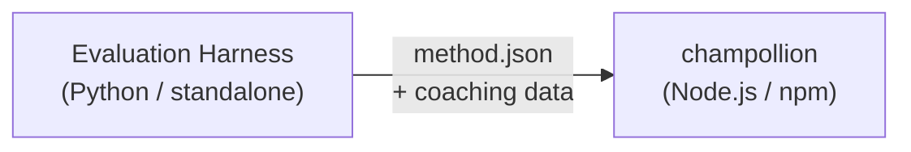

# メソッドプラグイン仕様

> **バージョン**: 1.1
> **対象**: プラグイン開発者
> **正規スキーマ**: [`shared/schemas/champollion-plugin.schema.json`](https://github.com/gamedaysuits/Champollion/blob/main/cli/shared/schemas/champollion-plugin.schema.json)

## 概要

champollion は**プラグイン可能なメソッドシステム**を採用しています。言語ペアごとに異なる翻訳メソッド（LLM、コーチング付き、スクリプト変換など）を使用できます。メソッドは `lib/translate.js` に登録され、`lib/pairs.js` を通じてペアごとに解決されます。

eval ハーネスの役割は、翻訳メソッドを**開発・テスト・エクスポート**することです。champollion の役割は、それらを**消費・実行**することです。プラグインは**データのみ**で構成されます — 設定、コーチングコンテンツ、ベンチマーク結果のみです。Python コードやハーネスへの依存関係は含みません。

### データフロー



ハーネスは Python でメソッドを開発・テストします。メソッドがデプロイ可能な状態になると、ハーネスは `method.json` マニフェストとオプションのコーチングデータファイルをエクスポートします。Champollion は、組み込みのメソッド実装を使用してメソッドをインストール・実行します。

---

## メソッドプラグインの形式

メソッドプラグインは、単一の JSON ファイル（`method.json`）とオプションのコーチングデータファイルで構成されます。

### `method.json` — 必須

```json
{
  "name": "french-formal-v1",
  "type": "llm-coached",
  "version": "1.0.0",
  "description": "Formally-tuned French with terminology enforcement and grammar coaching",
  "author": "Plugin Author",

  "config": {
    "model": "google/gemini-3.5-flash",
    "temperature": 0.2,
    "batchSize": 80,
    "register": "formal",
    "coachingFile": null,
    "coachingPrompt": null,
    "promptContext": null,
    "qualityTier": null
  },

  "locales": ["fr"],

  "benchmarks": {
    "fr": {
      "date": "2026-05-11T00:00:00Z",
      "corpus_size": 500,
      "exact_match_rate": 0.42,
      "corpus_chrf": 72.3,
      "corpus_bleu": 45.1,
      "model": "google/gemini-3.5-flash",
      "harness_version": "1.0.0"
    }
  },

  "provenance": {
    "resources": [],
    "commercialReady": false,
    "flags": ["license-unclear"]
  },

  "coaching": {
    "dir": "coaching"
  }
}
```

### フィールドリファレンス

| フィールド | 型 | 必須 | 説明 |
|-------|------|----------|-------------|
| `name` | string | ✅ | 一意のメソッド識別子（kebab-case） |
| `type` | string | ✅ | Champollion のメソッドタイプ: `llm`、`llm-coached`、`api`、`google-translate`、`deepl`、`microsoft-translator`、`libretranslate`、`openai`、`anthropic`、`gemini` |
| `version` | string | ✅ | セマンティックバージョン（例: `1.0.0`） |
| `locales` | string[] | ✅ | このメソッドが対象とするロケールコード（最低1つ） |
| `description` | string | — | 人間が読める説明文 |
| `author` | string | — | このメソッドを開発・テストした担当者 |
| `config.model` | string | — | OpenRouter モデル識別子 |
| `config.temperature` | number | — | LLM の temperature（0.0〜2.0、デフォルト: 0.3） |
| `config.batchSize` | number | — | API バッチあたりのキー数（1〜200、デフォルト: 80） |
| `config.register` | string \| null | — | 対象言語のレジスター／トーン（プリセットキーまたは自由記述テキスト） |
| `config.coachingFile` | string \| null | — | 自由記述コーチングプロンプトファイルへのパス（プロジェクトルートからの相対パス） |
| `config.coachingPrompt` | string \| null | — | 解決済みコーチングプロンプトテキスト（実行時に `coachingFile` から読み込まれる） |
| `config.promptContext` | string \| null | — | システムプロンプトに注入されるアプリケーションコンテキスト（例: "E-commerce product descriptions"） |
| `config.qualityTier` | string \| null | — | ベンチマーク評価による品質ティア（`standard`、`high`、`research`、`verified`） |
| `benchmarks` | object | — | eval ハーネスによるロケールごとのベンチマーク結果 |
| `provenance` | object | — | ライセンスおよびリソースの依存関係 |
| `coaching.dir` | string | — | コーチングデータディレクトリへの相対パス |

:::info[正規の MethodConfig の形式]
`config` ブロックは**正規の MethodConfig スキーマ**を使用します — `champollion.config.json`、ハーネスのランカード、`mt-eval export-config`、リーダーボードの公開・インストール全体で共通して使用される同じ 8 つのフィールドです。すべてのフィールドは常に存在し、未使用の値は `null` になります。これにより、評価と本番環境の間でのラウンドトリップがスムーズに行えます。
:::

### ベンチマークオブジェクト（ロケールごと）

| フィールド | 型 | 必須 | 説明 |
|-------|------|----------|-------------|
| `date` | string | ✅ | ベンチマーク実行の ISO 8601 タイムスタンプ |
| `corpus_size` | number | ✅ | 評価されたエントリ数 |
| `exact_match_rate` | number | ✅ | 0.0〜1.0、完全一致の割合 |
| `corpus_chrf` | number | — | chrF++ スコア（0〜100） |
| `corpus_bleu` | number | — | BLEU スコア（0〜100） |
| `model` | string | ✅ | 評価時に使用したモデル |
| `harness_version` | string | ✅ | 使用した評価ハーネスのバージョン |

:::info[表示されるメトリクスは何ですか？]
`champollion status` コマンドは、ベンチマークブロックから **chrF++** と**完全一致率**を表示します。`corpus_bleu` はマニフェストで受け付けられますが、現在 champollion のどのコマンドでも表示・使用されていません。[メソッドリーダーボード](/leaderboard)では chrF++、完全一致、FST 受理率を追跡しています。
:::

---

### プロベナンスオブジェクト

プロベナンスブロックは、プラグインにバンドルされたリソースのライセンス状況を伝えます。

| フィールド | 型 | デフォルト | 説明 |
|-------|------|---------|-------------|
| `resources` | object[] | `[]` | `name`、`license`、`type` を持つバンドルリソースのリスト |
| `commercialReady` | boolean | `false` | プラグインが商用配布の許可を受けているかどうか |
| `flags` | string[] | `["license-unclear"]` | 機械可読なステータスフラグ |

**デフォルト状態** — エクスポートされたプラグインは `commercialReady: false` および `flags: ["license-unclear"]` とともに出荷されます。

**クリア済み状態** — ライセンスが確認された場合: `commercialReady: true` を設定し、フラグをクリアします。

---

## コーチングデータの形式

`type` が `llm-coached` の場合、プラグインは `coaching/` サブディレクトリにコーチングデータファイルを含める必要があります。

### `coaching/<locale>.json`

```json
{
  "grammar_rules": [
    "French adjectives agree in gender and number with the noun they modify",
    "Use 'vous' for formal contexts, 'tu' for informal"
  ],
  "dictionary": {
    "dashboard": "tableau de bord",
    "deployment": "déploiement",
    "settings": "paramètres"
  },
  "style_notes": "Prefer active voice. Avoid anglicisms where a native French term exists."
}
```

| フィールド | 型 | 必須 | 説明 |
|-------|------|----------|-------------|
| `grammar_rules` | string[] | — | このロケールのすべての LLM プロンプトに注入されるルール |
| `dictionary` | object | — | 用語 → 翻訳のマップ。マッチした用語は必須用語として注入されます。 |
| `style_notes` | string | — | プロンプトに追加される自由記述のスタイル指示 |

---

## ディレクトリ構造

```
french-formal-v1/
  method.json                 # Method manifest with benchmarks
  coaching/
    fr.json                   # Coaching data for French
```

複数ロケールのメソッドの場合:

```
european-formal-v2/
  method.json                 # locales: ["fr", "de", "es", "it"]
  coaching/
    fr.json
    de.json
    es.json
    it.json
```

---

## Champollion によるプラグインの利用方法

### インストール

```bash
champollion plugin install ./french-formal-v1/
```

`.champollion/methods/french-formal-v1/` に保存されます。

### 設定

```json title="champollion.config.json"
{
  "pairs": {
    "en:fr": {
      "methodPlugin": "french-formal-v1"
    }
  }
}
```

:::info[マージのセマンティクス]
プラグインは使用する*メソッド*を定義します（`type`）。ペア設定はその*実行方法*を調整します（`model`、`register`、`batchSize`）。ペアで `model` が設定されている場合、プラグインのデフォルト値を上書きします。
:::

### 実行時

1. Champollion は `.champollion/methods/french-formal-v1/` から `method.json` を読み込みます
2. プラグインの `type` フィールドが翻訳メソッドを設定します（例: `llm-coached`）
3. プラグインの `coaching/` ディレクトリからコーチングデータを読み込みます
4. `config` ブロックを使用して、モデル・レジスター・temperature の不足分を補完します
5. `benchmarks` ブロックは `champollion status` の出力に表示されます
6. `provenance` ブロックは `champollion provenance` によってライセンスフラグの確認に使用されます

---

## スキーマ検証

プラグインマニフェストは、インストール時に [`shared/schemas/champollion-plugin.schema.json`](https://github.com/gamedaysuits/Champollion/blob/main/cli/shared/schemas/champollion-plugin.schema.json) に対して検証されます。

IDE のオートコンプリートを有効にするには、`method.json` でスキーマを参照してください:

```json
{
  "$schema": "./node_modules/champollion/shared/schemas/champollion-plugin.schema.json",
  "name": "my-method-v1"
}
```

---

## 含めてはいけないもの

- ❌ Python コードやハーネスへの依存関係は含めない
- ❌ 生のコーパスデータや実行ログは含めない
- ❌ API キーや認証情報は含めない
- ❌ ハーネスの設定は含めない
- ❌ 内部プロンプトテンプレートは含めない（それらは champollion のメソッド実装に含まれます）

プラグインは**データのみ**です: 設定、コーチングコンテンツ、ベンチマーク結果のみで構成されます。

---

## 関連情報

- [翻訳メソッド](/docs/guides/translation-methods) — 各組み込みメソッドの動作方法
- [設定](/docs/getting-started/configuration) — ペアごと・言語ごとの設定
- [API によるメソッドの提供](/docs/guides/serving-a-method) — メソッドを HTTP サービスとしてホスティングする方法
- [クックブック: FST ゲートパイプライン](/docs/network/tutorials/fst-gated-pipeline) — パイプラインの構築とパッケージング
- [MT 評価](/docs/network/leaderboard/rules) — リーダーボード提出のためのメソッドベンチマーク
- [低リソース言語のサポート](/docs/network/community/low-resource-languages) — コミュニティプラグインのユースケース
