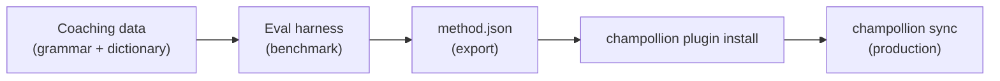

# チュートリアル：翻訳プラグインを作成する

カスタム翻訳メソッドをゼロから構築し、ベンチマークを実施して、champollion プラグインとしてデプロイします。これは、既製の API がサポートしていない新しい言語ペアを追加するための完全なワークフローです。

**作成するもの：** 用語の強制適用、文法ルール、ベンチマークスコアを備えた、フォーマルなフランス語向けのコーチング翻訳プラグイン。

**所要時間：** 30〜45 分

**前提条件：**
- champollion がインストール済みであること（`npm install --save-dev champollion`）
- OpenRouter の API キー（`OPENROUTER_API_KEY`）
- Python 3.10 以上（eval ハーネス用）

---

## ステップ 1：問題を特定する

SaaS ダッシュボードをフランス語に翻訳しています。デフォルトの `llm` メソッドは正確ではあるものの、一貫性のない翻訳を生成します：

- 「dashboard」が「tableau de bord」になる場合と「panneau de contrôle」になる場合がある
- 語調が `tu` 形式と `vous` 形式の間で揺れる
- 技術用語の英語化が一貫していない

汎用の LLM プロンプトでは対応できない、**用語の強制適用**と**レジスターの制御**が必要です。

## ステップ 2：コーチングデータを作成する

言語要件をエンコードするコーチングファイルを作成します：

```bash
mkdir -p .champollion/coaching
```

```json title=".champollion/coaching/fr.json"
{
  "grammar_rules": [
    "Always use the 'vous' form for formal register",
    "French adjectives agree in gender and number with their noun",
    "Use the present tense for UI instructions, not the imperative",
    "Preserve sentence-final punctuation style from the source"
  ],
  "dictionary": {
    "dashboard": "tableau de bord",
    "deployment": "déploiement",
    "settings": "paramètres",
    "environment variable": "variable d'environnement",
    "webhook": "webhook",
    "API key": "clé API",
    "sign in": "se connecter",
    "sign out": "se déconnecter",
    "repository": "dépôt",
    "pull request": "demande de tirage"
  },
  "style_notes": "Formal technical French. Prefer native French terms over anglicisms where established equivalents exist. Keep UI labels concise — 3 words maximum where possible."
}
```

**各フィールドの役割：**
- **`grammar_rules`** — 明示的な制約として LLM のシステムプロンプトに挿入されます
- **`dictionary`** — ソースキーと照合され、辞書の用語が出現した場合、プロンプト内で「必須用語」として挿入されます
- **`style_notes`** — 一般的なスタイルガイダンスとしてシステムプロンプトに追記されます

## ステップ 3：ペアを設定する

フランス語に `llm-coached` を使用するよう champollion に指定します：

```json title="champollion.config.json"
{
  "version": 3,
  "inputLocale": "en",
  "localesDir": "./locales",
  "pairs": {
    "en:fr": {
      "method": "llm-coached",
      "model": "google/gemini-3.5-flash",
      "temperature": 0.2
    }
  },
  "languages": {
    "fr": {
      "register": "Formal technical French (vous-form)",
      "name": "French"
    }
  }
}
```

## ステップ 4：テストする

```bash
npx champollion sync --dry
```

ドライランの出力を確認します。以下をチェックしてください：
- ✅ 辞書の用語が一貫して使用されている（「panneau de contrôle」ではなく「tableau de bord」）
- ✅ `vous` 形式が全体を通じて使用されている
- ✅ 技術用語が辞書と一致している

次に、実際の同期を実行します：

```bash
npx champollion sync
```

## ステップ 5：eval ハーネスでベンチマークを実施する（任意）

品質スコアが必要な場合（プラグインはベンチマークデータとともに公開されるため、必要になります）、付属の eval ハーネスを使用してください。

### ハーネスをインストールする

```bash
pip install mt-eval-harness
```

### リファレンスコーパスを作成する

ソース文字列と既知の正解翻訳を含むファイルを作成します：

```json title="corpus/french-formal.json"
[
  {
    "source": "Dashboard",
    "reference": "Tableau de bord"
  },
  {
    "source": "Sign in to your account",
    "reference": "Connectez-vous à votre compte"
  },
  {
    "source": "Your deployment is ready",
    "reference": "Votre déploiement est prêt"
  },
  {
    "source": "Environment variables",
    "reference": "Variables d'environnement"
  }
]
```

### ベンチマークを実行する

```bash
mt-eval test \
  --corpus corpus/french-formal.json \
  --source en \
  --target fr \
  --model google/gemini-3.5-flash \
  --temperature 0.2 \
  --champollion-config champollion.config.json
```

ハーネスは以下を出力します：
- **chrF++** — 文字レベルの F スコア（0〜100）。70 以上が良好です。
- **BLEU** — N グラムの重複度（0〜100）。コーチング翻訳では 40 以上が堅実です。
- **完全一致率** — リファレンスと完全に一致した翻訳の割合。
- **COMET** — ニューラル品質指標（`mt-eval setup --comet` 経由でインストールした場合）。

:::tip[出荷するものをテストする]
`--champollion-config` を使用すると、`champollion.config.json` から本番環境のモデル、レジスター、温度、コーチングデータを直接インポートします。これにより、実際にデプロイするメソッドをベンチマークしていることが保証されます。
:::

### プラグインをエクスポートする

スコアに満足したら：

```bash
mt-eval export \
  --name french-formal-v1 \
  --report eval/logs/harness/run_report.json \
  --output ./french-formal-v1/
```

これにより以下が作成されます：

```
french-formal-v1/
├── method.json          # Manifest with config + benchmarks
└── coaching/
    └── fr.json          # Your coaching data
```

## ステップ 6：Champollion にプラグインをインストールする

```bash
npx champollion plugin install ./french-formal-v1/
```

これにより、プラグインが `.champollion/methods/french-formal-v1/` にコピーされます。

使用するよう設定を更新します：

```json title="champollion.config.json"
{
  "pairs": {
    "en:fr": {
      "methodPlugin": "french-formal-v1"
    }
  }
}
```

## ステップ 7：確認する

```bash
# Check plugin is installed and shows benchmark scores
npx champollion status

# Run a sync with the plugin
npx champollion sync

# Audit licensing status
npx champollion provenance
```

`status` の出力に以下が表示されます：

```
en → fr
  Method:    french-formal-v1 (llm-coached)
  Model:     google/gemini-3.5-flash
  Quality:   high
  chrF++:    74.2
  BLEU:      46.8
  Exact:     42%
```

## 作成したもの



以下が完成しました：
1. **コーチングデータ** — 一貫性を強制する文法ルールと用語集
2. **ベンチマークスコア** — プラグインとともに公開される定量的な品質指標
3. **ポータブルなプラグイン** — `method.json` とコーチングデータのセットで、任意のマシンにインストール可能
4. **本番デプロイ** — 同期パイプラインに統合済み

## 次のステップ

- **[プラグイン仕様](/docs/reference/plugin-spec)** — マニフェスト形式の完全なリファレンス
- **[翻訳メソッド](/docs/guides/translation-methods)** — 4 つのメソッドをすべて比較する
- **[低リソース言語](/docs/network/community/low-resource-languages)** — API がカバーしていない言語にこのパターンを適用する
- **[30 言語を翻訳する](/docs/tutorials/translate-30-languages)** — プロジェクトをグローバルな規模に拡大する
