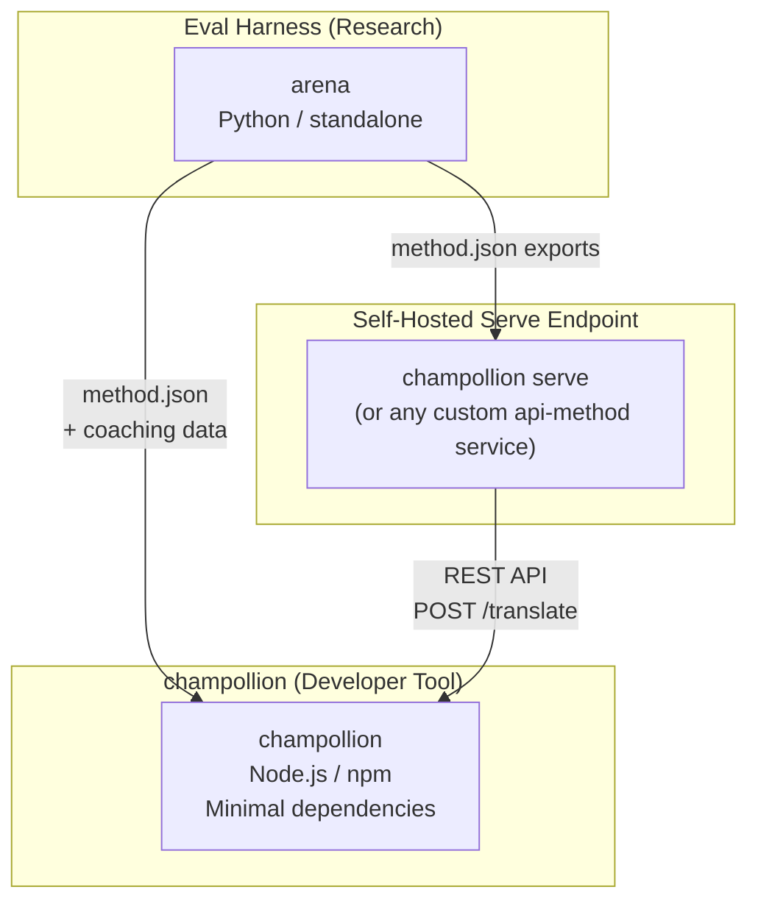
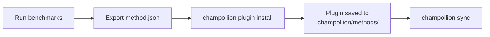
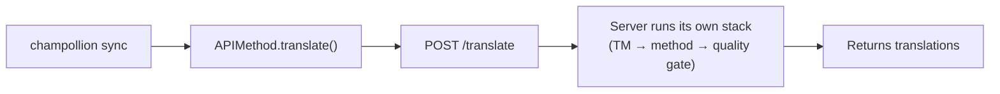
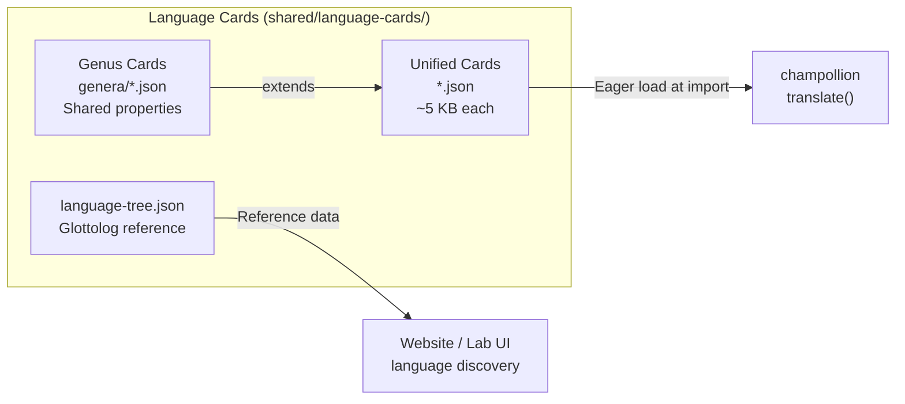

# 아키텍처

Champollion 번역 생태계는 잘 정의된 계약을 통해 함께 동작하는 세 개의 독립적인 도구로 구성되어 있어요. 이 도구들은 빌드 시점에 서로 의존하지 않아요. 공유되는 **method 플러그인 형식**과 **REST API 계약**을 통해 통신해요.

## 세 가지 구성 요소



### champollion (이 프로젝트)

소스 공개(source-available) 개발자 도구예요(비상업적 용도로는 무료). 플러그인 방식의 메서드를 사용하여 로케일 파일을 번역해요. 의존성이 최소화되어 있고, 설정은 선택 사항이며, 별도 설정 없이 바로 작동해요.

**내장 method:**
- `llm` → OpenRouter / 모든 LLM (200개 이상의 모델)
- `llm-coached` → LLM + 문법/사전 코칭
- `openai` → OpenAI API 직접 사용 (GPT-4o, GPT-4o-mini)
- `anthropic` → Anthropic API 직접 사용 (Claude Sonnet, Haiku, Opus)
- `gemini` → Google Gemini API 직접 사용 (Flash, Pro — 무료 등급 제공)
- `google-translate` → Google Cloud Translation API v2
- `deepl` → 용어집(glossary)을 지원하는 DeepL API
- `microsoft-translator` → Azure Cognitive Services Translator
- `libretranslate` → 셀프 호스팅 LibreTranslate (AGPL, 무료)
- `api` → 원격 REST 엔드포인트로 연결하는 얇은 파이프

### Eval Harness (동반 프로젝트)

번역 method를 개발, 테스트, 벤치마킹하기 위한 연구 도구예요. method가 허용 가능한 품질에 도달하면, harness는 **method 플러그인** — `method.json` 매니페스트와 선택적인 코칭 데이터 파일 — 을 내보내요.

harness는 champollion 내부에서 절대 실행되지 않아요. 정적 출력(JSON 파일)을 생성하는 별도의 도구예요. Champollion은 그 파일들을 읽기만 해요.

[→ GitHub의 Eval Harness](https://github.com/gamedaysuits/Champollion)

### 셀프 호스팅 서브 엔드포인트 (`champollion serve`)

모든 champollion 프로젝트는 단일 명령어인 [`champollion serve`](/docs/guides/serving-a-method#the-zero-code-path-champollion-serve)를 통해 구성된 자체 번역 스택을 HTTP로 제공(serve)할 수 있으며, 다른 모든 프로젝트는 `api` 메서드를 통해 이를 사용할 수 있어요. 프롬프트, 코칭 데이터, 번역 메모리(Translation Memory), 프로바이더 키는 소유자의 인프라에 유지되며, 사용자는 소스 문자열만 보내고 번역 결과를 받아요. champollion 외부에 완전히 독립적으로 존재하는 파이프라인(FST 체인, 연구 시스템 등)도 [사용자 지정 서비스](/docs/guides/serving-a-method)와 동일한 계약(contract)을 구현할 수 있어요. 호스팅되는 Champollion 서비스는 없으며, 설계상 서빙(serving)은 항상 셀프 호스팅으로 이루어져요.

## 서로 어떻게 연결되나요

### Eval Harness → champollion (단방향 내보내기)



**계약**: [플러그인 명세](/docs/reference/plugin-spec)

### 서브 엔드포인트 → champollion (런타임 API)



Champollion의 `APIMethod`는 **단순한 파이프**예요. 키를 내보내고 번역을 다시 받아와요. 번역 로직이나 독점 콘텐츠는 전혀 포함하지 않아요.

## 각 구성 요소가 다른 요소에 대해 아는 것

| 도구 | champollion을 알고 있나요? | 서브 엔드포인트를 알고 있나요? | harness를 알고 있나요? |
|------|---------------------|-------------------------------|---------------------|
| **champollion** | *(champollion 자체임)* | 예 — `api` 메서드가 호출해요 | 아니요 — 플러그인 내보내기(exports)만 읽어요 |
| **서브 엔드포인트(Serve endpoint)** | 예 — 요청을 처리(serve)해요 | *(서브 엔드포인트 자체임)* | 아니요 — 다른 프로젝트처럼 내보낸 메서드를 설치해요 |
| **Eval Harness** | 예 — 플러그인 형식을 내보내요 | 아니요 — 메서드는 별도로 배포돼요 | *(harness 자체임)* |

## 사용자 시나리오

### 시나리오 1: 무료, 설정 없음 (대부분의 사용자)

```bash
export OPENROUTER_API_KEY=sk-...
npx champollion sync
```

내장된 `llm` 메서드를 사용해요. 플러그인, 서버, harness가 필요 없어요.

### 시나리오 2: Google Translate 기준선

```bash
export GOOGLE_TRANSLATE_API_KEY=AIza...
npx champollion sync
```

내장 `google-translate` method를 사용해요. 플러그인이 필요 없어요.

### 시나리오 3: 코칭이 번들된 오픈 플러그인

```bash
champollion plugin install ./french-formal-v1/
champollion sync
```

플러그인에 `type: "llm-coached"`가 있어요 → champollion은 사용자 자신의 OpenRouter 키를 사용해요. 코칭 데이터는 로컬에 있어요 (서버 호출 없음).

### 시나리오 4: 직접 코칭 (플러그인 없음, harness 없음)

```json title="champollion.config.json"
{
  "pairs": {
    "en:fr": { "method": "llm-coached" }
  }
}
```

사용자는 자신의 문법 규칙과 사전을 `.champollion/coaching/fr.json`에서 직접 관리해요.

### 시나리오 5: 다른 프로젝트가 제공하는 스택 사용하기

```bash
champollion plugin install ./their-project-serve/   # manifest from `champollion serve --emit-manifest`
CHAMPOLLION_API_KEY=<their bearer token> champollion sync
```

페어의 `api` 메서드는 소스 문자열을 셀프 호스팅된 [`champollion serve`](/docs/guides/serving-a-method#the-zero-code-path-champollion-serve) 엔드포인트로 POST 요청을 보내며, 해당 스택(코칭, TM, 품질 게이트)이 번역을 수행해요.

## 언어 카드(Language Cards)

champollion의 각 언어는 **언어 카드(Language Card)** — register 프리셋, 격식 규칙, method 지원 플래그, 타이포그래피 관례, 계통 분류, 언어 참조 데이터를 담은 통합 JSON 파일 — 를 통해 구성돼요.



카드는 import 시점에 즉시(eagerly) 로드돼요. 각 카드는 번역 엔진과 개발자 문서에 필요한 모든 메타데이터를 담고 있어요 — 별도의 참조 계층은 없어요. 카드는 `scripts/generate-language-card.mjs`와 `scripts/build-language-tree.mjs`를 사용해 권위 있는 출처(IANA, CLDR, [Glottolog](https://glottolog.org), [WALS](https://wals.info))에서 생성된 후, 언어적 정확성을 위해 사람이 직접 큐레이션해요.

## 설계 원칙

1. **순환 의존성이 없어요.** 브리지는 단방향이에요.
2. **Champollion은 가벼운 코어예요.** 의존성이 최소화되어 있고, 설정은 선택 사항이에요. 플러그인과 API는 부가적인 요소예요.
3. **IP 보호는 아키텍처 수준에서 이루어져요.** 독점적인 기술은 서빙 측에 유지돼요. 즉, 엔드포인트를 실행하는 사람이 프롬프트, 코칭, 키를 보관해요. npm 패키지에는 독점적인 내용이 포함되지 않아요.
4. **플러그인 형식이 곧 계약(contract)이에요.** 모든 것은 `method.json`을 통해 흐르게 돼요.
5. **각 도구는 하나의 역할만 수행해요.** Harness → 메서드 개발. `champollion serve` → 메서드 호스팅. Champollion → 파일 번역.

---

## 참고 항목

- [번역 method](/docs/guides/translation-methods) — 각 내장 method가 동작하는 방식
- [플러그인 명세](/docs/reference/plugin-spec) — method.json 매니페스트 형식
- [Eval Harness](/docs/network/specifications/harness) — 동반 연구 도구
- [API를 통한 method 제공](/docs/guides/serving-a-method) — 커스텀 번역 파이프라인 호스팅
- [저자원 언어 지원하기](/docs/network/community/low-resource-languages) — 이 아키텍처를 이끈 사용 사례
