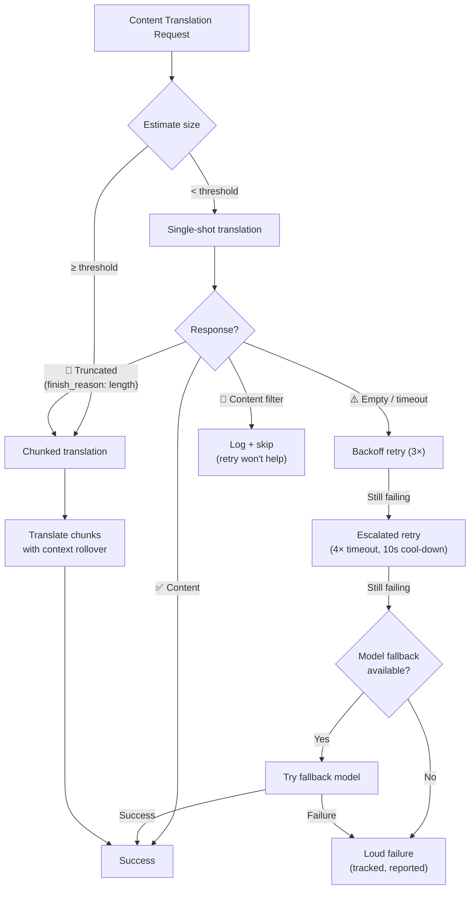

# 콘텐츠 번역 복원력

Champollion의 콘텐츠 번역 파이프라인(Markdown/MDX 문서)은 실패를 우아하게 처리하기 위해 다층 복원력 시스템을 사용해요. 각 배치가 작고 재시도 비용이 저렴한 키-값 번역과 달리, 콘텐츠 번역은 일시적인 이유가 아니라 구조적인 이유로 실패할 수 있는 큰 프롬프트와 긴 출력을 포함해요.

## 문제점

콘텐츠 번역은 키-값 번역과 근본적으로 다른 실패 모드를 가지고 있어요:

| 실패 모드 | 키-값 | 콘텐츠 |
|---|---|---|
| 속도 제한(429) | 흔함, 일시적 | 흔함, 일시적 |
| 타임아웃 | 드묾(작은 배치) | 흔함(긴 출력) |
| 빈 응답 | 드묾 | 흔함(출력 제한, 필터) |
| 출력 잘림 | 해당 없음(JSON 검증됨) | 조용히 발생 |
| 콘텐츠 필터 | 극히 드묾 | 가능(CLI 문서, 보안 문서) |
| 모델 한계 | 재시도로 해결됨 | 재시도로 해결 안 됨 |

핵심 통찰은 다음과 같아요: **동일하게 실패하는 요청을 재시도하는 것은 중복성이 아니라 고집이에요.** 적절한 복원력 시스템은 무언가가 *왜* 실패했는지 식별하고 그에 따라 접근 방식을 변경해요.

## 아키텍처 개요



## 계층 1: 진단 우선 재시도

*어떻게* 재시도할지 결정하기 전에, 시스템은 API 응답을 검사하여 *무엇이* 실패했는지 이해해요.

### 종료 사유 분석

모든 LLM API는 생성된 텍스트와 함께 `finish_reason`를 반환해요. Champollion은 이를 사용하여 지능적인 재시도 결정을 내려요:

| `finish_reason` | 의미 | 조치 |
|---|---|---|
| `stop` + 콘텐츠 | 모델이 정상적으로 완료됨 | ✅ 결과 수락 |
| `stop` + 비어 있음 | 모델이 아무것도 생성하지 않음 | ⚠️ 동일 요청 재시도(일시적) |
| `length` | 출력이 토큰 제한에 도달함 | 🔶 문서 자동 청크 분할 |
| `content_filter` | 안전 필터가 출력을 차단함 | 🔴 로그 기록 후 건너뛰기(재시도 무의미) |
| `null` / 누락 | 형식이 잘못된 응답 | ⚠️ 동일 요청 재시도(일시적) |

이는 모든 실패를 백오프 재시도로 동일하게 취급하는 현재의 접근 방식을 대체해요.

### 재시도 예산

일시적 실패에 대한 표준 재시도 예산:

| 라운드 | 시도 횟수 | 타임아웃 | 백오프 |
|---|---|---|---|
| 표준 | 4(0→3) | 60초 | 1초 → 2초 → 4초 |
| 단계 상향 | 4(0→3) | 120초 | 1초 → 2초 → 4초 |
| **합계** | **8** | — | **최악의 경우 ~3.5분** |

라운드 사이에는 10초의 쿨다운으로 일시적 문제가 해결될 수 있도록 해요.

## 계층 2: 콘텐츠 청크 분할

문서가 크기 임계값을 초과하거나, 계층 1이 출력 잘림을 신호할 때, 시스템은 문서를 번역 크기의 청크로 분할해요.

자세한 청크 분할 구성은 [Context Rollover](/docs/concepts/context-rollover#content-chunking)를 참조하세요. 핵심 사항은 다음과 같아요:

### 분할 전략

1. **헤딩 경계** — `##`와 `###`은 자연스러운 번역 단위 경계예요. 각 섹션은 독립적인 번역을 위해 충분히 자체 완결적이에요.
2. **단락 폴백** — 단일 헤딩 섹션이 청크 크기를 초과하면 이중 줄바꿈에서 분할해요.
3. **하드 분할** — 극도로 긴 단락(예: 표)에 대한 최후의 수단이에요. 문장 경계에서 분할해요.

### 청크 간 컨텍스트

각 청크는 *이전 청크 번역*의 마지막 2-3개 단락을 컨텍스트로 받아요. 이는 다음을 방지해요:
- **용어 표류** — 모델이 이전 청크에서 "tableau de bord"라고 부른 것을 확인해요
- **대명사 해소** — 이전 섹션의 선행사가 이어져요
- **어조 일관성** — 청크 1에서 확립된 어조가 청크 N까지 유지돼요

### 자동 청크 분할 트리거

| 트리거 | 동작 |
|---|---|
| 구성에 `contentChunkSize` 설정됨 | 해당 크기를 초과하는 문서는 항상 청크 분할 |
| `finish_reason: "length"` 반환됨 | 폴백으로 자동 청크 분할(구성 없이도) |
| 입력 > ~12KB(자동 감지) | 제안 로그 기록, 단 강제하지 않음 |

## 계층 3: 모델 폴백 체인

구성된 모델이 일시적이 아니라 구조적으로 지속적으로 실패할 때, 시스템은 대체 모델을 시도해요. 서로 다른 모델은 서로 다른 컨텍스트 윈도우, 출력 제한, 안전 필터, 다국어 강점을 가지고 있어요.

### 기본 폴백 체인

```json title="champollion.config.json"
{
  "contentFallbackChain": [
    "google/gemini-2.5-flash",
    "anthropic/claude-sonnet-4"
  ]
}
```

구성된 모델이 항상 먼저 시도돼요. 폴백 모델은 모든 재시도 라운드(표준 + 단계 상향)가 소진된 후에만 사용돼요.

### 여러 아키텍처를 사용하는 이유

| 시나리오 | 기본 모델 실패 | 폴백 모델 성공 |
|---|---|---|
| 베트남어 CLI 문서 | Gemini가 빈 응답 반환 | Claude가 문제없이 처리 |
| 안전 필터링된 콘텐츠 | OpenAI가 차단 | Gemini는 다른 필터 임계값을 가짐 |
| 긴 구조화된 표 | 모델 A가 잘림 | 모델 B는 더 큰 출력 윈도우를 가짐 |

폴백의 가치는 아키텍처 다양성이에요 — 서로 다른 모델 계열은 서로 다른 실패 모드를 가지고 있어요. 한 모델에 구조적인 실패가 다른 모델에는 사소할 수 있어요.

### 범위

> 모델 폴백은 **콘텐츠 전용**이에요. 키-값 배치는 작고 구조적으로 실패하는 경우가 거의 없어요. 거기에 폴백 복잡성을 추가하는 것은 과도한 엔지니어링이에요.

## 계층 4: 실패 회계

실패가 발생하면, 시스템은 조용히 계속 진행하는 대신 이를 적절하게 추적하고 보고해요.

### 동기화 중

- 실패한 항목은 진행 상황 출력에 `[FAIL]`를 표시해요
- 각 실패는 구체적인 사유를 로그에 기록해요(타임아웃, 빈 응답, 콘텐츠 필터, 잘림)
- 완료된 항목은 즉시 매니페스트에 저장돼요(증분 영속화)

### 동기화 후

마지막에 실패 요약이 출력돼요:

```
  ┌─ Content Translation Failures ─────────────────────────────────────┐
  │                                                                     │
  │  2 of 24 content translations failed:                              │
  │                                                                     │
  │  ✗ docs/reference/cli.md → vi                                      │
  │    Reason: empty response after 8 attempts + 1 fallback model      │
  │    Models tried: google/gemini-3.1-pro-preview, gemini-2.5-flash   │
  │                                                                     │
  │  ✗ docs/guides/troubleshooting.md → ar                             │
  │    Reason: content_filter (no retry — blocked by safety filter)    │
  │                                                                     │
  │  Re-run: npx champollion@latest sync                              │
  │  (22 completed translations are cached and won't re-run)           │
  └─────────────────────────────────────────────────────────────────────┘
```

### 재시도 매니페스트

실패한 파일은 `.champollion-retry.json`에 기록돼요:

```json
{
  "failedAt": "2026-05-27T21:45:00Z",
  "files": [
    {
      "source": "docs/reference/cli.md",
      "locale": "vi",
      "reason": "empty_response",
      "attempts": 8,
      "modelsTried": ["google/gemini-3.1-pro-preview", "google/gemini-2.5-flash"]
    }
  ]
}
```

다음 `sync` 실행 시에는 이 파일들만 다시 처리돼요. 완료된 파일은 콘텐츠 해시 매니페스트(`.champollion-content.lock`)를 통해 보존돼요.

### 종료 코드

| 코드 | 의미 |
|---|---|
| 0 | 모든 번역 성공 |
| 1 | 구성 오류, API 키 누락 등 |
| 2 | 부분 실패 — 일부 콘텐츠 번역 실패 |

## 구성

```json title="champollion.config.json"
{
  "contentChunkSize": 4000,
  "contentOverlap": 200,
  "contentFallbackChain": [
    "google/gemini-2.5-flash",
    "anthropic/claude-sonnet-4"
  ]
}
```

| 필드 | 타입 | 기본값 | 설명 |
|---|---|---|---|
| `contentChunkSize` | `number \| null` | `null` | 콘텐츠 청크당 최대 토큰 수. `null` = 청크 분할 없음(잘림 시에만 자동 청크 분할) |
| `contentOverlap` | `number` | `200` | 컨텍스트 연속성을 위한 콘텐츠 청크 간 중첩 토큰 |
| `contentFallbackChain` | `string[]` | `[]` | 구성된 모델이 구조적으로 실패할 때 시도할 폴백 모델 |

## 구현 상태

| 기능 | 상태 |
|---|---|
| 진단 우선 재시도(finish_reason 파싱) | 🔲 계획됨 |
| 콘텐츠 청크 분할(헤딩/단락 분할) | 🔲 계획됨 |
| 청크 간 컨텍스트 롤오버 | 🔲 계획됨 |
| 모델 폴백 체인 | 🔲 계획됨 |
| 실패 요약 보고서 | 🔲 계획됨 |
| 재시도 매니페스트(.champollion-retry.json) | 🔲 계획됨 |
| 부분 실패에 대한 종료 코드 2 | 🔲 계획됨 |
| 단계 상향 재시도(타임아웃 연장) | ✅ 구현됨(v3.3.3) |
| 시도 번호가 매겨진 재시도 메시지 | ✅ 구현됨(v3.3.3) |
| 콘텐츠 오류 시 명시적 실패 | ✅ 구현됨(v3.3.3) |

## 참고 자료

- [Context Rollover](/docs/concepts/context-rollover) — 배치 일관성 및 콘텐츠 청크 분할 구성
- [How Sync Works](/docs/concepts/how-sync-works) — 전체 동기화 파이프라인
- [Translation Methods](/docs/guides/translation-methods) — 사용 가능한 방법과 그 특성
