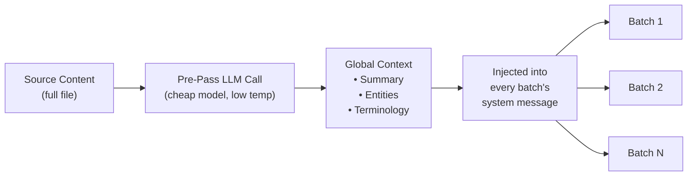

# Context Rollover Batching

Context rollover는 이전 번역의 일정 범위를 후속 배치로 이어 전달하여, LLM이 배치 경계를 넘나드는 "단기 기억"을 갖도록 하는 문서 수준 번역 일관성 기능이에요.

## 존재 이유

대용량 파일(키 100개 이상 또는 긴 Markdown 문서)을 번역할 때, champollion은 작업을 배치로 분할해요. rollover가 없으면 각 배치는 독립적으로 번역되며 — LLM은 이전 배치에서 무엇을 번역했는지 기억하지 못해요. 이로 인해 다음과 같은 문제가 발생해요:

- **용어 표류**: 동일한 영어 용어가 배치마다 다르게 번역돼요(예: "dashboard" → 배치 1에서는 "tableau de bord", 배치 3에서는 "panneau")
- **상호참조 실패**: 배치 경계를 넘나드는 대명사와 참조가 선행사를 잃어버려요
- **레지스터 불일치**: 톤이 배치 간에 바뀔 수 있어요(격식체 → 비격식체 → 격식체)

이는 MT 문헌에서 잘 문서화된 문제예요. 슬라이딩 윈도우 접근 방식은 문서 수준 기계 번역 연구(ACL, WMT 워크숍)에서 검증되었어요.

## 작동 방식

### 슬라이딩 윈도우

`contextRollover`가 활성화되면, 번역 파이프라인은 최근에 번역된 키-값 쌍의 윈도우를 유지해요. 각 배치가 완료되면, 출력의 일부(기본값: `batchSize`의 20%)가 다음 배치의 프롬프트에 "참조 번역"으로 이어 전달돼요.

```
Batch 1: Translate keys 1-80         → LLM sees: system prompt + keys 1-80
Batch 2: Translate keys 81-160       → LLM sees: system prompt + [16 reference translations from batch 1] + keys 81-160
Batch 3: Translate keys 161-240      → LLM sees: system prompt + [16 reference translations from batch 2] + keys 161-240
```

참조 번역은 명확한 레이블과 함께 사용자 메시지에 삽입돼요:

```
--- Previous translations for context (do NOT re-translate these) ---
"nav.dashboard": "Tableau de bord"
"nav.settings": "Paramètres"
"header.welcome": "Bienvenue sur la plateforme"
---

{
  "content.main_heading": "Getting Started with Your Dashboard",
  ...
}
```

### 선택 전략

이어 전달할 번역을 선택하는 두 가지 모드가 있어요:

| 전략 | 동작 | 적합한 경우 |
|----------|----------|----------|
| `tail` (기본값) | 이전 배치의 마지막 N개 번역 | 순차적 문서, Markdown 콘텐츠 |
| `diverse` | 서로 다른 키 유형(버튼, 제목, 설명)을 포괄하는 항목 선택 | 혼합된 UI 요소 유형을 가진 대용량 JSON 파일 |

### 토큰 예산

rollover 윈도우는 입력 토큰을 소비해요. Champollion은 대략적인 토큰 비용을 계산하고, 윈도우가 모델의 추정 컨텍스트 윈도우의 15%를 초과하면 경고해요. 이 경고에는 권장 축소량이 포함돼요:

```
[WARN] Rollover window is ~2400 tokens (18% of model context).
       Consider reducing rolloverSize to 0.15 or lowering batchSize.
```

## Global Context Pre-Pass

번역이 시작되기 **전에** 실행되는 선택적 첫 번째 패스 LLM 호출이에요. LLM은 전체 소스 콘텐츠를 분석하여 다음을 생성해요:

1. **Document Summary** — 번역 대상에 대한 2~3문장 설명
2. **Named Entities** — 제품명, 기술 용어, 고유명사와 권장 처리 방식
3. **Terminology Consistency List** — LLM이 일관된 번역이 필요하다고 식별한 핵심 용어

이 글로벌 컨텍스트는 모든 배치의 **시스템 메시지**에 삽입되어, 각 배치가 일부 조각만 보더라도 전체 문서를 인식할 수 있게 해줘요.



### Pre-Pass 모델

글로벌 컨텍스트 추출은 사용자가 구성한 번역 모델과 관계없이 별도의 저렴한 LLM 호출(기본값: temperature 0.1의 `google/gemini-3.5-flash`)을 사용해요. 이는 번역 작업이 아니라 메타데이터 추출 작업이며 — 창의적인 출력보다 속도와 비용이 더 중요해요.

## Content Chunking {#content-chunking}

긴 Markdown 문서(콘텐츠 번역)의 경우, 본문이 LLM의 유효 컨텍스트 윈도우를 초과하거나 모델이 출력을 잘라낼 수 있어요. Content chunking은 문서를 겹치는 세그먼트로 분할하여 각각 독립적으로 번역한 다음 재조립해요.

### 분할 전략

청킹은 우선순위 캐스케이드를 따르며 — 의미적으로 가장 의미 있는 분할 지점을 먼저 시도해요:

1. **제목 경계** — `##` 및 `###` 마커는 자연스러운 번역 단위를 만들어요. 각 섹션은 독립적인 번역이 가능할 만큼 자족적이며, 제목은 번역 대상에 대한 구조적 컨텍스트를 LLM에 제공해요.
2. **단락 경계** — 단일 제목 섹션이 청크 크기를 초과하는 경우, 이중 줄바꿈(`\n\n`)에서 분할해요. 단락은 완전한 생각을 나타내므로 그다음으로 좋은 경계예요.
3. **문장 경계** — 매우 긴 단락(예: 큰 표, 밀집된 산문)의 최후 수단이에요. 약어를 고려하면서 마침표-공백 경계에서 분할해요.

보호된 블록(코드 펜스, 숏코드 — [How Sync Works](/docs/concepts/how-sync-works) 참고)은 청크 간에 절대 분할되지 않아요. 보호된 블록이 잘릴 경우, 분할 지점이 해당 블록 앞이나 뒤로 이동해요.

### Auto-Chunking 트리거

청킹은 두 가지 방식으로 활성화돼요:

| 트리거 | 동작 |
|---------|----------|
| 구성에서 `contentChunkSize` 설정 | 해당 토큰 수를 초과하는 모든 문서를 선제적으로 청킹 |
| 모델이 `finish_reason: "length"` 반환 | 구성 없이도 폴백으로 자동 청킹 |

폴백 트리거는 청킹을 구성하지 않더라도 안전망으로 작동한다는 의미예요 — 모델이 출력을 잘라내면 champollion이 자동으로 청크로 재시도해요.

### 구성

- **`contentChunkSize`**: 청크당 최대 토큰 수(기본값: null = 전체 본문 전송; 긴 문서의 경우 예를 들어 4000으로 설정)
- **`contentOverlap`**: 청크 간 겹침 토큰 수(기본값: 200). 이 겹침은 청크 경계에서 부드러운 전환을 보장해요.

청킹이 활성화되면, context rollover가 청크 간에 자동으로 적용돼요 — 이전 청크의 마지막 단락의 번역 출력이 다음 청크의 프롬프트 앞에 추가돼요.

```json title="champollion.config.json"
{
  "contentChunkSize": 4000,
  "contentOverlap": 200
}
```

> 전체 콘텐츠 번역 복원력 시스템(진단 재시도, 모델 폴백, 실패 집계)에 대해서는 [Content Resilience](/docs/concepts/content-resilience)를 참고하세요.

## 구성

### 빠른 시작

```json title="champollion.config.json"
{
  "contextRollover": true,
  "globalContext": true,
  "contentChunkSize": 4000,
  "contentOverlap": 200
}
```

### 전체 옵션

```json title="champollion.config.json (advanced)"
{
  "contextRollover": {
    "size": 0.2,
    "strategy": "tail",
    "maxTokens": null
  },
  "globalContext": {
    "model": "google/gemini-3.5-flash",
    "maxEntities": 20,
    "temperature": 0.1
  },
  "contentChunkSize": 4000,
  "contentOverlap": 200,
  "contentFallbackChain": [
    "google/gemini-2.5-flash",
    "anthropic/claude-sonnet-4"
  ]
}
```

| 필드 | 유형 | 기본값 | 설명 |
|-------|------|---------|-------------|
| `contextRollover` | `boolean \| object` | `false` | 슬라이딩 윈도우 rollover 활성화 |
| `contextRollover.size` | `number` | `0.2` | 이어 전달할 `batchSize`의 비율(0.0–1.0) |
| `contextRollover.strategy` | `string` | `"tail"` | 선택 전략: `"tail"` 또는 `"diverse"` |
| `contextRollover.maxTokens` | `number \| null` | `null` | rollover 토큰 예산의 하드 캡 |
| `globalContext` | `boolean \| object` | `false` | 글로벌 컨텍스트 pre-pass 활성화 |
| `globalContext.model` | `string` | `"google/gemini-3.5-flash"` | pre-pass 호출용 모델 |
| `globalContext.maxEntities` | `number` | `20` | 추출할 named entity 최대 개수 |
| `globalContext.temperature` | `number` | `0.1` | pre-pass 호출의 temperature |
| `contentChunkSize` | `number \| null` | `null` | 콘텐츠 청크당 최대 토큰 수(null = 청킹 없음) |
| `contentOverlap` | `number` | `200` | 콘텐츠 청크 간 겹침 토큰 수 |
| `contentFallbackChain` | `string[]` | `[]` | 구성된 모델이 구조적으로 실패할 때 콘텐츠 번역용 폴백 모델 |

## 사용 시점

| 시나리오 | 권장 사항 |
|----------|---------------|
| 작은 JSON 파일(< 50개 키) | 불필요 — 단일 배치, 경계 문제 없음 |
| 대용량 JSON 파일(키 100개 이상) | 용어 일관성을 위해 `contextRollover` 활성화 |
| 긴 Markdown 문서 | `contextRollover` + `contentChunkSize` + `globalContext` 활성화 |
| 기술 문서 | 엔티티 추출을 위해 `globalContext` 활성화 |
| 혼합 레지스터를 가진 UI 문자열 | `contextRollover`과 함께 `strategy: "diverse"` 사용 |

## 구현 상태

| 기능 | 상태 |
|---------|--------|
| 슬라이딩 윈도우 rollover (키-값) | 🔲 Planned |
| 슬라이딩 윈도우 rollover (콘텐츠) | 🔲 Planned |
| 글로벌 컨텍스트 pre-pass | 🔲 Planned |
| Content chunking | 🔲 Planned |
| 잘림 시 auto-chunking | 🔲 Planned |
| `diverse` 선택 전략 | 🔲 Planned |

## 문헌

이 기능은 문서 수준 기계 번역에 관한 출판된 연구에 기반을 두고 있어요:

- **슬라이딩 윈도우 접근 방식**: LLM을 번역에 사용할 때 BLEU, chrF, COMET 점수 향상에 대해 검증됨(문서 수준 MT에 관한 ACL 2023–2025 워크숍)
- **다중 지식 융합**: 문서 요약과 엔티티 목록을 글로벌 컨텍스트로 삽입하면 긴 문서 전체의 용어 일관성이 향상됨
- **Context-Aware Prompting (CAP)**: in-context learning을 위해 어텐션 점수나 의미적 유사성을 통해 관련 컨텍스트 선택

## 함께 보기

- [Content Resilience](/docs/concepts/content-resilience) — 진단 재시도, 모델 폴백, 실패 집계
- [How Sync Works](/docs/concepts/how-sync-works) — rollover가 보강하는 배치 파이프라인
- [Coaching Data](/docs/concepts/coaching-data) — 문법/사전 삽입을 위한 보완 기능
- [Translation Memory](/docs/concepts/translation-memory) — rollover와 함께 작동하는 TM 캐시
