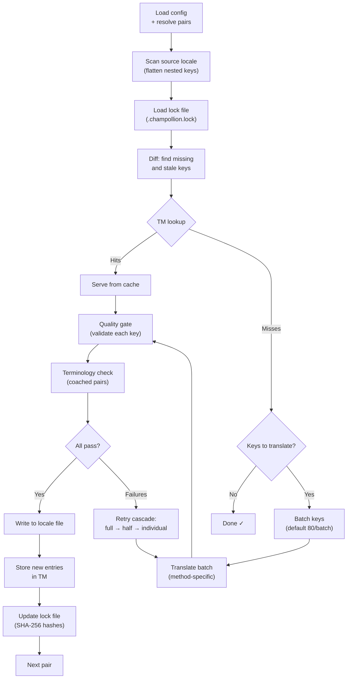

# Sync 작동 방식

`sync` 명령은 champollion의 핵심 작업이에요. `npx champollion sync`을 실행하면 다음과 같은 일이 일어나요.

## 파이프라인 개요



## 단계별 설명

### 1. 설정 해석

Champollion은 `champollion.config.json`을 로드해요(또는 설정을 자동 감지해요). 다음 항목을 해석해요:
- 소스 로케일과 타깃 로케일
- 페어 그래프(처리할 source→target 조합)
- 페어별 method, model, quality 설정

파일을 스캔하기 전에 champollion은 시작 헤더를 출력해요:

```
champollion v0.1.0

[INFO] Detected format: json (auto)
[INFO] Detected framework: Hugo
```

- **버전 배너**: 디버깅 및 이슈 보고를 위해 설치된 버전을 표시해요.
- **포맷 감지**: 파일 포맷과 그것이 자동 감지되었는지 `(auto)` 또는 명시적으로 구성되었는지 `(config)`를 보고해요. `json`, `toml`, `yaml`를 지원해요.
- **프레임워크 감지**: `contentDir`이 설정되면 프레임워크(`Hugo`)를 식별하여 콘텐츠 sync가 활성화되어 있는지 확인해요.

### 2. 소스 스캐닝

소스 로케일 파일이 로드되어 key→value 맵으로 평탄화돼요:

```json
// Input (nested)
{ "hero": { "title": "Welcome", "subtitle": "Build" } }

// Flattened
{ "hero.title": "Welcome", "hero.subtitle": "Build" }
```

### 3. 변경 감지

Champollion은 `.champollion.lock`을 읽어요. 여기에는 이전에 번역된 소스 값의 SHA-256 해시가 저장되어 있어요. 각 키에 대해 다음을 확인해요:

| 조건 | 작업 |
|-----------|--------|
| 타깃에 키 없음 | **번역** |
| 마지막 sync 이후 소스 해시 변경됨 | **재번역**(오래됨) |
| 타깃 값이 `[EN]`로 시작함 | **재번역**(레거시 폴백 마커) |
| 소스 해시 변경 없음, 키 존재함 | **건너뜀** |

이것이 champollion이 변경된 것만 번역하는 이유예요 — sync할 때마다 전체 파일을 재번역하지 않아요.

### 4. 배칭

키는 배치로 그룹화돼요(기본값: LLM은 80 keys/batch, Google Translate는 128). 배칭은 프롬프트를 관리 가능한 수준으로 유지하면서 API 왕복 횟수를 줄여요.

번역 중에 champollion은 각 배치가 완료될 때마다 업데이트되는 인라인 진행 표시줄을 표시해요:

```
[INFO] fr.json — 2,847 missing
     ████████████████░░░░░░░░░░░░░░░░ 1,440/2,847 keys
```

표시줄은 `\r` 캐리지 리턴을 사용하여 제자리에서 업데이트되도록 렌더링돼요 — 스크롤이 없어요. `--quiet` 및 `--json` 모드에서는 억제돼요.

### 4b. 번역 메모리

배칭 전에 champollion은 번역 메모리 캐시(`.champollion/tm.json`)를 확인해요. 소스 텍스트 + 로케일 + method가 이전 번역과 일치하는 키는 캐시에서 즉시 제공돼요 — API 호출이 필요 없어요.

```
  [TM] 142 key(s) served from cache
  Translating 3 key(s) to French (llm)... [OK]
```

TM은 주요 비용 절감 메커니즘이에요. 단일 키 변경 후 sync를 다시 실행하면 전체 파일이 아니라 그 한 개의 키만 번역해요. 자세한 내용은 [번역 메모리](/docs/concepts/translation-memory)를 참고하세요.

단일 실행에 대해 캐시를 우회하려면: `champollion sync --no-tm`

### 5. 번역

각 배치는 구성된 번역 method로 전송돼요:

- **`llm`**: register 및 성별 안내 지침이 포함된 OpenRouter로의 구조화된 프롬프트
- **`llm-coached`**: 동일하지만 문법 규칙, 사전, 스타일 노트가 주입됨
- **`google-translate`**: Google Cloud Translation API v2 배치 요청
- **`api`**: 원격 엔드포인트로의 HTTP POST

시스템 메시지(register, 성별 안내, 규칙)는 주어진 로케일에 대해 모든 배치에서 동일하여 **프롬프트 캐싱**을 가능하게 해요 — Anthropic 및 Google과 같은 제공자는 반복되는 시스템 메시지를 캐시하여 토큰 비용을 줄여요.

### 6. 품질 게이트

모든 번역은 디스크에 쓰이기 전에 검증돼요. 다섯 가지 검사가 실행돼요:

| 검사 | 무엇을 잡아내는지 | 예시 |
|-------|----------------|---------|
| **빈 값/공백** | 모델이 아무것도 반환하지 않음 | `""` |
| **소스 에코** | 모델이 영어 입력을 반환함 | 일본어에 대해 `"Welcome"` |
| **환각 루프** | 반복되는 트라이그램 | `"Qo' Qo' Qo' Qo'"` |
| **길이 팽창** | 출력이 소스보다 4배 이상 김 | 10자 소스 → 50자 출력 |
| **스크립트 준수** | 로케일에 맞지 않는 스크립트 | 아랍어 로케일에 라틴 텍스트 |

실패는 `[GATE]` 접두사와 함께 로깅돼요. 조용한 폴백은 없어요.

자세한 내용은 [품질 게이트](/docs/concepts/quality-gate)를 참고하세요.

### 6b. 용어 검증

사전이 있는 coached 페어의 경우, champollion은 번역 후 LLM이 실제로 필요한 용어를 사용했는지 확인해요. 위반은 `[TERM]` 경고로 로깅돼요:

```
[TERM] en→fr: 2 term violation(s)
  • "dashboard" → expected "tableau de bord" but got "panneau"
```

이는 경고이지 차단 오류가 아니에요 — 번역은 여전히 쓰여요.

### 7. 재시도 캐스케이드

JSON 파싱 실패 또는 배치 수준 오류가 발생하면 champollion은 점진적으로 더 작은 배치로 재시도해요:

```
Full batch (80 keys) → Failed
  └→ Half batch (40 keys) → 1 failure
      └→ Individual keys (1 each) → Isolates the problem key
```

재시도 예산은 토큰의 과도한 소비를 방지하기 위해 `maxRetries`(기본값: 3)로 제한돼요.

### 8. 쓰기 및 잠금

통과한 번역은 원본 중첩 구조를 보존하면서 타깃 로케일 파일에 쓰여요. 잠금 파일은 새로운 SHA-256 해시로 업데이트돼요.

### 9. 검증

모든 페어가 처리된 후, champollion은 디스크에서 쓰여진 로케일 파일을 다시 읽고 검증 패스를 실행해요(`--no-verify`이 설정되지 않은 경우). 이는 sync가 성공을 보고하는 것과 실제로 키가 잘못된 것 사이의 간극을 잡아내요:

- **키 동등성** — 모든 소스 키가 각 타깃에 존재함
- **`[EN]` 폴백 마커** — 이전 실행의 레거시 마커
- **빈 번역** — 빠져나간 빈 값
- **스크립트 준수** — ASCII 전용 번역을 가진 비라틴 로케일
- **플레이스홀더 보존** — ICU 플레이스홀더가 소스와 일치함
- **인코딩 문제** — BOM 마커, 보이지 않는 문자

이는 CI 게이트를 위한 독립형 `champollion verify` 명령으로도 사용할 수 있어요.

## 콘텐츠 번역(Phase 2)

Docusaurus 및 Hugo 프로젝트의 경우, `sync`는 JSON 키 번역 후 두 번째 단계를 실행해요. 이 단계는 동일한 method와 품질 게이트를 사용하여 Markdown 및 MDX 파일(docs, 블로그 게시물, 튜토리얼)을 번역해요.

### 작동 방식

1. Champollion은 content/docs 디렉터리를 순회하여 모든 소스 콘텐츠 파일(`.md`, `.mdx`)을 발견해요
2. 각 파일 × 로케일 페어에 대해, 별도의 콘텐츠 잠금 파일(`.champollion-content.lock`)에서 SHA-256 해시 변경 여부를 확인해요
3. 변경되었거나 누락된 파일은 플랫 작업 항목 풀로 수집돼요
4. 풀은 **병렬 동시성**으로 처리돼요(기본값: 12개의 동시 API 호출)

```
Phase 2: content (79 translations to process, 341 skipped, concurrency: 48)

    [1/79] (1%)  docs/concepts/security.md → ja [RE-TRANSLATE] (~3328s left)
    [2/79] (3%)  docs/concepts/security.md → th [RE-TRANSLATE] (~1821s left)
    ...
    [79/79] (100%) blog/v3-2-quality.md → de [OK]

  [OK] Created 79 content file(s), 341 unchanged
```

### 병렬 처리

Phase 1(JSON 키)과 Phase 2(콘텐츠) 모두 이제 병렬로 실행돼요:

- **Phase 1**: 모든 로케일 번역이 동시에 시작돼요(기본값: 50개의 동시 로케일). 각 로케일 내에서 API 배치도 병렬로 실행돼요(4개의 동시 배치). 120개의 키를 가진 12개 로케일 sync는 약 15분이 아니라 약 1분 안에 완료돼요.
- **Phase 2**: 모든 파일×로케일 조합이 플랫 풀로 번역돼요(기본값: 12개의 동시 API 호출). 서로 다른 파일과 서로 다른 로케일이 동시에 번역돼요.

`--json-concurrency`, `--content-concurrency` 또는 `--concurrency`(둘 다 설정)로 병렬 처리를 제어하세요:

```bash
# Faster JSON sync (more parallel locale translations)
npx champollion sync --json-concurrency 30

# Faster content sync (more parallel API calls)
npx champollion sync --content-concurrency 20

# Slower (gentler on rate limits)
npx champollion sync --concurrency 4
```

### 콘텐츠 보호

번역 중에 champollion은 번역 불가능한 콘텐츠를 보호해요:

- **코드 블록**(펜스 및 들여쓰기)은 플레이스홀더로 대체돼요
- `translatableFields` 목록에 없는 **프론트매터** 필드는 그대로 보존돼요
- **링크**, 이미지 경로, HTML 태그는 보호돼요
- **숏코드** 및 보간 변수(예: `{count}`, `{{.Params.title}}`)는 보호돼요

번역 후 모든 플레이스홀더는 복원되고 검증돼요. 누락되거나 손상된 것이 있으면 번역이 거부되고 재시도돼요.

## 부분 성공

하나의 실패한 배치가 나머지를 차단하지 않아요. 10개 배치 중 9개가 성공하면 그 9개는 쓰여요. 실패한 배치는 로깅되며, `sync`를 다시 실행하여 재시도할 수 있어요.

## Dry Run

파일을 쓰지 않고 무엇이 변경될지 미리 보세요:

```bash
npx champollion sync --dry-run
```

## 강제 재번역

변경되지 않았더라도 특정 키를 강제로 재번역하도록 하세요:

```bash
npx champollion sync --force-keys "hero.title,nav.about"
```

## 비용 추정

번역 전에 champollion은 페어별 예상 비용을 보여주는 **사전 sync 비용 보고서**를 생성해요. 이는 모든 `sync` 중에 자동으로 실행돼요 — API 호출이 이루어지기 전에 볼 수 있어요.

```
╔══════════════════════════════════════════════════════════╗
║  Cost Estimate                                          ║
╠════════════╦═══════╦════════════╦════════════════════════╣
║ Pair       ║ Keys  ║ Est. Cost  ║ Method                 ║
╠════════════╬═══════╬════════════╬════════════════════════╣
║ en → fr    ║   142 ║ $0.07      ║ google-translate       ║
║ en → ja    ║    38 ║   —        ║ llm (model-dependent)  ║
║ en → crk   ║    38 ║   —        ║ llm-coached            ║
╚════════════╩═══════╩════════════╩════════════════════════╝
```

### 무엇이 추정되는지

각 번역 method는 자체 비용 추정을 제공해요:

| Method | 비용 기준 | 정밀도 |
|--------|-----------|--------|
| `google-translate` | Google의 공시 요율(백만 자당 $20) | 정확함 |
| `llm` | OpenRouter 모델에 따라 다름 | 모델 의존적 — [OpenRouter 가격](https://openrouter.ai/models) 확인 |
| `llm-coached` | `llm`와 동일하며 coaching 컨텍스트 토큰 추가 | 모델 의존적 |
| `api` | 서버 결정 | 알 수 없음 — 엔드포인트를 쿼리하지 않고는 추정할 수 없음 |

method가 비용을 결정할 수 없을 때(LLM method, 원격 API), champollion은 추측하는 대신 `—`을 보고해요. 실제로 번역하지 않고 비용 추정을 보려면 `--dry`을 사용하세요.

---

## 함께 보기

- [CLI 레퍼런스 — sync](/docs/reference/cli#sync) — 명령 플래그 및 옵션
- [번역 메모리](/docs/concepts/translation-memory) — 캐싱 및 비용 절감
- [품질 게이트](/docs/concepts/quality-gate) — 번역이 검증되는 방식
- [번역 Method](/docs/guides/translation-methods) — 각 method의 작동 방식
- [전문 번역가와 함께 작업하기](/docs/guides/professional-translators) — XLIFF 워크플로
- [구성](/docs/getting-started/configuration) — 설정 레퍼런스
- [CI/CD 가이드](/docs/guides/ci-cd) — 파이프라인에서 sync 자동화하기
